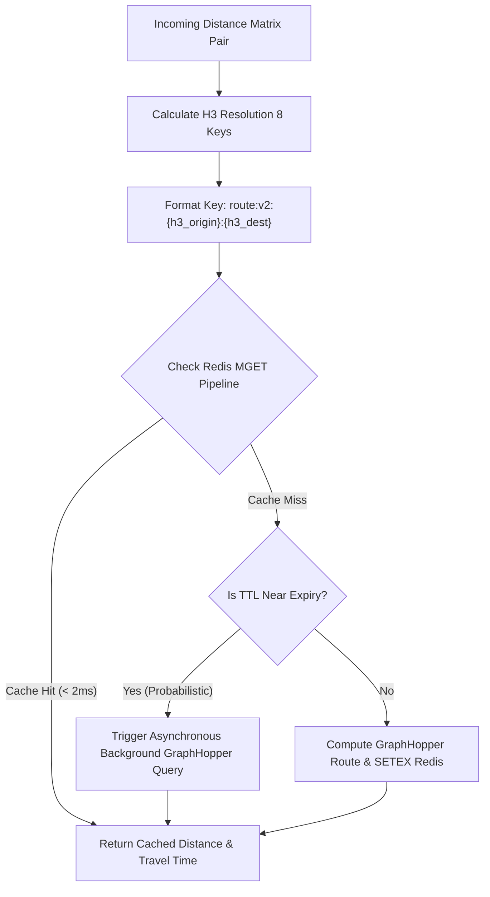

> **Prerequisite:** Before reading this part, review [Part 5: Route Visualization UI](/series/routing-geospatial-architecture/part-5-visualization-ui/).

# Part 6: Location Clustering with Uber H3 & Redis Semantic Caching

> **Executive Summary & Quick Answer**: Semantic caching transforms continuous floating-point GPS coordinates into discrete Uber H3 hexagonal keys (Resolution 8/9), increasing cache hit rates from 0% to over 80%. Combining H3 spatial keys with Redis MGET pipelines and XFetch early recomputation prevents cache stampedes and lowers matrix latency to <2ms.
>
> **Key Takeaways**:
> - **Deterministic Keys**: Format Redis cache keys as `route:{h3_origin}:{h3_dest}` to pool nearby user queries into shared cache buckets.
> - **MGET Pipelining**: Fetch 100 distance matrix spatial pairs in a single Redis TCP pipeline to reduce network roundtrip overhead.
> - **XFetch Probabilistic Recomputation**: Recompute expiring routes before TTL hits zero to prevent thundering-herd spikes on GraphHopper.

### What You'll Learn That AI Won't Tell You
- **XFetch Mathematical Formula:** How to evaluate $ -\beta \times \delta \times \ln(\text{rand}()) $ for early background updates.
- **Key Versioning Strategies:** Deleting millions of legacy route keys without running blocking Redis `KEYS` commands.
- **Bloom Filter Guarding:** Rejecting impossible coordinate lookups at the API Gateway using Redis Bloom Filters.

Caching an exact GPS coordinate is impossible. Because floating-point numbers are infinitely precise, two users standing 1 meter apart will have completely different coordinates (`106.0001` vs `106.0002`). If your Redis key is simply `lat1,lng1:lat2,lng2`, your Cache Hit Rate will forever remain at 0%.

To survive massive scale, you must implement **Semantic Caching**. Instead of caching raw coordinates, use **Uber H3** to "snap" coordinates into 100-meter hexagonal buckets. Your cache key becomes `route:{h3_origin}:{h3_dest}`. This instantly transforms a compute-heavy routing problem into a lightning-fast Redis memory lookup.



## 1. The Anatomy of a Semantic Cache

By generating H3 indexes for origin and destination, we create a deterministic string. If User A and User B stand in the same parking lot and request routes to the same airport, they generate the exact same H3 Hexagon IDs.

### Escaping the Distance Matrix Latency Trap
When generating a 10x10 Distance Matrix, your API needs to check 100 cache keys. If you use a simple `for` loop executing `GET` 100 times, you will incur 100 network roundtrips. Even if the cache is hit, network latency will destroy performance.
**The Fix:** You MUST use Redis `MGET` (Multi-Get) or TCP Pipelining to fetch all 100 keys in a single network trip. This reduces latency from 100ms down to 2ms.

## 2. Dealing with the Dark Side of Redis

Redis is fast, but if mismanaged under massive load, it will cause catastrophic system failures.

### The Cache Stampede (Thundering Herd)
Imagine your most popular cache key (e.g., from the Airport to Downtown) expires at 5:00 PM during rush hour. Suddenly, 5,000 concurrent requests miss the cache and hit GraphHopper simultaneously. Your server crashes instantly.
**The Fix (XFetch):** Do not use standard `SETEX`. Implement the **XFetch (Probabilistic Early Expiration)** algorithm. As the TTL approaches 0, XFetch mathematically forces exactly *one* random request to recompute the route in the background, while the other 4,999 requests safely consume the old cache.

### The "Hot Key" Shard Melt
A massive concert ends. 100,000 users check the route home from the exact same H3 hexagon. In a Redis Cluster, this creates a "Hot Key." All 100,000 requests map to a single hash slot, crashing one Redis node while the rest of the cluster sits idle.

**The Fix (L1 Caching):** You cannot scale out of a Hot Key. Your Golang API Gateway must implement an In-Memory L1 Cache (e.g., using `ristretto`) to absorb the Hot Key traffic before it even touches the network.

## Redis Geospatial Commands: `GEOSEARCH` vs `GEORADIUS`

Historically, Redis developers used the `GEORADIUS` and `GEORADIUSBYMEMBER` commands to search for elements within a circular geographic area. However, starting with Redis 6.2, these commands are deprecated in favor of the more unified and flexible **`GEOSEARCH`** command.

`GEOSEARCH` allows developers to query indexed geohash sets using circular areas (`BYRADIUS`) or rectangular bounding boxes (`BYBOX`). It supports dynamically locating origin points from explicit coordinates (`FROMLONLAT`) or existing set members (`FROMMEMBER`). Under the hood, Redis stores geospatial data inside a Sorted Set (ZSET) where scores represent 52-bit Geohashes. `GEOSEARCH` queries run in logarithmic time $\mathcal{O}(\log(N) + M)$, where $N$ is the total elements in the set and $M$ is the number of results returned, making it extremely fast for high-concurrency dispatching.

## Cache Invalidation and Versioning Pipelines

While routes can be cached semantically to achieve high hit rates, mapping data changes over time (e.g. road construction, new traffic rules, seasonal closures). A static cache will serve stale, incorrect routes.

To handle invalidation without executing expensive database scans, we design an explicit cache invalidation pipeline:

- **Key Versioning:** All cache keys incorporate a map schema version (e.g. `route:map_v2:origin:dest`). When the underlying map data is updated, we simply increment the schema version config variable at the API gateway. The gateway immediately writes and reads using the new key namespace, leaving the old keys to expire gracefully via their TTL.
- **Dynamic TTL Decay:** Routes in dense city centers are subject to rapid traffic changes. We apply a variable TTL: shorter durations (e.g. 5-10 minutes) for high-congestion city hexagons, and longer durations (e.g. 1-2 hours) for highway or rural connections.

## Go Implementation: Redis Geospatial Caching Wrapper

This code block demonstrates how to use the modern `GeoSearch` commands and manage semantic cache keys using the popular `go-redis/v9` library in Go:

```go
package caching

import (
	"context"
	"fmt"
	"time"

	"github.com/redis/go-redis/v9"
)

// GeoCacheWrapper wraps Redis client calls for geospatial searches and caching
type GeoCacheWrapper struct {
	rdb *redis.Client
}

// NewGeoCacheWrapper initializes the Redis client wrapper
func NewGeoCacheWrapper(addr string) *GeoCacheWrapper {
	rdb := redis.NewClient(&redis.Options{
		Addr: addr,
	})
	return &GeoCacheWrapper{rdb: rdb}
}

// AddDriverLocation indexes a driver's longitude/latitude in a Redis Geospatial Index
func (c *GeoCacheWrapper) AddDriverLocation(ctx context.Context, key string, lng, lat float64, driverID string) error {
	_, err := c.rdb.GeoAdd(ctx, key, &redis.GeoLocation{
		Longitude: lng,
		Latitude:  lat,
		Name:      driverID,
	}).Result()
	if err != nil {
		return fmt.Errorf("failed to GEOADD driver %s: %w", driverID, err)
	}
	return nil
}

// SearchNearbyDrivers queries the Redis Geospatial Index using GEOSEARCH
func (c *GeoCacheWrapper) SearchNearbyDrivers(ctx context.Context, key string, lng, lat, radiusKm float64, count int) ([]string, error) {
	// GEOSEARCH is the modern replacement for GEORADIUS
	locations, err := c.rdb.GeoSearch(ctx, key, &redis.GeoSearchQuery{
		Longitude:  lng,
		Latitude:   lat,
		Radius:     radiusKm,
		RadiusUnit: "km",
		Count:      count,
		Sort:       "ASC",
	}).Result()
	if err != nil {
		return nil, fmt.Errorf("failed to GEOSEARCH nearby drivers: %w", err)
	}

	driverIDs := make([]string, len(locations))
	for i, loc := range locations {
		driverIDs[i] = loc.Name
	}
	return driverIDs, nil
}

// GetCachedRoute retrieves a semantically cached route if it exists
func (c *GeoCacheWrapper) GetCachedRoute(ctx context.Context, h3Origin, h3Dest string) (string, error) {
	cacheKey := fmt.Sprintf("route:v1:%s:%s", h3Origin, h3Dest)
	val, err := c.rdb.Get(ctx, cacheKey).Result()
	if err == redis.Nil {
		return "", nil // cache miss
	} else if err != nil {
		return "", fmt.Errorf("failed to query Redis for cache key %s: %w", cacheKey, err)
	}
	return val, nil // cache hit
}

// SetCachedRoute stores a calculated route geometry in Redis with a TTL
func (c *GeoCacheWrapper) SetCachedRoute(ctx context.Context, h3Origin, h3Dest, geojson string, ttl time.Duration) error {
	cacheKey := fmt.Sprintf("route:v1:%s:%s", h3Origin, h3Dest)
	err := c.rdb.Set(ctx, cacheKey, geojson, ttl).Err()
	if err != nil {
		return fmt.Errorf("failed to write route cache in Redis: %w", err)
	}
	return nil
}
```

## Deep Dive: Mitigating Cache Penetration with Bloom Filters

In production routing systems, cache performance is vulnerable to a specific type of attack called **Cache Penetration**. This occurs when clients (or malicious scripts) request route calculations for coordinates that do not map to valid roads—such as coordinates in the middle of the ocean, inside national parks, or outside the serviced geographic boundaries. 

Because these impossible route queries always result in a downstream "no path found" error, they are traditionally not cached. This allows an attacker to bypass the Redis caching layer entirely and directly bomb the CPU-intensive GraphHopper routing engine with thousands of requests per second.

To mitigate this, we implement a **Redis Bloom Filter** in the API Gateway. A Bloom filter is a space-efficient probabilistic data structure that can tell us if an item is *definitely not* in a set, or if it *might be* in the set. Before executing a routing request, the API Gateway checks a Bloom Filter populated with all valid, driveable H3 index cells. If the H3 cell is not in the Bloom Filter, the gateway rejects the request instantly with a 400 Bad Request without hitting Redis or GraphHopper.

Below is a Go implementation of the Bloom Filter verification check:

```go
package caching

import (
	"context"
	"fmt"
	"github.com/redis/go-redis/v9"
)

type SpatialGuard struct {
	rdb            *redis.Client
	bloomFilterKey string
}

func NewSpatialGuard(rdb *redis.Client, filterKey string) *SpatialGuard {
	return &SpatialGuard{
		rdb:            rdb,
		bloomFilterKey: filterKey,
	}
}

// IsValidH3Cell checks the Bloom Filter in Redis to see if the H3 index contains driveable roads
func (g *SpatialGuard) IsValidH3Cell(ctx context.Context, h3Index string) (bool, error) {
	// Execute Redis Bloom Filter check command: BF.EXISTS key item
	exists, err := g.rdb.Do(ctx, "BF.EXISTS", g.bloomFilterKey, h3Index).Bool()
	if err != nil {
		// Fallback to true on Redis error to maintain system availability
		return true, fmt.Errorf("bloom filter check failed, falling back to bypass: %w", err)
	}
	return exists, nil
}

// RegisterValidH3Cells populates the Bloom Filter with a list of driveable H3 cells
func (g *SpatialGuard) RegisterValidH3Cells(ctx context.Context, h3Indices []string) error {
	pipe := g.rdb.Pipeline()
	for _, h3Index := range h3Indices {
		pipe.Do(ctx, "BF.ADD", g.bloomFilterKey, h3Index)
	}
	_, err := pipe.Exec(ctx)
	if err != nil {
		return fmt.Errorf("failed to bulk load H3 cells into Bloom Filter: %w", err)
	}
	return nil
}
```

### Operational Considerations:
1. **False Positives vs. Space Trade-off**: Bloom filters have a configurable false-positive probability (e.g., 1%). A 1% false positive rate means that out of 100 invalid coordinates, 99 will be rejected instantly at the edge, and only 1 will reach the routing engine. This represents a 99% reduction in malicious traffic load.
2. **Initialization Pipeline**: During the offline map compilation process (which we discussed in the blue-green map update lifecycle), a utility script crawls all valid roads in the Geofabrik map extract, converts their geometries into H3 indexes at Resolution 8, and uploads them to the Redis Bloom Filter. This ensures the filter is always in sync with the latest map topology.

---

## FAQ: Production Caching Nightmares


NEVER use `SCAN` or `KEYS` to delete millions of records on production. Redis is single-threaded; `SCAN` will block the server. Instead, use **Key Versioning** (e.g., `route:map_v2:origin:dest`). When the map updates, simply increment the version variable in your API config. Old keys are instantly orphaned and gracefully expire via their TTL.



This is **Cache Penetration**. Fake routes don't exist, so they are never cached, causing every malicious request to bypass Redis and hit Graphhopper. You MUST cache "Null" values (404 Not Found) with a short TTL, or use a Redis Bloom Filter to bounce impossible queries instantly.



Welcome to **Memory Fragmentation**. Caching and deleting variable-length JSON strings causes the `jemalloc` allocator to fragment memory. The OS sees Redis using 15GB (`used_memory_rss`), while Redis only holds 5GB of data. You MUST monitor `mem_fragmentation_ratio` and enable `activedefrag yes` to defragment memory without restarting.


Need help building high-scale routing engines or spatial indexing pipelines? [Get in touch](/hire/) to discuss your project.

🔗 **Next Step:** Verify system scale under load in [Part 7: Load Testing and Performance Tuning for Production]().

