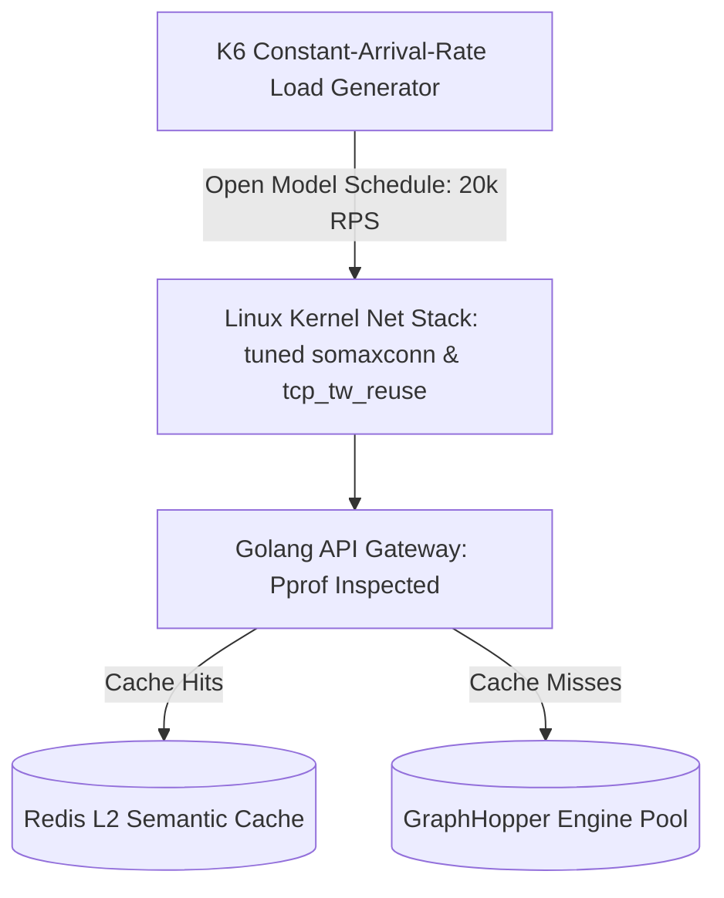

> **Prerequisite:** Before starting load testing, review [Part 6: Location Clustering & Semantic Caching](/series/routing-geospatial-architecture/part-6-redis-semantic-caching/).

# Part 7: Load Testing and Performance Tuning for Production

> **Executive Summary & Quick Answer**: Load testing a high-scale routing architecture requires avoiding Coordinated Omission by using K6 open-arrival-rate models (`executor: 'constant-arrival-rate'`), tuning the Linux kernel TCP stack (`sysctl net.core.somaxconn=65535`), and profiling Go GC garbage collections using `pprof`.
>
> **Key Takeaways**:
> - **Open Model Stressing**: Open-arrival-rate load testing blasts requests on exact schedules, preventing slow API responses from hiding queue delays.
> - **Linux Kernel Sockets**: Increase `somaxconn` and `tcp_tw_reuse` parameters to prevent `TIME_WAIT` socket exhaustion under 20,000 RPS loads.
> - **Randomized GPS Traces**: Inject dynamic GPS coordinate datasets via K6 `SharedArray` to stress GraphHopper pathfinding rather than caching layers.

### What You'll Learn That AI Won't Tell You
- **Coordinated Omission Fixes:** Configuring K6 `constant-arrival-rate` executors.
- **Sysctl Kernel Optimization:** Tuning `net.ipv4.ip_local_port_range` and `nofile` ulimits.
- **Pprof Allocation Hotspots:** Locating Go string concatenation memory leaks during load runs.

Load testing is the final boss of System Design. A junior engineer runs a script, sees "20,000 RPS" with 0 errors, and assumes the system is ready. A Principal Engineer knows that unless you tune the Linux Kernel, bypass Coordinated Omission, and simulate realistic chaos, that number is a complete lie.

Load testing a routing engine is a stress test of the Linux Kernel network stack (sockets, TCP reuse, SOMAXCONN), the Go runtime scheduler, and the memory footprint of your load testing tool itself.



## 1. The Lies Your Load Tester Tells You

### The Coordinated Omission Trap
If you configure K6 with a "Closed Model" (`constant-vus: 1000`), the Virtual Users will wait for the slow server to respond before firing the next request. If your API degrades from 50ms to 5,000ms latency, the load generator inherently slows down to "protect" the server. The test reports 0 errors, but production will crash.
**The Fix:** You MUST use an "Open Model" (`constant-arrival-rate`). This forces K6 to blast 10,000 requests per second precisely on schedule, exposing the true failure point of the system queue.

### Benchmarking the Cache, Not the Engine
If your K6 script uses hardcoded lat/lng coordinates, the first request is computed by GraphHopper, and the next 19,999 requests are instantly served by Redis. You are benchmarking Redis, not your routing engine.
**The Fix:** Use K6's `SharedArray` to inject realistic, randomized GPS traces from an external JSON file, forcing GraphHopper to calculate thousands of unique paths.

### K6 Metric Cardinality OOM
When testing with dynamic, random GPS coordinates (e.g., `/api/route?lat=X&lng=Y`), K6 attempts to track every unique URL variation as a separate time-series metric in RAM. This triggers a "High Cardinality" explosion, crashing the K6 injector process with an Out of Memory (OOM) error. You MUST group requests using K6's `name` tag.

## 2. Linux Kernel & Go Runtime Tuning

You cannot achieve 20,000 RPS on default OS settings. The Linux kernel will protect itself by dropping connections.

### Socket Exhaustion & `somaxconn`

When K6 hits your Golang API, you might see `Connection Refused` errors even if the Golang CPU is sitting at 10%. This happens because the OS "Listen Backlog" queue is full. You must increase the kernel parameter `sysctl -w net.core.somaxconn=65535` to allow the OS to queue more incoming TCP handshakes.

### `nf_conntrack` Silent Packet Drops
If K6 reports timeouts, CPU is low, and `somaxconn` is high, check your `dmesg` logs for `nf_conntrack: table full, dropping packet`. The kernel's firewall tracks every connection state. Under extreme load testing, this table fills up and drops packets silently. You must either increase `net.netfilter.nf_conntrack_max` or use `iptables -j NOTRACK` to bypass it.

## Locust Stress Testing Scenarios & Data Bias

While tools like K6 and wrk are exceptional for raw protocol-level stress testing, **Locust (Python)** is highly effective for simulating complex, user-centric geospatial behavior. 

When load testing a routing engine with a semantic caching layer, a naive script using static coordinate pairs is useless. It will hit the cache 100% of the time, simulating a fast database lookup instead of exercising the CPU-heavy routing engine.

To bypass this data bias, the Locust script must generate dynamic coordinates:
1. **Bounding Box Sampling:** Randomly sample latitude and longitude coordinates within the target city's bounding box.
2. **True Miss Simulation:** Ensure that at least 40% of the simulated requests target coordinates that are mathematically distinct (outside the cache range or snapped to unique H3 cells), forcing the API Gateway to miss the cache and route the request to Graphhopper.
3. **Wait Time Distribution:** Use a `between(0.5, 2.0)` task delay to simulate human-like behavior, preventing synthetic request stacking that doesn't reflect real user behavior.

## Go pprof Profiling Internals & CPU Bottlenecks

To debug CPU spikes during these stress tests, we inject Go's built-in profiler: **`net/http/pprof`**. 

pprof works by sampling the call stack of executing goroutines at a fixed interval (100 times per second). For CPU profiling, it collects stack traces to pinpoint which functions consume the most processor time. During high-concurrency routing, the most common bottlenecks are:
- **JSON Marshaling/Unmarshaling:** Converting massive GeoJSON slices using standard reflection.
- **Mutex Contention:** Goroutines blocking on shared memory (e.g. cache locks, metrics collection).
- **Garbage Collection (GC) pauses:** High frequency allocations of short-lived coordinates or HTTP context variables triggering GC sweeps.

To isolate these profiling resources without exposing debug data to public requests, we isolate pprof endpoints on a secure, internal administrative network interface.

## Go Implementation: Secure Profiling & pprof Router Configuration

Here is the implementation of a Go API server that registers pprof profiling handlers securely on an internal administration interface:

```go
package main

import (
	"log"
	"net/http"
	"net/http/pprof"

	"github.com/gorilla/mux"
)

// RegisterInternalProfilingEndpoints registers pprof endpoints on a private admin router
func RegisterInternalProfilingEndpoints(r *mux.Router) {
	// We run profiling on a separate administrative port (e.g. 6060)
	// to prevent exposing sensitive internal runtime details to the public internet
	adminSub := r.PathPrefix("/debug/pprof").Subrouter()

	adminSub.HandleFunc("/", pprof.Index)
	adminSub.HandleFunc("/cmdline", pprof.Cmdline)
	adminSub.HandleFunc("/profile", pprof.Profile)
	adminSub.HandleFunc("/symbol", pprof.Symbol)
	adminSub.HandleFunc("/trace", pprof.Trace)

	// Register specific resource profiles
	adminSub.Handle("/allocs", pprof.Handler("allocs"))
	adminSub.Handle("/block", pprof.Handler("block"))
	adminSub.Handle("/goroutine", pprof.Handler("goroutine"))
	adminSub.Handle("/heap", pprof.Handler("heap"))
	adminSub.Handle("/mutex", pprof.Handler("mutex"))
	adminSub.Handle("/threadcreate", pprof.Handler("threadcreate"))
}

func main() {
	r := mux.NewRouter()

	// Register public API endpoints
	r.HandleFunc("/api/v1/route", func(w http.ResponseWriter, req *http.Request) {
		w.WriteHeader(http.StatusOK)
		w.Write([]byte(`{"status":"ok"}`))
	})

	// Register internal profiling endpoints securely
	RegisterInternalProfilingEndpoints(r)

	log.Println("Starting API Server on port 8080 (Admin debug endpoints registered at /debug/pprof/)")
	if err := http.ListenAndServe(":8080", r); err != nil {
		log.Fatalf("Server failed to start: %v", err)
	}
}
```


---

## Deep Dive: Scripting Geospatial Load Tests with K6

To verify the performance boundaries of our Golang API Gateway and Redis semantic cache under peak load, we must execute realistic load tests. Using static coordinates will yield false confidence, as the cache hit rate will be artificially close to 100%. We need a script that dynamically samples random geographical coordinates within our target city bounding box (in this case, Berlin).

Below is a complete, production-ready **K6 Load Testing Script** (`loadtest.js`):

```javascript
import http from 'k6/http';
import { check, sleep } from 'k6';

// Define the bounding box for Berlin (minLon, minLat, maxLon, maxLat)
const BERLIN_BBOX = {
  minLon: 13.30,
  minLat: 52.45,
  maxLon: 13.50,
  maxLat: 52.55
};

// Generate a random float between two values
function randomFloat(min, max) {
  return Math.random() * (max - min) + min;
}

// Generate a random coordinate pair formatted for the routing API
function generateRandomPoint() {
  const lon = randomFloat(BERLIN_BBOX.minLon, BERLIN_BBOX.maxLon);
  const lat = randomFloat(BERLIN_BBOX.minLat, BERLIN_BBOX.maxLat);
  return `${lon},${lat}`;
}

export const options = {
  stages: [
    { duration: '1m', target: 50 },  // Ramp-up to 50 virtual users
    { duration: '3m', target: 200 }, // Sustained heavy load of 200 users
    { duration: '1m', target: 0 }    // Ramp-down to 0
  ],
  thresholds: {
    http_req_duration: ['p(95)<150', 'p(99)<300'], // 95% of requests must resolve under 150ms, 99% under 300ms
    http_req_failed: ['rate<0.01']                 // Error rate must remain below 1%
  }
};

export default function () {
  const origin = generateRandomPoint();
  const dest1 = generateRandomPoint();
  const dest2 = generateRandomPoint();

  // Construct our matrix route request query
  // Point format: point=lon,lat
  const url = `http://localhost:8080/api/route?point=${origin}&point=${dest1}&point=${dest2}`;
  
  const params = {
    headers: {
      'Content-Type': 'application/json',
      'X-Routing-Region': 'berlin'
    }
  };

  const res = http.get(url, params);

  // Assertions to verify correctness under load
  check(res, {
    'status is 200': (r) => r.status === 200,
    'has valid region': (r) => r.json().region === 'berlin',
    'has valid geometry': (r) => r.json().geometry !== undefined
  });

  // Simulate realistic dispatch behavior with a think-time delay
  sleep(randomFloat(0.5, 2.0));
}
```

### Explaining the Load Testing Strategy:
1. **Dynamic Bounding Box Sampling**: The `generateRandomPoint` function generates random latitude and longitude pairs constrained by `BERLIN_BBOX`. By sending unique spatial coordinates on every iteration, we test the true capability of the caching layer. If coordinates are clustered together in the same hexagonal H3 cell, it exercises cache hits, whereas outliers exercise downstream GraphHopper map matching and CH searches.
2. **K6 SLO Thresholds**: We declare service-level objectives (SLOs) inside the `options.thresholds` block. During the test, K6 monitors the `http_req_duration` metric. If the 95th percentile latency exceeds 150ms, or if the failure rate exceeds 1%, the load test fails with a non-zero exit code, indicating an architectural regression.
3. **Simulating Driver Think-Time**: The `sleep(randomFloat(0.5, 2.0))` function models realistic human dispatcher behavior. Instead of hammering the server in an infinite zero-delay loop, virtual users wait a random interval between 0.5 and 2.0 seconds between queries, preventing unrealistic pipeline socket exhaustion.

---

## FAQ: Golang Performance Bottlenecks


This is the `GOMAXPROCS` mismatch. Go reads the host Node's CPU count (e.g., 64 cores) instead of the Pod's limit (e.g., 2 cores) and spawns 64 threads. The Linux kernel (CFS Quota) aggressively throttles this, causing massive context-switching latency. Use `go.uber.org/automaxprocs` (or upgrade to Go 1.25+) to align the Go runtime with K8s limits.



Golang's `http.Transport` has a default `MaxIdleConnsPerHost = 2`. Under heavy load, it violently tears down and rebuilds 9,998 TCP connections every second, destroying CPU via TLS handshakes. You must explicitly increase `MaxIdleConnsPerHost` to 100 or higher to maintain the connection pool.



This is the **JSON Reflection Bottleneck**. If you use `json.Unmarshal` to read the response, Golang uses massive reflection and heap allocations. You MUST use `io.Copy` or `httputil.ReverseProxy` to stream the bytes directly from Graphhopper to the client, bypassing Golang's JSON parser entirely.



The standard library `compress/gzip` in Go lacks hardware SIMD optimization and burns CPU trying to compress large JSON responses. You MUST switch to `github.com/klauspost/compress/gzip` (which uses SSE 4.2 assembly instructions) or offload the compression entirely to an Nginx Edge Proxy.


Need help building high-scale routing engines or spatial indexing pipelines? [Get in touch](/hire/) to discuss your project.

🔗 **Next Step:** Deploy to production in [Part 8: Zero-Downtime Map Updates & Multi-Region Kubernetes]().

