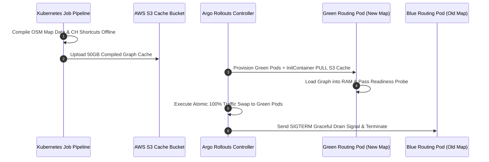

> **Prerequisite:** Before reading this final part, review [Part 7: Load Testing & Performance Tuning](/series/routing-geospatial-architecture/part-7-load-testing-production/).

# Part 8: Zero-Downtime Map Updates & Multi-Region Kubernetes

> **Executive Summary & Quick Answer**: Deploying stateful routing engines to Kubernetes without downtime requires decoupling map graph compilation into offline jobs, hydrating Pod cache volumes via `initContainers`, and executing atomic Blue-Green traffic cuts via Argo Rollouts to preserve Redis semantic cache consistency.
>
> **Key Takeaways**:
> - **Atomic Cutover**: Standard Kubernetes `RollingUpdate` causes split-brain map routing; Argo Rollouts Blue-Green swaps 100% of traffic atomically upon green health checks.
> - **InitContainer Hydration**: Pre-compiled 50GB GraphHopper graph shortcut caches are pulled from S3 storage using high-speed AWS CLI `initContainers`.
> - **Graceful Drain**: Golang API gateways catch `SIGTERM` signals and use `http.Server.Shutdown(ctx)` to drain inflight routing requests without 502 errors.

### What You'll Learn That AI Won't Tell You
- **Argo Rollouts Blue-Green YAML Spec:** Exact manifest configuration for routing service cutovers.
- **Readiness vs Liveness Traps:** Tuning probes to avoid premature pod restarts during 8GB JVM heap warmups.
- **Multi-Region GeoDNS Failover:** Routing requests to the closest geographic cluster via Route53 latency routing.

Writing a fast algorithm is only half the battle. The true test of a Principal Engineer is deploying a massive, stateful Routing Engine to the Cloud without causing a single second of downtime during map updates or infrastructure failures.

You cannot treat GraphHopper like a stateless web server. Updating OpenStreetMap data takes 30 minutes of heavy computation. You MUST decouple the map build process using Kubernetes Jobs, inject the pre-computed 50GB cache via `initContainers`, and switch traffic instantly using Blue-Green Deployments.



## 1. The Zero-Downtime Deployment Strategy

### Decoupling the Build from the Server
If you run the graph generation script inside live serving Pods, you guarantee 30 minutes of downtime every time the map updates. 
**The Fix:** Use a Kubernetes Job to download the new `.pbf` file and generate `graph-cache` entirely offline. Upload the resulting 50GB cache folder to an AWS S3 bucket.

### InitContainers & Blue-Green Deployments
When deploying a new version, standard Kubernetes Rolling Updates create a "Split-Brain" scenario where 50% of your pods route on the old map and 50% on the new map, destroying your Redis Semantic Cache Hit Rate.
**The Fix:** Use **Argo Rollouts** for Blue-Green deployment. When "Green" pods boot up, a Kubernetes `initContainer` pulls the 50GB cache from S3 into an `emptyDir` volume. The main GraphHopper container starts only when the data is fully downloaded. Once Readiness Probes confirm the graph is loaded into RAM, Argo Rollouts instantly flips 100% of traffic to the Green pods.

## 2. Kubernetes RollingUpdate vs Argo Rollouts Blue-Green

- **Kubernetes `RollingUpdate` (Incremental):** Standard K8s deployments terminate old Pods and create new ones one-by-one. In a high-throughput routing environment, this creates a **"Split-Brain"** state where 50% of your gateway instances route traffic on the old graph, and the other 50% route on the new graph. Since these graphs have different node IDs, this triggers a massive wave of cache misses and corrupts the Redis Semantic Cache.
- **Argo Rollouts Blue-Green (Atomic):** Argo Rollouts deploys a complete secondary set of pods (Green) alongside the running set (Blue). The Green pods load the new map data and run their readiness checks. Once 100% of the Green pods are healthy, Argo Rollouts executes a dynamic service endpoint swap, switching 100% of user traffic to the new map instantly.

## 3. Go Implementation: Graceful Shutdown Handler

When scaling down pods during deployments, Kubernetes sends a `SIGTERM` signal. The Golang gateway must capture this signal and drain all active HTTP/gRPC requests before exiting:


```go
package main

import (
	"context"
	"log"
	"net/http"
	"os"
	"os/signal"
	"syscall"
	"time"
)

// StartHTTPServerWithGracefulShutdown launches an HTTP server and listens for exit signals to exit cleanly
func StartHTTPServerWithGracefulShutdown(handler http.Handler, addr string) {
	server := &http.Server{
		Addr:    addr,
		Handler: handler,
	}

	// Create channel to listen for interrupt/termination signals
	stopChan := make(chan os.Signal, 1)
	signal.Notify(stopChan, os.Interrupt, syscall.SIGTERM)

	go func() {
		log.Printf("Serving routing requests on %s...", addr)
		if err := server.ListenAndServe(); err != http.ErrServerClosed {
			log.Fatalf("HTTP server ListenAndServe failed: %v", err)
		}
	}()

	// Block until a signal is received
	sig := <-stopChan
	log.Printf("Received signal: %v. Initiating graceful shutdown...", sig)

	// Set a deadline context to drain active connections (e.g. 15 seconds)
	// During this period, the server stops accepting new connections
	// but finishes processing any active, in-flight routing requests
	ctx, cancel := context.WithTimeout(context.Background(), 15*time.Second)
	defer cancel()

	if err := server.Shutdown(ctx); err != nil {
		log.Fatalf("Server forced to shutdown with active connections: %v", err)
	}

	log.Println("Server exited cleanly. All connections drained.")
}
```


---

## 2. Surviving Multi-Region Kubernetes & Global Latency

Code execution takes milliseconds, but the speed of light is unforgiving. A user in London hitting a Singapore cluster will suffer 200ms of TCP handshake latency before the API even receives the request.

### Geo DNS & Active Health Checks
To achieve global low latency, deploy your Kubernetes clusters to multiple regions (e.g., US-East, EU-West, AP-South). 
**The Fix:** Use a Geo DNS provider (like Route53 or Cloudflare). The authoritative DNS will inspect the user's location and resolve the domain to the IP of the closest cluster. **Crucially**, you must configure L7 Health Checks with a low TTL (30s). If the Singapore cluster loses power, the DNS provider will automatically withdraw the IP and route Asian users to Tokyo.

## Production Kubernetes Deployment Manifest

To ensure that the blue-green map update lifecycle and graceful shutdown patterns function correctly, we must configure our Kubernetes manifests with precise SRE configurations. Below is a complete, production-ready deployment manifest (`graphhopper-deployment.yaml`) highlighting resource boundaries, lifecycles, and health checks:

```yaml
apiVersion: apps/v1
kind: Deployment
metadata:
  name: graphhopper-routing-engine
  namespace: logistics
  labels:
    app: graphhopper
spec:
  replicas: 3
  strategy:
    type: RollingUpdate
    rollingUpdate:
      maxSurge: 1
      maxUnavailable: 0
  selector:
    matchLabels:
      app: graphhopper
  template:
    metadata:
      labels:
        app: graphhopper
    spec:
      containers:
      - name: graphhopper
        image: graphhopper/graphhopper:8.0
        command: ["java"]
        args: [
          "-XX:MaxRAMPercentage=75.0", # Dynamically limit Heap to 75% of container RAM
          "-XX:+UseG1GC",              # Use G1 Garbage Collector for low latency
          "-jar",
          "/graphhopper-web.jar",
          "server",
          "/data/config.yml"
        ]
        resources:
          limits:
            cpu: "4"
            memory: 16Gi
          requests:
            cpu: "2"
            memory: 12Gi
        ports:
        - containerPort: 8989
          name: http
        livenessProbe:
          httpGet:
            path: /health
            port: http
          initialDelaySeconds: 120 # Give JVM time to load the OSM graph cache
          periodSeconds: 10
        readinessProbe:
          httpGet:
            path: /health
            port: http
          initialDelaySeconds: 120
          periodSeconds: 5
        lifecycle:
          preStop:
            exec:
              command: ["sh", "-c", "sleep 15"] # Let kube-proxy remove Pod from service endpoints
        volumeMounts:
        - name: osm-graph-cache
          mountPath: /data
      volumes:
      - name: osm-graph-cache
        persistentVolumeClaim:
          claimName: graphhopper-pvc
```

### Explaining the Manifest Details:
1. **RollingUpdate Strategy**: By setting `maxUnavailable: 0` and `maxSurge: 1`, Kubernetes guarantees that during a rollout (such as updating map files or deploying a new code version), the cluster will spin up a new container first. It will wait for the new container to pass its readiness checks before terminating any of the old containers. This prevents temporary capacity drops.
2. **Readiness and Liveness Probes**: GraphHopper requires a significant boot time (typically 1–3 minutes depending on map size) to load the compiled Contraction Hierarchies graph into heap memory. By setting `initialDelaySeconds: 120`, we prevent Kubernetes from prematurely killing the container during its initialization sequence. The readiness probe ensures that no client traffic is routed to a pod until the graph is fully loaded.
3. **Graceful Terminations via PreStop Hook**: When Kubernetes terminates a pod (e.g. during scale-down or updating), it sends a `SIGTERM` signal. However, there is a propagation delay before the load-balancer and kube-proxy remove the pod from their IP lists. By executing `sleep 15` in the `preStop` hook, we force the container to wait 15 seconds before processing the `SIGTERM`. During this period, the pod stops receiving new requests while gracefully finishing any in-flight routing queries, eliminating 502/503 HTTP errors during rollouts.

---

## FAQ: Senior SRE Nightmares


When Kubernetes scales down a Pod, it sends a `SIGTERM` signal. If your Golang API exits immediately, inflight routing requests are brutally killed. Because `kube-proxy` needs a few seconds to update `iptables`, new traffic still hits the dead Pod. You MUST add a `preStop` hook (e.g., `sleep 10`) in your YAML and implement `http.Server.Shutdown()` in Go to drain connections gracefully.



Welcome to the JVM Off-Heap trap. 16GB `-Xmx` only limits the Java Heap. The JVM also allocates "Off-Heap" memory for Thread Stacks, Metaspace, and NIO buffers. Total usage hits 16.5GB, and the Linux kernel's cgroup instantly kills the Pod without any Java logs. You MUST use `-XX:MaxRAMPercentage=75.0` to leave a 25% safety buffer for the OS.



This is **SNAT Port Exhaustion**. When your 50 Gateway Pods connect outbound, they use the physical Node's IP via Source NAT. When the Node exhausts its 65,000 ephemeral ports, it drops new connections. You MUST deploy a Managed NAT Gateway, use NodeLocal DNSCache, or heavily pool connections.



This is the **Tail at Scale (P99) problem**. If you fan out 100 requests, and just 1 request hits a 2-second tail latency, the entire matrix waits 2 seconds. Averages lie. You MUST monitor Prometheus P99 metrics and implement **Hedging Requests**: if a request exceeds 100ms, the Gateway automatically fires a duplicate request to a different pod and takes the fastest result.


Need help building high-scale routing engines or spatial indexing pipelines? [Get in touch](/hire/) to discuss your project.

🔗 **Next Step:** You have completed the Routing & Geospatial Architecture masterclass! Feel free to review the [Executive Summary]() or explore other series.


