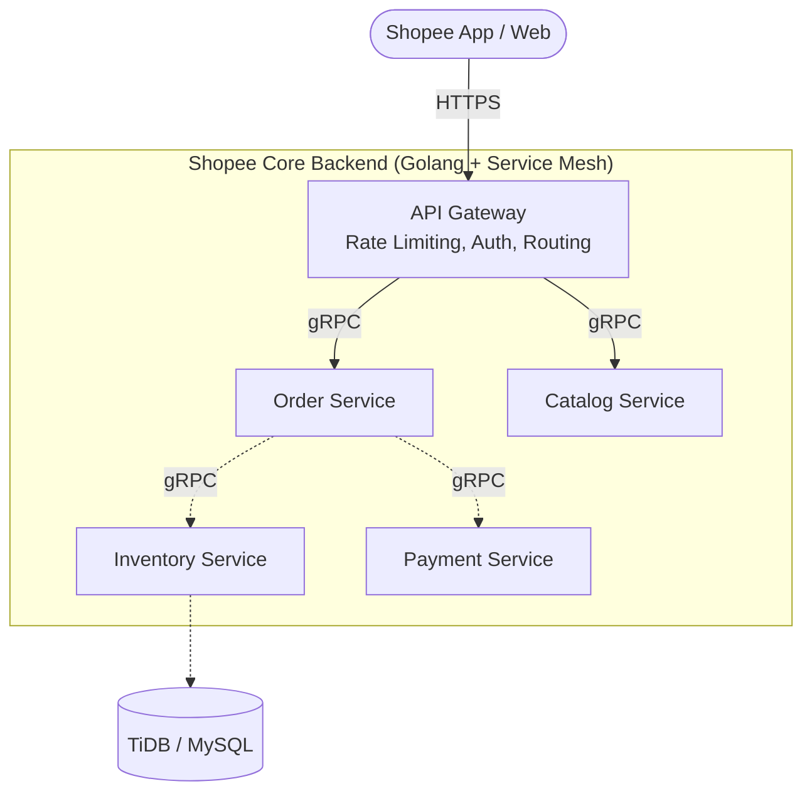

---
title: "Chapter 1: Microservices Foundation - The Power of Go, gRPC, and API Gateway"
date: 2026-05-05T08:10:00+07:00
lastmod: 2026-05-05T08:10:00+07:00
draft: false
mermaid: true
description: "How Shopee builds its backend with Golang, gRPC, and Microservices to handle massive scale."
ShowToc: true
TocOpen: true
cover:
  image: "/images/posts/shopee-flash-sale-cover.png"
  alt: "Shopee Architecture series: scaling for flash sales — rate limiting, Redis, and distributed systems"
  relative: false
---
# Chapter 1: Building a Massive Foundation with Microservices, Golang, and gRPC

**Shopee handles millions of concurrent users by abandoning monolithic architectures in favor of microservices built on Golang and gRPC. This foundation guarantees isolated scaling and sub-millisecond inter-service communication.**

[← Series hub](/series/shopee-architecture/) | [Next →](/series/shopee-architecture/02-flash-sale-engine/)

In the first part of our Shopee architecture series, we dive deep into their foundational layer. To serve millions of concurrent users (high-concurrency), a Monolithic architecture is impossible. A single bottleneck would bring down the entire system. The mandatory solution is the **Microservices Architecture**.

## 1. Why Did Shopee Choose Golang?

**Golang was chosen over Java because its goroutine model consumes only ~2KB of RAM per concurrent connection, enabling a single backend instance to handle tens of thousands of requests without memory exhaustion or JVM warmup delays.**

While Java remains traditional for Enterprise systems, Shopee selected **Golang (Go)** for the vast majority of its core backend services.

- **Goroutines & Ultimate Concurrency:** In Java or C++, each thread maps directly to an OS thread, consuming around 1-2MB of RAM. Go introduces **Goroutines**, which run on the User Space and are managed by the Go Runtime via an M:N scheduling model. A Goroutine consumes only about 2KB of RAM. This enables a single, lightweight backend instance to handle tens of thousands of concurrent connections (the C10K problem) without memory exhaustion.
- **Compiled Performance:** Go compiles directly to Machine Code. There is no JVM warmup or JIT compilation overhead. It starts up blazingly fast, making it perfectly suited for Kubernetes environments where scaling up hundreds of Pods in seconds is critical.

## 2. Inter-Service Communication: The Power of gRPC

**To eliminate HTTP/1.1 JSON parsing overhead across thousands of microservices, Shopee uses gRPC. It leverages HTTP/2 multiplexing and binary Protobuf serialization to drastically reduce payload sizes and latency.**

Inside Shopee's ecosystem, there are thousands of Microservices. If they communicated via RESTful APIs (HTTP/1.1 + JSON), the parsing overhead would cause massive latency. The solution is **gRPC**.

- **HTTP/2 Multiplexing:** gRPC runs over HTTP/2, allowing multiple requests to be sent concurrently over a single TCP connection (Multiplexing). This eliminates Head-of-Line blocking and drastically reduces latency.
- **Protocol Buffers (Protobuf):** Instead of sending heavy JSON text strings, gRPC serializes data into a highly compressed Binary format. Payload sizes shrink significantly, and parsing binary is orders of magnitude faster than parsing JSON. Furthermore, `.proto` files act as a strict "API Contract", eliminating type mismatch errors across different engineering teams.

## 3. Traffic Management: API Gateway & Service Mesh

**All incoming traffic is filtered by an API Gateway for rate limiting and authentication, while internal east-west traffic is routed through a Service Mesh proxy (Envoy/Istio) to decouple infrastructure logic from business logic.**

When a user opens the Shopee app, their phone never talks directly to the Database or the Order Service. Everything goes through gatekeepers.

- **API Gateway (North-South Traffic):** Located at the edge of the network, the Gateway handles cross-cutting concerns:
  - **Authentication (JWT Validation)**
  - **Rate Limiting:** Using algorithms like *Token Bucket* or *Leaky Bucket*. If an IP spams 1,000 requests per second, the Gateway immediately drops the traffic and returns a `429 Too Many Requests` error, shielding the backend completely.
- **Service Mesh (East-West Traffic):** Internally, Shopee utilizes a Service Mesh pattern (e.g., Envoy/Istio). Services do not need to manually discover IP addresses (Service Discovery) or write custom retry logic. A "Sidecar Proxy" running alongside each service automatically handles load balancing, retries, and timeouts. This decouples infrastructure logic entirely from the business logic.

**Developer Takeaway:** A skyscraper needs a solid foundation. The combination of **Microservices + Go + gRPC + API Gateway** forms the perfect skeleton for building distributed, ultra-high traffic, and low-latency systems.


