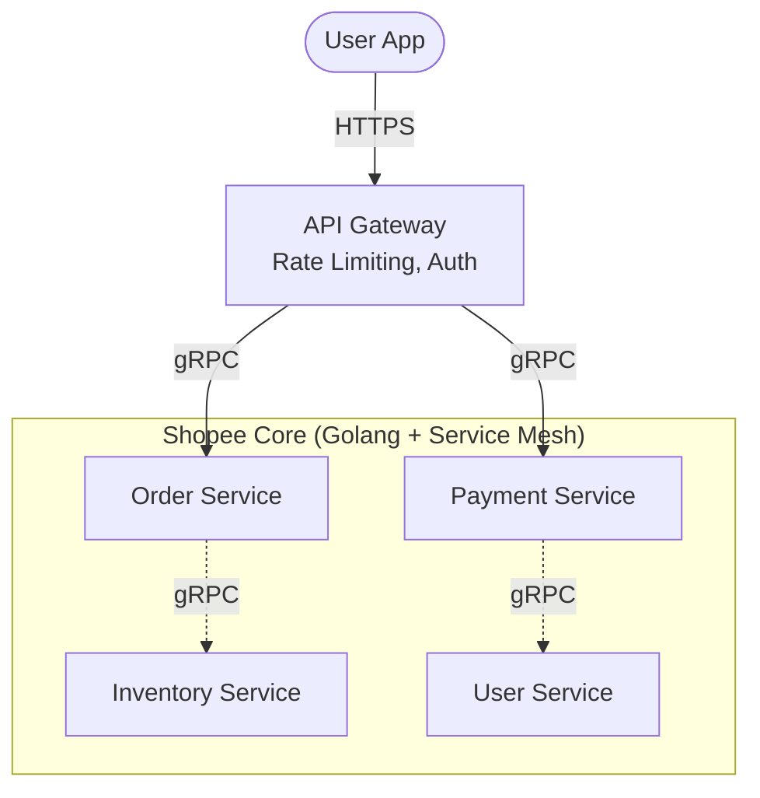

[← Series hub](/series/shopee-architecture/)
[Next →](/series/shopee-architecture/02-flash-sale-engine/)

# Chapter 1: Building a Massive Foundation with Microservices, Golang, and gRPC

In the first part of our Shopee architecture series, we explore their foundational layer: the Microservices Architecture. To serve millions of concurrent users, a monolithic approach is impossible. Shopee divides its system into hundreds of independent services.

## 1. Why Golang?
Shopee's core backend is primarily written in **Golang (Go)**.
- **Ultimate Concurrency:** Go is designed with Goroutines, allowing the processing of millions of concurrent requests with a fraction of the RAM compared to Java Threads.
- **High Performance:** Go compiles directly to machine code, running extremely fast, which is perfect for low-latency services like Ordering and Payment.

## 2. Internal Communication: The Power of gRPC
Instead of using slow RESTful APIs (HTTP/JSON), microservices within Shopee communicate using **gRPC**.
- It uses **HTTP/2** (allowing multiple data streams over a single connection).
- It uses **Protocol Buffers (Protobuf)**: Data is serialized into binary format instead of JSON text. Payload size is significantly reduced, and parsing speed is incredibly fast.

## 3. Traffic Management with API Gateway & Service Mesh
When you open the Shopee app, your phone doesn't call the Database or Order Service directly.
- **API Gateway (North-South Traffic):** Acts as the single entry point receiving requests from users. Its main tasks include: Token validation, API aggregation, and crucially, **Rate Limiting** (blocking spam requests).
- **Service Mesh (East-West Traffic):** Internally, hundreds of services need to call each other. Shopee uses a Service Mesh (like Istio/Envoy) to automate internal load balancing and **Circuit Breaking** (automatically cutting off traffic if a service fails, preventing a domino effect).

**Takeaway:** A skyscraper needs a solid foundation. Microservices + Go + gRPC + API Gateway form the perfect skeletal structure for Shopee to withstand massive traffic storms.


