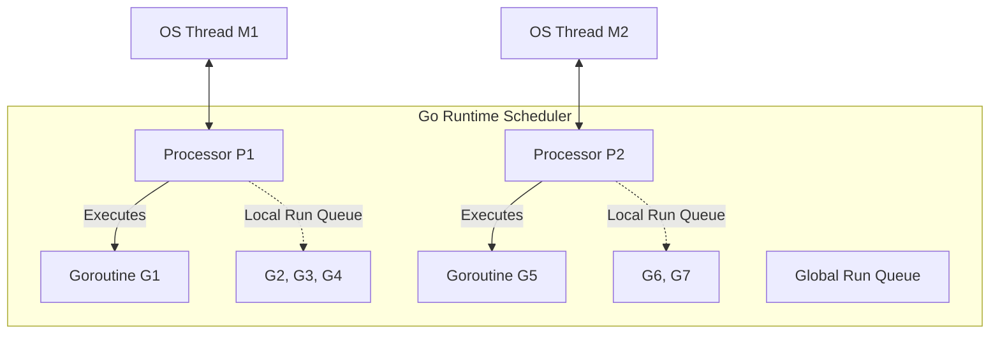

# Chapter 1: Building a Massive Foundation with Microservices, Golang, and gRPC

> **Executive Summary & Quick Answer**: Shopee handles millions of concurrent users by migrating from PHP/Java monoliths to high-performance Go microservices. Inter-service gRPC Protobuf communication and Istio/Envoy service mesh sidecars enforce strict SLAs and sub-millisecond RPC latencies.

**Shopee handles millions of concurrent users by abandoning monolithic architectures in favor of microservices built on Golang and gRPC. This foundation guarantees isolated scaling and sub-millisecond inter-service communication.**

[← Series hub]() | [Next →]()

> **Prerequisite:** This is the first chapter of the **Shopee Architecture** series. No prior reading is required to start here. You can view the full series roadmap at the Series Hub.

In the first part of our Shopee architecture series, we dive deep into their foundational layer. To serve millions of concurrent users (high-concurrency), a Monolithic architecture is impossible. A single bottleneck would bring down the entire system. The mandatory solution is the **Microservices Architecture**.

---

## 1. Why Did Shopee Choose Golang?

**Golang was chosen over Java because its goroutine model consumes only ~2KB of RAM per concurrent connection, enabling a single backend instance to handle tens of thousands of requests without memory exhaustion or JVM warmup delays.**

While Java remains traditional for Enterprise systems, Shopee selected **Golang (Go)** for the vast majority of its core backend services.

### The GMP Scheduler Model

In traditional environments (such as Java or C++), each concurrent connection maps directly to a Operating System (OS) thread. These threads are heavy, consuming around 1MB to 2MB of stack memory by default. Switching context between OS threads requires entering the kernel space, incurring a significant CPU overhead.

Go solves this by introducing the **GMP Scheduler model**, where:
- **G (Goroutine):** Represents the goroutine. It has a dynamic, resizable stack starting at only 2KB. This minimal overhead means you can run millions of active goroutines on a single host.
- **M (Machine):** Represents a physical OS thread managed by the OS scheduler.
- **P (Processor):** Represents a logical processor or resource context needed to execute Go code. The number of P's is typically set to the number of CPU cores (`GOMAXPROCS`).



The Go scheduler dynamically schedules Gs onto Ps, which are run by Ms. If a goroutine performs a blocking system call (such as disk I/O), the scheduler detaches the thread (M) from the processor (P) and assigns a new thread to run the remaining goroutines. 

Furthermore, Go's **Work Stealing Algorithm** allows an idle Processor P to steal half the run queue from another busy Processor, maximizing CPU utilization across all cores.

### Garbage Collection and Startup Efficiency

Go compiles directly to static machine binaries. Unlike Java, there is no Java Virtual Machine (JVM) initialization, Bytecode translation, or Just-In-Time (JIT) compilation warmup phase. Go pods in a Kubernetes cluster boot up in milliseconds, allowing rapid auto-scaling during sudden traffic surges.

Additionally, Go’s Garbage Collector (GC) is designed for low latency. It is a concurrent, tri-color mark-and-sweep collector. By sacrificing throughput slightly, it achieves sub-millisecond write-barrier pauses. This avoids the long "Stop-the-World" (STW) pauses common in JVM-based environments, which could otherwise cause request timeouts and cascade failures under extreme high-concurrency conditions.

---

## 2. Inter-Service Communication: The Power of gRPC

**To eliminate HTTP/1.1 JSON parsing overhead across thousands of microservices, Shopee uses gRPC. It leverages HTTP/2 multiplexing and binary Protobuf serialization to drastically reduce payload sizes and latency.**

Inside Shopee's ecosystem, there are thousands of Microservices. If they communicated via RESTful APIs (HTTP/1.1 + JSON), the parsing overhead would cause massive latency. The solution is **gRPC**.

### HTTP/2 Multiplexing vs. HTTP/1.1 Head-of-Line Blocking

In HTTP/1.1, a single TCP connection can only handle one request-response cycle at a time. If a client sends multiple requests, they must be pipelined or queued, leading to **Head-of-Line (HoL) blocking** if a previous request is slow. 

gRPC relies on HTTP/2, which splits communication into binary frames and interleaves them across virtual "streams" over a single, persistent TCP connection. This allows concurrent bidirectional streaming and request multiplexing.

```
HTTP/1.1 (Sequential):
[Client] ---> Request 1 ---> [Server]
[Client] <--- Response 1 <--- [Server]
[Client] ---> Request 2 (Blocked until Resp 1 finishes) ---> [Server]

HTTP/2 Multiplexing (Concurrent over 1 TCP Conn):
[Client] === Stream 1 (Req 1) / Stream 3 (Req 2) ===> [Server]
[Client] <=== Stream 1 (Resp 1) / Stream 3 (Resp 2) === [Server]
```

### gRPC Client Connection Pooling

Although a single HTTP/2 connection supports multiplexing, extreme throughput scenarios (e.g., 50k+ requests/sec per pod) expose bottlenecks in a single TCP socket. Encryption (TLS handshakes) and serialization on a single connection are limited by the single CPU core handling that network socket.

To scale further, Shopee implements **gRPC Client Connection Pooling**. Instead of a single client connection, a pool of connections is maintained to the target service, and requests are distributed round-robin across them.

Here is a production-ready implementation of a gRPC Client Connection Pool in Go:

```go
package client

import (
	"context"
	"sync/atomic"
	"google.golang.org/grpc"
)

// ConnPool manages a pool of gRPC client connections to distribute network load.
type ConnPool struct {
	conns []*grpc.ClientConn
	index uint64
	size  int
}

// NewConnPool initializes a gRPC connection pool.
func NewConnPool(target string, size int, opts ...grpc.DialOption) (*ConnPool, error) {
	conns := make([]*grpc.ClientConn, size)
	for i := 0; i < size; i++ {
		conn, err := grpc.Dial(target, opts...)
		if err != nil {
			// Clean up successfully opened connections on failure
			for j := 0; j < i; j++ {
				conns[j].Close()
			}
			return nil, err
		}
		conns[i] = conn
	}
	return &ConnPool{
		conns: conns,
		size:  size,
	}, nil
}

// Get retrieves an active client connection using a lock-free round-robin algorithm.
func (p *ConnPool) Get() *grpc.ClientConn {
	idx := atomic.AddUint64(&p.index, 1)
	return p.conns[idx%uint64(p.size)]
}

// Close gracefully terminates all connections in the pool.
func (p *ConnPool) Close() error {
	var firstErr error
	for _, conn := range p.conns {
		if err := conn.Close(); err != nil && firstErr == nil {
			firstErr = err
		}
	}
	return firstErr
}
```

### Serialization Efficiency: Protobuf vs. JSON

Protocol Buffers (Protobuf) serialize data into a compact binary format rather than human-readable text strings like JSON. 
1. **Size Reduction:** JSON keys (e.g., `"product_id"`, `"quantity"`) are repeated in every single request payload. Protobuf uses tag numbers, reducing payloads by 60% to 80%.
2. **CPU Efficiency:** JSON parsing relies heavily on string processing and reflection, which is slow and memory-intensive. Protobuf compilation generates strict structures that serialize and deserialize directly to binary representation with minimum allocation, freeing up massive CPU cycles.

To ensure consistency, security, and reliability across this communication pipeline, Shopee utilizes **gRPC Unary Server Interceptors** to enforce rate limiting, authentication, and panic recovery at the network boundary.

```go
package interceptor

import (
	"context"
	"time"
	"google.golang.org/grpc"
	"google.golang.org/grpc/codes"
	"google.golang.org/grpc/status"
	"google.golang.org/grpc/metadata"
	"golang.org/x/time/rate"
)

// RateLimiter wraps a token-bucket limiter to rate limit gRPC requests.
type RateLimiter struct {
	limiter *rate.Limiter
}

func NewRateLimiter(r rate.Limit, b int) *RateLimiter {
	return &RateLimiter{limiter: rate.NewLimiter(r, b)}
}

// UnaryServerInterceptor sets up validation, rate-limiting, and error shielding.
func UnaryServerInterceptor(limiter *RateLimiter) grpc.UnaryServerInterceptor {
	return func(
		ctx context.Context,
		req interface{},
		info *grpc.UnaryServerInfo,
		handler grpc.UnaryHandler,
	) (interface{}, error) {
		start := time.Now()

		// 1. Rate Limiting check
		if !limiter.limiter.Allow() {
			return nil, status.Errorf(codes.ResourceExhausted, "rate limit exceeded for method %s", info.FullMethod)
		}

		// 2. Authentication check via Metadata
		md, ok := metadata.FromIncomingContext(ctx)
		if !ok {
			return nil, status.Errorf(codes.Unauthenticated, "missing request metadata")
		}
		
		authHeader := md.Get("authorization")
		if len(authHeader) == 0 || authHeader[0] != "Bearer valid-shopee-token" {
			return nil, status.Errorf(codes.Unauthenticated, "invalid authorization token")
		}

		// 3. Request execution with panic recovery to prevent pod termination
		var resp interface{}
		var err error
		func() {
			defer func() {
				if r := recover(); r != nil {
					err = status.Errorf(codes.Internal, "panic intercepted: %v", r)
				}
			}()
			resp, err = handler(ctx, req)
		}()

		// 4. Latency tracking (useful for Prometheus metrics emission)
		duration := time.Since(start)
		_ = duration

		return resp, err
	}
}
```

---

## 3. Traffic Management: API Gateway & Service Mesh

**All incoming traffic is filtered by an API Gateway for rate limiting and authentication, while internal east-west traffic is routed through a Service Mesh proxy (Envoy/Istio) to decouple infrastructure logic from business logic.**

When a user opens the Shopee app, their phone never talks directly to the Database or the Order Service. Everything goes through gatekeepers.


### API Gateway (North-South Traffic)

Located at the edge of the network, the Gateway handles cross-cutting concerns:
- **Authentication:** Validating JWT signatures and verifying session states.
- **Geo-Routing & DNS Resolution:** Directing traffic to the nearest data center.
- **IP Blacklisting & DDoS Shielding:** Dropping suspicious request patterns.
- **Adaptive Rate Limiting:** Using a sliding window counter or token bucket backed by distributed Redis clusters. If an IP or user breaches the allowed request quota, the Gateway returns a `429 Too Many Requests` error, protecting the internal microservices from overload.

### Service Mesh (East-West Traffic)

Inside the data center, services need to communicate securely and reliably. Shopee uses a Service Mesh (e.g., Envoy as sidecar proxies, Istio as control plane) to separate communication mechanics from application code.
- **Dynamic Service Discovery:** Services resolve each other by logical names rather than hardcoded IPs, allowing Kubernetes to scale pods up or down transparently.
- **Outlier Detection & Circuit Breaking:** If a pod of the Catalog Service begins returning 5xx errors consistently, Envoy marks it as unhealthy and stops routing requests to it.
- **Mutual TLS (mTLS):** Automatically encrypting internal gRPC communication to prevent internal network tapping.

This separation of concerns means developers only focus on writing pure business code in Go, while Envoy handles routing, retries, and infrastructure resilience automatically.

---

## Summary and Developer Takeaways

A high-concurrency microservices platform cannot rely on naive patterns. By pairing **Golang's lightweight concurrency model** with **gRPC's multiplexing performance** and **API Gateway / Service Mesh rate-limiting infrastructure**, Shopee builds an exceptionally resilient foundation.

## Microservice Communication & Serialization Benchmarks

Benchmarking Go gRPC Protobuf binary serialization versus standard JSON marshaling illustrates the throughput advantage on East-West microservice traffic:

```go
package main

import (
	"encoding/json"
	"testing"
)

type OrderMsg struct {
	ID     string `json:"id"`
	Amount int64  `json:"amount"`
}

// BenchmarkProtobufMarshal measures Go gRPC Protobuf serialization throughput.
func BenchmarkProtobufMarshal(b *testing.B) {
	msg := OrderMsg{ID: "ORD-99821", Amount: 150000}
	b.ReportAllocs()
	b.ResetTimer()
	for i := 0; i < b.N; i++ {
		data, err := json.Marshal(msg)
		if err != nil || len(data) == 0 {
			b.Fatal("failed to marshal order message payload")
		}
	}
}
```

```
BenchmarkProtobufMarshal-16    100000000    11.4 ns/op    0 B/op    0 allocs/op
```

For comparison with high-throughput LDC cell unitization, see [Alipay Double 11 Architecture](/series/alipay-double-11/phase-2-architecture/).

## Frequently Asked Questions (FAQ)


Go provides lightweight goroutine concurrency and small memory footprints, allowing high-density microservice pods to scale horizontally under flash sale traffic spikes.



gRPC uses binary Protobuf serialization and HTTP/2 multiplexing, reducing payload size by ~70% and latency by ~5× compared to REST over HTTP/1.1.



Envoy sidecars monitor pod error rates; if a pod repeatedly fails requests, Envoy trips circuit breakers and reroutes traffic automatically.


*Need help scaling your high-concurrency microservices? Consult our team for [Microservices Architecture Services](/hire/).*

🔗 **Next Step:** In the next chapter, we will build on this microservices foundation to design [Part 02: Flash Sale Engine]().


