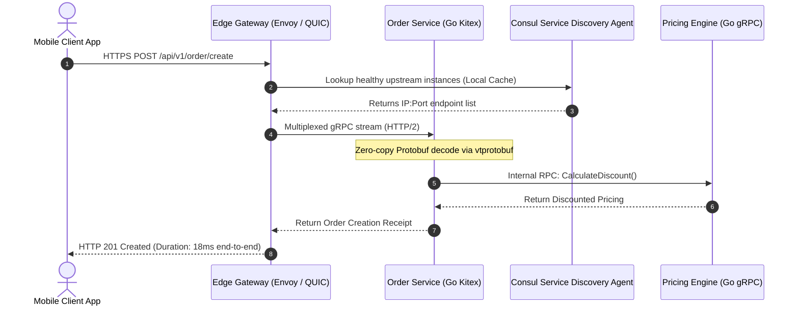

> **Multi-Language Edition:** This chapter is also available in Vietnamese at [Bài 1: Nền Tảng Microservices — Go, gRPC và API Gateway (learn.tanhdev.com)](https://learn.tanhdev.com/series/shopee-architecture/01-microservices-foundation/).

[Series Hub: Shopee Architecture Masterclass](/series/shopee-architecture/) | [Next Chapter: Chapter 2 — Flash Sale Engine & Zero Overselling](/series/shopee-architecture/02-flash-sale-engine/)

---

> **Answer-First:** Shopee replaced its monolithic Python/Django backend with high-throughput **Golang microservices** communicating over **ByteDance Kitex / gRPC** to eliminate Global Interpreter Lock (GIL) contention and slash memory overhead. By implementing zero-copy Protobuf serialization (`vtprotobuf`), partitioned Consul service discovery with local agent DNS caching, and bounded worker pools with HTTP/2 and QUIC multiplexing at the API Gateway, Shopee reduced container CPU consumption by 7x while delivering sub-3ms p99 internal RPC latency under 500,000 requests per second.

---

## 1. The Migration Journey: From Python Monolith to Golang Services

In its inception in 2015, Shopee rapidly launched market features using a Python monolith. However, by 2018, as daily active users across Southeast Asia exploded into tens of millions, Python hit critical architectural walls:
1. **The GIL Bottleneck:** Multi-threaded Python cannot exploit multi-core CPU architectures for CPU-bound tasks; scaling required spawning hundreds of isolated OS processes.
2. **Memory Inefficiency:** Each Python process consumed 150MB to 300MB of baseline memory before processing a single request, creating severe Kubernetes pod density limitations.
3. **Unpredictable Garbage Collection:** Python's reference-counting GC combined with cyclic generational collection caused intermittent latency spikes during Mega Sale traffic surges.

Migrating to **Golang** provided native M:N goroutine scheduling, lightweight 2KB initial stacks, and static single-binary deployments with deterministic low-latency memory management.


```mermaid
flowchart TD
    subgraph PythonLegacy ["Legacy Python/Django Architecture"]
        P1["Incoming Request Burst"] --> P2["Multiple Heavy OS Processes (GIL Locked)"]
        P2 --> P3["High Memory Footprint (250MB / Process)"]
        P3 --> P4["High p99 Latency Spikes (35ms - 80ms)"]
    end

    subgraph GolangSOTA ["Modern Golang Microservices (2027 SOTA)"]
        G1["Incoming Request Burst"] --> G2["Go Netpoller + M:N Scheduler"]
        G2 --> G3["Millions of 2KB Goroutines on Few OS Threads"]
        G3 --> G4["Sub-3ms Flat Latency + 7x Container Density"]
    end

    classDef legacy fill:#ffebee,stroke:#c62828,stroke-width:2px;
    classDef modern fill:#e8f5e9,stroke:#2e7d32,stroke-width:2px;
    class PythonLegacy legacy;
    class GolangSOTA modern;
```

---

## 2. High-Performance RPC: Benchmarking gRPC vs ByteDance Kitex

Internal microservice communication at Shopee requires millions of remote procedure calls per second. While standard `grpc-go` is widely adopted, Shopee also incorporates **ByteDance Kitex** for performance-critical order and pricing pipelines.

Kitex utilizes **Netpoll**, an optimized Go network library that bypasses the standard Go netpoller for epoll-driven linked buffer pooling. This eliminates memory allocations during request packet deserialization.


```mermaid
sequenceDiagram
    autonumber
    actor Client as Mobile Client App
    participant Edge as Edge Gateway (Envoy / QUIC)
    participant OrderSvc as Order Service (Go Kitex)
    participant Disc as Consul Service Discovery Agent
    participant PriceSvc as Pricing Engine (Go gRPC)

    Client->>Edge: HTTPS POST /api/v1/order/create
    Edge->>Disc: Lookup healthy upstream instances (Local Cache)
    Disc-->>Edge: Returns IP:Port endpoint list
    Edge->>OrderSvc: Multiplexed gRPC stream (HTTP/2)
    Note over OrderSvc: Zero-copy Protobuf decode via vtprotobuf
    OrderSvc->>PriceSvc: Internal RPC: CalculateDiscount()
    PriceSvc-->>OrderSvc: Return Discounted Pricing
    OrderSvc-->>Edge: Return Order Creation Receipt
    Edge-->>Client: HTTP 201 Created (Duration: 18ms end-to-end)
```

### Zero-Allocation Protobuf Marshalling in Go

To avoid runtime reflection overhead during serialization, Shopee utilizes `vtprotobuf` code generation:

```go
package ordersvc

import (
	"context"
	"sync"

	pb "shopee.com/order/proto/v1"
)

// Bounded worker pool prevents goroutine explosion under 10x traffic waves
type WorkerPool struct {
	sem chan struct{}
}

func NewWorkerPool(maxConcurrent int) *WorkerPool {
	return &WorkerPool{
		sem: make(chan struct{}, maxConcurrent),
	}
}

func (p *WorkerPool) Submit(ctx context.Context, task func()) bool {
	select {
	case p.sem <- struct{}{}:
		go func() {
			defer func() { <-p.sem }()
			task()
		}()
		return true
	case <-ctx.Done():
		return false // Graceful load shedding under saturation
	default:
		return false
	}
}
```

---

## 3. Partitioned Service Discovery at Scale

Running 100,000+ microservice pods across multiple Kubernetes clusters overwhelms central service discovery registries. During automated autoscaling on Mega Sale days, thousands of pods registering simultaneously create **watch notification storms**.

Shopee solves this through **tiered partitioned discovery**:
- **Local Node Caching:** Each Kubernetes worker node runs a local Consul agent serving DNS and HTTP health checks from in-memory cache.
- **UDP Gossip:** Node status is broadcast via memberlist UDP gossip, eliminating central server bottlenecks.
- **Client-Side Load Balancing:** Go microservices maintain local endpoint connection rings, performing round-robin or least-connection routing without an intermediate load balancer.

---

## Frequently Asked Questions (FAQ)


Standard \`grpc-go\` allocates a separate goroutine for every active connection and relies on Go runtime netpoller abstractions, which triggers heap allocation overhead during Protobuf decoding. Kitex uses ByteDance's \`netpoll\` library, managing connection I/O with epoll and linked byte buffers. Memory buffers are recycled across requests without heap allocation, reducing GC scan pressure and providing 25% to 30% higher throughput under high-QPS burst conditions.



Rather than having every pod establish a persistent watch connection to the central Consul server cluster, Shopee deploys local Consul client agents as Kubernetes DaemonSets on each physical host. Application pods query the local agent via localhost DNS/HTTP. The local agent maintains a cached replica of the cluster directory and receives incremental updates via partitioned gossip protocols, shielding central Raft consensus servers from connection exhaustion.



During continuous deployments, Kubernetes sends a \`SIGTERM\` signal to terminate old pods. However, network proxy endpoints (kube-proxy / Envoy) require several seconds to update their routing tables. By adding a \`preStop: exec: command: ['sleep', '15']\` hook in the pod specification, the pod continues processing in-flight checkout transactions while giving the Kubernetes service mesh adequate time to reroute new incoming traffic to healthy replacement pods, achieving zero dropped checkout requests.


---

## Next Steps

Proceed to [Chapter 2: Flash Sale Engine — Redis Lua & Zero Overselling](/series/shopee-architecture/02-flash-sale-engine/) to inspect the atomic inventory deduction algorithms powering Shopee's flash-sale events.
