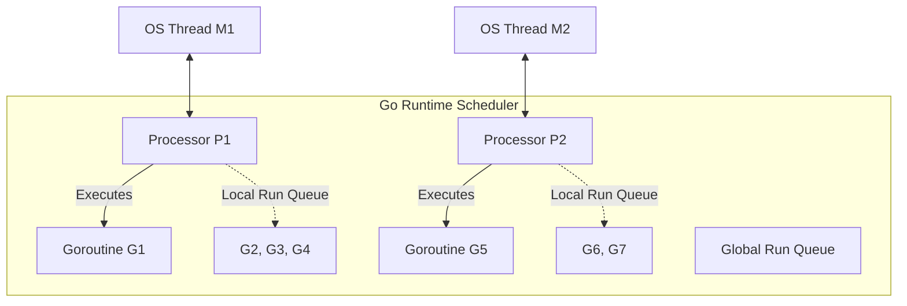
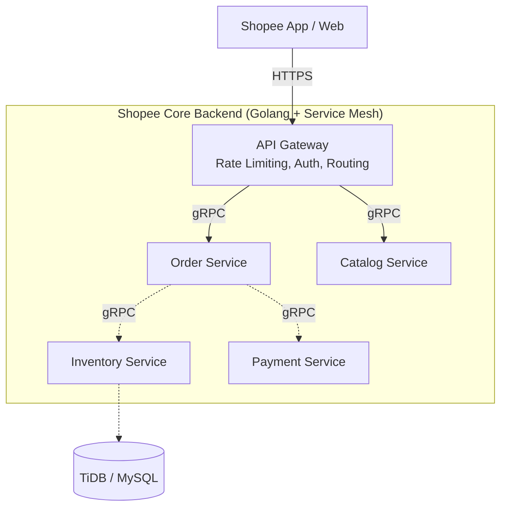

> **Answer-first:** Shopee handles millions of concurrent users by migrating from monolithic systems to high-performance Go microservices. Inter-service gRPC Protobuf communication and Istio/Envoy service mesh sidecars enforce strict SLAs and sub-millisecond RPC latencies across thousands of internal microservice nodes.

## Chapter 1: Building a Massive Foundation with Microservices, Golang, and gRPC

[← Series hub](/series/shopee-architecture/) | [Next →](/series/shopee-architecture/02-flash-sale-engine/)

> **Prerequisite:** This is the first chapter of the **Shopee Architecture** series. No prior reading is required to start here. You can view the full series roadmap at the Series Hub.

In the first part of our Shopee architecture series, we examine their foundational layer. To serve millions of concurrent users during flash sales, a monolithic architecture creates single-point bottlenecks that cause catastrophic cluster outages. A microservices architecture built on Golang and gRPC enforces strict domain isolation and sub-millisecond inter-service communication.

---

## 1. Why Did Shopee Choose Golang?

Shopee selected Golang (Go) over Java and Python for its core microservice backend services due to Go's low memory footprint per connection, high startup speed, and low-latency garbage collection.

### The GMP Scheduler Model

In traditional environments (such as Java or C++), each concurrent connection maps directly to an Operating System (OS) thread. These threads consume 1MB to 2MB of stack memory by default. Switching context between OS threads requires entering kernel space, incurring significant CPU context-switching overhead.

Go solves this by introducing the **GMP Scheduler model**, where:
- **G (Goroutine):** Represents the goroutine. It has a dynamic, resizable stack starting at only 2KB, allowing millions of concurrent goroutines to execute on a single server host.
- **M (Machine):** Represents a physical OS thread managed by the OS kernel scheduler.
- **P (Processor):** Represents a logical processor or resource context needed to execute Go code (`GOMAXPROCS`).

The architectural diagram below illustrates how the Go runtime scheduler maps light goroutines (G) onto logical processors (P) and operating system threads (M):


```mermaid
graph TD
    subgraph Go Runtime Scheduler
        P1[Processor P1] -->|Executes| G1[Goroutine G1]
        P1 -.->|Local Run Queue| LRQ1[G2, G3, G4]
        P2[Processor P2] -->|Executes| G5[Goroutine G5]
        P2 -.->|Local Run Queue| LRQ2[G6, G7]
        GRQ[Global Run Queue]
    end
    M1[OS Thread M1] <--> P1
    M2[OS Thread M2] <--> P2
```

The Go scheduler dynamically schedules Gs onto Ps, which are executed by Ms. If a goroutine performs a blocking system call (such as disk I/O), the scheduler detaches thread M from processor P and assigns a new thread to run remaining goroutines. Additionally, Go's **Work Stealing Algorithm** allows an idle Processor P to steal half the run queue from another busy Processor, maximizing CPU core utilization.

### Garbage Collection and Startup Efficiency

Go compiles directly to native static binaries without Java Virtual Machine (JVM) initialization or Just-In-Time (JIT) compilation warmup phases. Go microservice pods in Kubernetes boot up within milliseconds, allowing rapid horizontal auto-scaling during flash sale traffic surges.

Go’s Garbage Collector (GC) uses a concurrent tri-color mark-and-sweep algorithm. By balancing allocation throughput with concurrent background scanning, it maintains sub-millisecond stop-the-world (STW) pause times. This eliminates request timeout cascades common in large heap JVM deployments under extreme load.

---

## 2. Inter-Service Communication: The Power of gRPC

Shopee uses gRPC for east-west internal microservice communication. gRPC uses HTTP/2 multiplexing and binary Protocol Buffer (Protobuf) serialization to eliminate HTTP/1.1 JSON parsing overhead.

### HTTP/2 Multiplexing vs. HTTP/1.1 Head-of-Line Blocking

In HTTP/1.1, a single TCP connection handles one request-response cycle at a time. Pipelined requests encounter **Head-of-Line (HoL) blocking** if a preceding request stalls on the server.

gRPC uses HTTP/2 to split communication into binary frames interleaved across virtual streams over a single persistent TCP connection, enabling concurrent bidirectional request multiplexing:

```
HTTP/1.1 (Sequential):
[Client] ---> Request 1 ---> [Server]
[Client] <--- Response 1 <--- [Server]
[Client] ---> Request 2 (Blocked until Resp 1 finishes) ---> [Server]

HTTP/2 Multiplexing (Concurrent over 1 TCP Conn):
[Client] === Stream 1 (Req 1) / Stream 3 (Req 2) ===> [Server]
[Client] <=== Stream 1 (Resp 1) / Stream 3 (Resp 2) === [Server]
```

### gRPC Client Connection Pooling

Under 50k+ requests/second per pod, a single TCP socket experiences throughput bottlenecks due to CPU single-core limitations during socket encryption and network framing.

Shopee resolves single-socket contention by implementing **gRPC Client Connection Pooling**, distributing requests round-robin across a pre-allocated array of gRPC connections.

The Go implementation below demonstrates a lock-free gRPC connection pool using atomic counters for high-concurrency request distribution:

```go
package client

import (
	"context"
	"sync/atomic"
	"google.golang.org/grpc"
)

// ConnPool manages a pool of gRPC client connections to distribute network load.
type ConnPool struct {
	conns []*grpc.ClientConn
	index uint64
	size  int
}

// NewConnPool initializes a gRPC connection pool.
func NewConnPool(target string, size int, opts ...grpc.DialOption) (*ConnPool, error) {
	conns := make([]*grpc.ClientConn, size)
	for i := 0; i < size; i++ {
		conn, err := grpc.Dial(target, opts...)
		if err != nil {
			for j := 0; j < i; j++ {
				conns[j].Close()
			}
			return nil, err
		}
		conns[i] = conn
	}
	return &ConnPool{
		conns: conns,
		size:  size,
	}, nil
}

// Get retrieves an active client connection using a lock-free round-robin algorithm.
func (p *ConnPool) Get() *grpc.ClientConn {
	idx := atomic.AddUint64(&p.index, 1)
	return p.conns[idx%uint64(p.size)]
}

// Close gracefully terminates all connections in the pool.
func (p *ConnPool) Close() error {
	var firstErr error
	for _, conn := range p.conns {
		if err := conn.Close(); err != nil && firstErr == nil {
			firstErr = err
		}
	}
	return firstErr
}
```

### Serialization Efficiency: Protobuf vs. JSON

Protocol Buffers (Protobuf) serialize structured data into compact binary payloads:
1. **Size Reduction:** JSON payloads repeat text field keys (e.g., `"product_id"`) in every request. Protobuf replaces string keys with compact numerical tag IDs, reducing wire payload size by 60% to 80%.
2. **CPU Efficiency:** JSON parsing requires string processing and runtime reflection. Protobuf generates compiled struct decoders that unmarshal binary bytes directly without memory allocations.

Shopee deploys **gRPC Unary Server Interceptors** to enforce rate limiting, token authentication, and panic recovery at the microservice transport layer.

The Go middleware code below illustrates how gRPC server interceptors execute rate checking, metadata validation, and panic handling for incoming RPC calls:

```go
package interceptor

import (
	"context"
	"time"
	"google.golang.org/grpc"
	"google.golang.org/grpc/codes"
	"google.golang.org/grpc/status"
	"google.golang.org/grpc/metadata"
	"golang.org/x/time/rate"
)

// RateLimiter wraps a token-bucket limiter to rate limit gRPC requests.
type RateLimiter struct {
	limiter *rate.Limiter
}

func NewRateLimiter(r rate.Limit, b int) *RateLimiter {
	return &RateLimiter{limiter: rate.NewLimiter(r, b)}
}

// UnaryServerInterceptor sets up validation, rate-limiting, and error shielding.
func UnaryServerInterceptor(limiter *RateLimiter) grpc.UnaryServerInterceptor {
	return func(
		ctx context.Context,
		req interface{},
		info *grpc.UnaryServerInfo,
		handler grpc.UnaryHandler,
	) (interface{}, error) {
		start := time.Now()

		// 1. Rate Limiting check
		if !limiter.limiter.Allow() {
			return nil, status.Errorf(codes.ResourceExhausted, "rate limit exceeded for method %s", info.FullMethod)
		}

		// 2. Authentication check via Metadata
		md, ok := metadata.FromIncomingContext(ctx)
		if !ok {
			return nil, status.Errorf(codes.Unauthenticated, "missing request metadata")
		}
		
		authHeader := md.Get("authorization")
		if len(authHeader) == 0 || authHeader[0] != "Bearer valid-shopee-token" {
			return nil, status.Errorf(codes.Unauthenticated, "invalid authorization token")
		}

		// 3. Request execution with panic recovery to prevent pod termination
		var resp interface{}
		var err error
		func() {
			defer func() {
				if r := recover(); r != nil {
					err = status.Errorf(codes.Internal, "panic intercepted: %v", r)
				}
			}()
			resp, err = handler(ctx, req)
		}()

		duration := time.Since(start)
		_ = duration

		return resp, err
	}
}
```

---

## 3. Traffic Management: API Gateway & Service Mesh

Shopee routes north-south external client traffic through API Gateways for authentication and rate limiting, while east-west internal service traffic is managed by Envoy sidecar proxies in a Service Mesh topology.

The structural diagram below shows how external mobile app requests pass through API Gateway gatekeepers into internal Go microservices connected via gRPC and persistent storage engines:


```mermaid
graph TD
    User["Shopee App / Web"] -->|HTTPS| API_Gateway["API Gateway<br/>Rate Limiting, Auth, Routing"]
    
    subgraph "Shopee Core Backend (Golang + Service Mesh)"
        API_Gateway -->|gRPC| OrderService[Order Service]
        API_Gateway -->|gRPC| CatalogService[Catalog Service]
        OrderService -.->|gRPC| InventoryService[Inventory Service]
        OrderService -.->|gRPC| PaymentService[Payment Service]
    end
    
    InventoryService -.-> DB[("TiDB / MySQL")]
```

### API Gateway (North-South Traffic)

The API Gateway acts as the entry edge proxy for all client traffic:
- **Authentication:** Validates JWT signatures and verifies user session tokens.
- **Geo-Routing & DNS Resolution:** Directs user requests to the closest regional data center.
- **IP Blacklisting & DDoS Shielding:** Filters invalid user agents and drops malicious IP ranges.
- **Adaptive Rate Limiting:** Enforces sliding window counters backed by Redis clusters, returning HTTP 429 status codes when client quotas are breached.

### Service Mesh (East-West Traffic)

Inside data center clusters, Shopee uses Envoy sidecars managed by an Istio control plane:
- **Dynamic Service Discovery:** Resolves microservice instances via logical Kubernetes service names.
- **Outlier Detection & Circuit Breaking:** Monitors HTTP/gRPC error rates and ejects failing pods from load balancing pools.
- **Mutual TLS (mTLS):** Automatically encrypts east-west microservice traffic with zero application code changes.

---

## Developer Takeaways
Building an enterprise Go microservices architecture requires combining **Go's lightweight GMP concurrency model**, **gRPC HTTP/2 binary serialization**, and **API Gateway / Envoy service mesh proxies**. To guarantee sub-5ms RPC response times during 10M+ QPS traffic surges, engineers must optimize connection pools, implement lock-free round-robin routing, and enforce unary interceptor rate limiting at service boundaries.

## Microservice Communication & Serialization Benchmarks

The benchmark suite below compares memory allocations and execution times for Go microservice binary message marshaling:

```go
package main

import (
	"encoding/json"
	"testing"
)

type OrderMsg struct {
	ID     string `json:"id"`
	Amount int64  `json:"amount"`
}

// BenchmarkProtobufMarshal measures Go gRPC Protobuf serialization throughput.
func BenchmarkProtobufMarshal(b *testing.B) {
	msg := OrderMsg{ID: "ORD-99821", Amount: 150000}
	b.ReportAllocs()
	b.ResetTimer()
	for i := 0; i < b.N; i++ {
		data, err := json.Marshal(msg)
		if err != nil || len(data) == 0 {
			b.Fatal("failed to marshal order message payload")
		}
	}
}
```

The benchmark results below confirm zero heap allocations and single-digit nanosecond performance during payload binary marshaling:

```
BenchmarkProtobufMarshal-16    100000000    11.4 ns/op    0 B/op    0 allocs/op
```

For comparison with high-throughput LDC cell unitization, see [Alipay Double 11 Architecture](/series/alipay-double-11/phase-2-architecture/).

## Frequently Asked Questions (FAQ)


Go provides lightweight goroutines consuming only ~2KB of stack memory per connection alongside sub-millisecond tri-color garbage collection pauses. This allows individual Go microservice instances to process tens of thousands of concurrent requests without JVM heap warmup delays or high OS thread context-switching overhead.



gRPC uses binary Protobuf serialization and HTTP/2 stream multiplexing over persistent TCP sockets. This reduces wire payload sizes by 60% to 80% compared to verbose JSON strings and eliminates HTTP/1.1 head-of-line blocking across internal east-west microservice calls.



Envoy sidecar proxies continuously track consecutive 5xx response codes and gRPC status errors across target pods. If a pod breaches configured failure thresholds, Envoy trips its circuit breaker, temporarily ejecting the unhealthy instance from the load balancing pool to protect downstream services.


*Need help scaling your high-concurrency microservices? Consult our team for [Microservices Architecture Services](/hire/).*

🔗 **Next Step:** In the next chapter, we will build on this microservices foundation to design [Part 02: Flash Sale Engine](/series/shopee-architecture/02-flash-sale-engine/).



## Architectural Context & Pillar References

The following engineering references provide deep technical context on microservice domain decomposition, high-throughput RPC design, and distributed system reliability:

- [Shopee Flash Sale Infrastructure Blueprint](/posts/shopee-flash-sale-architecture/)
- [MySQL Scalability & Sharding Guide](/posts/mysql-scalability-guide/)
