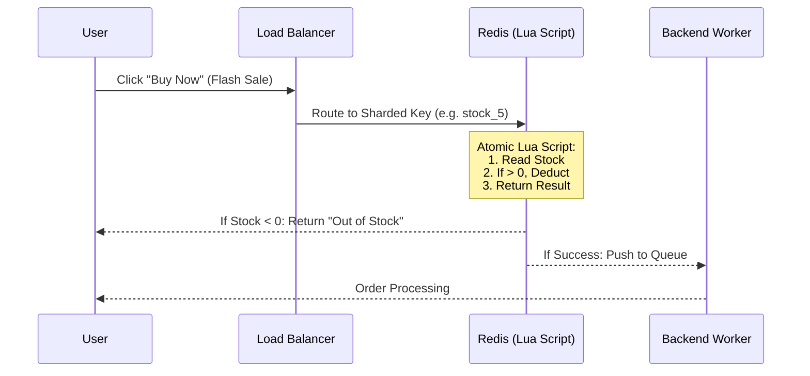

[← Series hub](/series/shopee-architecture/)
[← Prev](/series/shopee-architecture/01-microservices-foundation/) • [Next →](/series/shopee-architecture/03-traffic-shield/)

# Chapter 2: Flash Sale Engine - Solving Overselling with Redis

Flash Sale events are a nightmare for system engineers. When an item is sold for a fraction of its price, millions of users will click "Buy Now" in the exact same millisecond. This product becomes a **"Hot Key"**.

If 1 million requests hit the Database (MySQL) directly, it will result in Deadlocks and the entire system will crash instantly. Shopee uses **Redis** as a shield.

## 1. Pre-heating
Before the event starts (e.g., 00:00), the entire inventory of Flash Sale items is read from the Database and **pre-loaded into RAM (Redis)**.

## 2. Atomic Operations & Lua Scripts
When a user clicks Buy, the system checks the inventory in Redis. However, if using a standard read (GET) then write (SET) approach, a **Race Condition** will occur (two users see 1 item left, both buy successfully -> Overselling).
- **Solution:** Shopee uses **Lua Scripts** running inside Redis. The Lua script combines Read - Check - Deduct Inventory into a single **Atomic** operation. While the Lua script runs, no other requests can interrupt.
- **Fail Fast:** If Redis reports out of stock, the request is immediately returned to the user. 99.9% of excess traffic is blocked right at the RAM level.

## 3. Breaking the Limit with Key Splitting (Sharding)
A single Redis node can handle about 100,000 Ops/sec. For a super hot product (hundreds of millions of clicks), a single Redis node will still fail.
- **Inventory Sharding:** Shopee splits the inventory. If there are 1,000 iPhones, they create 10 keys across 10 different Redis Nodes (`iphone_stock_1` to `iphone_stock_10`), each holding 100 items.
- User requests are randomly routed by a Load Balancer to one of those 10 keys, distributing the load 10x.

**Takeaway:** To combat massive traffic concentrated on a single point (Hot Key), use RAM (Redis), Atomic Scripts, and shard the data across as many nodes as possible.


