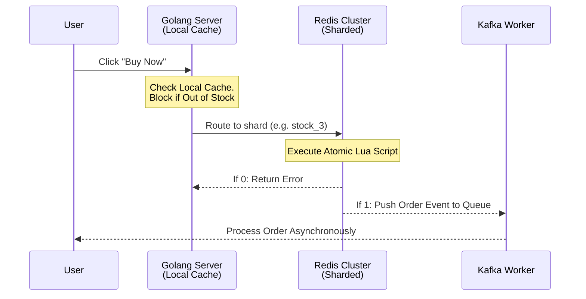

# Chapter 2: Flash Sale Engine - The Mystery Behind Redis and Hot Keys

**Flash sales generate massive traffic spikes that instantly crush traditional databases via row locks. Shopee solves this using a two-tier caching architecture, atomic Lua scripts in Redis, and inventory sharding to guarantee sub-millisecond response times without overselling.**

[← Series hub](/series/shopee-architecture/) | [← Prev](/series/shopee-architecture/01-microservices-foundation/) | [Next →](/series/shopee-architecture/03-traffic-shield/)

Flash Sale events are the ultimate stress test for system architecture. When an iPhone is sold for $1, millions of users will smash the "Buy Now" button in the exact same millisecond. If this massive spike hits a MySQL database directly, the system will instantly crash due to Row Locks and Deadlocks. 

## 1. The Hot Key Problem and Two-Tier Caching

**A single Redis node maxes out at ~100k Ops/sec and will saturate its network interface under flash sale traffic. Shopee intercepts 90% of useless traffic using a 1-second local memory cache (Tier 1) before it ever hits the distributed Redis cluster (Tier 2).**

A highly discounted product is known as a **Hot Key**.
Many developers mistakenly believe that "just putting inventory in Redis" solves everything. However, a single Redis node has Network Bandwidth and CPU limits (typically maxing out at ~100k Ops/sec). One million clicks on a single key will saturate the network interface card (NIC) of that Redis node.

**Shopee's Solution: Multi-Level Caching**
- **Tier 1 (Local Cache):** Built directly into the RAM of the Golang Application Servers (using tools like `sync.Map` or `BigCache`). This local cache only stores a boolean flag: "Is the item still in stock?". It has a TTL of just 1-2 seconds but successfully blocks 90% of useless traffic from hitting the network once the item is sold out.
- **Tier 2 (Distributed Cache - Redis):** Only when the Local Cache reports that the item is available does the request proceed to the Redis cluster.

## 2. Preventing Overselling with Atomic Lua Scripts

**Standard GET and SET commands create race conditions that lead to overselling. By wrapping the deduction logic in a Lua script, Redis executes the check and decrement as a single atomic transaction that no other thread can interrupt.**

When a user buys an item, the system must deduct the inventory. But if you use standard commands: Read stock (GET) -> Check if > 0 -> Write new stock (SET), you will face a critical **Race Condition**. Two parallel threads might both read a stock value of 1, both decrement it, and result in selling two items when only one existed (Overselling).

**The Solution:** Shopee wraps the inventory deduction logic inside **Lua Scripts** running natively within Redis. Because Redis is fundamentally single-threaded, executing a Lua script acts as an **Atomic Transaction**—no other requests can interrupt it mid-execution.

```lua
-- Example Lua Script for Inventory Deduction
local stock_key = KEYS[1]
local stock = tonumber(redis.call('GET', stock_key))

if stock and stock > 0 then
    redis.call('DECR', stock_key)
    return 1 -- Purchase Successful
else
    return 0 -- Out of Stock
end
```
**Fail Fast:** Thanks to this mechanism, if the Lua script returns 0, the request is immediately rejected and the user sees an "Out of Stock" message. This RAM-level operation takes mere microseconds.

## 3. Inventory Sharding

**To bypass single-node bottlenecks on extreme hot keys, inventory is sliced across multiple Redis nodes. 1,000 iPhones are stored as 10 shards of 100 items each, instantly dividing the massive system pressure by 10.**

For mega-campaigns, a single Hot Key on a single Redis Node is still too risky. Shopee employs **Inventory Sharding**.
If there are 1,000 iPhones, they do not store the number 1,000 in a single key `iphone_stock`. Instead, they slice it into 10 shards: `iphone_stock_1` to `iphone_stock_10`. Each key holds 100 items and is distributed across 10 different physical Redis Nodes.

A load balancer or router randomly routes incoming user traffic to one of those 10 keys, instantly dividing the massive system pressure by 10.



**Developer Takeaway:** RAM and caching are your strongest weapons against heavy traffic. However, do not blindly rely on a Distributed Cache. Combine it with Local Caches on the App Server to save network bandwidth, and always use Lua Scripts to guarantee data consistency when handling sensitive numbers like inventory or wallet balances.

---

## References & Further Reading

- [Handling Flash Sales with Redis and Lua (Medium)](https://medium.com/@kiki.syah/inventory-system-design-to-handle-flash-sales-37fc2e8dcffb)
- [Solving the Hot Key Problem with Inventory Sharding](https://medium.com/@soesah/how-to-handle-flash-sales-using-redis-c02058e0a811)
- [Shopee Engineering Blog](https://careers.shopee.sg/blog/)


