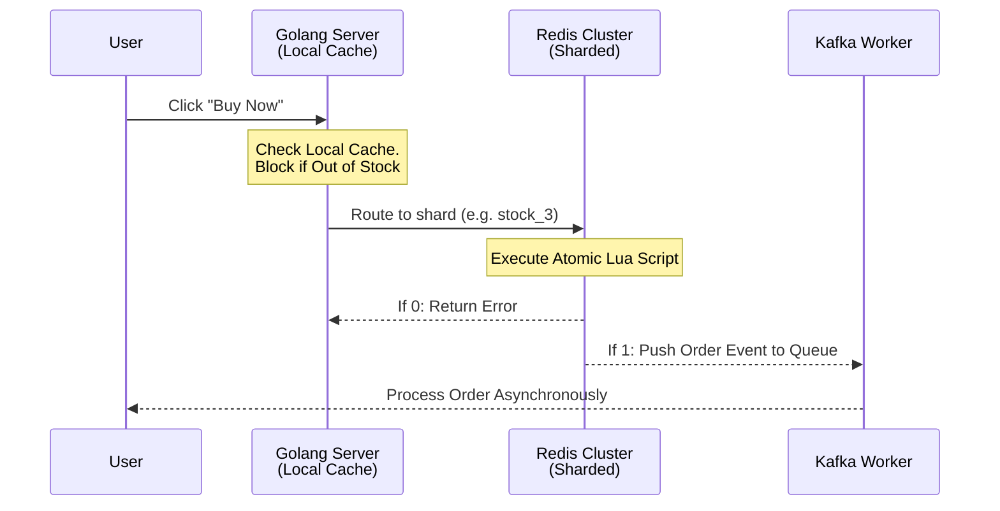

# Chapter 2: Flash Sale Engine - The Mystery Behind Redis and Hot Keys

**Flash sales generate massive traffic spikes that instantly crush traditional databases via row locks. Shopee solves this using a two-tier caching architecture, atomic Lua scripts in Redis, and inventory sharding to guarantee sub-millisecond response times without overselling.**

[← Series hub]() | [← Prev]() | [Next →]()

> **Prerequisite:** Before reading this chapter, please ensure you have read the previous article in this series: [Chapter 1: Microservices Foundation - The Power of Go, gRPC, and API Gateway]().

Flash Sale events are the ultimate stress test for system architecture. When an iPhone is sold for $1, millions of users will smash the "Buy Now" button in the exact same millisecond. If this massive spike hits a MySQL database directly, the system will instantly crash due to Row Locks and Deadlocks. 

---

## 1. The Hot Key Problem and Two-Tier Caching

**A single Redis node maxes out at ~100k Ops/sec and will saturate its network interface under flash sale traffic. Shopee intercepts 90% of useless traffic using a 1-second local memory cache (Tier 1) before it ever hits the distributed Redis cluster (Tier 2).**

A highly discounted product is known as a **Hot Key**.
Many developers mistakenly believe that "just putting inventory in Redis" solves everything. However, a single Redis node has Network Bandwidth and CPU limits (typically maxing out at ~100k Ops/sec). One million clicks on a single key will saturate the network interface card (NIC) of that Redis node.

### Shopee's Solution: Multi-Level Caching

To scale throughput, Shopee implements a multi-level caching system:
- **Tier 1 (Local Cache):** Built directly into the RAM of the Golang Application Servers (using tools like `sync.Map` or `BigCache`). This local cache only stores a boolean flag: "Is the item still in stock?". It has a TTL of just 1-2 seconds but successfully blocks 90% of useless traffic from hitting the network once the item is sold out.
- **Tier 2 (Distributed Cache - Redis):** Only when the Local Cache reports that the item is available does the request proceed to the Redis cluster.

### Local Cache Sync Intervals and Implementation

Keeping the local memory cache synchronized with Redis without causing massive network overhead is a delicate balance. Shopee uses a **pull-sync combined with event-driven invalidation** pattern. While the local cache checks a fast ticker (typically 1-second interval) to update general stock availability, a Redis Pub/Sub channel broadcasts immediate "Sold Out" messages to all pods to invalidate the local cache instantly when stock hits zero.

Here is a Go implementation of a synchronized local inventory cache:

```go
package cache

import (
	"context"
	"sync"
	"time"
	"github.com/go-redis/redis/v8"
)

// LocalInventoryCache maintains a fast, thread-safe in-memory cache of stock status.
type LocalInventoryCache struct {
	mu           sync.RWMutex
	soldOutItems map[string]bool
	redisClient  *redis.Client
	syncInterval time.Duration
}

// NewLocalInventoryCache initializes and starts the background sync routine.
func NewLocalInventoryCache(rClient *redis.Client, interval time.Duration) *LocalInventoryCache {
	cache := &LocalInventoryCache{
		soldOutItems: make(map[string]bool),
		redisClient:  rClient,
		syncInterval: interval,
	}
	// Start background synchronization routine
	go cache.startSyncTicker(context.Background())
	return cache
}

// IsSoldOut checks the local memory first. This avoids hitting Redis for already sold-out items.
func (c *LocalInventoryCache) IsSoldOut(itemID string) bool {
	c.mu.RLock()
	defer c.mu.RUnlock()
	return c.soldOutItems[itemID]
}

func (c *LocalInventoryCache) startSyncTicker(ctx context.Context) {
	ticker := time.NewTicker(c.syncInterval)
	defer ticker.Stop()

	for {
		select {
		case <-ctx.Done():
			return
		case <-ticker.C:
			// Synchronize the list of sold-out items from Redis
			soldOutList, err := c.redisClient.SMembers(ctx, "shopee:soldout:items").Result()
			if err == nil {
				c.mu.Lock()
				c.soldOutItems = make(map[string]bool)
				for _, itemID := range soldOutList {
					c.soldOutItems[itemID] = true
				}
				c.mu.Unlock()
			}
		}
	}
}
```

### Blocking Bot Attacks with Sliding Window Rate Limiters

Flash sales attract massive botnets. To prevent bots from hogging Redis connection pools, Shopee implements **Sliding Window Rate Limiters** at the application layer using Redis Sorted Sets (`ZSET`). This ensures users cannot exceed a predefined number of clicks per second.

```go
package limiter

import (
	"context"
	"strconv"
	"time"
	"github.com/go-redis/redis/v8"
)

// SlidingWindowLimiter prevents bot spam using Redis Sorted Sets.
type SlidingWindowLimiter struct {
	redisClient *redis.Client
}

func NewSlidingWindowLimiter(rClient *redis.Client) *SlidingWindowLimiter {
	return &SlidingWindowLimiter{redisClient: rClient}
}

// Allow checks if a request is permitted within the sliding window window.
func (l *SlidingWindowLimiter) Allow(ctx context.Context, key string, limit int64, window time.Duration) (bool, error) {
	now := time.Now()
	nowMs := now.UnixNano() / int64(time.Millisecond)
	clearBefore := now.Add(-window).UnixNano() / int64(time.Millisecond)

	pipe := l.redisClient.TxPipeline()

	// 1. Remove request timestamps outside the sliding window
	pipe.ZRemRangeByScore(ctx, key, "-inf", strconv.FormatInt(clearBefore, 10))
	// 2. Add current request timestamp (using a unique member string)
	member := strconv.FormatInt(nowMs, 10) + "_" + strconv.FormatInt(now.UnixNano(), 10)
	pipe.ZAdd(ctx, key, &redis.Z{Score: float64(nowMs), Member: member})
	// 3. Get current request count in this window
	cardCmd := pipe.ZCard(ctx, key)
	// 4. Set expiration to automatically clean up inactive keys
	pipe.Expire(ctx, key, window*2)

	_, err := pipe.Exec(ctx)
	if err != nil {
		return false, err
	}

	return cardCmd.Val() <= limit, nil
}
```

---

## 2. Preventing Overselling with Atomic Lua Scripts

**Standard GET and SET commands create race conditions that lead to overselling. By wrapping the deduction logic in a Lua script, Redis executes the check and decrement as a single atomic transaction that no other thread can interrupt.**

When a user buys an item, the system must deduct the inventory. But if you use standard commands: Read stock (GET) -> Check if > 0 -> Write new stock (SET), you will face a critical **Race Condition**. Two parallel threads might both read a stock value of 1, both decrement it, and result in selling two items when only one existed (Overselling).

```
Race Condition:
Thread A: GET iphone_stock -> 1
Thread B: GET iphone_stock -> 1
Thread A: SET iphone_stock -> 0 (Success)
Thread B: SET iphone_stock -> 0 (Oversold!)
```

### Atomic Lua Execution in Redis

Because Redis executes commands using a single-threaded architecture, any operations inside a Lua script run sequentially and exclusively. No other client command can execute until the script finishes, ensuring absolute isolation and atomicity.

```lua
-- Lua script for inventory deduction with user deduplication checks.
local item_key = KEYS[1]
local user_limit_key = KEYS[2]
local user_id = ARGV[1]
local max_per_user = tonumber(ARGV[2])

-- 1. Check if the user has already exceeded their purchase limit
local user_purchased = tonumber(redis.call('HGET', user_limit_key, user_id) or 0)
if user_purchased >= max_per_user then
    return -1 -- Code -1: User purchase limit reached
end

-- 2. Check current stock level
local stock = tonumber(redis.call('GET', item_key) or 0)
if stock <= 0 then
    return 0 -- Code 0: Out of stock
end

-- 3. Deduct inventory and log purchase
redis.call('DECR', item_key)
redis.call('HSET', user_limit_key, user_id, user_purchased + 1)
return 1 -- Code 1: Success
```

By executing this script, if the return value is `1`, the order is valid. If it returns `-1` or `0`, the request fails immediately, shielding database workers from useless write operations.

---

## 3. Inventory Sharding

**To bypass single-node bottlenecks on extreme hot keys, inventory is sliced across multiple Redis nodes. 1,000 iPhones are stored as 10 shards of 100 items each, instantly dividing the massive system pressure by 10.**

For mega-campaigns, a single Hot Key on a single Redis Node is still too risky. Shopee employs **Inventory Sharding**.
If there are 1,000 iPhones, they do not store the number 1,000 in a single key `iphone_stock`. Instead, they slice it into 10 shards: `iphone_stock_1` to `iphone_stock_10`. Each key holds 100 items and is distributed across 10 different physical Redis Nodes.

A routing mechanism (typically hashing the User ID) randomly routes incoming traffic to one of those 10 keys, instantly dividing the massive system pressure by 10.



If one shard runs out of stock while others still have inventory, an background allocator automatically triggers **Shard Rebalancing** to migrate items from higher-stock shards to dry shards, maintaining high availability for all users.

---

## Summary and Developer Takeaways

RAM and caching are your strongest weapons against heavy traffic. However, do not blindly rely on a Distributed Cache. Combine it with Local Caches on the App Server to save network bandwidth, use Sliding Window Rate Limiters to drop bot traffic, and always use Lua Scripts to guarantee data consistency when handling sensitive numbers like inventory or wallet balances.

*Struggling with hot keys and database locking during flash sales? [Hire me](/hire/) to review your Redis and caching architecture.*

🔗 **Next Step:** Once the inventory is safely deducted in Redis, the traffic must be managed as it flows to downstream services. Read [Chapter 3: Traffic Shield - Peak Shaving with Kafka and Graceful Degradation]() to see how to buffer these orders.

---

## References & Further Reading

- [Handling Flash Sales with Redis and Lua (Medium)](https://medium.com/@kiki.syah/inventory-system-design-to-handle-flash-sales-37fc2e8dcffb)
- [Solving the Hot Key Problem with Inventory Sharding](https://medium.com/@soesah/how-to-handle-flash-sales-using-redis-c02058e0a811)
- [Shopee Engineering Blog](https://careers.shopee.sg/blog/)


