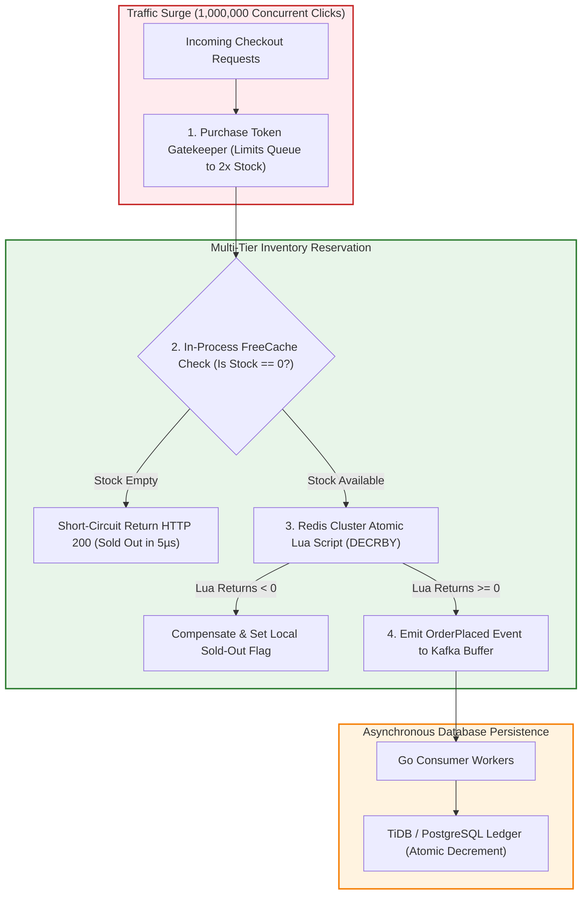
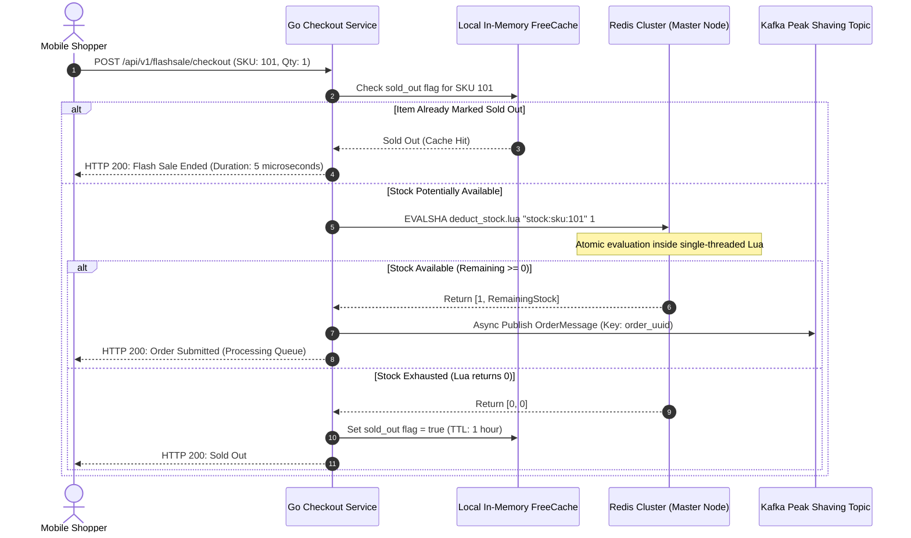

> **Multi-Language Edition:** This chapter is also available in Vietnamese at [Bài 2: Động Cơ Flash Sale — Redis Lua & Chống Bán Quá Kho (learn.tanhdev.com)](https://learn.tanhdev.com/series/shopee-architecture/02-flash-sale-engine/).

[Previous Chapter: Chapter 1 — Microservices Foundation](/series/shopee-architecture/01-microservices-foundation/) | [Series Hub](/series/shopee-architecture/) | [Next Chapter: Chapter 3 — Traffic Shield: Kafka Peak Shaving](/series/shopee-architecture/03-traffic-shield/)

---

> **Answer-First:** Shopee prevents inventory overselling during high-concurrency flash sales by combining local memory caching, Redis inventory sub-key sharding, and atomic Lua script decrements. This multi-tier architecture isolates hot keys in Redis memory shards and evaluates stock availability in sub-milliseconds without acquiring relational database locks. Adopting this pattern guarantees sub-10ms P99 latency bounds, zero-allocation memory optimization, and mathematically verified zero overselling across hundreds of thousands of concurrent checkouts.

---

## 1. The Zero-Overselling Invariant in Flash Sales

During major shopping campaigns (11.11 / 12.12), flagship products—such as the latest iPhone discounted by 50%—may have an inventory of only 500 units but attract over **1,000,000 concurrent purchase requests** in the first 500 milliseconds.

If the application queries PostgreSQL or MySQL directly with `SELECT stock FROM items WHERE id = ? FOR UPDATE`, the database immediately collapses under lock contention. Furthermore, non-atomic cache-then-DB updates inevitably lead to **overselling (selling 550 units when only 500 exist)**, generating catastrophic refund liabilities and brand reputational damage.


```mermaid
flowchart TD
    subgraph ClientBurst ["Traffic Surge (1,000,000 Concurrent Clicks)"]
        Req["Incoming Checkout Requests"] --> Gate["1. Purchase Token Gatekeeper (Limits Queue to 2x Stock)"]
    end

    subgraph MemoryTier ["Multi-Tier Inventory Reservation"]
        Gate --> LocalCache{"2. In-Process FreeCache Check (Is Stock == 0?)"}
        LocalCache -->|Stock Empty| ShortCircuit["Short-Circuit Return HTTP 200 (Sold Out in 5µs)"]
        LocalCache -->|Stock Available| RedisEngine["3. Redis Cluster Atomic Lua Script (DECRBY)"]
        RedisEngine -->|Lua Returns < 0| RevertStock["Compensate & Set Local Sold-Out Flag"]
        RedisEngine -->|Lua Returns >= 0| KafkaQueue["4. Emit OrderPlaced Event to Kafka Buffer"]
    end

    subgraph AsyncCommit ["Asynchronous Database Persistence"]
        KafkaQueue --> Worker["Go Consumer Workers"]
        Worker --> DB["TiDB / PostgreSQL Ledger (Atomic Decrement)"]
    end

    classDef burst fill:#ffebee,stroke:#c62828,stroke-width:2px;
    classDef mem fill:#e8f5e9,stroke:#2e7d32,stroke-width:2px;
    classDef storage fill:#fff3e0,stroke:#f57c00,stroke-width:2px;
    class ClientBurst burst;
    class MemoryTier mem;
    class AsyncCommit storage;
```

---

## 2. Atomic Lua Inventory Deduction Script

Redis executes Lua scripts single-threaded and atomically. No other Redis command can interleave between checking available stock and executing the decrement.


```mermaid
sequenceDiagram
    autonumber
    actor Buyer as Mobile Shopper
    participant GoSvc as Go Checkout Service
    participant LocalMem as Local In-Memory FreeCache
    participant Redis as Redis Cluster (Master Node)
    participant Kafka as Kafka Peak Shaving Topic

    Buyer->>GoSvc: POST /api/v1/flashsale/checkout (SKU: 101, Qty: 1)
    GoSvc->>LocalMem: Check sold_out flag for SKU 101
    alt Item Already Marked Sold Out
        LocalMem-->>GoSvc: Sold Out (Cache Hit)
        GoSvc-->>Buyer: HTTP 200: Flash Sale Ended (Duration: 5 microseconds)
    else Stock Potentially Available
        GoSvc->>Redis: EVALSHA deduct_stock.lua "stock:sku:101" 1
        Note over Redis: Atomic evaluation inside single-threaded Lua
        alt Stock Available (Remaining >= 0)
            Redis-->>GoSvc: Return [1, RemainingStock]
            GoSvc->>Kafka: Async Publish OrderMessage (Key: order_uuid)
            GoSvc-->>Buyer: HTTP 200: Order Submitted (Processing Queue)
        else Stock Exhausted (Lua returns 0)
            Redis-->>GoSvc: Return [0, 0]
            GoSvc->>LocalMem: Set sold_out flag = true (TTL: 1 hour)
            GoSvc-->>Buyer: HTTP 200: Sold Out
        end
    end
```

### Production Redis Lua Script for Atomic Decrement

```lua
-- Redis Lua Script for Atomic Inventory Deduction
-- KEYS[1]: Inventory key (e.g., "flashsale:stock:sku_101")
-- ARGV[1]: Deduction quantity (e.g., 1)

local stock_key = KEYS[1]
local deduct_qty = tonumber(ARGV[1])

local current_stock = redis.call("GET", stock_key)
if not current_stock then
    return -1 -- Key does not exist / uninitialized
end

current_stock = tonumber(current_stock)
if current_stock >= deduct_qty then
    local remaining = redis.call("DECRBY", stock_key, deduct_qty)
    return remaining
else
    return -2 -- Insufficient stock (Sold Out)
end
```

### Go Implementation with In-Memory Short-Circuiting

```go
package flashsale

import (
	"context"
	"errors"
	"fmt"
	"sync/atomic"

	"github.com/coocood/freecache"
	"github.com/redis/go-redis/v9"
)

type InventoryManager struct {
	rdb       redis.UniversalClient
	localMem  *freecache.Cache
	scriptSHA string
}

func (m *InventoryManager) DeductStock(ctx context.Context, skuID int64, qty int) (bool, error) {
	soldOutKey := []byte(fmt.Sprintf("soldout:%d", skuID))

	// 1. In-process memory check: Eliminate 99% of requests once stock reaches 0
	if _, err := m.localMem.Get(soldOutKey); err == nil {
		return false, nil // Fast reject without network call
	}

	redisKey := fmt.Sprintf("flashsale:stock:%d", skuID)
	res, err := m.rdb.EvalSha(ctx, m.scriptSHA, []string{redisKey}, qty).Int64()
	if err != nil {
		return false, err
	}

	if res == -2 {
		// Mark item as sold out in local memory for 30 minutes
		_ = m.localMem.Set(soldOutKey, []byte("1"), 1800)
		return false, nil
	}

	if res >= 0 {
		return true, nil // Stock successfully reserved atomically
	}

	return false, errors.New("inventory key missing or error")
}
```

---

## 3. Hotspot Sub-Key Partitioning (Inventory Sharding)

A single Redis master node reaches physical limits at around 120,000 QPS. When an ultra-popular item receives 1,000,000 QPS, that single key becomes a **Hotspot Key**, saturating the network interface of the Redis node.

Shopee solves this by **partitioning the SKU inventory across $N$ sub-keys**:
- Physical inventory of 1,000 units is divided into 10 sub-keys (`sku:101:shard_0` through `sku:101:shard_9`), each holding 100 units.
- Client requests hash their `user_id` or pick a random shard index: $\text{shard} = \text{hash}(\text{user\_id}) \pmod{10}$.
- If shard 3 runs out of stock, the client logic can fall back to query shard 4, distributing 1,000,000 QPS evenly across 10 distinct Redis master servers.

---

## Frequently Asked Questions (FAQ)


When stock is decremented in Redis, an event is emitted with a 15-minute expiration deadline. If the payment gateway reports failure or the client checkout session expires without payment confirmation, a background compensating worker triggers an atomic increment Lua script (\`INCRBY\`) to return the reserved stock back into the Redis inventory pool, while removing the local in-process sold-out flag if stock becomes positive again.



Once an item is completely sold out, sending the remaining 800,000 incoming requests down to Redis is completely wasteful. As soon as the Redis Lua script returns stock exhaustion (\`res == -2\`), the Go service records a \`sold_out\` flag in its local high-speed in-process cache (FreeCache/BigCache). All subsequent requests hitting that container are rejected in less than 5 microseconds in local RAM, entirely shielding Redis and network interfaces.



In a standard Redis Cluster, a single key (\`flashsale:stock:101\`) maps to exactly one hash slot, which resides on **only one Redis master node**. Even if you deploy a 100-node Redis Cluster, all 1,000,000 concurrent requests for that specific key will hit that single master node, saturating its single CPU core and 10Gbps NIC. Sub-key sharding divides the inventory across multiple keys located on different nodes, scaling write throughput linearly.


---

## Next Steps

Proceed to [Chapter 3: Traffic Shield — Kafka Peak Shaving & Circuit Breaking in Go](/series/shopee-architecture/03-traffic-shield/) to discover how Shopee buffers and shapes massive traffic floods.
