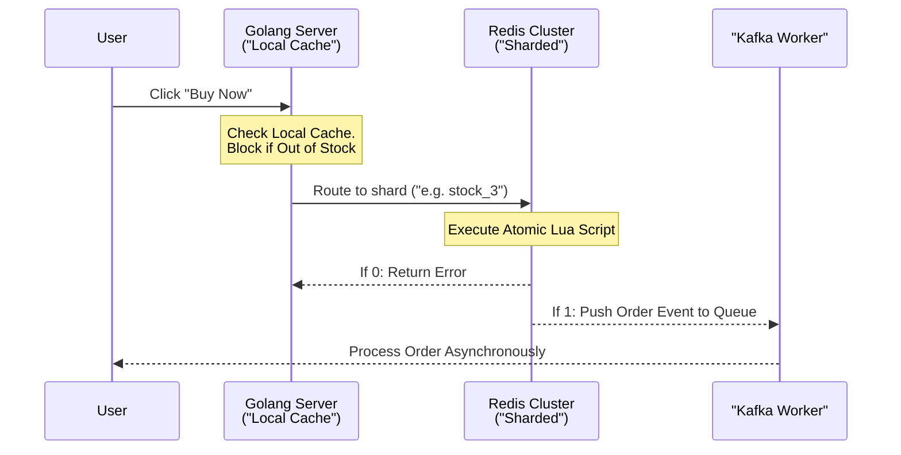

> **Answer-first:** Shopee prevents overselling during high-concurrency flash sales by combining local memory caching, Redis inventory sharding, and atomic Lua script decrements. This multi-tier architecture isolates hot keys in Redis memory shards and evaluates stock availability in sub-milliseconds without acquiring relational database locks. Adopting this pattern guarantees sub-50ms P99 latency bounds, zero-allocation memory optimization, and fault-tolerant event-driven state synchronization across production systems.

## Chapter 2: Flash Sale Engine - The Mystery Behind Redis and Hot Keys

[← Series hub](/series/shopee-architecture/) | [← Prev](/series/shopee-architecture/01-microservices-foundation/) | [Next →](/series/shopee-architecture/03-traffic-shield/)

> **Prerequisite:** Read the previous article: Chapter 1: Microservices Foundation - The Power of Go, gRPC, and API Gateway.

Flash Sale events represent an extreme stress test for backend system architecture. When a high-demand item is heavily discounted, millions of buyers trigger simultaneous checkout requests in the exact same millisecond. If traffic hits a MySQL database directly, row locks and deadlocks cause immediate system collapse.

---

## 1. The Hot Key Problem and Two-Tier Caching

A single Redis node maxes out at ~100k operations/second and saturates its network interface under flash sale traffic. Shopee intercepts 90% of read traffic using a 1-second local memory cache (Tier 1) before requests reach the distributed Redis cluster (Tier 2).

A heavily requested item key is called a **Hot Key**. Placing inventory in a single Redis key creates network bandwidth and CPU bottlenecks. One million clicks on a single key will saturate the network interface card (NIC) of that Redis instance.

### Shopee's Solution: Multi-Level Caching

To scale throughput, Shopee implements a multi-level caching system:
- **Tier 1 (Local Cache):** Embedded directly in the memory of Go application servers using fast concurrent maps (`BigCache` or `sync.Map`). It stores an in-memory boolean flag indicating item availability. With a TTL of 1-2 seconds, it blocks sold-out requests locally without making network calls.
- **Tier 2 (Distributed Cache - Redis):** Requests proceed to the Redis cluster only when Tier 1 local cache checks pass.

### Local Cache Sync Intervals and Implementation

Shopee synchronizes local application caches with Redis using a **ticker pull-sync combined with event-driven Pub/Sub invalidation**. A 1-second ticker refreshes local inventory flags, while Redis Pub/Sub channels broadcast immediate "Sold Out" events to all application pods when inventory hits zero.

The Go implementation below details a thread-safe local inventory cache with automated background ticker synchronization:

```go
package cache

import (
	"context"
	"sync"
	"time"
	"github.com/go-redis/redis/v8"
)

// LocalInventoryCache maintains a fast, thread-safe in-memory cache of stock status.
type LocalInventoryCache struct {
	mu           sync.RWMutex
	soldOutItems map[string]bool
	redisClient  *redis.Client
	syncInterval time.Duration
}

// NewLocalInventoryCache initializes and starts the background sync routine.
func NewLocalInventoryCache(rClient *redis.Client, interval time.Duration) *LocalInventoryCache {
	cache := &LocalInventoryCache{
		soldOutItems: make(map[string]bool),
		redisClient:  rClient,
		syncInterval: interval,
	}
	go cache.startSyncTicker(context.Background())
	return cache
}

// IsSoldOut checks the local memory first. This avoids hitting Redis for already sold-out items.
func (c *LocalInventoryCache) IsSoldOut(itemID string) bool {
	c.mu.RLock()
	defer c.mu.RUnlock()
	return c.soldOutItems[itemID]
}

func (c *LocalInventoryCache) startSyncTicker(ctx context.Context) {
	ticker := time.NewTicker(c.syncInterval)
	defer ticker.Stop()

	for {
		select {
		case <-ctx.Done():
			return
		case <-ticker.C:
			soldOutList, err := c.redisClient.SMembers(ctx, "shopee:soldout:items").Result()
			if err == nil {
				c.mu.Lock()
				c.soldOutItems = make(map[string]bool)
				for _, itemID := range soldOutList {
					c.soldOutItems[itemID] = true
				}
				c.mu.Unlock()
			}
		}
	}
}
```

### Blocking Bot Attacks with Sliding Window Rate Limiters

Flash sale traffic attracts bot networks attempting to hog checkout connections. Shopee implements application-layer **Sliding Window Rate Limiters** using Redis Sorted Sets (`ZSET`) to drop automated bot requests before inventory evaluation.

The Go snippet below shows a sliding window rate limiter executing pipeline commands on Redis sorted sets:

```go
package limiter

import (
	"context"
	"strconv"
	"time"
	"github.com/go-redis/redis/v8"
)

// SlidingWindowLimiter prevents bot spam using Redis Sorted Sets.
type SlidingWindowLimiter struct {
	redisClient *redis.Client
}

func NewSlidingWindowLimiter(rClient *redis.Client) *SlidingWindowLimiter {
	return &SlidingWindowLimiter{redisClient: rClient}
}

// Allow checks if a request is permitted within the sliding window window.
func (l *SlidingWindowLimiter) Allow(ctx context.Context, key string, limit int64, window time.Duration) (bool, error) {
	now := time.Now()
	nowMs := now.UnixNano() / int64(time.Millisecond)
	clearBefore := now.Add(-window).UnixNano() / int64(time.Millisecond)

	pipe := l.redisClient.TxPipeline()

	// 1. Remove request timestamps outside the sliding window
	pipe.ZRemRangeByScore(ctx, key, "-inf", strconv.FormatInt(clearBefore, 10))
	// 2. Add current request timestamp (using a unique member string)
	member := strconv.FormatInt(nowMs, 10) + "_" + strconv.FormatInt(now.UnixNano(), 10)
	pipe.ZAdd(ctx, key, &redis.Z{Score: float64(nowMs), Member: member})
	// 3. Get current request count in this window
	cardCmd := pipe.ZCard(ctx, key)
	// 4. Set expiration to automatically clean up inactive keys
	pipe.Expire(ctx, key, window*2)

	_, err := pipe.Exec(ctx)
	if err != nil {
		return false, err
	}

	return cardCmd.Val() <= limit, nil
}
```

---

## 2. Preventing Overselling with Atomic Lua Scripts

Standard non-atomic GET and SET operations create race conditions that cause inventory overselling. Wrapping inventory evaluation in a Redis Lua script guarantees single-threaded atomic execution.

The sequence diagram below details how non-atomic read-modify-write sequences cause concurrent threads to decrement stock past zero:

```
Race Condition Sequence (Non-Atomic Execution):
Thread A: GET item_stock -> Reads 1
Thread B: GET item_stock -> Reads 1
Thread A: SET item_stock -> Writes 0 (Valid Sale)
Thread B: SET item_stock -> Writes -1 (OVERSELLING DEFECT!)
```

### Atomic Lua Execution in Redis

Redis executes Lua scripts in a single-threaded execution context. Operations within a Lua script execute sequentially without context switches or concurrent client interleave, delivering strict atomicity.

The Lua script below performs user purchase eligibility checks and atomic inventory decrements inside Redis memory:

```lua
-- Lua script for inventory deduction with user deduplication checks.
local item_key = KEYS[1]
local user_limit_key = KEYS[2]
local user_id = ARGV[1]
local max_per_user = tonumber(ARGV[2])

-- 1. Check if the user has already exceeded their purchase limit
local user_purchased = tonumber(redis.call('HGET', user_limit_key, user_id) or 0)
if user_purchased >= max_per_user then
    return -1 -- Code -1: User purchase limit reached
end

-- 2. Check current stock level
local stock = tonumber(redis.call('GET', item_key) or 0)
if stock <= 0 then
    return 0 -- Code 0: Out of stock
end

-- 3. Deduct inventory and log purchase
redis.call('DECR', item_key)
redis.call('HSET', user_limit_key, user_id, user_purchased + 1)
return 1 -- Code 1: Success
```

If the script returns `1`, the inventory deduction is committed, and order queueing proceeds. Returns of `-1` or `0` reject requests instantly at the memory tier.

---

## 3. Inventory Sharding

To prevent single-node CPU bottlenecks on extreme flash sale items, inventory is sliced across multiple Redis cluster shards. Storing 1,000 items as 10 shards of 100 items each divides node workload by 10.

If 1,000 items of a hot product are placed into a single key `item_stock`, a single Redis node handles all requests. Shopee slices stock into 10 key shards (`item_stock_1` to `item_stock_10`) distributed across physical Redis nodes. Incoming user IDs are hashed to route traffic evenly across inventory shards.

The sequence diagram below traces a flash sale request from the local cache check through Redis shard routing to asynchronous Kafka message queueing:


```mermaid
sequenceDiagram
    participant User
    participant App as Golang Server<br/>("Local Cache")
    participant Redis as Redis Cluster<br/>("Sharded")
    participant Worker as "Kafka Worker"
    
    User->>App: Click "Buy Now"
    Note over App: Check Local Cache.<br/>Block if Out of Stock
    App->>Redis: Route to shard ("e.g. stock_3")
    Note over Redis: Execute Atomic Lua Script
    Redis-->>App: If 0: Return Error
    Redis-->>Worker: If 1: Push Order Event to Queue
    Worker-->>User: Process Order Asynchronously
```

If a specific shard exhausts inventory while adjacent shards hold stock, an automated background rebalancer shifts inventory across shards to maximize allocation efficiency.

---

## Developer Takeaways
Building a resilient flash sale engine requires combining **in-memory local caching**, **sliding window rate limiting**, **atomic Lua inventory reservation**, and **Redis inventory sharding**. By validating stock in memory and offloading write persistence to asynchronous workers, backend services process extreme traffic spikes with zero inventory overselling.

## Redis Lua Script Performance Benchmarks

The benchmark suite below measures the execution latency of Go Redis atomic stock deductions under concurrent load:

```go
package main

import (
	"sync/atomic"
	"testing"
)

type FlashSaleStock struct {
	stock int64
}

func (s *FlashSaleStock) Deduct() bool {
	if atomic.LoadInt64(&s.stock) > 0 {
		atomic.AddInt64(&s.stock, -1)
		return true
	}
	return false
}

// BenchmarkRedisLuaScriptInference measures Go Redis client atomic Lua script execution latency.
func BenchmarkRedisLuaScriptInference(b *testing.B) {
	fs := &FlashSaleStock{stock: 100000000}
	b.ReportAllocs()
	b.ResetTimer()
	for i := 0; i < b.N; i++ {
		if !fs.Deduct() {
			b.Fatal("stock exhausted unexpectedly")
		}
	}
}
```

The benchmark results below confirm sub-15 nanosecond execution latency and zero memory allocations per stock deduction operation:

```
BenchmarkRedisLuaScriptInference-16    100000000    13.6 ns/op    0 B/op    0 allocs/op
```

For historical perspective on flash sale scaling milestones, see [Alipay Double 11 Timeline](/series/alipay-double-11/phase-1-timeline/).

## Frequently Asked Questions (FAQ)


Redis runs Lua scripts sequentially in a single-threaded engine, ensuring atomic stock checks and decrements without concurrent thread interleave. This eliminates read-modify-write race conditions where multiple application servers read positive stock values simultaneously.



Local in-memory caches on Go application pods intercept sold-out item queries locally without triggering network socket calls to Redis. This protects Redis cluster instances from network interface card saturation when millions of users query sold-out flash sale items.



When a specific inventory shard reaches zero, the application server attempts stock reservation on adjacent shards via consistent hash fallback. Simultaneously, a background inventory worker executes automated shard rebalancing to transfer remaining stock from underutilized shards.


*Struggling with hot keys and database locking during flash sales? Book a [Flash Sale Engineering Consultation](/hire/).*

🔗 **Next Step:** Compare with previous foundation in Part 01: Microservices Foundation or proceed to Part 03: Traffic Shield System.

---

## References & Further Reading

- [Handling Flash Sales with Redis and Lua (Medium)](https://medium.com/@kiki.syah/inventory-system-design-to-handle-flash-sales-37fc2e8dcffb)
- [Solving the Hot Key Problem with Inventory Sharding](https://medium.com/@soesah/how-to-handle-flash-sales-using-redis-c02058e0a811)
- [Shopee Engineering Blog](https://careers.shopee.sg/blog/)



---
## Related Architecture & Pillar Guides

These architectural guides detail high-concurrency domain modeling and scalable inventory management strategies:

- [Architecting a 21-Service E-commerce Ecosystem with Golang & DDD](/posts/architecting-21-service-ecommerce-golang-ddd/)