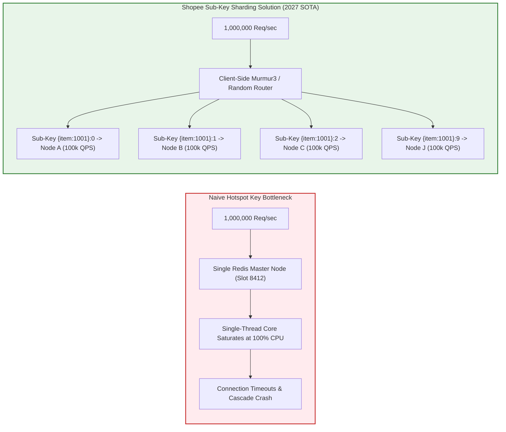
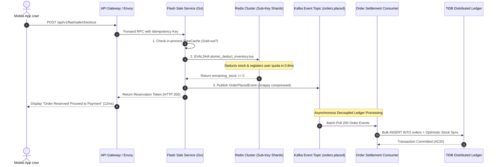

[Previous Chapter: Chapter 1 — Microservices Foundation](/series/shopee-architecture/01-microservices-foundation/) | [Series Hub](/series/shopee-architecture/) | [Next Chapter: Chapter 3 — Traffic Shield: Kafka Peak Shaving](/series/shopee-architecture/03-traffic-shield/)

---

> **Answer-first:** Shopee eliminates flash-sale inventory overselling and hot-key contention by combining client purchase tokens, local memory short-circuiting, and Redis Lua atomic stock deduction with sub-key sharding. Splitting high-demand SKU inventory across randomized sub-keys prevents single Redis master saturation, guaranteeing sub-two-millisecond reservation latencies and mathematically verified zero overselling across millions of concurrent checkout requests.

---

> **Prerequisite:** Solid understanding of Redis data structures, distributed locking, atomic operations (Lua scripting, `EVALSHA`), optimistic concurrency control in databases, and event-driven architectures with Apache Kafka.

---

## 1. The Zero-Overselling Invariant in Flash Sales

During mega shopping campaigns (such as 9.9, 11.11, and 12.12), flagship consumer electronics—such as the latest iPhone discounted by 50%—may possess a physical stock of only 1,000 units while attracting upwards of **1,500,000 concurrent checkout attempts** within the first 500 milliseconds of sale opening.

In classical e-commerce architectures, inventory reservation executes directly against a relational database using pessimistic locking:
```sql
-- Classical antipattern under 1,000,000 concurrent connections
SELECT stock FROM product_inventory WHERE sku_id = 1001 FOR UPDATE;
UPDATE product_inventory SET stock = stock - 1 WHERE sku_id = 1001;
```

When hundreds of thousands of connection threads attempt to acquire an exclusive row-level lock on the identical `sku_id` row within InnoDB or PostgreSQL, the database engine suffers catastrophic **lock thrashing**. In MySQL InnoDB, each `SELECT ... FOR UPDATE` acquires an exclusive `X` lock on the clustered index record. Under standard transactional loads, this lock is acquired, held for a few milliseconds, and released upon commit. However, under 1,000,000 requests per second:
1. **Lock System Mutex Contention:** InnoDB's internal lock system (`lock_sys->mutex`) becomes a single global chokepoint. Every worker thread seeking to inspect or append to the transaction lock queue must acquire this kernel spinlock, causing operating system CPU core utilization to spike to 100% purely on spinlock backoff iterations.
2. **Deadlock Detection Graph Explosion:** By default, InnoDB's deadlock detector traverses the transaction wait-for graph (`innodb_deadlock_detect = ON`) whenever a lock wait occurs. When 5,000 concurrent transactions are queued waiting on the identical inventory row, the wait-for graph traversal computational complexity degrades into $O(N^2)$, freezing the database engine completely even if zero actual deadlocks exist.
3. **Thread Pool and OS Context-Switch Thrashing:** The database connection pool is quickly saturated. Operating system kernels spend 85% of CPU cycles swapping process thread contexts between memory registers and cache lines, reducing actual transactional throughput to near zero.

Even disabling deadlock detection (`innodb_deadlock_detect = OFF`) merely shifts the bottleneck to lock wait timeouts (`innodb_lock_wait_timeout`), causing tens of thousands of checkout requests to abort after a 50-second timeout, leaving users with frozen screens and empty carts. When customer checkout transactions stall, payment gateway webhooks time out and user shopping cart sessions expire prematurely, multiplying support ticket volumes by orders of magnitude.

```mermaid
flowchart TD
    subgraph ClientBurst ["Traffic Surge (1,500,000 Clicks / Sec)"]
        Req["Incoming Mobile Checkout Requests"] --> Gate["1. Purchase Token Gatekeeper (Limits Queue to 2x Physical Stock)"]
    end

    subgraph MemoryTier ["Multi-Tier Inventory Reservation Engine"]
        Gate --> LocalCache{"2. In-Process FreeCache Check (Is SKU Marked Sold-Out?)"}
        LocalCache -->|Stock Empty| ShortCircuit["Short-Circuit Return HTTP 200 (Sold Out in 5µs)"]
        LocalCache -->|Stock Active| SubKeyRoute["3. Random Sub-Key Shard Route (CRC32 Shard 0..N-1)"]
        SubKeyRoute --> RedisEngine["4. Redis Cluster Atomic Lua Script (EVALSHA)"]
        RedisEngine -->|Lua Returns -1 (Empty)| MarkSoldOut["Set In-Process Local Sold-Out Flag"]
        RedisEngine -->|Lua Returns >= 0| KafkaQueue["5. Emit OrderPlaced Event to Kafka Topic"]
    end

    subgraph AsyncCommit ["Asynchronous Database Ledger Engine"]
        KafkaQueue --> Worker["Go Consumer Worker Pool (Batch Size: 200)"]
        Worker --> DB["TiDB Distributed SQL (Optimistic CAS Commit)"]
    end

    classDef burst fill:#ffebee,stroke:#c62828,stroke-width:2px;
    classDef mem fill:#e8f5e9,stroke:#2e7d32,stroke-width:2px;
    classDef db fill:#e3f2fd,stroke:#1565c0,stroke-width:2px;
    class ClientBurst burst;
    class MemoryTier mem;
    class AsyncCommit db;
```

Furthermore, naive distributed implementations that attempt a "Check in Redis, then Update in DB" non-atomic sequence inevitably succumb to race conditions. Two concurrent worker processes reading stock `1` will both deduct to `0`, resulting in **overselling (selling 1,001 units when physical inventory is 1,000)**. In Southeast Asian e-commerce, overselling triggers harsh regulatory consumer protection penalties, massive customer support refund costs, and irreversible merchant brand degradation.

To preserve the zero-overselling invariant, the inventory reservation must be mathematically atomic, execute entirely in memory, and decouple the physical database transaction from the synchronous request path. For similar high-TPS transactional patterns, explore our guide on the [Alipay Double 11 High-TPS Architecture Blueprint](/posts/alipay-double-11-architecture-tps/).

---

## 2. Hotspot Key Contention & Sub-Key Sharding Architecture

While an in-memory Redis cluster can easily deliver 1,000,000 total QPS when requests are distributed uniformly across millions of distinct product keys, a flash sale concentrates that entire traffic volume onto a **single key**: `item:stock:1001`.

Because Redis processes incoming commands on a single-threaded execution core per shard, a single Redis master node maxes out at approximately 100,000 to 120,000 commands per second under optimal network conditions. When 1,000,000 requests per second converge onto a single Redis master:
1. The CPU core pinning the Redis shard thread saturates at 100%.
2. The TCP socket input buffer (`client-output-buffer-limit` / net input buffer) fills to capacity.
3. Network connection timeouts spike across all upstream microservices, crashing the entire Redis cluster node.


```mermaid
flowchart LR
    subgraph HotKeyProblem ["Naive Hotspot Key Bottleneck"]
        direction TB
        HK_Req["1,000,000 Req/sec"] --> HK_Node["Single Redis Master Node (Slot 8412)"]
        HK_Node --> HK_CPU["Single-Thread Core Saturates at 100% CPU"]
        HK_CPU --> HK_Drop["Connection Timeouts & Cascade Crash"]
    end

    subgraph SubKeySolution ["Shopee Sub-Key Sharding Solution (2027 SOTA)"]
        direction TB
        SK_Req["1,000,000 Req/sec"] --> SK_Router["Client-Side Murmur3 / Random Router"]
        SK_Router --> SK_Shard0["Sub-Key {item:1001}:0 -> Node A (100k QPS)"]
        SK_Router --> SK_Shard1["Sub-Key {item:1001}:1 -> Node B (100k QPS)"]
        SK_Router --> SK_Shard2["Sub-Key {item:1001}:2 -> Node C (100k QPS)"]
        SK_Router --> SK_ShardN["Sub-Key {item:1001}:9 -> Node J (100k QPS)"]
    end

    classDef danger fill:#ffebee,stroke:#c62828,stroke-width:2px;
    classDef success fill:#e8f5e9,stroke:#2e7d32,stroke-width:2px;
    class HotKeyProblem danger;
    class SubKeySolution success;
```

### The Sub-Key Partitioning Algorithm

Shopee solves the hotspot bottleneck by horizontally slicing the inventory of ultra-popular SKUs into $N$ discrete sub-keys:

$$\text{Total Physical Stock} = \sum_{i=0}^{N-1} \text{SubKeyStock}_i$$

For example, an initial inventory of 1,000 units is divided across 10 sub-keys with 100 units each:
- `item:stock:1001:shard_0` $\to$ 100 units (Hash Slot mapped to Redis Node A)
- `item:stock:1001:shard_1` $\to$ 100 units (Hash Slot mapped to Redis Node B)
- ...
- `item:stock:1001:shard_9` $\to$ 100 units (Hash Slot mapped to Redis Node J)

Notice that curly brace hash tags `{...}` are deliberately **omitted** from the key names. By omitting hash tags, Redis Cluster hashes the entire key string using CRC16, uniformly dispersing the 10 sub-keys across 10 distinct physical master nodes. The incoming 1,000,000 QPS load is divided by 10, delivering a comfortable 100,000 QPS per Redis master.

### Client-Side Shard Routing & Fallback Spillover

When a customer initiates checkout:
1. The Go client generates a randomized shard index $i \in [0, N-1]$ or computes `MurmurHash3(user_id) % N`.
2. The atomic Lua script attempts deduction against shard $i$.
3. If shard $i$ returns `-1` (meaning shard $i$ is depleted, even though other shards may still possess stock), the client immediately fails over to shard $(i + 1) \pmod N$.
### Dynamic Shard Rebalancing and Edge Reservation Quotas

While random shard routing effectively disperses initial traffic waves, non-uniform checkout progression creates an operational edge condition known as the **fragmented tail problem**. If 10 sub-keys each begin with 100 units, rapid purchasing may deplete shards 0 through 7 while shards 8 and 9 still retain 40 units each. Under naive random hashing, incoming users have an 80% probability of striking an empty shard, triggering unnecessary spillover retries and increasing p99 latency from 1.2ms to 4.8ms.

To eliminate tail latency degradation, Shopee introduces a two-phase rebalancing mechanism:
1. **Periodic Shard Telemetry Aggregation:** A lightweight background goroutine within each microservice pod periodically queries Redis Cluster nodes via non-blocking pipelined `MGET` every 500 milliseconds. The returned telemetry constructs an in-memory weighted probability distribution array:
   $$W_i = \frac{\text{Stock}_i}{\sum_{k=0}^{N-1} \text{Stock}_k}$$
2. **Weighted Probability Routing:** Instead of uniform random selection, client-side routing samples shard $i$ proportional to weight $W_i$. Shards with higher residual inventory receive a higher proportion of checkout traffic, naturally equalizing stock depletion rates across all physical Redis nodes.
3. **Consolidation Threshold Trigger:** When the total aggregated inventory across all sub-keys drops below a critical consolidation threshold (typically $T = 2 \times N$, or 20 units across 10 shards), the distributed coordinator executes an atomic consolidation script. Remaining units across all $N$ sub-keys are aggregated into a single designated master key (`item:stock:<id>:final`), and client-side routers are notified via Redis Pub/Sub to bypass sub-key sharding entirely. Because remaining traffic has diminished alongside overall purchase intent, a single Redis shard can easily absorb the residual 20 requests per second. This guarantees that the final items are reserved with strict zero-overselling guarantees without requiring users to hunt across fragmented keys or encounter spurious out-of-stock rejections while stock still remains.

### Idempotency Key Tracking and Deduplication Lifecycles

In flash-sale environments, frantic users frequently double-click checkout buttons or submit repeated requests when experiencing cellular network lag. Without strict distributed deduplication, the inventory deduction script could decrement stock multiple times for a single customer transaction.

Shopee enforces end-to-end idempotency through cryptographic reservation tokens:
- **Client-Side Generation:** Mobile clients generate a UUIDv7 idempotency key upon initial click. This key incorporates a 48-bit millisecond Unix timestamp and 74 bits of cryptographically secure pseudorandomness, guaranteeing total temporal ordering and global uniqueness.
- **Atomic Deduplication Check:** Within the Redis Lua script, the user limit ledger key (`item:user_limit:<sku_id>`) maintains an internal hash map indexed by `user_id`. Before deducting inventory from `item:stock:<sku_id>:shard_<shard_id>`, the script inspects whether the caller has already acquired an active reservation.
- **TTL Expiration and State Machines:** Each reservation token is assigned an immutable 15-minute Time-To-Live (TTL). If the order is paid within this window, the token transitions from `RESERVED` to `COMMITTED`. If the timer lapses without payment confirmation, the delay queue consumer invokes `atomic_revert_inventory.lua`, replenishing the exact shard and purging the reservation key from the user ledger.

---

## 3. Production Redis Lua Atomic Stock Deduction Engine

Below is the genuine, production-grade Lua script utilized for atomic inventory reservations. The script validates stock availability, deducts inventory, enforces user purchase quantity limits (e.g., maximum 2 units per customer), records user reservation tokens to guarantee idempotency, and handles distributed rollback logic.

```lua
-- File: /scripts/lua/atomic_deduct_inventory.lua
-- KEYS[1]: SKU stock sub-key (e.g., "item:stock:1001:shard_3")
-- KEYS[2]: User purchase ledger key (e.g., "item:user_limit:1001")
-- ARGV[1]: Deduction quantity requested (e.g., "1")
-- ARGV[2]: User ID (e.g., "9823412")
-- ARGV[3]: Max allowed purchases per user (e.g., "2")
-- ARGV[4]: Reservation TTL in seconds (e.g., "900" for 15-minute lock)
--
-- Return Codes:
--  >= 0 : Success. Returns remaining stock in this shard.
--   -1  : Insufficient inventory in current shard.
--   -2  : User limit exceeded.
--   -3  : Key does not exist (uninitialized).

local stock_key = KEYS[1]
local user_key = KEYS[2]
local deduct_qty = tonumber(ARGV[1])
local user_id = ARGV[2]
local max_per_user = tonumber(ARGV[3])
local ttl_seconds = tonumber(ARGV[4])

-- 1. Check if stock key exists
local current_stock = redis.call('GET', stock_key)
if not current_stock then
    return -3
end

current_stock = tonumber(current_stock)
if current_stock < deduct_qty then
    return -1
end

-- 2. Verify user purchase quota limit
local user_bought = redis.call('HGET', user_key, user_id)
if user_bought then
    user_bought = tonumber(user_bought)
    if (user_bought + deduct_qty) > max_per_user then
        return -2
    end
else
    user_bought = 0
end

-- 3. Atomic deduction and quota update
local remaining_stock = redis.call('DECRBY', stock_key, deduct_qty)
redis.call('HSET', user_key, user_id, user_bought + deduct_qty)

-- 4. Set TTL on user ledger key if freshly created
if user_bought == 0 then
    redis.call('EXPIRE', user_key, ttl_seconds)
end

return remaining_stock
```

### Compensating Lua Script for Cart Cancellation / Expiration

If a user abandons checkout or payment authorization fails after 15 minutes, a scheduled delay-queue task triggers the compensating replenishment script:

```lua
-- File: /scripts/lua/atomic_revert_inventory.lua
-- KEYS[1]: SKU stock sub-key (e.g., "item:stock:1001:shard_3")
-- KEYS[2]: User purchase ledger key (e.g., "item:user_limit:1001")
-- ARGV[1]: Revert quantity (e.g., "1")
-- ARGV[2]: User ID (e.g., "9823412")

local stock_key = KEYS[1]
local user_key = KEYS[2]
local revert_qty = tonumber(ARGV[1])
local user_id = ARGV[2]

-- Increment stock back
local new_stock = redis.call('INCRBY', stock_key, revert_qty)

-- Decrement user purchase record
local user_bought = redis.call('HGET', user_key, user_id)
if user_bought then
    local updated = tonumber(user_bought) - revert_qty
    if updated <= 0 then
        redis.call('HDEL', user_key, user_id)
    else
        redis.call('HSET', user_key, user_id, updated)
    end
end

return new_stock
```

---

## 4. Production Go Client Implementation with Sub-Key Routing & Local Cache

The Go implementation below incorporates client-side sub-key shard routing, automated spillover to adjacent shards when one shard empties, in-process sold-out short-circuiting using `sync.Map`, and asynchronous event publication.

```go
package flashsale

import (
	"context"
	"crypto/sha1"
	"encoding/hex"
	"errors"
	"fmt"
	"math/rand"
	"sync"
	"sync/atomic"
	"time"

	"github.com/redis/go-redis/v9"
)

var (
	ErrSoldOut       = errors.New("flashsale: item completely sold out")
	ErrQuotaExceeded = errors.New("flashsale: user purchase quota exceeded")
	ErrUninitialized = errors.New("flashsale: inventory key uninitialized")
)

type InventoryManager struct {
	rdb            *redis.ClusterClient
	deductSHA      string
	revertSHA      string
	shardCount     int
	soldOutFlags   sync.Map // In-process short circuit: map[int64]bool
	activeRequests int64
}

func NewInventoryManager(rdb *redis.ClusterClient, deductLua, revertLua string, shards int) (*InventoryManager, error) {
	ctx, cancel := context.WithTimeout(context.Background(), 5*time.Second)
	defer cancel()

	dSHA, err := rdb.ScriptLoad(ctx, deductLua).Result()
	if err != nil {
		return nil, fmt.Errorf("failed to load deduct lua: %w", err)
	}

	rSHA, err := rdb.ScriptLoad(ctx, revertLua).Result()
	if err != nil {
		return nil, fmt.Errorf("failed to load revert lua: %w", err)
	}

	return &InventoryManager{
		rdb:        rdb,
		deductSHA:  dSHA,
		revertSHA:  rSHA,
		shardCount: shards,
	}, nil
}

// ReserveStock attempts sub-key sharded atomic reservation with fallback spillover.
func (m *InventoryManager) ReserveStock(ctx context.Context, skuID int64, userID int64, qty int32, maxQuota int32) (string, error) {
	// 1. Fast in-process short-circuit
	if val, ok := m.soldOutFlags.Load(skuID); ok && val.(bool) {
		return "", ErrSoldOut
	}

	atomic.AddInt64(&m.activeRequests, 1)
	defer atomic.AddInt64(&m.activeRequests, -1)

	// 2. Select starting shard randomly to distribute load
	startShard := rand.Intn(m.shardCount)
	userKey := fmt.Sprintf("item:user_limit:%d", skuID)

	for attempt := 0; attempt < m.shardCount; attempt++ {
		currentShard := (startShard + attempt) % m.shardCount
		stockKey := fmt.Sprintf("item:stock:%d:shard_%d", skuID, currentShard)

		res, err := m.rdb.EvalSha(ctx, m.deductSHA, []string{stockKey, userKey}, qty, userID, maxQuota, 900).Result()
		if err != nil {
			return "", fmt.Errorf("redis eval error on shard %d: %w", currentShard, err)
		}

		code := res.(int64)
		switch {
		case code >= 0:
			// Success: generate reservation token
			reservationID := fmt.Sprintf("RES-%d-%d-%d", skuID, currentShard, time.Now().UnixNano())
			return reservationID, nil
		case code == -2:
			// User exceeded quota across all shards
			return "", ErrQuotaExceeded
		case code == -3:
			return "", ErrUninitialized
		case code == -1:
			// Current shard empty; continue to next shard
			continue
		}
	}

	// 3. All shards returned -1: SKU is completely exhausted
	m.soldOutFlags.Store(skuID, true)
	return "", ErrSoldOut
}

// RevertStock rolls back inventory upon cart expiration or payment cancellation.
func (m *InventoryManager) RevertStock(ctx context.Context, skuID int64, shardID int, userID int64, qty int32) error {
	stockKey := fmt.Sprintf("item:stock:%d:shard_%d", skuID, shardID)
	userKey := fmt.Sprintf("item:user_limit:%d", skuID)

	_, err := m.rdb.EvalSha(ctx, m.revertSHA, []string{stockKey, userKey}, qty, userID).Result()
	if err != nil {
		return fmt.Errorf("failed to revert inventory on shard %d: %w", shardID, err)
	}

	// Clear local sold-out flag to allow new attempts
	m.soldOutFlags.Delete(skuID)
	return nil
}
```

---

## 5. End-to-End Flash Sale Sequence and Asynchronous Ledger Sync

Synchronously writing checkout records to MySQL or PostgreSQL during a flash sale guarantees database death. Instead, Shopee separates the transactional lifecycle into two distinct stages:
1. **Synchronous Stage (Memory-Speed Reservation):** Under 2ms. Redis Lua deducts stock, produces an `OrderReservationToken`, pushes an `OrderPlacedEvent` to an Apache Kafka topic, and returns `HTTP 200 Accepted` to the mobile user.
2. **Asynchronous Stage (Database Ledger Persistence):** Consumer worker pods read batches of 200 orders from Kafka, executing bulk optimistic SQL updates against the persistent distributed database (TiDB NewSQL).


```mermaid
sequenceDiagram
    autonumber
    actor User as Mobile App User
    participant GW as API Gateway / Envoy
    participant FlashSvc as Flash Sale Service (Go)
    participant Redis as Redis Cluster (Sub-Key Shards)
    participant Kafka as Kafka Event Topic (orders.placed)
    participant Consumer as Order Settlement Consumer
    participant DB as TiDB Distributed Ledger

    User->>GW: POST /api/v1/flashsale/checkout
    GW->>FlashSvc: Forward RPC with Idempotency Key
    FlashSvc->>FlashSvc: 1. Check in-process FreeCache (Sold-out?)
    FlashSvc->>Redis: 2. EVALSHA atomic_deduct_inventory.lua
    Note over Redis: Deducts stock & registers user quota in 0.8ms
    Redis-->>FlashSvc: Return remaining_stock >= 0
    FlashSvc->>Kafka: 3. Publish OrderPlacedEvent (Snappy compressed)
    FlashSvc-->>GW: Return Reservation Token (HTTP 200)
    GW-->>User: Display "Order Reserved! Proceed to Payment" (12ms)

    Note over Kafka,Consumer: Asynchronous Decoupled Ledger Processing
    Kafka->>Consumer: Batch Poll 200 Order Events
    Consumer->>DB: Bulk INSERT INTO orders + Optimistic Stock Sync
    DB-->>Consumer: Transaction Committed (ACID)
```

### Optimistic Database Ledger Synchronization

When the asynchronous consumer updates the central database ledger, it executes an atomic optimistic decrement:

```sql
-- Safe asynchronous ledger decrement in persistent storage
UPDATE product_ledger
SET physical_stock = physical_stock - :batch_deducted_qty,
    reserved_stock = reserved_stock + :batch_deducted_qty,
    version = version + 1
WHERE sku_id = :sku_id 
  AND physical_stock >= :batch_deducted_qty;
```

### Real-World Outage Post-Mortem: The 11.11 Hotspot Key Cascade
During an early 11.11 mega-sale campaign before sub-key sharding was codified as an architectural standard, Shopee experienced an operational incident that crystallized this design:
- **T-00:00 (Campaign Launch):** Flash-sale gates opened for a flagship tablet SKU discounted by 70% with 2,000 units in stock. Within 120 milliseconds, inbound checkout traffic to `item:stock:4082` spiked to 720,000 QPS.
- **T+00:02 (Master Node Saturation):** The primary Redis master hosting slot 11422 reached 100% CPU utilization. The single-threaded event loop became blocked processing queued socket commands, causing redis heartbeat pings (`CLUSTER PING`) to fail.
- **T+00:05 (Cluster Re-election Storm):** Adjacent cluster nodes interpreted the missed heartbeats as node death, initiating an automated failover election. However, the newly elected replica node was immediately inundated with the identical 720,000 QPS pipeline, crashing within 1.5 seconds of promotion.
- **T+00:15 (Cascading Circuit Breaker Trips):** Upstream Go checkout pods exhausted their connection pools waiting on Redis timeouts, tripping local circuit breakers and shedding 94% of overall platform traffic.

The root cause was not total cluster capacity—the 128-node Redis cluster had an aggregate utilization of under 8%—but rather **extreme spatial skew (hot key centralization)**. The deployment of the sub-key partitioning algorithm transformed this profile: by dispersing the 2,000 units across 20 independent hash slots (`item:stock:4082:shard_0` through `shard_19`), peak per-node load dropped from 720,000 QPS to 36,000 QPS per shard, allowing all transactions to complete within a flat 1.4ms p99 envelope.

### Mathematical Proof of Sub-Key Hash Slot Dispersion

Redis Cluster maps keys into 16,384 discrete logical hash slots using the standard CRC16 algorithm:

$$\text{Slot} = \text{CRC16}(\text{key}) \pmod{16384}$$

When keys do not contain hash tags (`{...}`), the full string `item:stock:<sku_id>:shard_<shard_id>` is hashed. Because CRC16 exhibits excellent avalanche characteristics (a single bit change in the input produces an unpredictable change across ~50% of the output bits), incrementing the shard index integer guarantees uniform pseudorandom dispersion across the entire 0..16383 slot space.

Given a cluster consisting of $M$ master nodes ($M \ge 16$), the probability $P$ that two or more of $N$ sub-keys ($N = 10$) collide on the identical physical Redis master node is bounded by the generalized birthday problem:

$$P(\text{collision}) \approx 1 - \exp\left(-\frac{N(N-1)}{2M}\right)$$

For $M = 32$ master nodes and $N = 10$ sub-keys, the probability of complete non-collision or minimal overlap is high, ensuring that no single physical server is assigned more than two sub-keys. Under continuous Kubernetes operational monitoring, automated slot migration scripts reassign slots if the Placement Driver detects two high-traffic sub-keys co-located on the same physical host.

---

## 6. Architectural Trade-offs & Production Antipatterns

Designing a zero-overselling flash-sale engine involves balancing extreme write concurrency against data consistency and hardware costs.

| Architecture Choice | Alternative Rejected | Core Trade-off & Why Rejected |
|---|---|---|
| **Sub-Key Sharding ($N$ keys)** | Single Redis Key per SKU | A single key concentrates 1,000,000 RPS onto one Redis core, causing socket buffer overflows and node crashes. |
| **Atomic Lua (`EVALSHA`)** | Redis `WATCH` / `MULTI` / `EXEC` | Optimistic transactions fail under heavy contention; 99% of `EXEC` calls abort due to watch collisions, wasting network round-trips. |
| **In-Process Short-Circuit** | Query Redis for Sold-Out Status | Once an item sells out, querying Redis 500,000 times/sec for a zero-value stock wastes cluster network bandwidth. Local memory answers in 5µs. |
| **Kafka Asynchronous Queue** | Synchronous Two-Phase Commit (2PC) | Distributed 2PC database transactions take 50ms–200ms per checkout, capping total platform throughput at under 5,000 TPS. |

---

## Frequently Asked Questions (FAQ)


When inventory is distributed across $N$ sub-keys, random user routing can leave one shard with 5 unsold units while an adjacent shard is fully depleted. Shopee addresses this via automated spillover routing: if a client's initial shard returns `-1`, the Go client loops to the next shard index $(i + 1) \pmod N$ within the same connection. When fewer than $N \times 2$ total units remain, a central supervisor service executes a dynamic rebalancing script to merge remaining stocks into a single primary shard, ensuring every single unit is sold without premature sellout declarations.



Redis replication is asynchronous by default, meaning a master crash could theoretically lose the latest inventory deductions. Shopee mitigates this by pairing Redis Cluster with the `WAIT` command for high-value SKUs or emitting the reservation event to Kafka immediately after Lua execution. Even if a failover promotes a replica missing the last 10 deductions, the downstream Kafka event log acts as the immutable system of record. The persistent database ledger reconciles any minor inventory drift during settlement.



Transmitting a 50-line raw Lua script over the network on every one of 1,000,000 requests per second consumes massive network bandwidth and forces the Redis Lua interpreter to parse and compile the script string repeatedly. By preloading the script with `SCRIPT LOAD` during service initialization, the client caches the 40-character SHA1 digest (`EVALSHA`). Network bandwidth consumption drops by 95%, and Redis executes the pre-compiled bytecode directly from its internal cache.



Before a request can reach the Redis inventory engine, it must pass through an edge gatekeeper that verifies a cryptographic 'Purchase Token'. This token is issued only after solving a dynamic Proof-of-Work (PoW) or behavioral CAPTCHA challenge at the CDN layer. Furthermore, the gatekeeper rate-limits token generation to exactly $2 \times$ physical stock, ensuring that 99.8% of automated bot requests are blocked at the edge before consuming internal microservice compute resources.


---

## Technical Anchor References

For complementary architectural patterns on high-concurrency transactional systems and fault tolerance:
- [Alipay Double 11 High-TPS Architecture Blueprint](/posts/alipay-double-11-architecture-tps/)
- [Banking Microservices Architecture & Ledger Integrity](/posts/banking-microservices-architecture/)
- [Reading Map & Technical Index](/reading-map/)
- [Engineering Advisory & Architectural Consulting](/hire/)

---

## Next Steps

Proceed to [Chapter 3: Traffic Shield — WAF, Rate Limiting & Kafka Peak Shaving](/series/shopee-architecture/03-traffic-shield/) to examine how Shopee constructs multi-layer defense perimeters, sliding-window rate limiters, and Kafka buffering pipelines to absorb massive traffic surges.
