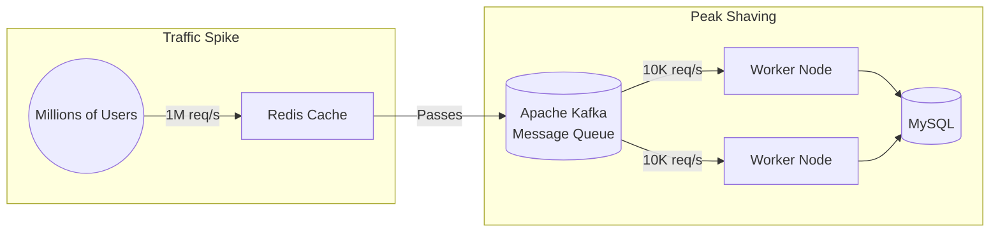

[← Series hub](/series/shopee-architecture/)
[← Prev](/series/shopee-architecture/02-flash-sale-engine/) • [Next →](/series/shopee-architecture/04-database-scale/)

# Chapter 3: Peak Shaving - The Power of Apache Kafka

In the previous chapter, we used Redis to prevent overselling. But if a user successfully secures an item, we still need to write the invoice details into MySQL, call the payment gateway API, and notify the Logistics system. If we do all this simultaneously (Synchronously), the system will still crash due to overload.

Shopee's secret is: **Asynchronous Processing**.

## 1. Peak Shaving with Kafka
Shopee doesn't try to "digest" massive traffic instantly. They use **Apache Kafka** as a giant funnel.
- After Redis successfully deducts the inventory, an "Order_Created" event is compressed and thrown into Kafka.
- The system immediately returns a "Order successful, processing" notification to the user.
- Behind the scenes, workers slowly consume messages from Kafka and write them into the Database. Even with 1 million orders/second, the Database is only written to at a limited speed (e.g., 10k orders/second). The traffic peak (Spike) is "shaved" flat into a stable horizontal line.

## 2. Eventual Consistency
In a distributed system, demanding 100% immediate data synchronization (Strong Consistency) is impossible.
Shopee designs around **Eventual Consistency**: You might not see your money deducted the exact millisecond after purchase, but a few seconds later (when the worker finishes consuming Kafka), everything will be perfectly synchronized.

## 3. Graceful Degradation
During the night of 11.11, Shopee must protect the "Core Flow" (Search -> Add to Cart -> Checkout) at all costs.
- They establish a **Feature Toggle** mechanism. When traffic reaches an alarming threshold, the system automatically TURNS OFF non-essential features: old purchase history, avatar updates, seller statistics, and even tones down the heavy Recommendation system.
- They accept a "slightly degraded" user experience to ensure customers can still successfully pay.

**Takeaway:** Flatten the traffic curve using Message Queues. Don't try to do everything at once. Keep the core money-making flow alive, and be ready to "sacrifice" auxiliary features.


