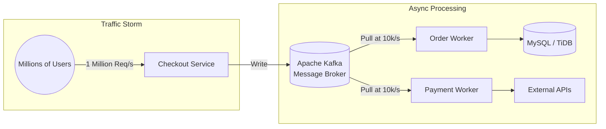

[← Series hub](/series/shopee-architecture/)
[← Prev](/series/shopee-architecture/02-flash-sale-engine/) • [Next →](/series/shopee-architecture/04-database-scale/)

# Chapter 3: Peak Shaving - The Power of Apache Kafka and Graceful Degradation

In Chapter 2, we utilized Redis to deduct inventory in a fraction of a millisecond. However, the purchase journey isn't over. The system still needs to: Create the order record in MySQL, generate an invoice, deduct money from ShopeePay, calculate shipping, and award Shopee Coins.

If we attempt to perform all these steps **Synchronously** while the user waits, the system will collapse due to database lock timeouts or slow third-party API responses. The secret is: **Asynchronous Processing**.

## 1. Peak Shaving with Apache Kafka
The core philosophy of Flash Sale design is: **Accept requests blazingly fast, process them slowly**. Shopee uses **Apache Kafka**—a massive, high-throughput message broker—as a massive buffer funnel.

- Once Redis successfully deducts inventory, a lightweight message stating "User A ordered an iPhone" is pushed into a Kafka Topic.
- The system immediately returns a success response to the app: "You are in queue. Your order is being processed." The user experience takes just milliseconds.
- Behind the scenes, Backend Workers slowly pull messages from Kafka and insert them into the actual Database.
- **The Result:** Even if a spike of 1 million orders arrives in a single second, it won't crash the Database. The 1 million messages are safely stored in Kafka. If the workers process at 10,000 orders/second, the backlog is cleared in 100 seconds. The massive traffic spike has been successfully "shaved" into a flat, manageable horizontal line.

## 2. Eventual Consistency
Shopee embraces the philosophy of **Eventual Consistency** for distributed systems. Do not attempt to force 100% Strong Consistency across all microservices instantly. There will be a slight delay from the moment you tap "Buy" to the moment the invoice fully appears in your "To Ship" tab. This minor time trade-off is the key to preserving the high availability of the entire e-commerce platform.

## 3. Graceful Degradation
During the midnight rush of 11.11, Shopee enforces a strict policy: **Protect the Core Flow at all costs** (Search -> Add to Cart -> Checkout). Everything else can die, but the checkout system must survive!

- **Circuit Breakers:** When an internal system (e.g., the Promotions Service) becomes overloaded and slow, a Circuit Breaker (like Hystrix or Sentinel) automatically trips. It severs the connection to the failing service for a set duration, instantly returning a default fallback response. This prevents slow services from creating cascading timeouts.
- **Feature Toggling:** Engineers pre-configure "switches" in their centralized configuration system. When traffic crosses a critical threshold, the system automatically degrades the user experience by turning off non-essential, heavy features:
  - Disabling historical purchase viewing.
  - Hiding Seller analytics dashboards.
  - Pausing heavy AI Recommendation engines.
  - Disabling avatar updates.

**Developer Takeaway:** Message Queues (Kafka/RabbitMQ) are the key to decoupling monolithic processes into independent pipelines. In high-concurrency design, you must embrace trade-offs: Be willing to sacrifice auxiliary features to keep the primary money-making flow alive.


