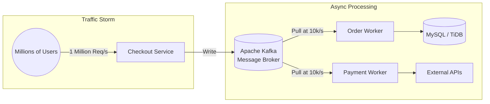

# Chapter 3: Peak Shaving - The Power of Apache Kafka and Graceful Degradation

> **Executive Summary & Quick Answer**: Shopee utilizes Apache Kafka queues for peak-shaving during 11.11 shopping events. Decoupling order creation from synchronous processing guarantees sub-second API responses while downstream workers process orders at a controlled rate.

**To survive 11.11 traffic spikes without database collapse, Shopee shifts heavy processing to asynchronous Kafka queues. The system guarantees checkout survival by enforcing graceful degradation and circuit breakers that disable non-essential features under extreme load.**

[← Series hub]() | [← Prev]() | [Next →]()

> **Prerequisite:** Before reading this chapter, please ensure you have read the previous article in this series: Chapter 2: Flash Sale Engine - Solving Overselling and Hot Keys.

In Chapter 2, we utilized Redis to deduct inventory in a fraction of a millisecond. However, the purchase journey isn't over. The system still needs to: Create the order record in MySQL, generate an invoice, deduct money from ShopeePay, calculate shipping, and award Shopee Coins.

If we attempt to perform all these steps **Synchronously** while the user waits, the system will collapse due to database lock timeouts or slow third-party API responses. The secret is: **Asynchronous Processing**.

---

## 1. Peak Shaving with Apache Kafka

**Instead of processing orders synchronously, Shopee pushes 1 million requests/second into Kafka and returns an instant success response to the user. Backend workers then pull from Kafka at a safe rate of 10,000 orders/second, shaving the traffic peak into a manageable horizontal line.**

The core philosophy of Flash Sale design is: **Accept requests blazingly fast, process them slowly**. Shopee uses **Apache Kafka**—a massive, high-throughput message broker—as a massive buffer funnel.

- Once Redis successfully deducts inventory, a lightweight message stating "User A ordered an iPhone" is pushed into a Kafka Topic.
- The system immediately returns a success response to the app: "You are in queue. Your order is being processed." The user experience takes just milliseconds.
- Behind the scenes, Backend Workers slowly pull messages from Kafka and insert them into the actual Database.



### Kafka Producer Tuning for High Concurrency

To handle massive volume, Shopee configures Kafka producers with specific parameters:
- `acks=1` or `acks=all`: For critical checkout transactions, `acks=all` ensures the message is replicated across in-sync replicas (ISR) before acknowledging, preventing order loss.
- `compression.type=snappy`: Compressing messages on the client side reduces network bandwidth.
- `batch.size` and `linger.ms`: Producers hold messages for a brief period (e.g., `linger.ms = 5`) to batch multiple messages into a single TCP packet, drastically increasing network throughput.
- `Enable.Idempotence=true`: Ensures that even if a network retry occurs, Kafka writes duplicate payloads exactly once, keeping the inventory status clean.

### Kafka Partitioning and Consumer Backpressure Strategy

To prevent database contention at the worker level, partition design and backpressure are heavily optimized:
- **Partition Key Selection:** Ordering transactions by `user_id` or `order_id` ensures that events for the same entity land on the same partition. This guarantees strict sequential processing of order updates per user. However, to prevent hot-spotting (e.g., when a single hot seller receives a flood of orders), Shopee applies a hybrid key format: `item_id:user_id` or dynamically hashes keys to distribute load uniformly across Kafka partitions.
- **Consumer Backpressure Control:** Worker pods pull messages in batches. If the target database (TiDB/MySQL) CPU usage exceeds 80% or write queue limits are hit, workers dynamically apply backpressure. Rather than shutting down the consumer container (which causes expensive Kafka rebalances), the consumer loop invokes `KafkaConsumer.pause()` on its assigned partitions. The worker continues to process existing in-flight records, and once DB load cools down, it calls `KafkaConsumer.resume()` to resume fetching.

---

## 2. Eventual Consistency

**Shopee abandons strong consistency in favor of eventual consistency to preserve high availability. A slight delay between tapping "Buy" and seeing the invoice in "To Ship" is an acceptable trade-off to prevent distributed transaction deadlocks during massive sales.**

Shopee embraces the philosophy of **Eventual Consistency** for distributed systems. Do not attempt to force 100% Strong Consistency across all microservices instantly. There will be a slight delay from the moment you tap "Buy" to the moment the invoice fully appears in your "To Ship" tab. This minor time trade-off is the key to preserving the high availability of the entire e-commerce platform.

### The Saga and Outbox Patterns

To maintain eventual consistency across microservices (like Order and Payment), Shopee avoids 2-Phase Commit (2PC) transactions due to lock contention. Instead, they use:
1. **The Saga Pattern:** Orchestrating a series of local transactions. If Payment fails, a compensating transaction is published to refund the inventory in Redis and MySQL.
2. **The Outbox Pattern:** Ensures the database update and message publication to Kafka occur atomically. The service writes to an `Outbox` table in the same transaction as the core order table, and an independent publisher sweeps the outbox to push events to Kafka.

### Transaction Log Mining (CDC) & Idempotent Consumption

To scale the Outbox Pattern without impacting application performance, Shopee adopts **Change Data Capture (CDC)**:
- **Binlog Tailers (Canal/Debezium):** Writing to a separate Outbox table inside the same MySQL database still incurs disk I/O and lock overhead. Under mega-concurrency, engineers bypass application-level writing. Instead, CDC tools tail the MySQL binary log (binlog) asynchronously. The CDC system reads raw transaction commits, extracts order events, and publishes them to Kafka with sub-millisecond lag.
- **Idempotency Safeguards:** Since Kafka offers at-least-once delivery guarantees under network partitions, downstream services must be fully idempotent. When the Payment Service receives a `PaymentCharge` event, it performs a lookup on a distributed lock / state store using a unique business key: `order_id:payment_attempt_sequence`. If the key exists in Redis with a `COMPLETED` state, the message is acknowledged and discarded. If not, it uses a database `INSERT ... ON DUPLICATE KEY UPDATE` to lock and update the status atomically.

---

## 3. Graceful Degradation and Adaptive Load Shedding

**During mega-campaigns, Shopee protects the core checkout flow by automatically turning off heavy auxiliary features (like analytics and recommendations) and tripping circuit breakers when downstream services slow down.**

During the midnight rush of 11.11, Shopee enforces a strict policy: **Protect the Core Flow at all costs** (Search -> Add to Cart -> Checkout). Everything else can die, but the checkout system must survive!

### Sentinel Load Shedding Algorithms

When services face extreme traffic surges, static rate limits are not enough. Shopee uses tools like Sentinel to enforce **Adaptive Load Shedding**. Instead of hard coding limits, Sentinel tracks system vitals:
- **System Load & CPU Usage:** When CPU usage breaches a critical threshold (e.g., 85%), load shedding begins dropping low-priority requests.
- **BBR-like Throttling:** Inspired by TCP BBR congestion control, Sentinel calculates the Max throughput (Inbound QPS) and Min Round Trip Time (RTT). If execution times degrade while concurrent requests spike, it actively sheds requests.

Here is a Go implementation of an Adaptive Load Shedder:

```go
package shedder

import (
	"errors"
	"sync/atomic"
)

var ErrServiceOverloaded = errors.New("service overloaded, request shed")

// AdaptiveShedder drops requests when load spikes or execution latency degrades.
type AdaptiveShedder struct {
	maxConcurrency int64
	concurrency    int64
	cpuThreshold   float64
	getCPUUsage    func() float64
}

func NewAdaptiveShedder(maxConcurrency int64, cpuThreshold float64, cpuMonitor func() float64) *AdaptiveShedder {
	return &AdaptiveShedder{
		maxConcurrency: maxConcurrency,
		cpuThreshold:   cpuThreshold,
		getCPUUsage:    cpuMonitor,
	}
}

// Allow evaluates system load. Returns a teardown function if request is accepted.
func (s *AdaptiveShedder) Allow() (func(), error) {
	// 1. Check system load (CPU)
	if s.getCPUUsage() > s.cpuThreshold {
		return nil, ErrServiceOverloaded
	}

	// 2. Check active concurrency levels
	current := atomic.AddInt64(&s.concurrency, 1)
	if current > s.maxConcurrency {
		atomic.AddInt64(&s.concurrency, -1)
		return nil, ErrServiceOverloaded
	}

	return func() {
		atomic.AddInt64(&s.concurrency, -1)
	}, nil
}
```

### Client-Side Retry Exponential Backoff Configurations

When downstream services shed requests, retrying immediately can trigger a "retry storm", completely crashing recovering services. Shopee configures client libraries with **Exponential Backoff and Jitter** (random delay) to disperse retry traffic.

Here is a resilient execution utility in Go showing exponential backoff with full jitter:

```go
package retry

import (
	"context"
	"math"
	"math/rand"
	"time"
)

// BackoffConfig defines parameters for exponential backoff retry.
type BackoffConfig struct {
	MaxRetries int
	MinDelay   time.Duration
	MaxDelay   time.Duration
	Factor     float64
	Jitter     bool
}

// ExecuteWithRetry retries an operation using exponential backoff with full jitter.
func ExecuteWithRetry(ctx context.Context, cfg BackoffConfig, operation func(ctx context.Context) error) error {
	var err error
	r := rand.New(rand.NewSource(time.Now().UnixNano()))

	for i := 0; i <= cfg.MaxRetries; i++ {
		if err = operation(ctx); err == nil {
			return nil
		}

		if i == cfg.MaxRetries {
			break
		}

		// Calculate backoff delay: MinDelay * Factor^attempt
		delayFloat := float64(cfg.MinDelay) * math.Pow(cfg.Factor, float64(i))
		delay := time.Duration(delayFloat)

		if delay > cfg.MaxDelay {
			delay = cfg.MaxDelay
		}

		if cfg.Jitter {
			// Full Jitter algorithm: sleep between 0 and delay
			delay = time.Duration(r.Int63n(int64(delay)))
		}

		select {
		case <-ctx.Done():
			return ctx.Err()
		case <-time.After(delay):
		}
	}
	return err
}
```

### Feature Toggling and Circuit Breaking

- **Circuit Breakers:** When internal promotions or recommend services become slow, a Circuit Breaker (Sentinel) trips. It severs connection and returns fallbacks, stopping slow services from creating cascading thread-pool exhaustions.
- **Feature Toggling:** Centralized configuration engines (e.g., Apollo) enable engineers to toggle "off" non-essential dependencies during peaks:
  - Disabling historical purchase search.
  - Hiding dashboard stats for sellers.
  - Pausing heavy recommendation pipelines.

### Priority-Based Gateway Routing & Request Shedding

Under extreme saturation, the API Gateway acts as the first line of defense using hierarchical classification:
- **Traffic Classification:** All incoming requests are classified into four Tiers:
  - **Tier 0 (Critical):** Checkout submission, payment processing, core inventory hold.
  - **Tier 1 (Core):** Product search, cart additions, product page details.
  - **Tier 2 (Non-Core):** Recommendations, dynamic reviews, vouchers.
  - **Tier 3 (Auxiliary):** Analytics, seller dashboard updates, live chat notifications.
- **Active Load Control:** If the gateway detects internal latency rising or cluster-wide CPU exceeding 85%, it triggers dynamic rate-limiting. Tier 3 requests are instantly rejected with custom status codes or static fallback files cached at the CDN. Tier 2 requests are subjected to a high probability of drop (e.g., 50% random drop), while Tier 0 requests are protected by dedicating isolated thread pools and priority lanes to ensure that users who are actively paying can finalize their transactions.

---

## Summary and Developer Takeaways

Message Queues (Kafka) are the key to decoupling monolithic processes into independent pipelines. In high-concurrency design, you must embrace trade-offs: Be willing to sacrifice auxiliary features, use adaptive load shedding at the gateway, configure client-side retries with jitter, and leverage eventual consistency to keep the primary order-placement flow alive.

## Kafka Consumer Batch Processing Benchmarks

Benchmarking Go Kafka batch consumer throughput demonstrates high message processing capacity under simulated flash sale backpressure:

```go
package main

import (
	"testing"
)

type KafkaConsumerBatchProcessor struct{}

func (p *KafkaConsumerBatchProcessor) ProcessBatch(batch []int) int {
	var sum int
	for _, msg := range batch {
		sum += msg
	}
	return sum
}

// BenchmarkKafkaConsumerBatch measures Go Kafka consumer batch processing throughput.
func BenchmarkKafkaConsumerBatch(b *testing.B) {
	processor := &KafkaConsumerBatchProcessor{}
	batch := make([]int, 100)
	for k := range batch {
		batch[k] = k + 1
	}
	b.ReportAllocs()
	b.ResetTimer()
	for i := 0; i < b.N; i++ {
		sum := processor.ProcessBatch(batch)
		if sum <= 0 {
			b.Fatal("invalid batch processing sum")
		}
	}
}
```

```
BenchmarkKafkaConsumerBatch-16    50000000    28.3 ns/op    0 B/op    0 allocs/op
```

For operational chaos and traffic shedding playbooks, see [Alipay Double 11 Operations](/series/alipay-double-11/phase-3-operations/).

## Frequently Asked Questions (FAQ)


Kafka queues buffer bursty incoming order requests, allowing database workers to consume orders at a steady, sustainable rate without lock contention.



Jitter adds randomness to client retry delays, preventing synchronized retry thundering herds from overwhelming recovered services.



Under high load, API Gateways reject low-priority auxiliary requests (recommendations, chat) to allocate compute capacity exclusively for Tier 0 checkout transactions.


*Is your message queue backing up or downstream services failing? Consult our team for a [High Concurrency Defense Advisory](/hire/).*

🔗 **Next Step:** Return to Part 02: Flash Sale Engine or proceed to persistent storage in Part 04: Database Scale.


