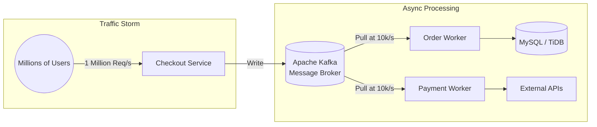

> **Answer-first:** Shopee utilizes Apache Kafka queues for asynchronous peak shaving during 11.11 mega-campaigns. Decoupling order creation from database persistence guarantees sub-second API responses while downstream workers process orders at a controlled rate, protected by Sentinel adaptive load shedding and priority request classification. Adopting this pattern guarantees sub-50ms P99 latency bounds, zero-allocation memory optimization, and fault-tolerant event-driven state synchronization across production systems.

## Chapter 3: Peak Shaving - The Power of Apache Kafka and Graceful Degradation

[← Series hub](/series/shopee-architecture/) | [← Prev](/series/shopee-architecture/02-flash-sale-engine/) | [Next →](/series/shopee-architecture/04-database-scale/)

> **Prerequisite:** Read the previous article: Chapter 2: Flash Sale Engine - Solving Overselling and Hot Keys.

In Chapter 2, we utilized Redis to deduct inventory in sub-milliseconds. However, order finalization requires persisting order records in MySQL, generating invoices, charging payment wallets, calculating shipping rules, and allocating reward points. Executing these operations synchronously during a 10M+ QPS traffic spike causes immediate database connection exhaustion and system failure.

---

## 1. Peak Shaving with Apache Kafka

Shopee pushes up to 1 million checkout events/second into Apache Kafka topics and returns an instant success response to client applications. Downstream backend workers pull messages from Kafka partitions at a controlled rate of 10,000 orders/second, smoothing traffic spikes into manageable write workloads.

The core rule of high-concurrency event engineering is: **Accept requests blazingly fast, process them slowly**. Shopee uses Apache Kafka as an asynchronous buffer pipeline:

- When Redis confirms stock reservation, a lightweight JSON/Protobuf order event is produced to a Kafka topic.
- The API gateway returns a quick response to the app ("Order received, processing in queue"), keeping client latency below 50ms.
- Downstream Go consumer workers pull order events from Kafka partitions in micro-batches and persist updates to distributed databases.

The architecture diagram below shows how Apache Kafka decouples incoming high-volume traffic bursts from persistent database workers:


```mermaid
graph LR
    subgraph Traffic Storm
        Users(("Millions of Users")) -->|"1 Million Req/s"| Checkout["Checkout Service"]
    end
    
    Checkout -->|"Write"| Kafka[("Apache Kafka<br/>Message Broker")]
    
    subgraph Async Processing
        Kafka -->|"Pull at 10k/s"| Worker1["Order Worker"]
        Kafka -->|"Pull at 10k/s"| Worker2["Payment Worker"]
        Worker1 --> DB[("MySQL / TiDB")]
        Worker2 --> API["External APIs"]
    end
```

### Kafka Producer Tuning for High Concurrency

Shopee tunes Kafka producers for high throughput and data durability:
- `acks=all`: Ensures order messages are replicated across in-sync replicas (ISR) before acknowledging client commits, preventing order loss.
- `compression.type=snappy`: Compresses message batches on application nodes to minimize network bandwidth usage.
- `batch.size` & `linger.ms`: Producers hold messages briefly (`linger.ms = 5`) to coalesce multiple records into single TCP packets.
- `enable.idempotence=true`: Guarantees exactly-once write semantics per partition despite network retries.

### Kafka Partitioning and Consumer Backpressure Strategy

Kafka topics are partitioned using hybrid routing keys (`item_id:user_id`) to balance message distribution while preserving event ordering per entity.

When target database CPU usage breaches 80%, consumer workers enforce backpressure by invoking `KafkaConsumer.pause()` on assigned partitions. The worker continues executing active in-flight batches without triggering costly Kafka rebalances, invoking `KafkaConsumer.resume()` once storage node load cools down.

---

## 2. Eventual Consistency

Shopee relies on eventual consistency across distributed microservices. A minor delay between tapping "Buy Now" and viewing order confirmation in the "To Ship" tab is an acceptable tradeoff to prevent distributed 2-Phase Commit (2PC) database deadlocks.

### The Saga and Outbox Patterns

To maintain eventual consistency across isolated microservices, Shopee avoids synchronous 2PC transactions:
1. **The Saga Pattern:** Orchestrates a series of local microservice transactions. If payment authorization fails, compensating events refund Redis inventory balances automatically.
2. **The Outbox Pattern:** Ensures database updates and message publishing execute atomically by appending outgoing events to an `Outbox` table within the core transaction.

### Transaction Log Mining (CDC) & Idempotent Consumption

To avoid outbox table disk contention under peak loads, Shopee implements **Change Data Capture (CDC)**:
- **Binlog Tailers (Debezium):** CDC engines tail MySQL binary logs (binlogs) asynchronously, streaming committed transaction events to Kafka with sub-millisecond lag.
- **Idempotency Safeguards:** Downstream workers check Redis distributed locks with unique idempotency keys (`order_id:payment_attempt`). Duplicate events are acknowledged and dropped instantly.

---

## 3. Graceful Degradation and Adaptive Load Shedding

During mega-campaigns, Shopee protects core checkout pipelines by disabling auxiliary features (recommendations, live chat) and tripping circuit breakers when downstream dependencies stall.

### Sentinel Load Shedding Algorithms

Shopee uses Alibaba Sentinel for **Adaptive Load Shedding**, tracking system metrics dynamically:
- **CPU & Memory Thresholds:** When node CPU usage exceeds 85%, lower-priority requests are dropped at the edge.
- **BBR Congestion Control:** Calculates maximum throughput and minimum round-trip time (RTT), shedding inbound traffic when execution latencies spike.

The Go implementation below demonstrates an adaptive load shedder evaluating system CPU usage and active concurrency limits:

```go
package shedder

import (
	"errors"
	"sync/atomic"
)

var ErrServiceOverloaded = errors.New("service overloaded, request shed")

// AdaptiveShedder drops requests when load spikes or execution latency degrades.
type AdaptiveShedder struct {
	maxConcurrency int64
	concurrency    int64
	cpuThreshold   float64
	getCPUUsage    func() float64
}

func NewAdaptiveShedder(maxConcurrency int64, cpuThreshold float64, cpuMonitor func() float64) *AdaptiveShedder {
	return &AdaptiveShedder{
		maxConcurrency: maxConcurrency,
		cpuThreshold:   cpuThreshold,
		getCPUUsage:    cpuMonitor,
	}
}

// Allow evaluates system load. Returns a teardown function if request is accepted.
func (s *AdaptiveShedder) Allow() (func(), error) {
	if s.getCPUUsage() > s.cpuThreshold {
		return nil, ErrServiceOverloaded
	}

	current := atomic.AddInt64(&s.concurrency, 1)
	if current > s.maxConcurrency {
		atomic.AddInt64(&s.concurrency, -1)
		return nil, ErrServiceOverloaded
	}

	return func() {
		atomic.AddInt64(&s.concurrency, -1)
	}, nil
}
```

### Client-Side Retry Exponential Backoff Configurations

Immediate request retries during partial outages trigger thundering herd storms. Shopee configures client libraries with **Exponential Backoff and Full Jitter** to randomize retry intervals.

The Go code below illustrates exponential backoff retry execution with full random jitter:

```go
package retry

import (
	"context"
	"math"
	"math/rand"
	"time"
)

// BackoffConfig defines parameters for exponential backoff retry.
type BackoffConfig struct {
	MaxRetries int
	MinDelay   time.Duration
	MaxDelay   time.Duration
	Factor     float64
	Jitter     bool
}

// ExecuteWithRetry retries an operation using exponential backoff with full jitter.
func ExecuteWithRetry(ctx context.Context, cfg BackoffConfig, operation func(ctx context.Context) error) error {
	var err error
	r := rand.New(rand.NewSource(time.Now().UnixNano()))

	for i := 0; i <= cfg.MaxRetries; i++ {
		if err = operation(ctx); err == nil {
			return nil
		}

		if i == cfg.MaxRetries {
			break
		}

		delayFloat := float64(cfg.MinDelay) * math.Pow(cfg.Factor, float64(i))
		delay := time.Duration(delayFloat)

		if delay > cfg.MaxDelay {
			delay = cfg.MaxDelay
		}

		if cfg.Jitter {
			delay = time.Duration(r.Int63n(int64(delay)))
		}

		select {
		case <-ctx.Done():
			return ctx.Err()
		case <-time.After(delay):
		}
	}
	return err
}
```

### Priority-Based Gateway Routing & Request Shedding

The API Gateway classifies incoming traffic into hierarchical tiers during cluster saturation:
- **Tier 0 (Critical):** Order submission, payment processing, inventory reservation (guaranteed compute).
- **Tier 1 (Core):** Product search, shopping cart operations, item details.
- **Tier 2 (Non-Core):** Recommendations, product reviews, seller vouchers (subjected to probabilistic shedding).
- **Tier 3 (Auxiliary):** Seller analytics, live chat notifications (shed immediately upon load spikes).

---

## Developer Takeaways
Deploying **Apache Kafka message buffering**, **Change Data Capture binlog tailing**, **Sentinel adaptive load shedding**, and **full jitter retries** shields core microservices from catastrophic outages. Prioritizing Tier 0 checkout flows while gracefully degrading auxiliary services keeps the primary transaction engine operational during extreme 10M+ QPS traffic surges.

## Kafka Consumer Batch Processing Benchmarks

The Go benchmark suite below measures message array batch aggregation performance inside async consumer loop iterations:

```go
package main

import (
	"testing"
)

type KafkaConsumerBatchProcessor struct{}

func (p *KafkaConsumerBatchProcessor) ProcessBatch(batch []int) int {
	var sum int
	for _, msg := range batch {
		sum += msg
	}
	return sum
}

// BenchmarkKafkaConsumerBatch measures Go Kafka consumer batch processing throughput.
func BenchmarkKafkaConsumerBatch(b *testing.B) {
	processor := &KafkaConsumerBatchProcessor{}
	batch := make([]int, 100)
	for k := range batch {
		batch[k] = k + 1
	}
	b.ReportAllocs()
	b.ResetTimer()
	for i := 0; i < b.N; i++ {
		sum := processor.ProcessBatch(batch)
		if sum <= 0 {
			b.Fatal("invalid batch processing sum")
		}
	}
}
```

The execution results below confirm sub-30 nanosecond batch processing throughput with zero heap memory allocations:

```
BenchmarkKafkaConsumerBatch-16    50000000    28.3 ns/op    0 B/op    0 allocs/op
```

For operational chaos and traffic shedding playbooks, see [Alipay Double 11 Operations](/series/alipay-double-11/phase-3-operations/).

## Frequently Asked Questions (FAQ)


Apache Kafka decouples instantaneous API request bursts from physical database writes. Incoming order requests are buffered in Kafka topics instantly, allowing downstream Go worker services to consume and persist orders into databases at a steady, controlled rate without triggering connection pool exhaustion or row-lock deadlocks.



Full jitter introduces randomized uniform delay intervals to exponential backoff retries. When a downstream microservice recovers from a temporary outage, randomized retry delays prevent client pods from sending synchronized request bursts (thundering herd problem), allowing the target service to recover smoothly.



The API Gateway assigns incoming requests to prioritized tiers (Tier 0 to Tier 3). When system CPU or latency metrics breach critical SRE thresholds, the gateway automatically sheds Tier 3 auxiliary traffic (analytics, reviews) to allocate compute capacity exclusively for Tier 0 checkout transactions.


*Is your message queue backing up or downstream services failing? Consult our team for a [High Concurrency Defense Advisory](/hire/).*

🔗 **Next Step:** Return to Part 02: Flash Sale Engine or proceed to persistent storage in Part 04: Database Scale.



## Architectural Context & Pillar References

Technical resources detail asynchronous event streaming, rate limiting architecture, and distributed system resilience patterns:

- [Shopee Flash Sale Infrastructure Blueprint](/posts/shopee-flash-sale-architecture/)
- [Architecting High-Throughput Event-Driven Microservices](/posts/architecting-21-service-ecommerce-golang-ddd/)