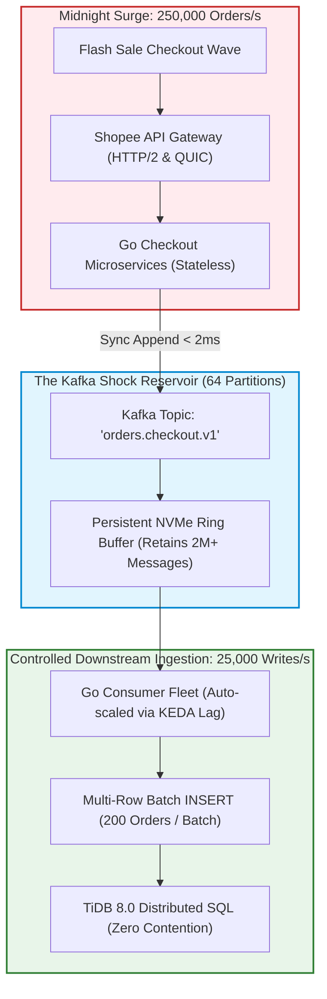
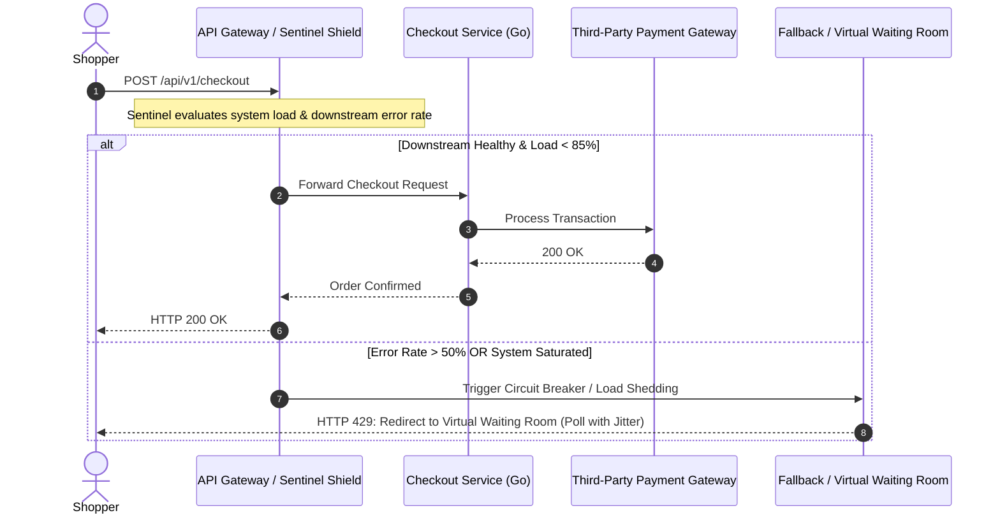

> **Multi-Language Edition:** This chapter is also available in Vietnamese at [Bài 3: Tấm Khiên Bảo Vệ — Message Queue và San Phẳng Đỉnh Tải (learn.tanhdev.com)](https://learn.tanhdev.com/series/shopee-architecture/03-traffic-shield/).

[Previous Chapter: Chapter 2 — Flash Sale Engine & Zero Overselling](/series/shopee-architecture/02-flash-sale-engine/) | [Series Hub](/series/shopee-architecture/) | [Next Chapter: Chapter 4 — Database Scalability: From MySQL to TiDB](/series/shopee-architecture/04-database-scale/)

---

> **Answer-First:** Shopee utilizes Apache Kafka queues for asynchronous peak shaving during 11.11 mega-campaigns. Decoupling user order submission from relational database persistence guarantees sub-50ms API responses while downstream consumer workers insert orders at a flat, controlled rate. Combined with Alibaba Sentinel adaptive load shedding, virtual waiting rooms, and strict Dead Letter Queue (DLQ) isolation, this traffic shield absorbs 10x traffic surges without database connection pool exhaustion or cascaded outages.

---

## 1. The Traffic Shaving Reservoir: Decoupling Compute from Storage

During the opening minutes of a Mega Sale, incoming orders spike from a baseline of 10,000 orders/sec to **over 250,000 orders/sec**. Relational database engines cannot commit 250,000 ACID transactions per second without exhausting disk write-ahead log (WAL) bandwidth.

Instead of synchronously writing orders to the database, Shopee treats **Apache Kafka as a shock-absorbing water reservoir**:
1. The checkout service validates the request, decrements in-memory Redis inventory atomically, and pushes an `OrderMessage` to Kafka.
2. The user immediately receives an HTTP 200 response with an order tracking UUID.
3. Downstream Go worker consumers pull batches from Kafka and persist them into the database at a safe, constant throughput (e.g., 25,000 writes/sec), smoothly flattening a 10x peak over several minutes.


```mermaid
flowchart TD
    subgraph SuddenPeak ["Midnight Surge: 250,000 Orders/s"]
        P1["Flash Sale Checkout Wave"] --> API["Shopee API Gateway (HTTP/2 & QUIC)"]
        API --> GoCheckout["Go Checkout Microservices (Stateless)"]
    end

    subgraph KafkaBuffer ["The Kafka Shock Reservoir (64 Partitions)"]
        GoCheckout -->|Sync Append < 2ms| KP["Kafka Topic: 'orders.checkout.v1'"]
        KP --> PBuf["Persistent NVMe Ring Buffer (Retains 2M+ Messages)"]
    end

    subgraph SmoothDBConsumption ["Controlled Downstream Ingestion: 25,000 Writes/s"]
        PBuf --> Consumers["Go Consumer Fleet (Auto-scaled via KEDA Lag)"]
        Consumers --> Batcher["Multi-Row Batch INSERT (200 Orders / Batch)"]
        Batcher --> TiDBCluster["TiDB 8.0 Distributed SQL (Zero Contention)"]
    end

    classDef surge fill:#ffebee,stroke:#c62828,stroke-width:2px;
    classDef buffer fill:#e1f5fe,stroke:#0288d1,stroke-width:2px;
    classDef safe fill:#e8f5e9,stroke:#2e7d32,stroke-width:2px;
    class SuddenPeak surge;
    class KafkaBuffer buffer;
    class SmoothDBConsumption safe;
```

---

## 2. Adaptive Circuit Breaking & Graceful Degradation with Sentinel

When downstream dependencies (such as external credit card processing networks or regional logistics APIs) degrade, queuing requests unbounded inside microservice memory causes container out-of-memory (OOM) crashes.

Shopee deploys **Sentinel-style adaptive flow control** in Go:
- **System Watermark Monitoring:** If node CPU utilization exceeds 85% or thread pool queue delay exceeds 200ms, low-priority requests are immediately shed.
- **Graceful Feature Degradation:** During peak checkout hours, non-critical features—such as personalized recommendations, product reviews, and complex reward point recalculations—are dynamically switched off to preserve 100% of compute capacity for checkout.


```mermaid
sequenceDiagram
    autonumber
    actor User as Shopper
    participant GW as API Gateway / Sentinel Shield
    participant CheckoutSvc as Checkout Service (Go)
    participant PaymentGW as Third-Party Payment Gateway
    participant Fallback as Fallback / Virtual Waiting Room

    User->>GW: POST /api/v1/checkout
    Note over GW: Sentinel evaluates system load & downstream error rate
    alt Downstream Healthy & Load < 85%
        GW->>CheckoutSvc: Forward Checkout Request
        CheckoutSvc->>PaymentGW: Process Transaction
        PaymentGW-->>CheckoutSvc: 200 OK
        CheckoutSvc-->>GW: Order Confirmed
        GW-->>User: HTTP 200 OK
    else Error Rate > 50% OR System Saturated
        GW->>Fallback: Trigger Circuit Breaker / Load Shedding
        Fallback-->>User: HTTP 429: Redirect to Virtual Waiting Room (Poll with Jitter)
    end
```

### Go Consumer Batching Implementation with Kafka

```go
package consumer

import (
	"context"
	"time"

	"github.com/segmentio/kafka-go"
	"gorm.io/gorm"
)

type OrderConsumer struct {
	reader *kafka.Reader
	db     *gorm.DB
}

func (c *OrderConsumer) StartIngestionLoop(ctx context.Context) {
	batch := make([]OrderEntity, 0, 200)
	ticker := time.NewTicker(50 * time.Millisecond)
	defer ticker.Stop()

	for {
		select {
		case <-ctx.Done():
			return
		case <-ticker.C:
			if len(batch) > 0 {
				c.flushBatch(batch)
				batch = batch[:0]
			}
		default:
			msg, err := c.reader.FetchMessage(ctx)
			if err != nil {
				continue
			}
			order := parseOrderPayload(msg.Value)
			batch = append(batch, order)

			if len(batch) >= 200 {
				c.flushBatch(batch)
				c.reader.CommitMessages(ctx, msg)
				batch = batch[:0]
			}
		}
	}
}

func (c *OrderConsumer) flushBatch(orders []OrderEntity) {
	// Multi-row atomic batch insert reduces DB round-trips by 200x
	c.db.CreateInBatches(orders, len(orders))
}
```

---

## 3. Dead Letter Queue (DLQ) & Poison Pill Isolation

In high-throughput event processing, a single corrupted payload (e.g., malformed JSON or zero-length user ID) that causes an unhandled consumer panic must not block the entire Kafka partition.

Shopee enforces a **Three-Strike DLQ Strategy**:
1. If processing an event fails, the consumer retries up to 3 times with exponential backoff.
2. If all retries fail, the message is routed to `orders.checkout.dlq` along with error stack trace headers.
3. The consumer commits the offset on the main topic and proceeds immediately to the next message, preventing consumer partition stalls.

---

## Frequently Asked Questions (FAQ)


During mega flash sales, write requests arrive in a sharp spike of 250,000 orders/second. By appending these orders as sequential binary records into partitioned Kafka topics, disk write I/O is purely sequential (which modern NVMe drives handle at gigabytes per second). Downstream database consumer workers then drain Kafka at a controlled, flat rate of 25,000 writes/second using batch SQL inserts, turning a destructive spike into a smooth, manageable workload.



Shopee utilizes KEDA (Kubernetes Event-driven Autoscaling) to monitor the Prometheus metric \`kafka_consumergroup_lag\`. When unconsumed messages in an order topic exceed 50,000, KEDA automatically scales consumer worker pods from a baseline of 20 up to the maximum number of topic partitions (e.g., 64 or 128 pods), multiplying consumption bandwidth within 30 seconds.



When platform ingress exceeds total computing capacity (e.g., during the first 60 seconds of 11.11), the API Gateway intercepts excess users and diverts them to an edge-hosted Virtual Waiting Room (powered by Cloudflare Workers). The waiting room assigns an encrypted ticket number and instructs the mobile app to poll a status endpoint with randomized exponential backoff, preventing millions of frustrated users from furiously spamming the reload button.


---

## Next Steps

Proceed to [Chapter 4: Database Scalability — From MySQL Sharding to TiDB NewSQL](/series/shopee-architecture/04-database-scale/) to learn how Shopee migrated from sharded MySQL to distributed TiDB.
