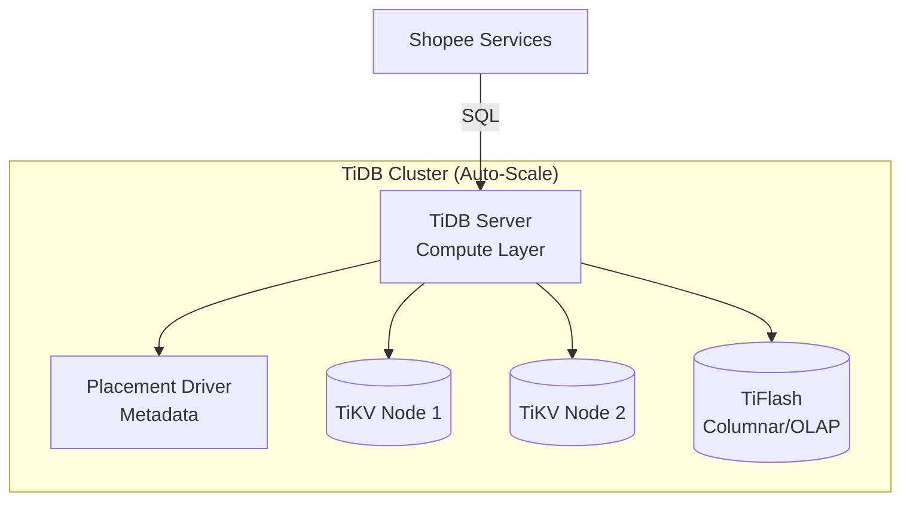

[← Series hub](/series/shopee-architecture/)
[← Prev](/series/shopee-architecture/03-traffic-shield/) • [Next →](/series/shopee-architecture/05-observability/)

# Chapter 4: How Shopee Stores Billions of Orders (Database Scaling)

No matter how great your Cache (Redis) or Queue (Kafka) is, the final destination of every transaction is the Database. With billions of orders every month, traditional Relational Database Management Systems (RDBMS) like MySQL stand on the brink of collapse due to Storage Limits and IO Bottlenecks.

## 1. The Limits of MySQL and Database Sharding
A table in MySQL performs best when it has under 20 million rows. At Shopee, this number is surpassed in a few hours.
- Initially, systems used **Database Sharding**. Instead of 1 order DB, they split it into 1,000 order DBs (e.g., Even User IDs go to DB_A, odd ones to DB_B).
- **The Consequence:** Backend code becomes incredibly complex. Joining data across tables located on 2 different physical DBs is a nightmare. When needing to add the 1,001st DB, data migration takes months.

## 2. TiDB: The Savior of Distributed Storage (NewSQL)
To solve the root cause, Shopee heavily migrated many core systems to **TiDB**.
- **What is TiDB?** It is a next-generation database system (NewSQL). It completely separates the Compute layer from the Storage layer.
- **Fully MySQL Compatible:** Developers don't need to rewrite code; they just change the connection string from MySQL to TiDB. SQL statements remain identical.
- **Auto Horizontal Scaling:** TiDB automatically shards data under the hood (using TiKV). When storage is full, you simply plug a new hard drive/server into the cluster, and TiDB automatically redistributes the data with Zero Downtime.

## 3. HTAP (Hybrid Transactional/Analytical Processing)
Previously, to analyze revenue, Shopee had to copy data from MySQL (OLTP) to a Data Warehouse (OLAP), taking hours. With TiDB, it supports both OLTP and OLAP on the same platform in real-time thanks to its columnar storage architecture (TiFlash).

**Takeaway:** Don't build manual Database Sharding if you don't have a massive team. Leverage NewSQL solutions like TiDB or CockroachDB to solve data scaling issues at the billion-record scale.


