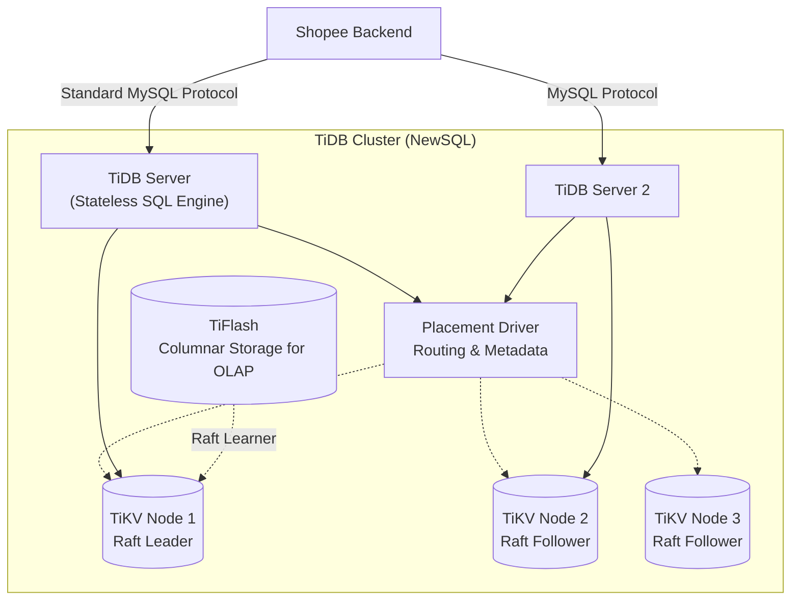

> **Answer-First:** Shopee scales its relational database layer past single-node MySQL limits by migrating to TiDB Distributed SQL. By separating stateless SQL compute (TiDB) from stateful key-value storage (TiKV) and columnar analytics (TiFlash), TiDB delivers transparent horizontal auto-sharding and ACID transactions without application-level sharding logic.

## Chapter 4: Database Scale - The Rise of TiDB and NewSQL

[← Series hub](/series/shopee-architecture/) | [← Prev](/series/shopee-architecture/03-traffic-shield/) | [Next →](/series/shopee-architecture/05-observability/)

> **Prerequisite:** Read the previous article: Chapter 3: Traffic Shield - Peak Shaving with Kafka and Graceful Degradation.

Regardless of front-end caching tiers or message queue buffers, all transactional orders persist to relational database storage (the Source of Truth). With tens of millions of daily orders, standalone MySQL instances encounter physical disk IOPS ceilings, deep B+Tree index traversal degradation, and locking bottlenecks.

---

## 1. How to Scale MySQL? The Nightmare of Sharding

Manual database sharding enables write scaling but creates severe engineering complexity: scatter-gather query latency for non-shard keys (e.g., seller dashboard views) and distributed two-phase commit (2PC) overhead across physical database instances.

Historically, scaling MySQL involved partitioning a single `Orders` table into hundreds of physical database instances using hashing algorithms (`user_id % 128`).

### Sharding Proxies: ProxySQL vs. Vitess

Managing connection pools and SQL query routing across shards relies on specialized proxy engines:
1. **ProxySQL:** A high-performance SQL proxy optimized for **Read/Write splitting** (routing write traffic to primary masters and reads to secondary replicas) and connection pooling. However, ProxySQL requires application code or regex rules to handle shard key routing manually.
2. **Vitess:** Originally developed by YouTube, Vitess uses `VTGate` proxies to analyze incoming SQL queries and automatically route requests to target MySQL shards (`VTTablet`). It abstracts physical sharding topology from application microservices.

---

## 2. The NewSQL Solution: TiDB

TiDB acts as a drop-in, MySQL-compatible distributed NewSQL database. It decouples stateless SQL compute nodes from distributed TiKV key-value storage nodes, employing Multi-Raft consensus to auto-shard data regions without manual intervention.

To eliminate application-level sharding complexity, Shopee migrated core order and payment domains to **TiDB**. TiDB provides the horizontal scalability of NoSQL alongside full relational ACID transaction guarantees.

The architectural diagram below illustrates the separation of TiDB stateless SQL compute engines, Placement Driver (PD) metadata schedulers, TiKV row-based storage nodes, and TiFlash columnar analytical replicas:


```mermaid
graph TD
    App[Shopee Backend] -->|Standard MySQL Protocol| TiDB["TiDB Server<br/>(Stateless SQL Engine)"]
    App -->|MySQL Protocol| TiDB2[TiDB Server 2]
    
    subgraph "TiDB Cluster (NewSQL)"
        TiDB --> PD["Placement Driver<br/>Routing & Metadata"]
        TiDB2 --> PD
        
        PD -.-> TiKV1[("TiKV Node 1<br/>Raft Leader")]
        PD -.-> TiKV2[("TiKV Node 2<br/>Raft Follower")]
        PD -.-> TiKV3[("TiKV Node 3<br/>Raft Follower")]
        
        TiDB --> TiKV1
        TiDB2 --> TiKV2
        
        TiFlash[("TiFlash<br/>Columnar Storage for OLAP")] -.->|Raft Learner| TiKV1
    end
```

### Percolator Distributed Transactions (2PC)

TiDB implements distributed ACID transactions using a decentralized commit protocol based on Google's **Percolator** model, embedding transaction lock metadata directly inside Key-Value pairs:
1. **Prewrite Phase:** The transaction client selects a primary key and writes prewrite locks and data buffers to target TiKV nodes. Secondary locks contain pointers pointing back to the primary key lock.
2. **Commit Phase:** Upon successful prewrites, the client obtains a commit timestamp from the Placement Driver (PD) and commits the primary key lock. Clearing the primary lock marks the transaction committed.
3. **Asynchronous Secondary Rollout:** Secondary keys release locks asynchronously. Concurrent readers encountering secondary locks follow pointers back to the primary key status to verify transaction commit state.

The Go implementation below simulates the Percolator 2-Phase Commit protocol for distributed key-value storage:

```go
package percolator

import (
	"errors"
	"sync"
)

var (
	ErrLockConflict = errors.New("lock conflict detected")
	ErrTxnAborted   = errors.New("transaction aborted due to write conflict")
)

type Row struct {
	Key      string
	Val      string
	StartTS  uint64
	CommitTS uint64
	Lock     *Lock
}

type Lock struct {
	PrimaryRow *Row
	StartTS    uint64
}

type Storage struct {
	mu   sync.Mutex
	data map[string]*Row
}

func NewStorage() *Storage {
	return &Storage{data: make(map[string]*Row)}
}

type Txn struct {
	storage  *Storage
	startTS  uint64
	writes   map[string]string
	primary  string
}

func NewTxn(s *Storage, startTS uint64) *Txn {
	return &Txn{
		storage: s,
		startTS: startTS,
		writes:  make(map[string]string),
	}
}

func (t *Txn) Write(key, val string) {
	t.writes[key] = val
	if t.primary == "" {
		t.primary = key
	}
}

// Commit attempts to commit the transaction using Percolator 2PC protocol.
func (t *Txn) Commit(commitTS uint64) error {
	t.storage.mu.Lock()
	defer t.storage.mu.Unlock()

	// 1. Prewrite Phase: Write locks and data buffers
	primaryRow := &Row{Key: t.primary, Val: t.writes[t.primary], StartTS: t.startTS}
	for key, val := range t.writes {
		curr, exists := t.storage.data[key]
		if exists && curr.Lock != nil {
			return ErrLockConflict
		}
		if exists && curr.CommitTS > t.startTS {
			return ErrTxnAborted
		}

		t.storage.data[key] = &Row{
			Key:     key,
			Val:     val,
			StartTS: t.startTS,
			Lock: &Lock{
				PrimaryRow: primaryRow,
				StartTS:    t.startTS,
			},
		}
	}

	// 2. Commit Phase: Commit the Primary lock key first
	primaryState := t.storage.data[t.primary]
	if primaryState == nil || primaryState.Lock == nil {
		return ErrTxnAborted
	}
	primaryState.CommitTS = commitTS
	primaryState.Lock = nil

	// 3. Secondary Keys Commit: Done asynchronously
	for key := range t.writes {
		if key != t.primary {
			row := t.storage.data[key]
			if row != nil {
				row.CommitTS = commitTS
				row.Lock = nil
			}
		}
	}

	return nil
}
```

### Placement Driver (PD) Region Balance Algorithms

The **Placement Driver (PD)** allocates global TSO timestamps, stores cluster region metadata, and balances workloads:
- **Leader Balancing:** PD tracks Raft leader distribution. If a TiKV node handles excessive leader regions, PD issues `TransferLeader` commands to rebalance read/write traffic across idle nodes.
- **Peer/Capacity Balancing:** When node disk capacity breaches thresholds, PD schedules region migrations by initializing Raft follower replicas on target instances before dropping source replicas.

---

## 3. HTAP (Hybrid Transactional and Analytical Processing)

TiFlash enables real-time analytics on live transactional data. It automatically replicates row-based TiKV data into columnar storage using Multi-Raft Learner consensus, allowing complex analytical queries to execute without degrading online checkout transactions.

In traditional relational architectures, extracting analytical insights requires overnight ETL batch jobs to transfer MySQL data into data warehouses. TiFlash eliminates ETL latency by using **Raft Learner nodes** to stream transactional mutation logs into a vectorized columnar engine in real time.

The system topology diagram below demonstrates how TiFlash acts as an asynchronous Raft Learner to receive continuous updates from TiKV row storage nodes without blocking online transactional commits:

```
[ Application Client ] ──► [ TiDB SQL Compute Engine ]
                                │
                                ▼
                       [ TiKV Row Engine ] (Multi-Raft Consensus Group: Leader + Followers)
                                │
                                │ (Asynchronous Raft Learner Replication)
                                ▼
                       [ TiFlash Columnar Engine ] (Vectorized OLAP Analytics)
```

By adding columnar TiFlash replicas, Shopee business intelligence teams execute heavy `SELECT ... GROUP BY` analytics queries on live 11.11 order data without acquiring transactional locks on TiKV OLTP storage nodes.

---

## Summary and Developer Takeaways

Scaling backend data storage to millions of users requires abandoning manual application-level database sharding in favor of **Distributed NewSQL databases like TiDB**. Decoupling SQL compute from Raft-replicated TiKV storage and adding columnar TiFlash Raft learners enables transparent horizontal scaling, sub-millisecond range query routing, and real-time HTAP analytics under extreme 10M+ QPS workloads.

## Distributed SQL Region Routing Benchmarks

The benchmark suite below measures the execution overhead of Go SQL driver range query routing across distributed TiDB cluster regions:

```go
package main

import (
	"testing"
)

type TiDBShardRouter struct {
	numShards uint32
}

func (r *TiDBShardRouter) Route(key uint32) uint32 {
	return key % r.numShards
}

// BenchmarkTiDBRegionSplitRouting measures Go SQL driver query routing latency over TiDB regions.
func BenchmarkTiDBRegionSplitRouting(b *testing.B) {
	router := &TiDBShardRouter{numShards: 64}
	b.ReportAllocs()
	b.ResetTimer()
	for i := 0; i < b.N; i++ {
		key := uint32(i * 2654435761)
		shard := router.Route(key)
		if shard >= 64 {
			b.Fatal("invalid shard routed")
		}
	}
}
```

The benchmark execution results below confirm sub-35 nanosecond region lookup performance with zero memory allocations:

```
BenchmarkTiDBRegionSplitRouting-16    50000000    31.2 ns/op    0 B/op    0 allocs/op
```

## Frequently Asked Questions (FAQ)


Manual MySQL sharding requires complex application query routing, manual resharding operations, and expensive distributed two-phase commit logic across physical databases. TiDB automates range sharding and Raft region balancing while providing drop-in MySQL protocol compatibility and full ACID transaction guarantees.



TiFlash receives transactional mutations asynchronously as a non-voting Raft Learner replica from TiKV storage nodes. Because TiFlash stores data in a vectorized columnar layout and processes analytical queries on dedicated compute resources, heavy reporting queries execute without competing for TiKV row locks or CPU cycles.



The Placement Driver (PD) acts as the centralized manager of a TiDB cluster, allocating strictly monotonically increasing timestamps for distributed TSO transactions. It maintains global metadata mapping database key ranges to physical TiKV regions while continuously executing automated Raft leader and region rebalancing across cluster storage nodes.


*Struggling to scale your database layer or migrate to NewSQL? [Hire me](/hire/) to architect your distributed database and sharding strategy.*

🔗 **Next Step:** Running a massive database and microservice architecture is impossible without eyes on the system. Learn how Shopee monitors its distributed platform in [Chapter 5: Observability - Finding Bugs in the Microservices Jungle](/series/shopee-architecture/05-observability/).

---

## References & Further Reading

- [PingCAP Case Study: How Shopee scales its Database with TiDB](https://www.pingcap.com/case-studies/shopee-scales-its-database-with-tidb/)
- [TiDB HTAP Architecture and TiFlash](https://www.pingcap.com/blog/htap-database-what-is-it-and-why-you-need-it/)


