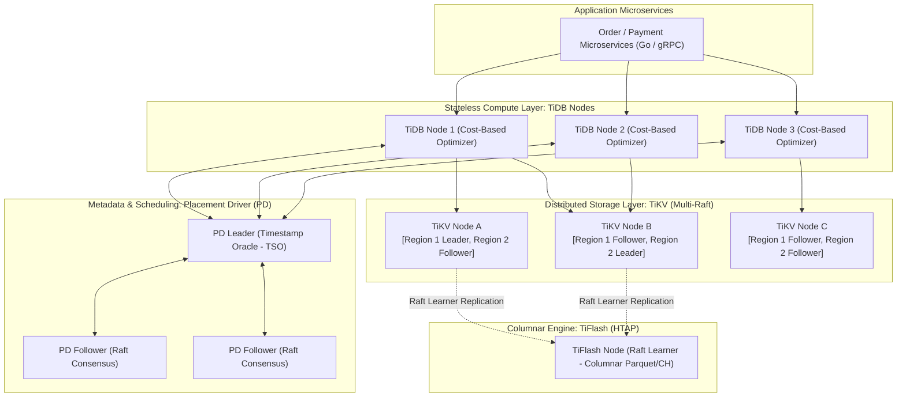
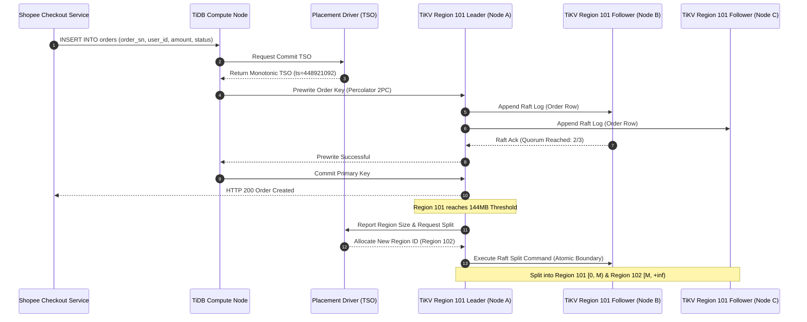

> **Multi-Language Edition:** This chapter is also available in Vietnamese at [Bài 4: Mở Rộng Cơ Sở Dữ Liệu — Từ Phân Mảnh MySQL Đến Phân Tán TiDB Multi-Raft (learn.tanhdev.com)](https://learn.tanhdev.com/series/shopee-architecture/04-database-scale/).

[Previous Chapter: Chapter 3 — Traffic Shield & Peak Shaving](/series/shopee-architecture/03-traffic-shield/) | [Series Hub](/series/shopee-architecture/) | [Next Chapter: Chapter 5 — Full-Stack Observability](/series/shopee-architecture/05-observability/)

---

> **Answer-First:** Traditional MySQL sharding collapses under hyper-scale e-commerce growth due to manual resharding overhead, cross-shard joins, and high 2-Phase Commit (2PC) latency penalties. Shopee transitioned its massive order and inventory backbones to **TiDB and TiKV**, a cloud-native NewSQL distributed database. By decoupling stateless SQL compute (TiDB) from distributed transactional storage (TiKV) coordinated via Placement Driver (PD) and Multi-Raft consensus across 96MB continuous key Regions, TiDB delivers horizontal elastic scalability, zero-downtime auto-rebalancing, and real-time HTAP analytics without impacting write-heavy OLTP workloads.

---

## 1. The Breakdown of Traditional MySQL Sharding

In its early growth phases, Shopee scaled relational storage using standard MySQL master-replica replication with proxy-based sharding (ShardingSphere, Vitess, or custom routing middlewares). Each shard housed tens of millions of records, partitioned by `user_id` or `merchant_id`.

```
MySQL Cluster Limits:
┌────────────────────────────┐    Cross-Shard Join / 2PC Latency (> 250ms)
│  Order Table (Sharded)     │ ───► Expensive cross-node XA locks
│  Merchant Shards (1..64)   │ ───► Manual resharding when single shard hits 500GB
│  Replica Lag Spike         │ ───► GTID replication delay during 11.11 traffic spikes
└────────────────────────────┘
```

Three critical operational bottlenecks forced a architectural paradigm shift:

1. **The Re-Sharding Tax:** When order volume expanded 5x year-over-year, splitting 64 shards into 128 shards required weeks of planning, manual data migration, routing table updates, and risky maintenance downtime windows.
2. **Cross-Shard Query Degradation:** While single-key lookups (`WHERE user_id = ? AND order_id = ?`) routed cleanly to one MySQL instance, aggregate merchant dashboards and fraud detection queries required distributed scatter-gather queries with high cross-node latency and heavy memory footprints.
3. **Replication Lag & Asymmetric Failover:** Under massive write surges during 11.11 flash sales, asynchronous or semi-synchronous binlog replication lagged by dozens of seconds. If a primary node failed under peak load, failover tools (such as Orchestrator) risked either silent data loss or extended read locks.

---

## 2. The TiDB NewSQL Architecture

To solve horizontal scalability while maintaining full ACID compliance and MySQL wire protocol compatibility, Shopee adopted a NewSQL distributed storage model powered by **TiDB, TiKV, and Placement Driver (PD)**.


```mermaid
flowchart TD
    subgraph ClientLayer["Application Microservices"]
        GOSVC["Order / Payment Microservices (Go / gRPC)"]
    end

    subgraph ComputeLayer["Stateless Compute Layer: TiDB Nodes"]
        TIDB1["TiDB Node 1 (Cost-Based Optimizer)"]
        TIDB2["TiDB Node 2 (Cost-Based Optimizer)"]
        TIDB3["TiDB Node 3 (Cost-Based Optimizer)"]
    end

    subgraph CoordLayer["Metadata & Scheduling: Placement Driver (PD)"]
        PD1["PD Leader (Timestamp Oracle - TSO)"]
        PD2["PD Follower (Raft Consensus)"]
        PD3["PD Follower (Raft Consensus)"]
    end

    subgraph StorageLayer["Distributed Storage Layer: TiKV (Multi-Raft)"]
        TIKV1["TiKV Node A<br/>[Region 1 Leader, Region 2 Follower]"]
        TIKV2["TiKV Node B<br/>[Region 1 Follower, Region 2 Leader]"]
        TIKV3["TiKV Node C<br/>[Region 1 Follower, Region 2 Follower]"]
    end

    subgraph AnalyticalLayer["Columnar Engine: TiFlash (HTAP)"]
        TIFLASH1["TiFlash Node (Raft Learner - Columnar Parquet/CH)"]
    end

    GOSVC --> TIDB1
    GOSVC --> TIDB2
    GOSVC --> TIDB3

    TIDB1 <--> PD1
    TIDB2 <--> PD1
    TIDB3 <--> PD1

    TIDB1 --> TIKV1
    TIDB1 --> TIKV2
    TIDB2 --> TIKV2
    TIDB3 --> TIKV3

    TIKV1 -. Raft Learner Replication .-> TIFLASH1
    TIKV2 -. Raft Learner Replication .-> TIFLASH1

    PD1 <--> PD2
    PD1 <--> PD3
```

### Architectural Separation of Concerns

1. **TiDB (Stateless Compute):**
   - Implements the MySQL 5.7/8.0 wire protocol. Any standard Go database driver (`database/sql` with `go-sql-driver/mysql`) connects seamlessly without code changes.
   - Houses the Cost-Based Optimizer (CBO), SQL parser, and distributed query executor.
   - Fully stateless: TiDB nodes scale out horizontally behind a Layer-4 load balancer (HAProxy or Envoy).

2. **Placement Driver (PD) (Cluster Brain & TSO):**
   - Manages global cluster topology, Region locations, and load balancing.
   - Provides strictly monotonic, monotonically increasing 64-bit timestamps via the **Timestamp Oracle (TSO)**, powering multi-version concurrency control (MVCC) and Percolator-based distributed snapshot isolation.
   - Implements Raft consensus across 3 or 5 nodes for high availability.

3. **TiKV (Distributed Transactional Storage):**
   - Implements transactional key-value pairs (`Key -> MVCC Value`) backed by high-performance RocksDB storage engines.
   - Organizes data into logical continuous chunks called **Regions** (~96MB each).
   - Coordinates replication and consensus across nodes using **Multi-Raft**.

4. **TiFlash (Columnar HTAP Engine):**
   - Replicates TiKV data asynchronously as a **Raft Learner** (zero impact on write leader consensus).
   - Stores data in a columnar format optimized for vector SIMD processing, empowering real-time management dashboards, BI analytics, and fraud scoring.

---

## 3. Multi-Raft Consensus & Dynamic Region Auto-Splitting

Rather than running a single monolithic Raft group across the entire cluster, TiKV breaks the global key-value space into hundreds of thousands of independent **Regions**.


```mermaid
sequenceDiagram
    autonumber
    participant App as Shopee Checkout Service
    participant TiDB as TiDB Compute Node
    participant PD as Placement Driver (TSO)
    participant Leader as TiKV Region 101 Leader (Node A)
    participant Follower as TiKV Region 101 Follower (Node B)
    participant Follower2 as TiKV Region 101 Follower (Node C)

    App->>TiDB: INSERT INTO orders (order_sn, user_id, amount, status)
    TiDB->>PD: Request Commit TSO
    PD-->>TiDB: Return Monotonic TSO (ts=448921092)
    TiDB->>Leader: Prewrite Order Key (Percolator 2PC)
    Leader->>Follower: Append Raft Log (Order Row)
    Leader->>Follower2: Append Raft Log (Order Row)
    Follower-->>Leader: Raft Ack (Quorum Reached: 2/3)
    Leader-->>TiDB: Prewrite Successful
    TiDB->>Leader: Commit Primary Key
    Leader-->>App: HTTP 200 Order Created

    Note over Leader: Region 101 reaches 144MB Threshold
    Leader->>PD: Report Region Size & Request Split
    PD-->>Leader: Allocate New Region ID (Region 102)
    Leader->>Follower: Execute Raft Split Command (Atomic Boundary)
    Note over Leader, Follower2: Split into Region 101 [0, M) & Region 102 [M, +inf)
```

### How Multi-Raft Operates in Production

1. **Logical Key Ranges:** A Region represents a continuous key range: `[start_key, end_key)`.
2. **Raft Quorum per Region:** Each Region has 3 replicas (Peers) distributed across separate fault domains (Availability Zones or Kubernetes racks). Only the **Region Leader** serves writes and linearizable reads.
3. **Region Auto-Split Heuristic:**
   - Default target size: **96MB**.
   - When incoming writes push a Region past **144MB** or 1,440,000 keys, the Region Leader initiates an internal Raft log split.
   - The split key is selected at the midpoint. An atomic metadata update divides the range into two distinct Regions: `[start_key, split_key)` and `[split_key, end_key)`.
   - The Placement Driver updates its routing table and automatically schedules background peer movement if any storage node experiences disk or I/O imbalance.

---

## 4. Flash Sale Hotspot Mitigation: Eliminating Sequential Bottlenecks

A frequent failure mode in naive distributed database implementations is **monotonic auto-increment keys**. If an e-commerce platform uses standard sequential primary keys (`order_id INT AUTO_INCREMENT`), all 250,000 orders created in a single second hit the exact same Region Leader, creating an extreme write hotspot while 99% of the TiKV cluster sits idle.

Shopee solves this using **TiDB `AUTO_RANDOM` primary keys** and **Region Pre-splitting**:

```sql
-- Production DDL for High-Throughput Orders Table
CREATE TABLE orders (
    order_id BIGINT AUTO_RANDOM(5) PRIMARY KEY,
    order_sn VARCHAR(64) NOT NULL UNIQUE,
    user_id BIGINT NOT NULL,
    merchant_id BIGINT NOT NULL,
    total_amount DECIMAL(12, 2) NOT NULL,
    currency VARCHAR(8) DEFAULT 'VND',
    status TINYINT NOT NULL DEFAULT 1,
    created_at TIMESTAMP NOT NULL DEFAULT CURRENT_TIMESTAMP,
    updated_at TIMESTAMP NOT NULL DEFAULT CURRENT_TIMESTAMP ON UPDATE CURRENT_TIMESTAMP,
    INDEX idx_user_orders (user_id, created_at),
    INDEX idx_merchant_orders (merchant_id, status)
)
-- Distribute table data evenly across 16 initial Regions
SHARD_ROW_ID_BITS = 4
PRE_SPLIT_REGIONS = 4;
```

### Code Explanation:
- `AUTO_RANDOM(5)`: TiDB prepends a 5-bit random shard ID (values 0–31) to the highest bits of the 64-bit integer, while preserving monotonic sequence in the remaining 59 bits. Consecutive inserts automatically scatter across 32 different TiKV Region Leaders.
- `SHARD_ROW_ID_BITS = 4` & `PRE_SPLIT_REGIONS = 4`: Ensures that when the table is created before the 11.11 campaign, TiDB proactively allocates $2^4 = 16$ distinct Regions spread across all available storage nodes, preventing any single node from bearing initial load spikes.

---

## 5. Production Go Integration: Handling Distributed Transactions

When executing mission-critical balance deductions and order updates, the Go application leverages TiDB's pessimistic transaction mode to avoid write conflicts under high contention.

```go
// Package db provides production-hardened database transaction utilities for TiDB.
package db

import (
	"context"
	"database/sql"
	"fmt"
	"time"

	_ "github.com/go-sql-driver/mysql"
)

// ExecuteOrderPayment executes payment state changes with pessimistic locking and TSO snapshot isolation.
func ExecuteOrderPayment(ctx context.Context, db *sql.DB, orderSN string, userID int64, amount float64) error {
	// Set execution timeout to prevent connection starvation
	ctx, cancel := context.WithTimeout(ctx, 3*time.Second)
	defer cancel()

	tx, err := db.BeginTx(ctx, &sql.TxOptions{
		Isolation: sql.LevelReadCommitted, // Maps to TiDB Pessimistic Read Committed
	})
	if err != nil {
		return fmt.Errorf("failed to begin transaction: %w", err)
	}
	defer tx.Rollback()

	// 1. Lock the order row using SELECT ... FOR UPDATE (PointGet on index)
	var currentStatus int
	queryLock := `SELECT status FROM orders WHERE order_sn = ? AND user_id = ? FOR UPDATE;`
	if err := tx.QueryRowContext(ctx, queryLock, orderSN, userID).Scan(&currentStatus); err != nil {
		return fmt.Errorf("failed to lock order row: %w", err)
	}

	if currentStatus != 1 { // 1 = Pending Payment
		return fmt.Errorf("order %s cannot be paid: current status %d", orderSN, currentStatus)
	}

	// 2. Update order status to 2 (Paid)
	queryUpdate := `UPDATE orders SET status = 2, updated_at = NOW() WHERE order_sn = ?;`
	if _, err := tx.ExecContext(ctx, queryUpdate, orderSN); err != nil {
		return fmt.Errorf("failed to update order status: %w", err)
	}

	// 3. Insert transaction ledger entry
	queryLedger := `
		INSERT INTO payment_ledger (order_sn, user_id, amount, payment_type, recorded_at)
		VALUES (?, ?, ?, 'WALLET', NOW());
	`
	if _, err := tx.ExecContext(ctx, queryLedger, orderSN, userID, amount); err != nil {
		return fmt.Errorf("failed to append ledger record: %w", err)
	}

	// Commit transaction via Percolator 2-Phase Commit
	if err := tx.Commit(); err != nil {
		return fmt.Errorf("distributed commit failed: %w", err)
	}

	return nil
}
```

---

## Frequently Asked Questions


TiDB addresses write hotspots through three complementary mechanisms:
1. <strong>AUTO_RANDOM Primary Keys:</strong> Injects high-bit pseudo-random numbers into primary keys, scattering sequential writes across dozens of distinct TiKV Region leaders instead of overloading a single disk.
2. <strong>PRE_SPLIT_REGIONS:</strong> Pre-allocates and distributes physical key ranges before mega-sale events, ensuring cluster write capacity scales linearly from second zero.
3. <strong>Placement Driver (PD) Hotspot Scheduler:</strong> Dynamically detects hot Regions based on CPU usage and write bandwidth, migrating hot Region leaders to cooler hardware nodes without dropping client connections.



TiDB provides strictly linearizable ACID consistency guaranteed by Multi-Raft quorum consensus and Google Percolator-based distributed snapshot isolation:
- Unlike MySQL semi-synchronous replication (which can suffer from phantom reads or split-brain during forced master promotions), a TiKV write is committed only after a quorum (majority) of Raft replicas persist the Raft log.
- Global monotonic ordering is enforced by the Placement Driver (PD) Timestamp Oracle (TSO), ensuring all transactions adhere to Snapshot Isolation or Strict Serializable Isolation without dirty reads or non-repeatable reads.



The cluster automatically executes a two-stage self-healing process:
1. <strong>Sub-3-second Leader Election:</strong> If a TiKV node crashes, the remaining Raft replicas for all affected Regions detect a missed heartbeat (default election timeout ~3s) and elect new Region Leaders. Client requests experience a brief retryable spike before resuming transparently.
2. <strong>Autonomous Re-Replication:</strong> If the disconnected node does not return within 30 minutes (configurable `max-store-down-time`), PD treats it as permanently offline and commands existing healthy nodes to replicate missing Region peers, restoring the 3-replica quorum across the cluster.


---

[Previous Chapter: Chapter 3 — Traffic Shield & Peak Shaving](/series/shopee-architecture/03-traffic-shield/) | [Series Hub](/series/shopee-architecture/) | [Next Chapter: Chapter 5 — Full-Stack Observability](/series/shopee-architecture/05-observability/)
