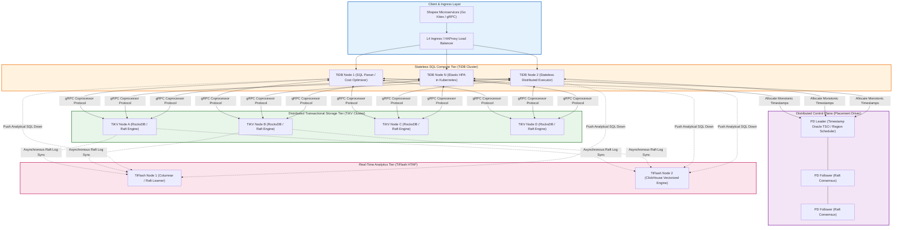
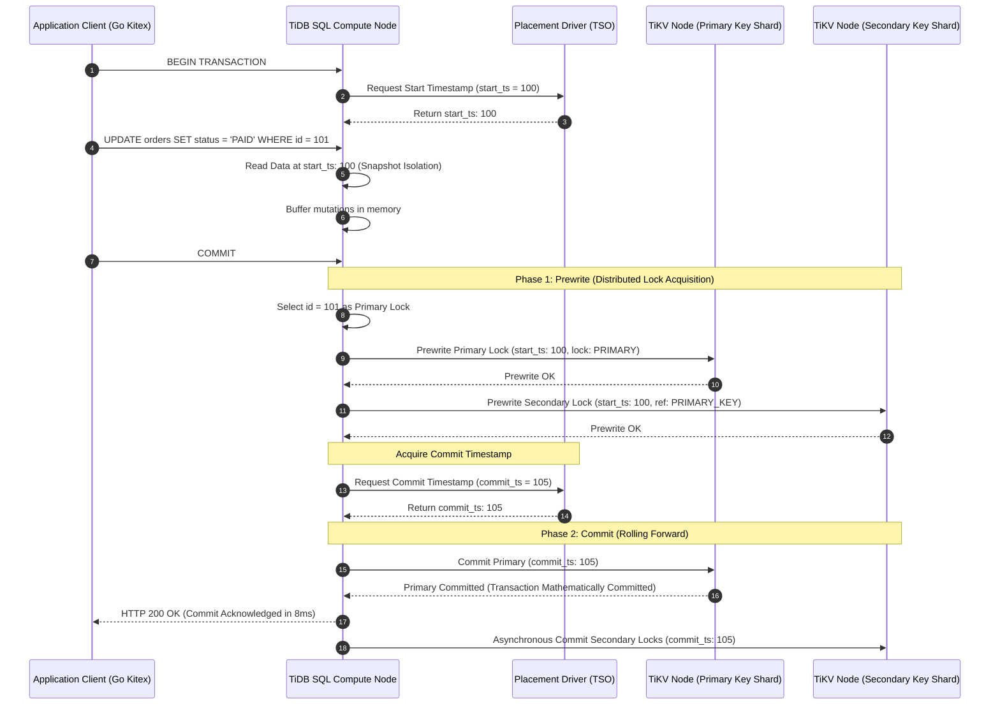
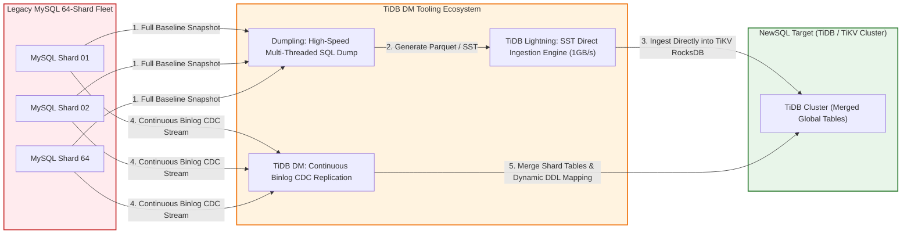

[Previous Chapter: Chapter 3 — Traffic Shield & Peak Shaving](/series/shopee-architecture/03-traffic-shield/) | [Series Hub](/series/shopee-architecture/) | [Next Chapter: Chapter 5 — Full-Stack Observability](/series/shopee-architecture/05-observability/)

---

> **Answer-first:** Shopee eliminated relational database bottlenecks by migrating mission-critical checkout clusters from sharded MySQL to TiDB NewSQL distributed storage. Decoupling stateless SQL compute from Multi-Raft consensus storage across 96MB TiKV regions enables elastic scaling, automated split-merge rebalancing, and Google Percolator distributed transactions, guaranteeing sub-twenty-millisecond p99 write latency and zero data loss across availability zones.

---

> **Prerequisite:** Solid understanding of relational database internals (InnoDB B+ trees, clustered indexes), distributed consensus protocols (Raft, Paxos), Two-Phase Commit (2PC), Snapshot Isolation (SI), and distributed SQL architectures.

---

## 1. The Breakdown of Traditional MySQL Sharding

In its early growth phases, Shopee scaled relational storage using standard MySQL master-replica clusters coupled with application-side routing middleware (such as ShardingSphere, Vitess, or customized GORM dbresolver wrappers). The core database was horizontally sliced into 64 physical database instances partitioned by `user_id` or `merchant_id`.

While this proxy-based sharding architecture sustained platform operations through 2019, exponential GMV expansion into hundreds of millions of daily orders exposed intractable structural limitations:

```
MySQL Sharding Architectural Ceilings:
┌───────────────────────────────────────┐   Cross-Shard Joins / 2PC Penalties (> 350ms)
│  Order & Ledger Shards (1..64)        │ ──► Expensive XA locks & coordination stalls
│  Single Shard Storage Cap (> 600GB)   │ ──► Re-sharding takes 4 weeks of dual-writing
│  Asymmetric Replica Lag (GTID drift)  │ ──► Binlog replication delays spike during 11.11
└───────────────────────────────────────┘
```

### The Three Inherent Failures of Sharded MySQL

1. **The Re-Sharding Tax:** As transaction volumes expanded by 400% year-over-year, individual MySQL shards exceeded 600GB of storage. Beyond this threshold, InnoDB B+ tree indexes grew 5 levels deep, triggering multiple random NVMe I/O operations per point lookup. Splitting 64 shards into 128 shards required weeks of meticulous preparation: provisioning new hardware, running complex double-write synchronization pipelines, performing checksum reconciliations, and coordinating risky midnight maintenance downtime windows.
2. **Cross-Shard Query Degradation:** While queries containing the partition key (`WHERE user_id = 9821 AND order_id = 'ORD-101'`) routed directly to a single MySQL instance, analytical merchant queries (such as "Show total revenue across all sellers in Jakarta for the past hour") required scatter-gather queries across all 64 shards. Network latency accumulated across nodes, and application servers frequently exhausted memory stitching together intermediate result sets.
3. **Replication Lag and Asymmetric Failover (RPO > 0):** MySQL relies on asynchronous or semi-synchronous binlog replication. Under intense write pressure during 11.11 flash-sale peaks, the replica thread (`applier`) fell behind the primary by dozens of seconds due to single-threaded or coarse-grained worker replay. If a primary hardware node crashed under peak load, automated failover tools faced an impossible dilemma: either promote the lagging replica and accept permanent data loss (violating RPO = 0), or lock the cluster into read-only mode, halting order processing.

For a comprehensive comparative analysis of relational partitioning versus distributed storage engines, inspect our architectural study on [MySQL Horizontal Scaling Strategies](/posts/mysql-horizontal-scaling/).

---

## 2. The TiDB NewSQL Architecture: Compute-Storage Disaggregation

To achieve unlimited horizontal elasticity while preserving strict ACID guarantees and full MySQL wire protocol compatibility, Shopee adopted **TiDB**, an open-source distributed NewSQL database.

The cornerstone of TiDB's architecture is the **complete disaggregation of stateless compute from distributed stateful storage**:


```mermaid
flowchart TD
    subgraph ClientLayer ["Client & Ingress Layer"]
        App["Shopee Microservices (Go Kitex / gRPC)"] --> L4["L4 Ingress / HAProxy Load Balancer"]
    end

    subgraph ComputeTier ["Stateless SQL Compute Tier (TiDB Cluster)"]
        L4 --> TiDB1["TiDB Node 1 (SQL Parser / Cost Optimizer)"]
        L4 --> TiDB2["TiDB Node 2 (Stateless Distributed Executor)"]
        L4 --> TiDBN["TiDB Node N (Elastic HPA in Kubernetes)"]
    end

    subgraph ControlPlane ["Distributed Control Plane (Placement Driver)"]
        PD1["PD Leader (Timestamp Oracle TSO / Region Scheduler)"]
        PD2["PD Follower (Raft Consensus)"]
        PD3["PD Follower (Raft Consensus)"]
        PD1 --- PD2 --- PD3
    end

    subgraph StorageTier ["Distributed Transactional Storage Tier (TiKV Cluster)"]
        TiKV1["TiKV Node A (RocksDB / Raft Engine)"]
        TiKV2["TiKV Node B (RocksDB / Raft Engine)"]
        TiKV3["TiKV Node C (RocksDB / Raft Engine)"]
        TiKV4["TiKV Node D (RocksDB / Raft Engine)"]
    end

    subgraph ColumnarTier ["Real-Time Analytics Tier (TiFlash HTAP)"]
        TiF1["TiFlash Node 1 (Columnar / Raft Learner)"]
        TiF2["TiFlash Node 2 (ClickHouse Vectorized Engine)"]
    end

    TiDB1 & TiDB2 & TiDBN <-->|Allocate Monotonic Timestamps| PD1
    TiDB1 & TiDB2 & TiDBN <-->|gRPC Coprocessor Protocol| TiKV1 & TiKV2 & TiKV3 & TiKV4
    TiKV1 & TiKV2 -.->|Asynchronous Raft Log Sync| TiF1 & TiF2
    TiDB1 & TiDB2 -.->|Push Analytical SQL Down| TiF1 & TiF2

    classDef client fill:#e3f2fd,stroke:#1565c0,stroke-width:2px;
    classDef compute fill:#fff3e0,stroke:#ef6c00,stroke-width:2px;
    classDef control fill:#f3e5f5,stroke:#7b1fa2,stroke-width:2px;
    classDef storage fill:#e8f5e9,stroke:#2e7d32,stroke-width:2px;
    classDef htap fill:#fce4ec,stroke:#c2185b,stroke-width:2px;
    class ClientLayer client;
    class ComputeTier compute;
    class ControlPlane control;
    class StorageTier storage;
    class ColumnarTier htap;
```

### Architectural Roles of Component Tiers

- **TiDB Server (Stateless Compute):** Speaks the standard MySQL wire protocol. Applications connect using standard Go, Java, or Python MySQL drivers without knowing they are speaking to a distributed database. TiDB nodes parse SQL queries, generate logical and physical execution plans, calculate cost-based optimizations (CBO), and push sub-queries down to storage nodes via the Coprocessor protocol.
- **TiKV (Distributed Key-Value Engine):** A transactional distributed key-value storage engine implemented in Rust for maximum memory safety and performance. Data is stored on disk using RocksDB and managed through distributed Multi-Raft consensus groups.
- **Placement Driver (PD):** The central control plane of the cluster. PD performs two vital duties:
  1. **Timestamp Oracle (TSO):** Allocates strictly monotonically increasing 64-bit physical-logical hybrid timestamps used to establish transaction serialization order under Snapshot Isolation.
  2. **Intelligent Scheduler:** Gathers heartbeat telemetry from all TiKV nodes, dynamically orchestrating Region splits, merges, and cross-node migrations to balance disk and CPU utilization.
- **TiFlash (Columnar HTAP Engine):** A columnar storage engine synchronized directly via Raft learner nodes. When business analysts query real-time 11.11 revenue dashboards, the TiDB optimizer automatically routes analytical queries to TiFlash columnar nodes, ensuring that multi-gigabyte aggregation queries consume zero CPU or I/O resources on OLTP TiKV checkout nodes.

---

## 3. Multi-Raft Consensus in TiKV for Zero Data Loss

In traditional master-slave replication, replication granularity is the entire physical server. If a master node fails, all data on that server is impacted. In contrast, TiKV decomposes data into continuous byte ranges called **Regions**:

```mermaid
flowchart LR
    subgraph AZ1 ["Availability Zone 1 (Data Center A)"]
        direction TB
        Node1["TiKV Node 1"]
        R1_L["Region 1 (Leader)"]
        R2_F1["Region 2 (Follower)"]
        Node1 --- R1_L & R2_F1
    end

    subgraph AZ2 ["Availability Zone 2 (Data Center B)"]
        direction TB
        Node2["TiKV Node 2"]
        R1_F1["Region 1 (Follower)"]
        R2_L["Region 2 (Leader)"]
        Node2 --- R1_F1 & R2_L
    end

    subgraph AZ3 ["Availability Zone 3 (Data Center C)"]
        direction TB
        Node3["TiKV Node 3"]
        R1_F2["Region 1 (Follower)"]
        R2_F2["Region 2 (Follower)"]
        Node3 --- R1_F2 & R2_F2
    end

    R1_L ===|Raft Log Replication (Quorum 2/3)| R1_F1 & R1_F2
    R2_L ===|Raft Log Replication (Quorum 2/3)| R2_F1 & R2_F2

    classDef az fill:#f5f5f5,stroke:#9e9e9e,stroke-width:1px;
    classDef leader fill:#e8f5e9,stroke:#2e7d32,stroke-width:2px;
    classDef follower fill:#e3f2fd,stroke:#1565c0,stroke-width:2px;
    class AZ1,AZ2,AZ3 az;
    class R1_L,R2_L leader;
    class R1_F1,R1_F2,R2_F1,R2_F2 follower;
```

### The Region Lifecycle: Automatic Split and Merge

- **Fixed Range Sizing:** A Region defaults to a target size of **96 Megabytes** (bounded by `[start_key, end_key)`).
- **Region Split:** When sustained transaction writes cause a Region to exceed **144 Megabytes**, TiKV automatically splits it into two contiguous 72MB regions. The split operation is a purely local metadata update in RocksDB taking less than 1 millisecond. The Placement Driver (PD) is notified via heartbeat, updating the global region routing table.
- **Region Merge:** When order data is archived or deleted, causing a Region's size to drop below **20 Megabytes**, PD automatically merges it with an adjacent continuous Region, reclaiming metadata overhead.
- **Multi-Raft Consensus:** Every Region is replicated across 3 or 5 nodes located in distinct physical data centers or availability zones (AZs). Each Region operates as an independent Raft consensus group with its own elected Leader. A single physical TiKV node hosts tens of thousands of Region replicas, acting simultaneously as Leader for some groups and Follower for others.
- **Raft Lease Read and Heartbeat Optimization:** In textbook Raft implementations, serving a read requires the Leader to execute an expensive round of heartbeats to confirm it has not been deposed by a network partition. TiKV avoids this overhead by using **Raft Leases**: when a Leader wins an election or commits a log entry, it is granted a physical time lease during which no other node can be elected. As long as the local clock drift is bounded, the Leader serves read requests directly from its local RocksDB engine without issuing network RPCs, achieving sub-millisecond read latency.
- **Safe Dynamic Reconfiguration via Joint Consensus:** When replacing degraded storage hardware or rebalancing Regions across data centers, TiKV executes configuration transitions using Ongaro's Raft **Joint Consensus** protocol ($C_{\text{old}} \to C_{\text{old,new}} \to C_{\text{new}}$). Configuration entries are committed through the state machine like standard data logs. At no point during cluster expansion or hardware decommissioning can two disjoint majorities be formed, guaranteeing mathematically verified safety during online topology shifts.
- **Strict RPO = 0 and Sub-2s RTO:** Writes succeed as soon as a majority quorum (e.g., 2 out of 3 AZs) acknowledges the Raft log. If an entire data center experiences a total power outage, the remaining 2 availability zones elect new Region leaders within **1.8 seconds**, achieving true Zero Data Loss ($\text{RPO} = 0$).

---

## 4. Google Percolator Distributed Transaction Model

TiDB implements the distributed transaction model pioneered by Google Percolator. This architecture delivers **Snapshot Isolation (SI)** and full ACID semantics across hundreds of distributed storage nodes without requiring specialized hardware (such as Google Spanner's atomic clocks):


```mermaid
sequenceDiagram
    autonumber
    participant Client as Application Client (Go Kitex)
    participant TiDB as TiDB SQL Compute Node
    participant PD as Placement Driver (TSO)
    participant TiKV_P as TiKV Node (Primary Key Shard)
    participant TiKV_S as TiKV Node (Secondary Key Shard)

    Client->>TiDB: BEGIN TRANSACTION
    TiDB->>PD: Request Start Timestamp (start_ts = 100)
    PD-->>TiDB: Return start_ts: 100

    Client->>TiDB: UPDATE orders SET status = 'PAID' WHERE id = 101;
    TiDB->>TiDB: Read Data at start_ts: 100 (Snapshot Isolation)
    TiDB->>TiDB: Buffer mutations in memory

    Client->>TiDB: COMMIT

    Note over TiDB,TiKV_S: Phase 1: Prewrite (Distributed Lock Acquisition)
    TiDB->>TiDB: Select id = 101 as Primary Lock
    TiDB->>TiKV_P: Prewrite Primary Lock (start_ts: 100, lock: PRIMARY)
    TiKV_P-->>TiDB: Prewrite OK
    TiDB->>TiKV_S: Prewrite Secondary Lock (start_ts: 100, ref: PRIMARY_KEY)
    TiKV_S-->>TiDB: Prewrite OK

    Note over TiDB,PD: Acquire Commit Timestamp
    TiDB->>PD: Request Commit Timestamp (commit_ts = 105)
    PD-->>TiDB: Return commit_ts: 105

    Note over TiDB,TiKV_S: Phase 2: Commit (Rolling Forward)
    TiDB->>TiKV_P: Commit Primary (commit_ts: 105)
    TiKV_P-->>TiDB: Primary Committed (Transaction Mathematically Committed)
    TiDB-->>Client: HTTP 200 OK (Commit Acknowledged in 8ms)

    TiDB->>TiKV_S: Asynchronous Commit Secondary Locks (commit_ts: 105)
```

### The Two-Phase Commit Workflow

1. **Start Timestamp Acquisition:** The TiDB coordinator queries the Placement Driver (PD) for a `start_ts`. All subsequent reads within the transaction view only data committed prior to `start_ts`.
2. **Prewrite Phase:** The coordinator designates one key as the **Primary Key** and all other modified keys as **Secondary Keys**. It sends prewrite requests to TiKV nodes containing:
   - The data value written to the `data` column family (CF).
   - An exclusive lock written to the `lock` CF bearing `start_ts`. Secondary locks contain a direct pointer reference to the primary lock key.
3. **Commit Phase:** The coordinator fetches a `commit_ts` from PD. It commits the **Primary Key** first by converting the lock record into a permanent `write` CF entry. **Once the primary lock commits, the transaction is irrevocably committed.** The secondary locks are cleared and rolled forward asynchronously in the background without holding up client response latency.

If the coordinator crashes mid-transaction, any concurrent transaction that encounters an orphaned secondary lock can resolve it by checking the status of the primary lock: if the primary committed, the secondary is rolled forward; if the primary was rolled back or expired, the secondary lock is purged.

### Lock Manager Internals and Wait-For Graph Resolution

In TiDB's pessimistic locking mode, transactional write locks are managed by a dedicated in-memory component inside each TiKV node called the **Lock Manager**:
- **Point-in-Time Lock Wait Queuing:** When transaction $T_2$ attempts to write to a row currently locked by transaction $T_1$, $T_2$ does not immediately abort. Instead, its request enters a priority queue managed by the Lock Manager on that specific TiKV Region leader.
- **Distributed Deadlock Detection Service:** If $T_1$ holds Key A and waits for Key B while $T_2$ holds Key B and waits for Key A, a distributed circular dependency is formed. To detect cross-node deadlocks without saturating the network with global lock gossip, TiDB designates one of the Placement Driver (PD) nodes or a designated TiKV instance as the **Deadlock Detector Leader**.
- **Wait-For Graph Edge Streaming:** Region leaders stream lock-wait edges (`T2 -> T1`) to the Deadlock Detector over long-lived gRPC streams. The detector continuously executes Tarjan's strongly connected components algorithm over the distributed wait-for graph. When a cycle is detected, the transaction with the younger `start_ts` (the transaction that started later) is sent an abort signal (`Error 1213: Deadlock found`), while the older transaction proceeds unimpeded. This minimizes overall transaction rollbacks and guarantees forward progress across the entire platform.

---

## 5. Mitigating Write Hotspots: `AUTO_RANDOM` vs `SHARD_ROW_ID_BITS`

In standard MySQL architectures, tables utilize an auto-incrementing primary key (`id BIGINT AUTO_INCREMENT PRIMARY KEY`). While this ensures compact B+ tree node clustering in single-instance MySQL, it creates an acute **write hotspot vulnerability** in distributed databases.

Because TiKV stores keys in strictly sorted lexicographical order:
$$\text{RowKey} = \text{TableID} \mathbin{\Vert} \text{RowID}$$

When primary keys increment monotonically (`1, 2, 3, ...`), all concurrent writes continuously append to the **end of the table's key range**. Consequently, 100% of write traffic converges onto the single TiKV node hosting the tail Region. The remaining 90+ storage nodes in the cluster sit completely idle while one node's CPU and disk saturation creates a massive system bottleneck.

### The SOTA Solution: `AUTO_RANDOM` and `SHARD_ROW_ID_BITS`

To eliminate write hotspot concentration, Shopee structures distributed order tables using TiDB's native random scattering primitives:

```sql
-- Production DDL for Shopee Core Order Table in TiDB 8.0
CREATE TABLE `orders` (
    `order_id` BIGINT(20) NOT NULL AUTO_RANDOM(5),
    `user_id` BIGINT(20) NOT NULL,
    `merchant_id` BIGINT(20) NOT NULL,
    `sku_id` BIGINT(20) NOT NULL,
    `quantity` INT(11) NOT NULL,
    `total_amount` DECIMAL(12,2) NOT NULL,
    `status` VARCHAR(32) NOT NULL,
    `created_at` DATETIME NOT NULL DEFAULT CURRENT_TIMESTAMP,
    PRIMARY KEY (`order_id`) /*T![clustered_index] CLUSTERED */,
    KEY `idx_user_created` (`user_id`, `created_at`),
    KEY `idx_merchant_created` (`merchant_id`, `created_at`)
) ENGINE=InnoDB DEFAULT CHARSET=utf8mb4 COLLATE=utf8mb4_bin;
```

### How `AUTO_RANDOM(5)` Eliminates Hotspot Skew

- The `AUTO_RANDOM(5)` directive allocates the first 5 binary bits of the 64-bit integer as a randomized shard header:
  - Total shard partitions: $2^5 = 32$ concurrent write streams.
  - The remaining 59 bits increment sequentially.
- When concurrent checkout transactions insert orders, row keys are dispersed uniformly across **32 distinct TiKV Regions** hosted on 32 separate physical servers.
- Write throughput scales linearly with cluster node count: an order table that maxed out at 15,000 writes/sec under auto-incrementing IDs scales smoothly past **350,000 writes/sec** on TiDB without a single hot Region bottleneck.

---

## 6. Production Go TiDB Client Implementation with Pessimistic Retries

The Go implementation below configures an enterprise-grade connection pool for TiDB, utilizing pessimistic distributed transactions with automated deadlock retry loops (`Error 1213`), dynamic statement timeouts, and Stale Read optimizations for non-critical query offloading.

```go
package tidb

import (
	"context"
	"database/sql"
	"errors"
	"fmt"
	"log"
	"math/rand"
	"time"

	"github.com/go-sql-driver/mysql"
)

const (
	ErrCodeDeadlock = 1213 // MySQL / TiDB deadlock conflict error
	MaxRetries      = 5
)

type DatabaseClient struct {
	db *sql.DB
}

func NewDatabaseClient(dsn string, maxOpenConns, maxIdleConns int) (*DatabaseClient, error) {
	db, err := sql.Open("mysql", dsn)
	if err != nil {
		return nil, fmt.Errorf("failed to open tidb connection: %w", err)
	}

	// Enterprise connection pool configuration
	db.SetMaxOpenConns(maxOpenConns)
	db.SetMaxIdleConns(maxIdleConns)
	db.SetConnMaxLifetime(30 * time.Minute)
	db.SetConnMaxIdleTime(5 * time.Minute)

	ctx, cancel := context.WithTimeout(context.Background(), 5*time.Second)
	defer cancel()

	if err := db.PingContext(ctx); err != nil {
		return nil, fmt.Errorf("failed to ping tidb cluster: %w", err)
	}

	return &DatabaseClient{db: db}, nil
}

// ExecutePessimisticTx runs a stateful transaction with automated conflict backoff.
func (c *DatabaseClient) ExecutePessimisticTx(ctx context.Context, fn func(tx *sql.Tx) error) error {
	var lastErr error

	for attempt := 1; attempt <= MaxRetries; attempt++ {
		err := c.runTx(ctx, fn)
		if err == nil {
			return nil
		}

		lastErr = err
		var mysqlErr *mysql.MySQLError
		if errors.As(err, &mysqlErr) && mysqlErr.Number == ErrCodeDeadlock {
			// Exponential backoff with full jitter to avoid stampeding retry collisions
			sleepDuration := time.Duration(attempt*attempt*15)*time.Millisecond + time.Duration(rand.Intn(10))*time.Millisecond
			log.Printf("[WARN] Deadlock detected (attempt %d/%d). Retrying in %v...", attempt, MaxRetries, sleepDuration)
			select {
			case <-time.After(sleepDuration):
				continue
			case <-ctx.Done():
				return ctx.Err()
			}
		}

		// Non-retryable error encountered
		return err
	}

	return fmt.Errorf("transaction aborted after %d attempts: %w", MaxRetries, lastErr)
}

func (c *DatabaseClient) runTx(ctx context.Context, fn func(tx *sql.Tx) error) error {
	// Enable pessimistic transaction mode explicitly for TiDB
	tx, err := c.db.BeginTx(ctx, &sql.TxOptions{
		Isolation: sql.LevelRepeatableRead,
	})
	if err != nil {
		return err
	}
	defer tx.Rollback()

	if err := fn(tx); err != nil {
		return err
	}

	return tx.Commit()
}

// QueryStaleRead demonstrates reading from TiKV followers at a 5-second historical timestamp.
func (c *DatabaseClient) QueryStaleRead(ctx context.Context, userID int64) ([]int64, error) {
	// Offload historical order listing from Raft leaders to local follower replicas
	query := `
		SELECT order_id 
		FROM orders AS OF SYSTEM TIME NOW() - INTERVAL 5 SECOND 
		WHERE user_id = ? 
		ORDER BY created_at DESC 
		LIMIT 20;
	`
	rows, err := c.db.QueryContext(ctx, query, userID)
	if err != nil {
		return nil, fmt.Errorf("stale read query failed: %w", err)
	}
	defer rows.Close()

	var orderIDs []int64
	for rows.Next() {
		var id int64
		if err := rows.Scan(&id); err != nil {
			return nil, err
		}
		orderIDs = append(orderIDs, id)
	}

	return orderIDs, rows.Err()
}
```

---

## 7. Online Zero-Downtime Data Migration: From MySQL to TiDB

Migrating hundreds of terabytes of live financial transactions without interrupting 24/7 e-commerce checkout required a sophisticated, multi-phase migration pipeline executed via **TiDB Data Migration (DM)**:


```mermaid
flowchart LR
    subgraph LegacyMySQL ["Legacy MySQL 64-Shard Fleet"]
        M1["MySQL Shard 01"]
        M2["MySQL Shard 02"]
        M64["MySQL Shard 64"]
    end

    subgraph MigrationPipeline ["TiDB DM Tooling Ecosystem"]
        Dumpling["Dumpling: High-Speed Multi-Threaded SQL Dump"]
        Lightning["TiDB Lightning: SST Direct Ingestion Engine (1GB/s)"]
        DMWorker["TiDB DM: Continuous Binlog CDC Replication"]
    end

    subgraph TargetCluster ["NewSQL Target (TiDB / TiKV Cluster)"]
        TiDBCluster["TiDB Cluster (Merged Global Tables)"]
    end

    M1 & M2 & M64 -->|1. Full Baseline Snapshot| Dumpling
    Dumpling -->|2. Generate Parquet / SST| Lightning
    Lightning -->|3. Ingest Directly into TiKV RocksDB| TiDBCluster
    M1 & M2 & M64 -->|4. Continuous Binlog CDC Stream| DMWorker
    DMWorker -->|5. Merge Shard Tables & Dynamic DDL Mapping| TiDBCluster

    classDef src fill:#ffebee,stroke:#c62828,stroke-width:2px;
    classDef tools fill:#fff3e0,stroke:#ef6c00,stroke-width:2px;
    classDef dest fill:#e8f5e9,stroke:#2e7d32,stroke-width:2px;
    class LegacyMySQL src;
    class MigrationPipeline tools;
    class TargetCluster dest;
```

### The Three Migration Phases

1. **Dumpling + TiDB Lightning (Full Data Ingestion):** Dumpling takes a consistent snapshot across all 64 MySQL shards. TiDB Lightning parses the raw SQL dump, compiles it directly into sorted RocksDB SST (Sorted String Table) files, and streams them into TiKV storage nodes bypassing the SQL compute layer entirely. This achieves ingestion speeds exceeding **1 Gigabyte per second per node**.
2. **TiDB DM Binlog CDC Synchronization (Incremental Catch-up):** TiDB DM workers act as MySQL replication slaves, continuously consuming binlog events across all 64 shards. DM automatically rewrites and merges sharded tables (e.g., merging `order_00` through `order_63` into a single unified `orders` table) with automated schema drift reconciliation.
3. **Dual-Writing and Cutover:** Once replication lag drops below 10 milliseconds, the application switches to dual-write verification. Read traffic is shifted to TiDB first. After 48 hours of zero discrepancy in checksum reconciliations, write traffic is permanently cut over to TiDB, completing the zero-downtime migration.

---

## 8. Architectural Trade-offs & Production Antipatterns

Transitioning from traditional relational sharding to distributed NewSQL involves distinct architectural trade-offs:

| Architectural Choice | Alternative Rejected | Core Trade-off & Why Rejected |
|---|---|---|
| **TiDB NewSQL Architecture** | Manual Proxy Sharding (Vitess / ShardingSphere) | Proxy sharding introduces immense operational complexity during resharding and cannot execute distributed transactions without severe latency degradation. |
| **`AUTO_RANDOM` Primary Keys** | `AUTO_INCREMENT` BigInt Keys | Monotonically increasing primary keys create a single hot Region bottleneck in TiKV, capping write throughput to a single disk. |
| **Pessimistic Locking for Core OLTP** | Pure Optimistic Concurrency Control (OCC) | Under extreme flash-sale contention, 95% of optimistic transactions abort at the commit phase due to lock conflicts, wasting CPU cycles on retries. |
| **Stale Reads (`AS OF SYSTEM TIME`)** | Strong Consistency Read from Raft Leader | Forcing all read-only dashboard and catalog queries to hit the Raft leader saturates leader bandwidth. Stale reads offload 60% of query traffic to followers. |

---

## Frequently Asked Questions (FAQ)


TiFlash does not rely on asynchronous binlog scraping or external ETL tools. Instead, each TiFlash node registers as an asynchronous **Raft Learner** within the TiKV Multi-Raft consensus groups. When the Raft leader commits an order write, the Raft log is replicated to the TiFlash learner node in the background. When an analytical query runs, TiDB executes a physical MVCC snapshot check to ensure TiFlash has replayed all logs up to the query's `start_ts`. If replication is slightly behind, the query waits for the log to apply or falls back transparently to TiKV, guaranteeing strict read consistency.



In TiDB v3.0 and earlier, optimistic concurrency control was the default. While OCC provides lower latency when transactions operate on non-overlapping key ranges, it performs disastrously in e-commerce flash sales where thousands of transactions contend for the identical inventory records. Under OCC, transactions do not acquire locks until the final commit phase; under contention, 90%+ of transactions abort and retry. Pessimistic locking (the default since TiDB v4.0) acquires locks during SQL statement execution (`SELECT FOR UPDATE`), blocking subsequent transactions early and eliminating wasted commit retries.



In early Raft implementations, each Raft group maintained an independent heartbeat timer, causing physical network interfaces to be swamped by millions of idle heartbeat packets per second. TiKV incorporates **Raft Engine and Batch Raft**: idle Regions do not emit individual heartbeats. Instead, heartbeats and log entries for thousands of co-located Regions are coalesced into a single consolidated network packet per physical server. This optimization reduces control plane CPU overhead to under 3% on high-density nodes.



In standard Raft, only the Leader can serve read requests to ensure the client views the latest committed state. TiDB implements **Follower Read**: a client can query a local Follower replica in its local availability zone. Before returning data, the Follower issues a lightweight `ReadIndex` RPC to the Raft leader to verify the leader's current commit index. Once the Follower's local state machine catches up to that index, it serves the read locally from its RocksDB instance, cutting cross-AZ network latency in half while guaranteeing linearizability.


---

## Technical Anchor References

For cross-domain architectural deep-dives into database scalability, distributed consensus, and microservices foundations:
- [MySQL Horizontal Scaling Strategies & Sharding Patterns](/posts/mysql-horizontal-scaling/)
- [Go Microservices Production Patterns](/posts/go-microservices/)
- [Alipay Double 11 High-TPS Architecture Blueprint](/posts/alipay-double-11-architecture-tps/)
- [Engineering Advisory & Enterprise Database Inquiries](/hire/)

---

## Next Steps

Advance to [Chapter 5: Ultra-Scale Observability — OpenTelemetry, ClickHouse & Tracing](/series/shopee-architecture/05-observability/) to explore how Shopee ingests and analyzes over 100 billion daily log events and traces using ClickHouse and eBPF kernel instrumentation.
