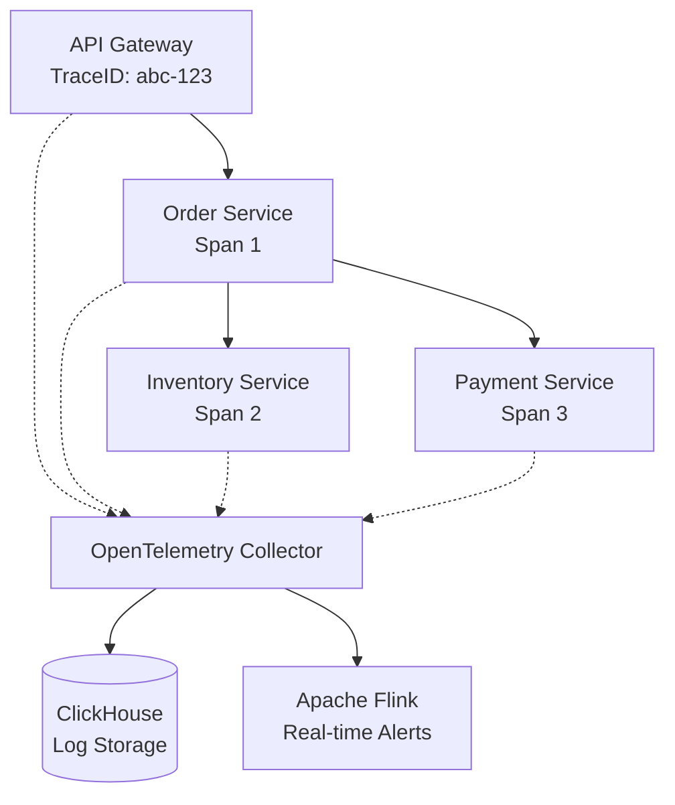

[← Series hub](/series/shopee-architecture/)
[← Prev](/series/shopee-architecture/04-database-scale/)

# Chapter 5: Observability - Finding Bugs in a "Forest" of Microservices

Imagine a user clicks checkout and gets a "Timeout" error. In a Monolithic system, you open the log and immediately see the error line in the `pay()` function. But at Shopee, that request must pass through:
API Gateway -> User Service -> Order Service -> Inventory Service -> Payment Service -> ...

If an error occurs mid-flow, how do you know which service caused the latency? The answer is **Distributed Tracing**.

## 1. Trace ID and Span ID
When a request hits the API Gateway, it is assigned a unique identifier: **Trace ID** (e.g., `abc-123`).
- When the API Gateway calls the Order Service, it passes this `Trace ID` along, along with the start and end time (called a **Span**).
- The Order Service calls the Payment Service, and it continues to pass that `Trace ID`.
- Finally, all this information is packaged and sent to a central monitoring system (like OpenTelemetry). Looking at Trace ID `abc-123`, an engineer will see a tree diagram showing the execution time of each sub-service.

## 2. Why Did Shopee Choose ClickHouse as the Brain?
Shopee generates billions of events (Spans) every second. If saved to MySQL or Elasticsearch, the system would crash or incur massive costs.
They chose **ClickHouse** - a super Columnar Database specialized for Analytics.
- **Extreme Compression:** ClickHouse compresses logs exceptionally well, saving PetaBytes of storage.
- **Hyper-fast Query Speed:** Thanks to its vectorized architecture, a Shopee engineer can write a `SELECT` query to find a Trace ID or analyze errors across a dataset of tens of Billions of log lines, and get results in just... 1-2 seconds.

## 3. Real-time Ecosystem with Apache Flink
Alongside ClickHouse storing logs, Shopee uses **Apache Flink** for Real-time stream processing.
For example: Flink continuously reads the transaction stream. If it detects 1 user spamming checkout 100 times in 1 minute, it immediately sends an alert to the Anti-Fraud system to lock the account before the transaction is confirmed.

**Takeaway:** The bigger the system, the more "blind" you become without Observability. Building a Distributed Tracing infrastructure using ClickHouse / OpenTelemetry right when your Microservices architecture starts getting complex is the cheapest investment to save your system during a Flash Sale night.


