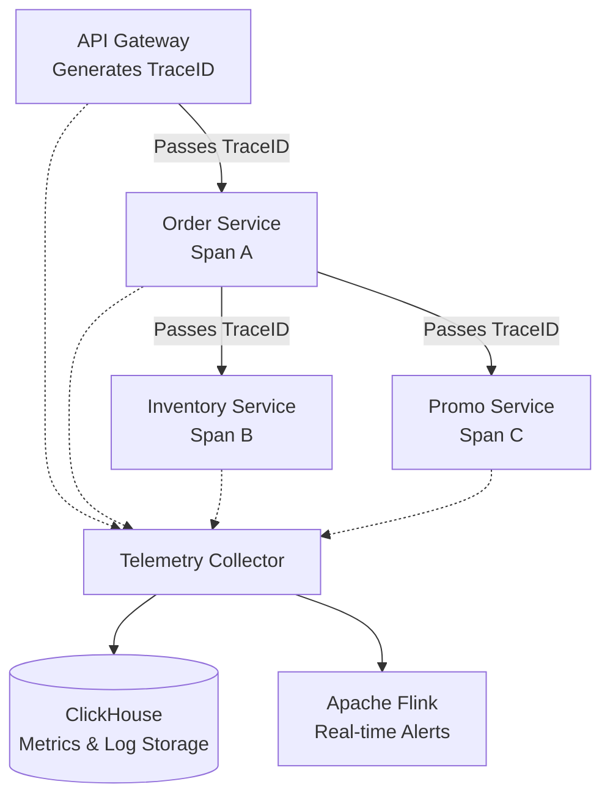

[← Series hub](/series/shopee-architecture/)
[← Prev](/series/shopee-architecture/04-database-scale/)

# Chapter 5: Observability - Finding Bugs in the Microservices Jungle

Imagine you are an on-call engineer during the 11.11 mega-sale. Suddenly, alerts go off: Checkout success rates are plummeting, and users are facing continuous Timeouts. In an old Monolithic system, you would simply open `error.log` and find the exact broken line in the `pay()` function.
However, at Shopee, the lifecycle of a single "Checkout" button press jumps across 30 different services:
`API Gateway -> Order Service -> Promo Service -> Inventory Service -> Payment Service -> Banking Gateway...`

If a bottleneck (latency spike) occurs at service #25, how do you find it among tens of thousands of running Pods? The answer lies in the **3 Pillars of Observability**: Metrics, Logs, and Distributed Tracing.

## 1. Distributed Tracing
The ultimate tool to map the journey of a request is **Distributed Tracing** (Shopee uses platforms based on OpenTelemetry and Jaeger).

- **Trace ID:** The exact millisecond a user request hits the API Gateway, it generates a globally unique identifier (e.g., `TraceID: a8f9x0`).
- **Context Propagation:** The crucial part is that this `TraceID` is injected into the Metadata/Headers of every subsequent gRPC call. When the Order Service calls the Promo Service, it passes the `TraceID` along.
- **Span ID:** Every time the request enters and exits a service, it creates a time block called a **Span**. 
The system aggregates all this data and visualizes it as a Waterfall chart. An engineer can instantly see: "The request took 5ms in Inventory, but got stuck for 5000ms in Payment. The Payment gateway is the root cause!"

## 2. Extreme Log Storage with ClickHouse
With millions of requests per second, the volume of Logs and Spans generated is astronomical (tens of Terabytes daily). Using a traditional Elasticsearch (ELK Stack) cluster would consume massive amounts of RAM and disk space just to maintain Inverted Indexes.

Shopee pivoted to using **ClickHouse**—an incredibly fast, columnar OLAP database.
- **Extreme Compression:** Because it stores data column by column, ClickHouse applies highly efficient compression algorithms like ZSTD. This reduces PetaBytes of log storage overhead by massive factors compared to Elastic.
- **Vectorized Query Execution:** Even when scanning across billions of log lines, an engineer can run `SELECT ... WHERE TraceID = 'a8f9x0'` and receive results in just 1-2 seconds, thanks to ClickHouse's vectorized processing and multi-core parallel architecture.

## 3. Real-Time Ecosystem with Apache Flink
Logs and Traces are not just for humans to read; machines read them too.
Shopee utilizes **Apache Flink**—a Stream Processing framework—to analyze continuous event streams in real-time.
- **Automated Alerts:** Flink monitors the stream of HTTP 500 errors. If it exceeds 100 errors per second within a tumbling time window, it fires an immediate Slack or PagerDuty alert to wake up the engineers.
- **Anti-Fraud System:** If Flink detects a single IP address attempting to create 1,000 shopping carts in 1 minute via the log stream, it triggers a security rule to block that IP instantly, neutralizing the attacker before further transactions occur.

**Developer Takeaway:** The more complex your Microservices become, the blinder you are without proper Observability. Injecting TraceIDs via Headers, centralizing logs in a system like ClickHouse, and visualizing them in Grafana is the best insurance investment you can make for any large-scale project.


