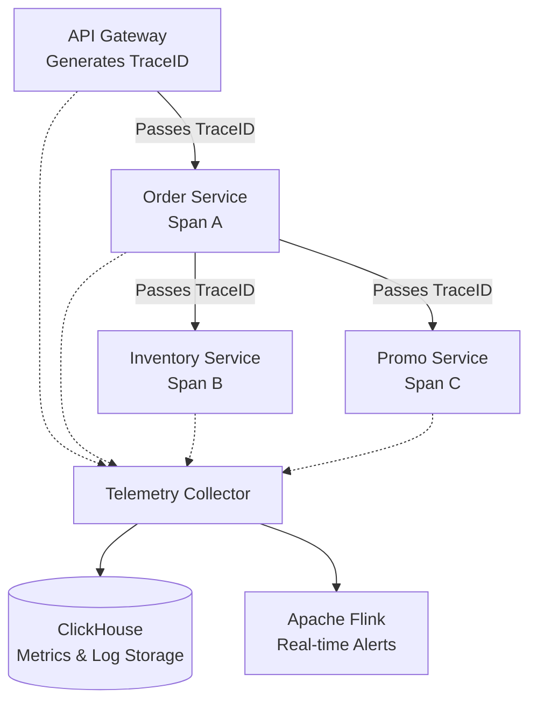

# Chapter 5: Observability - Finding Bugs in the Microservices Jungle

**Debugging a 30-hop microservice failure requires three pillars of observability: Distributed Tracing via OpenTelemetry, columnar log storage via ClickHouse, and real-time stream processing via Apache Flink. Together, they isolate latency bottlenecks across tens of thousands of pods in seconds.**

[← Series hub]() | [← Prev]()

> **Prerequisite:** Before reading this chapter, please ensure you have read the previous article in this series: [Chapter 4: Shopee DB: MySQL Sharding to TiDB NewSQL Migration]().

Imagine you are an on-call engineer during the 11.11 mega-sale. Suddenly, alerts go off: Checkout success rates are plummeting, and users are facing continuous Timeouts. In an old Monolithic system, you would simply open `error.log` and find the exact broken line in the `pay()` function.

However, at Shopee, the lifecycle of a single "Checkout" button press jumps across 30 different services:
`API Gateway -> Order Service -> Promo Service -> Inventory Service -> Payment Service -> Banking Gateway...`

If a bottleneck (latency spike) occurs at service #25, how do you find it among tens of thousands of running Pods? The answer lies in the **3 Pillars of Observability**: Metrics, Logs, and Distributed Tracing.

---

## 1. Distributed Tracing and Context Propagation

**By injecting a globally unique TraceID into the headers of every gRPC call, Shopee reconstructs the entire request journey as a waterfall chart. This instantly isolates which specific service among 30 hops caused a timeout.**

The ultimate tool to map the journey of a request is **Distributed Tracing** (Shopee uses platforms based on OpenTelemetry and Jaeger).
- **Trace ID:** The exact millisecond a user request hits the API Gateway, it generates a globally unique identifier (e.g., `TraceID: a8f9x0`).
- **Context Propagation:** The crucial part is that this `TraceID` is injected into the Metadata/Headers of every subsequent gRPC call. When the Order Service calls the Promo Service, it passes the `TraceID` along.
- **Span ID:** Every time the request enters and exits a service, it creates a time block called a **Span**. 

### W3C Trace Context propagation

To ensure interoperability, Shopee uses the W3C Trace Context standard. The HTTP/gRPC headers contain:
- `traceparent`: Format `00-4bf92f3577b34da6a3ce929d0e0e4736-00f067aa0ba902b7-01`
  - `00`: Version.
  - `4bf92f3577b34da6a3ce929d0e0e4736`: 16-byte Trace ID.
  - `00f067aa0ba902b7`: 8-byte Parent Span ID.
  - `01`: Trace flags (controls sampling).

### Tracing Latency Overhead Optimization

Tracing every single request in an environment with millions of requests per second introduces major CPU, memory allocation, and network bandwidth overhead. To optimize this, Shopee uses a two-pronged sampling strategy:
1. **Head-Based Sampling:** The API Gateway decides whether to trace a request immediately at the edge. If the sampling rate is set to 1%, only 1% of transactions generate tracing data, and the rest are ignored. The downstream services read the `traceparent` flags bit and skip span creation entirely for non-sampled requests.
2. **Tail-Based Sampling:** Collecting 100% of spans in the local memory of intermediate OpenTelemetry Collectors. The collector groups all spans by Trace ID, evaluates the entire trace (e.g., checking if it contains an error code or has an execution latency exceeding 500ms), and only exports the trace to database storage if it meets the critical criteria. This saves 90% of storage costs while capturing all failure traces.

### Baggage API & Asynchronous Message Queue Propagation

To propagate vital business metadata across distributed traces, Shopee leverages the W3C **Baggage API**:
- **Context vs. Baggage:** While the trace context transmits tracing metadata (like trace ID and parent span ID), Baggage allows propagation of key-value pairs (e.g., `user_tier=vip` or `origin_region=sg`) downstream. This enables microservices deep down the stack to make execution decisions (such as allocating premium compute resources) without performing expensive database retrievals.
- **Queue Injection/Extraction:** When passing tracing contexts through asynchronous message queues (e.g., Apache Kafka), standard HTTP headers cannot be used. OpenTelemetry provides specialized text-map inject methods to serialise trace contexts into Kafka Record Headers (specifically placing the traceparent value inside a byte-array header key named `traceparent`). Upon consuming, order workers extract this header to reconstruct the trace context, linking synchronous REST/gRPC actions to asynchronous background operations.

---

## 2. Metrics Collection and Log Storage

### Prometheus Scraping Targets & High Cardinality

Prometheus monitors system health via a Pull model, querying `/metrics` endpoints on each pod. To prevent memory explosion in Prometheus server instances, Shopee enforces strict rules on metrics labels:
- **Prometheus Scraping Target Config:** Prometheus discovers pods dynamically using Kubernetes DNS endpoints and scrapes them at brief intervals (e.g., every 10-15 seconds).
- **Avoiding High Cardinality:** Placing dynamic identifiers like `user_id` or `order_id` in Prometheus label fields is strictly prohibited. Prometheus creates a unique time series for every combination of labels. Dynamic values would create millions of time series, exhausting the RAM of Prometheus servers (high-cardinality label pollution).

### Log Storage with ClickHouse

With millions of requests per second, the volume of Logs and Spans generated is astronomical (tens of Terabytes daily). Using a traditional Elasticsearch (ELK Stack) cluster would consume massive amounts of RAM and disk space just to maintain Inverted Indexes.

Shopee pivoted to using **ClickHouse**—an incredibly fast, columnar OLAP database.
- **Extreme Compression:** Because it stores data column by column, ClickHouse applies highly efficient compression algorithms like ZSTD. This reduces PetaBytes of log storage overhead by massive factors compared to Elastic.
- **Vectorized Query Execution:** Even when scanning across billions of log lines, an engineer can run `SELECT ... WHERE TraceID = 'a8f9x0'` and receive results in just 1-2 seconds, thanks to ClickHouse's vectorized processing and multi-core parallel architecture.

### Go Implementation: Telemetry and Metrics Integration

Here is a Go implementation demonstrating how to inject/extract OpenTelemetry Trace Context and report custom latency metrics to Prometheus:

```go
package telemetry

import (
	"context"
	"time"
	"google.golang.org/grpc/metadata"
	"github.com/prometheus/client_golang/prometheus"
	"github.com/prometheus/client_golang/prometheus/promauto"
	"go.opentelemetry.io/otel/propagation"
)

var (
	// Prometheus metrics vector to trace RPC latency.
	rpcDuration = promauto.NewHistogramVec(
		prometheus.HistogramOpts{
			Name:    "shopee_rpc_duration_seconds",
			Help:    "Execution latency of gRPC microservice calls.",
			Buckets: []float64{0.002, 0.005, 0.01, 0.025, 0.05, 0.1, 0.25, 0.5, 1.0, 2.5},
		},
		[]string{"service_method", "response_code"},
	)
)

// InjectTraceContext injects the current trace context into gRPC metadata for propagation.
func InjectTraceContext(ctx context.Context) context.Context {
	md, ok := metadata.FromOutgoingContext(ctx)
	if !ok {
		md = metadata.New(nil)
	}

	propagator := propagation.TraceContext{}
	carrier := propagation.HeaderCarrier{}
	
	// Inject trace context fields from context.Context into W3C carrier headers
	propagator.Inject(ctx, carrier)

	// Copy injected values from carrier to outgoing metadata
	for _, key := range carrier.Keys() {
		md.Set(key, carrier.Get(key))
	}

	return metadata.NewOutgoingContext(ctx, md)
}

// ExtractTraceContext extracts the trace context from incoming gRPC metadata.
func ExtractTraceContext(ctx context.Context) context.Context {
	md, ok := metadata.FromIncomingContext(ctx)
	if !ok {
		return ctx
	}

	carrier := propagation.HeaderCarrier{}
	for key, values := range md {
		if len(values) > 0 {
			carrier.Set(key, values[0])
		}
	}

	propagator := propagation.TraceContext{}
	return propagator.Extract(ctx, carrier)
}

// RecordRPCLatency logs latency measurements to Prometheus vector buckets.
func RecordRPCLatency(method string, code string, startTime time.Time) {
	elapsed := time.Since(startTime).Seconds()
	rpcDuration.WithLabelValues(method, code).Observe(elapsed)
}
```

### Telemetry Implementation Walkthrough

The Go telemetry wrapper shown above performs critical tasks at the boundaries:
1. **Dynamic Context Propagation:** `InjectTraceContext` retrieves the active OpenTelemetry span context from Go's native `context.Context` and maps W3C-standard headers to outgoing gRPC metadata. This maintains execution graphs across microservices.
2. **Asynchronous Instrumentation:** The `ExtractTraceContext` counterpart intercepts incoming request headers, reconstructing the trace hierarchy. It uses `promauto.NewHistogramVec` to log latency distributions. The histograms utilize predefined bucket margins to capture microsecond-level variances in database queries.

### ClickHouse Schema Design for Trillions of Logs

To ingest and query logs efficiently, Shopee utilizes a columnar table schema optimized for log search:

```sql
CREATE TABLE telemetry.microservice_logs
(
    timestamp DateTime64(6, 'UTC'),
    service_name LowCardinality(String),
    log_level LowCardinality(String),
    trace_id String,
    span_id String,
    message String,
    attributes Map(String, String)
)
ENGINE = ReplacingMergeTree(timestamp)
PARTITION BY toYYYYMMDD(timestamp)
ORDER BY (service_name, log_level, timestamp, trace_id)
SETTINGS index_granularity = 8192;
```

- **LowCardinality Strings:** Columns like `service_name` and `log_level` contain a small set of unique values. Marking them as `LowCardinality` optimizes dictionary-based compression and speeds up filter operations.
- **Ordered Primary Keys:** Querying logs by `service_name` and `log_level` first is the most common debug workflow. Ordering the columns in the primary key array allows ClickHouse's sparse indexes to skip over non-matching data blocks without scanning the entire disk table.

---

## 3. Real-Time Analytics with Apache Flink

**Apache Flink processes event streams in real-time to automate incident response. It can detect an HTTP 500 spike and trigger a PagerDuty alert, or identify a bot creating 1,000 carts and block the IP instantly—before humans intervene.**

Logs and Traces are not just for humans to read; machines read them too.
Shopee utilizes **Apache Flink**—a Stream Processing framework—to analyze continuous event streams in real-time.



- **Automated Alerts:** Flink monitors the stream of HTTP 500 errors. If it exceeds 100 errors per second within a tumbling time window, it fires an immediate Slack or PagerDuty alert to wake up the engineers.
- **Anti-Fraud System:** If Flink detects a single IP address attempting to create 1,000 shopping carts in 1 minute via the log stream, it triggers a security rule to block that IP instantly, neutralizing the attacker before further transactions occur.

### Flink Windowing & Out-Of-Order Event Handling

To accurately process metrics from thousands of microservices, Flink handles event-time processing:
- **Tumbling vs. Sliding Windows:** Tumbling windows (non-overlapping blocks, e.g., every 10 seconds) evaluate absolute thresholds like "errors per block." Sliding windows (overlapping blocks, e.g., 1-minute window moving every 5 seconds) are used for rate calculations (such as calculating spike velocities) to prevent edge anomalies.
- **Watermarks and Latency Handling:** Event streams are naturally out-of-order due to network delays and queue buffering. Flink utilizes *Bounded-Out-Of-Orderness Watermarks* to allow for a configurable delay (e.g., 3 seconds). If an event arrives late but within the watermark, it is correctly incorporated into the window calculation, ensuring accurate alerts.
- **State Persistence:** Flink uses a RocksDB state backend to store window data locally on SSDs. This state is periodically backed up to distributed storage (like HDFS or Ceph) via checkpoints, enabling sub-second fault recovery during infrastructure outages.

---

## Summary and Developer Takeaways

The more complex your Microservices become, the blinder you are without proper Observability. Injecting TraceIDs via Headers, centralizing logs in a system like ClickHouse, and visualizing them in Grafana is the best insurance investment you can make for any large-scale project.

*Troubled by missing traces or excessive observability overhead in your cluster? [Hire me](/hire/) to optimize your OpenTelemetry, ClickHouse, and Prometheus setup.*

🔗 **Next Step:** This concludes the Shopee Architecture series. You can return to the [Series Hub]() for a complete overview, or explore our case study on migrating legacy platforms in the [Composable Commerce Migration Series]().


