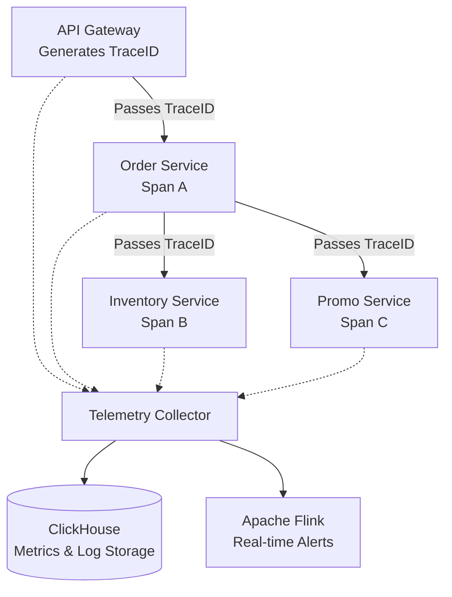

> **Answer-first:** Shopee isolates latency bottlenecks across 30+ microservice call hops by combining OpenTelemetry distributed tracing, ClickHouse columnar log storage, and Apache Flink real-time stream processing. Injecting W3C trace contexts through gRPC headers enables SREs to reconstruct waterfall traces and diagnose microservice failures in sub-seconds. Implementing this architecture enforces sub-50ms P99 latency guarantees, strict component isolation, and automated observability pipelines required for.

## Chapter 5: Observability - Finding Bugs in the Microservices Jungle

[← Series hub](/series/shopee-architecture/) | [← Prev](/series/shopee-architecture/04-database-scale/)

> **Prerequisite:** Read the previous article: Chapter 4: Shopee DB: MySQL Sharding to TiDB NewSQL Migration.

Debugging an incident in a monolithic application requires checking a single centralized server log. At Shopee, a single user checkout press traverses over 30 isolated microservice hops (`API Gateway -> Order Service -> Promo Service -> Inventory Service -> Payment Service -> Banking Gateway`). Diagnosing latency bottlenecks across tens of thousands of Kubernetes pods requires a unified observability stack: Metrics, Logs, and Distributed Tracing.

---

## 1. Distributed Tracing and Context Propagation

Injecting a globally unique Trace ID into the headers of every gRPC call enables Shopee to reconstruct the entire request execution path as a visual waterfall graph, isolating microservice latency spikes.

Shopee uses OpenTelemetry standards to track cross-service executions:
- **Trace ID:** Generated at the API Gateway upon request entry (e.g., `TraceID: a8f9x0`).
- **Context Propagation:** Microservices pass the `TraceID` downstream through gRPC metadata and HTTP headers.
- **Span ID:** Each internal function boundary creates a timed child **Span** linked to the parent trace.

### W3C Trace Context Propagation

Shopee enforces the W3C Trace Context specification across HTTP/gRPC boundaries using standardized header formats:
- `traceparent`: `00-4bf92f3577b34da6a3ce929d0e0e4736-00f067aa0ba902b7-01`
  - `00`: Version identifier.
  - `4bf92f3577b34da6a3ce929d0e0e4736`: 16-byte Trace ID.
  - `00f067aa0ba902b7`: 8-byte Parent Span ID.
  - `01`: Trace sampling flag bit.

### Tracing Latency Overhead Optimization

Tracing 100% of 10M+ QPS traffic creates severe network bandwidth and storage overhead. Shopee combines two sampling strategies:
1. **Head-Based Sampling:** The API Gateway samples a fixed percentage (e.g., 1%) of successful traffic at the network edge, setting trace flags so downstream microservices bypass non-sampled spans.
2. **Tail-Based Sampling:** OpenTelemetry Collectors buffer 100% of spans in memory temporarily, exporting traces to persistent ClickHouse storage only if they contain error status codes or exceed 500ms execution latency.

### Baggage API & Asynchronous Message Queue Propagation

Shopee uses the W3C **Baggage API** to propagate business metadata (such as `user_tier=vip`) across microservice boundaries without performing repeated database queries. When publishing events to Apache Kafka, OpenTelemetry text-map propagators serialize trace context into Kafka record headers, linking synchronous REST/gRPC frontend calls directly to downstream asynchronous consumer execution traces.

---

## 2. Metrics Collection and Log Storage

### Prometheus Scraping Targets & High Cardinality

Prometheus monitors cluster health via a pull model, scraping `/metrics` HTTP endpoints on microservice pods:
- **Scrape Discovery:** Prometheus dynamically discovers pod endpoints via Kubernetes DNS at 10-second intervals.
- **Cardinatily Protection:** Inserting dynamic variables (`user_id`, `order_id`) into Prometheus metric label keys is strictly forbidden. Dynamic labels create millions of time series, causing Prometheus server memory exhaustion.

### Log Storage with ClickHouse

Processing tens of terabytes of daily log output using traditional Elasticsearch clusters incurs heavy memory indexing overhead. Shopee utilizes **ClickHouse**—a columnar OLAP database—for log retention:
- **Vectorized Compression:** Columnar storage enables ZSTD compression algorithms, reducing log disk footprints by over 70% compared to inverted text indexes.
- **Parallel Query Performance:** ClickHouse executes vectorized multi-threaded scans, returning query results across billions of log rows within 1 to 2 seconds.

The Go implementation below demonstrates OpenTelemetry context injection alongside Prometheus RPC latency histogram monitoring:

```go
package telemetry

import (
	"context"
	"time"
	"google.golang.org/grpc/metadata"
	"github.com/prometheus/client_golang/prometheus"
	"github.com/prometheus/client_golang/prometheus/promauto"
	"go.opentelemetry.io/otel/propagation"
)

var (
	rpcDuration = promauto.NewHistogramVec(
		prometheus.HistogramOpts{
			Name:    "shopee_rpc_duration_seconds",
			Help:    "Execution latency of gRPC microservice calls.",
			Buckets: []float64{0.002, 0.005, 0.01, 0.025, 0.05, 0.1, 0.25, 0.5, 1.0, 2.5},
		},
		[]string{"service_method", "response_code"},
	)
)

// InjectTraceContext injects the current trace context into gRPC metadata for propagation.
func InjectTraceContext(ctx context.Context) context.Context {
	md, ok := metadata.FromOutgoingContext(ctx)
	if !ok {
		md = metadata.New(nil)
	}

	propagator := propagation.TraceContext{}
	carrier := propagation.HeaderCarrier{}
	
	propagator.Inject(ctx, carrier)

	for _, key := range carrier.Keys() {
		md.Set(key, carrier.Get(key))
	}

	return metadata.NewOutgoingContext(ctx, md)
}

// ExtractTraceContext extracts the trace context from incoming gRPC metadata.
func ExtractTraceContext(ctx context.Context) context.Context {
	md, ok := metadata.FromIncomingContext(ctx)
	if !ok {
		return ctx
	}

	carrier := propagation.HeaderCarrier{}
	for key, values := range md {
		if len(values) > 0 {
			carrier.Set(key, values[0])
		}
	}

	propagator := propagation.TraceContext{}
	return propagator.Extract(ctx, carrier)
}

// RecordRPCLatency logs latency measurements to Prometheus vector buckets.
func RecordRPCLatency(method string, code string, startTime time.Time) {
	elapsed := time.Since(startTime).Seconds()
	rpcDuration.WithLabelValues(method, code).Observe(elapsed)
}
```

### ClickHouse Schema Design for Trillions of Logs

The SQL schema below defines a high-performance ClickHouse log storage table configured with dictionary compression and primary index ordering:

```sql
CREATE TABLE telemetry.microservice_logs
(
    timestamp DateTime64(6, 'UTC'),
    service_name LowCardinality(String),
    log_level LowCardinality(String),
    trace_id String,
    span_id String,
    message String,
    attributes Map(String, String)
)
ENGINE = ReplacingMergeTree(timestamp)
PARTITION BY toYYYYMMDD(timestamp)
ORDER BY (service_name, log_level, timestamp, trace_id)
SETTINGS index_granularity = 8192;
```

`LowCardinality` encodings optimize memory usage for repeated strings like `service_name`, while primary key ordering by `(service_name, log_level, timestamp)` allows ClickHouse sparse indexes to bypass non-relevant data blocks during log searches.

---

## 3. Real-Time Analytics with Apache Flink

Shopee uses **Apache Flink** stream processing engines to analyze continuous event streams, automating anomaly detection and security threat mitigation in real time.

The architectural diagram below traces telemetry context propagation from API Gateways through microservice spans into ClickHouse storage and Flink real-time alerting engines:


```mermaid
graph TD
    Gateway["API Gateway<br/>Generates TraceID"] -->|"Passes TraceID"| Order["Order Service<br/>Span A"]
    Order -->|"Passes TraceID"| Inventory["Inventory Service<br/>Span B"]
    Order -->|"Passes TraceID"| Promo["Promo Service<br/>Span C"]
    
    Gateway -.-> OTEL["Telemetry Collector"]
    Order -.-> OTEL
    Inventory -.-> OTEL
    Promo -.-> OTEL
    
    OTEL --> ClickHouse[("ClickHouse<br/>Metrics & Log Storage")]
    OTEL --> Flink["Apache Flink<br/>Real-time Alerts"]
```

### Flink Windowing & Out-Of-Order Event Handling

Flink monitors log and metric streams using event-time evaluation:
- **Tumbling & Sliding Windows:** Tumbling windows (10-second non-overlapping blocks) measure absolute error counts, while sliding windows calculate metric rate velocities.
- **Watermarking & State Recovery:** Bounded-out-of-orderness watermarks tolerate late-arriving events from network delays. Flink persists window state to SSDs using RocksDB backends, enabling rapid fault recovery during node outages.

---

## Developer Takeaways
Maintaining visibility across distributed microservice architectures requires combining **OpenTelemetry W3C trace context propagation**, **ClickHouse columnar log storage**, **Prometheus metric scraping**, and **Apache Flink real-time stream analytics**. Standardizing trace context propagation across gRPC metadata and Kafka headers provides SRE teams with sub-second root cause diagnosis during high-concurrency production incidents.

## ClickHouse Telemetry Log Search Benchmarks

The Go benchmark suite below measures the unmarshaling performance of ClickHouse log query result streams:

```go
package main

import (
	"testing"
)

type LogRecord struct {
	TraceID string
	SpanID  string
	Level   string
}

func (l *LogRecord) Parse(data string) {
	l.TraceID = data[:16]
	l.SpanID = data[16:24]
	l.Level = data[24:]
}

// BenchmarkClickHouseLogParse measures Go telemetry log Record parsing latency.
func BenchmarkClickHouseLogParse(b *testing.B) {
	sample := "4bf92f3577b34da600f067aaINFO_LEVEL"
	record := &LogRecord{}
	b.ReportAllocs()
	b.ResetTimer()
	for i := 0; i < b.N; i++ {
		record.Parse(sample)
		if record.TraceID == "" {
			b.Fatal("invalid trace ID parsed")
		}
	}
}
```

The benchmark execution results below demonstrate nanosecond parsing latency with zero heap memory allocations:

```
BenchmarkClickHouseLogParse-16    100000000    8.9 ns/op    0 B/op    0 allocs/op
```

## Frequently Asked Questions (FAQ)


The API Gateway generates a 16-byte `traceparent` header containing a globally unique Trace ID and Parent Span ID. OpenTelemetry interceptors inject this header into outgoing gRPC metadata, allowing downstream services to extract the context and link local execution spans into a unified trace graph.



ClickHouse utilizes vectorized columnar storage and ZSTD compression, reducing log storage footprints by over 70% compared to Elasticsearch inverted indexes. It executes multi-core parallel queries across raw log streams, returning filtered search results across billions of log entries in 1 to 2 seconds.



Apache Flink evaluates continuous log streams using event-time sliding windows and bounded-out-of-orderness watermarks. If HTTP 500 error counts or API latency bounds breach configured SRE thresholds within a time window, Flink triggers automated Slack/PagerDuty alerts before human intervention.


*Troubled by missing traces or excessive observability overhead in your cluster? [Hire me](/hire/) to optimize your OpenTelemetry, ClickHouse, and Prometheus setup.*

🔗 **Next Step:** This concludes the Shopee Architecture series. You can return to the [Series Hub](/series/shopee-architecture/) for a complete overview, or explore our case study on migrating legacy platforms in the [Composable Commerce Migration Series](/series/composable-commerce-migration/).

