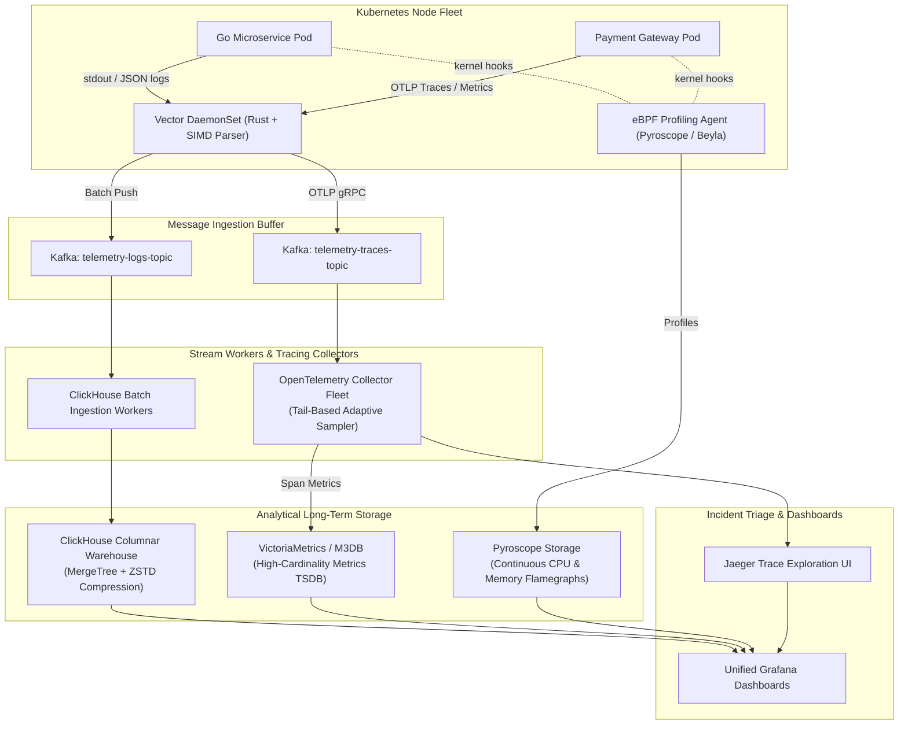
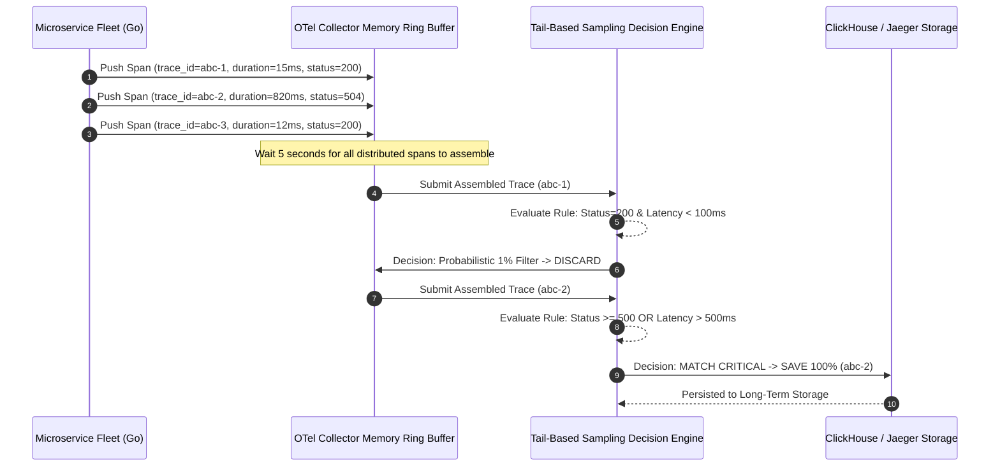

> **Multi-Language Edition:** This chapter is also available in Vietnamese at [Bài 5: Hệ Thống Giám Sát Toàn Diện — Vector, ClickHouse và Truy Vết Phân Tán Ở Quy Mô Siêu Lớn (learn.tanhdev.com)](https://learn.tanhdev.com/series/shopee-architecture/05-observability/).

[Previous Chapter: Chapter 4 — Database Scalability: From MySQL to TiDB](/series/shopee-architecture/04-database-scale/) | [Series Hub](/series/shopee-architecture/)

---

> **Answer-First:** Operating thousands of microservices generating billions of daily transactions makes naive logging (Elasticsearch/ELK) financially prohibitive and computationally unsustainable. Shopee adopted a next-generation observability stack: **Rust-based Vector edge daemons** parsing telemetry with SIMD acceleration, **Apache Kafka** buffering ingestion bursts, **ClickHouse columnar storage** compressing petabyte-scale logs by 12x with sparse indexing, **OpenTelemetry (OTel)** collectors executing tail-based adaptive sampling (retaining 100% of errors and p99 latency anomalies while discarding 99% of normal traces), and **eBPF continuous profiling** diagnosing production CPU/memory bottlenecks with sub-1% runtime overhead.

---

## 1. The Observability Trilemma at Hyper-Scale

At Shopee's scale, observing distributed microservices during mega-campaigns introduces three conflicting pressures:

```
                  Cost & Storage Budget
                         ▲
                        / \
                       /   \
                      /     \
    Data Completeness ◄───────► Query & Ingestion Latency
    (100% Traces/Logs)        (Sub-Second Incident Response)
```

- **Storage Explosion:** Over 500 TB of raw JSON logs generated daily quickly exhaust traditional inverted-index search clusters like Elasticsearch, driving astronomical SSD storage costs.
- **Agent Resource Contention:** Heavy logging sidecars (like Python or JVM-based log collectors) consume up to 15% of pod CPU and trigger memory out-of-memory (OOM) evictions during peak traffic.
- **Sampling Dilemma:** Head-based sampling (deciding whether to keep a trace at the initial HTTP ingress) blindfolds engineering teams from capturing elusive p99 tail latencies and distributed deadlocks that only surface deep within the call graph.

---

## 2. End-to-End Telemetry Architecture

Shopee's unified observability platform decouples data collection, ingestion buffering, storage indexing, and visualization across dedicated high-throughput layers:


```mermaid
flowchart TD
    subgraph ComputeNodes["Kubernetes Node Fleet"]
        APP1["Go Microservice Pod"]
        APP2["Payment Gateway Pod"]
        VEC["Vector DaemonSet (Rust + SIMD Parser)"]
        EBPF["eBPF Profiling Agent (Pyroscope / Beyla)"]

        APP1 -->|stdout / JSON logs| VEC
        APP2 -->|OTLP Traces / Metrics| VEC
        APP1 -. kernel hooks .- EBPF
        APP2 -. kernel hooks .- EBPF
    end

    subgraph StreamingBuffer["Message Ingestion Buffer"]
        KAFKA_LOGS["Kafka: telemetry-logs-topic"]
        KAFKA_TRACES["Kafka: telemetry-traces-topic"]
    end

    subgraph ProcessingLayer["Stream Workers & Tracing Collectors"]
        OTEL_COL["OpenTelemetry Collector Fleet<br/>(Tail-Based Adaptive Sampler)"]
        CLICK_SINK["ClickHouse Batch Ingestion Workers"]
    end

    subgraph StorageLayer["Analytical Long-Term Storage"]
        CH["ClickHouse Columnar Warehouse<br/>(MergeTree + ZSTD Compression)"]
        VM["VictoriaMetrics / M3DB<br/>(High-Cardinality Metrics TSDB)"]
        PYRO["Pyroscope Storage<br/>(Continuous CPU & Memory Flamegraphs)"]
    end

    subgraph VisualizationLayer["Incident Triage & Dashboards"]
        GRAFANA["Unified Grafana Dashboards"]
        JAEGER["Jaeger Trace Exploration UI"]
    end

    VEC -->|Batch Push| KAFKA_LOGS
    VEC -->|OTLP gRPC| KAFKA_TRACES
    EBPF -->|Profiles| PYRO

    KAFKA_LOGS --> CLICK_SINK --> CH
    KAFKA_TRACES --> OTEL_COL --> JAEGER
    OTEL_COL -->|Span Metrics| VM

    CH --> GRAFANA
    VM --> GRAFANA
    PYRO --> GRAFANA
    JAEGER --> GRAFANA
```

### Key Architectural Decisions

1. **Rust-Powered Vector Edge Agents:** Installed as a Kubernetes `DaemonSet`, Vector reads container logs directly from node `/var/log/pods/`. By leveraging Rust SIMD vectorization, Vector parses JSON lines at over **400 MB/sec per CPU core**, keeping CPU overhead below 0.5% per host.
2. **Kafka Shock Absorber:** Decouples ingestion spikes from database sinks. If ClickHouse undergoes a rolling cluster restart or compaction spike, Kafka retains hours of telemetry without dropping a single record.
3. **ClickHouse Columnar Warehouse:** Replaces Elasticsearch for log analytics. By storing structured fields (e.g., `service`, `level`, `trace_id`, `http_status`) in dense columnar format with ZSTD-12 compression, ClickHouse reduces storage footprints by over **90%** while executing multi-billion-row queries in hundreds of milliseconds.

---

## 3. High-Performance ClickHouse Log Storage Engine

To achieve real-time log querying across billions of rows, the log storage schema uses a specialized `MergeTree` engine partitioned by day with primary keys ordered for fast filtering:

```sql
-- Production ClickHouse Schema for Distributed Service Logs
CREATE TABLE service_logs (
    timestamp DateTime64(3, 'UTC') CODEC(DoubleDelta, ZSTD(3)),
    service LowCardinality(String),
    environment LowCardinality(String),
    level LowCardinality(String),
    trace_id String CODEC(ZSTD(6)),
    span_id String CODEC(ZSTD(6)),
    http_method LowCardinality(String),
    http_status UInt16,
    duration_ms Float32 CODEC(Gorilla, ZSTD(3)),
    message String CODEC(ZSTD(6)),
    attributes Map(String, String) CODEC(ZSTD(6))
)
ENGINE = MergeTree()
PARTITION BY toYYYYMMDD(timestamp)
ORDER BY (service, level, http_status, timestamp)
SETTINGS index_granularity = 8192, ttl_only_drop_parts = 1;
```

### Schema Optimization Highlights:
- **`LowCardinality(String)`**: Encodes repetitive strings (like `service`, `environment`, `level`) as integer dictionaries, transforming string lookups into blazing-fast integer comparisons.
- **Compound Primary Index `(service, level, http_status, timestamp)`**: Matches the natural triage workflow of engineers investigating production errors (`WHERE service = 'order-service' AND level = 'ERROR'`).
- **`DoubleDelta` & `Gorilla` Codecs**: Specifically compress timestamps and floating-point execution latencies down to fractions of a byte per row.

---

## 4. Adaptive Tail-Based Distributed Tracing

In standard head-based sampling, a trace decision is made at the root gateway before the request finishes. If an internal database query takes 5 seconds or throws a 500 error deep inside the downstream inventory service, a head-sampled system configured at 1% sampling will drop 99% of those critical failure traces.

Shopee deploys **OpenTelemetry Collector clusters with Tail-Based Sampling**:


```mermaid
sequenceDiagram
    autonumber
    participant App as Microservice Fleet (Go)
    participant Buffer as OTel Collector Memory Ring Buffer
    participant Decision as Tail-Based Sampling Decision Engine
    participant TraceSink as ClickHouse / Jaeger Storage

    App->>Buffer: Push Span (trace_id=abc-1, duration=15ms, status=200)
    App->>Buffer: Push Span (trace_id=abc-2, duration=820ms, status=504)
    App->>Buffer: Push Span (trace_id=abc-3, duration=12ms, status=200)

    Note over Buffer: Wait 5 seconds for all distributed spans to assemble

    Buffer->>Decision: Submit Assembled Trace (abc-1)
    Decision-->>Decision: Evaluate Rule: Status=200 & Latency < 100ms
    Decision->>Buffer: Decision: Probabilistic 1% Filter -> DISCARD

    Buffer->>Decision: Submit Assembled Trace (abc-2)
    Decision-->>Decision: Evaluate Rule: Status >= 500 OR Latency > 500ms
    Decision->>TraceSink: Decision: MATCH CRITICAL -> SAVE 100% (abc-2)
    TraceSink-->>Decision: Persisted to Long-Term Storage
```

### Tail-Based Sampling Rule Definition:

```yaml
# OpenTelemetry Collector Tail-Based Sampling Processor
processors:
  tail_sampling:
    decision_wait: 5s # Wait for late-arriving asynchronous spans
    num_traces: 250000 # Memory capacity for in-flight trace tracking
    expected_new_traces_per_sec: 10000
    policies:
      # Rule 1: Retain 100% of all HTTP 5xx and internal gRPC errors
      - name: capture-errors
        type: status_code
        status_code: { status_codes: [ ERROR ] }

      # Rule 2: Retain 100% of slow requests exceeding P99 threshold (> 500ms)
      - name: capture-latency-anomalies
        type: latency
        latency: { threshold_ms: 500 }

      # Rule 3: Retain 100% of high-value VIP / checkout funnel operations
      - name: capture-checkout-funnel
        type: string_attribute
        string_attribute:
          key: http.target
          values: [ "/api/v1/checkout", "/api/v1/payment" ]

      # Rule 4: Sample remaining normal baseline 200 OK traffic at 1%
      - name: probabilistic-sample-normal
        type: probabilistic
        probabilistic: { sampling_percentage: 1.0 }
```

---

## 5. Continuous Profiling with eBPF in Production Go Services

Traditional Go pprof profiling introduces CPU spikes and cannot be run continuously across thousands of production nodes. Shopee uses **eBPF continuous profiling** (Grafana Pyroscope / Beyla) to sample kernel stack traces and Go runtime goroutine scheduler states with sub-1% overhead.

```go
// Package profiling initializes continuous flamegraph profiling with zero code intrusion.
package profiling

import (
	"log"
	"os"

	"github.com/grafana/pyroscope-go"
)

// InitContinuousProfiling attaches non-blocking continuous profiling to the Go runtime.
func InitContinuousProfiling(serviceName string) (*pyroscope.Profiler, error) {
	serverAddress := os.Getenv("PYROSCOPE_SERVER_ADDRESS")
	if serverAddress == "" {
		serverAddress = "http://pyroscope.telemetry.svc.cluster.local:4040"
	}

	profiler, err := pyroscope.Start(pyroscope.Config{
		ApplicationName: serviceName,
		ServerAddress:   serverAddress,
		Logger:          pyroscope.StandardLogger,
		Tags: map[string]string{
			"env":     os.Getenv("APP_ENV"),
			"region":  os.Getenv("K8S_REGION"),
			"node_ip": os.Getenv("HOST_IP"),
		},
		ProfileTypes: []pyroscope.ProfileType{
			pyroscope.ProfileCPU,              // CPU hotspot flamegraph
			pyroscope.ProfileAllocObjects,     // Heap allocation counts (GC pressure)
			pyroscope.ProfileAllocSpace,       // Total allocated memory bytes
			pyroscope.ProfileInuseObjects,     // Active heap object count
			pyroscope.ProfileGoroutines,       // Goroutine leak detection
			pyroscope.ProfileBlockCount,       // Channel & mutex contention frequency
			pyroscope.ProfileBlockDuration,    // Lock waiting time
		},
	})
	if err != nil {
		return nil, err
	}

	log.Printf("Continuous profiling initialized for service: %s", serviceName)
	return profiler, nil
}
```

By correlating continuous flamegraphs directly with distributed trace spans, engineers can click on a slow 500ms trace span and immediately see the exact line of code where a Go mutex lock contention occurred.

---

## Frequently Asked Questions


ClickHouse achieves exceptional query performance through four architectural advantages:
1. <strong>Columnar Data Layout:</strong> Only the columns referenced in the SQL `SELECT` and `WHERE` clauses are read from disk, reducing I/O volume by over 95% compared to row-oriented stores.
2. <strong>Vectorized Execution:</strong> Leverages CPU SIMD (Single Instruction, Multiple Data) instructions to scan and filter tens of millions of rows per core every second.
3. <strong>Sparse Indexing with Granularity 8192:</strong> Indexes one mark per 8,192 rows, allowing the query engine to skip entire physical data blocks rapidly with minimal index RAM footprint.
4. <strong>Partition Pruning:</strong> Partitioning by date (`toYYYYMMDD`) ensures queries specifying a time range immediately discard data parts outside the window without disk reads.



Tail-based sampling requires buffering spans in memory until a trace completes. During flash sale surges, the collector manages memory safety through:
- <strong>Bounded Ring Buffer (`num_traces` limit):</strong> Enforces a strict ceiling on active in-memory traces (e.g., 250,000 traces).
- <strong>Memory Ballast & Ballast Checkers:</strong> Detects heap allocation thresholds; if memory crosses 80% of pod limits, the sampler switches dynamically to early-drop or head-based shedding for low-priority endpoints.
- <strong>Cluster Routing with Trace-ID Hashing:</strong> An upstream Envoy or OTel load balancer hashes spans by `trace_id` so that all spans belonging to the same trace land on the exact same collector instance, eliminating cross-node synchronization overhead.



eBPF continuous profiling operates fundamentally differently from manual pprof:
- <strong>Kernel-Level Non-Intrusive Sampling:</strong> eBPF hooks directly into Linux kernel timer interrupts (`perf_events`), reading call stacks from memory without pausing Go garbage collection (GC) or stopping the world.
- <strong>System-Wide Correlation:</strong> Unlike pprof (which only observes the Go user-space runtime), eBPF profiles capture kernel syscalls, page faults, network TCP socket stalls, and CGo code execution.
- <strong>Always-On Historical Differential Analysis:</strong> Profiling runs 24/7 in production with <1% overhead, allowing developers to generate differential flamegraphs ("What changed in CPU consumption between 11:59 PM and 12:01 AM during 11.11?").


---

[Previous Chapter: Chapter 4 — Database Scalability: From MySQL to TiDB](/series/shopee-architecture/04-database-scale/) | [Series Hub](/series/shopee-architecture/)
