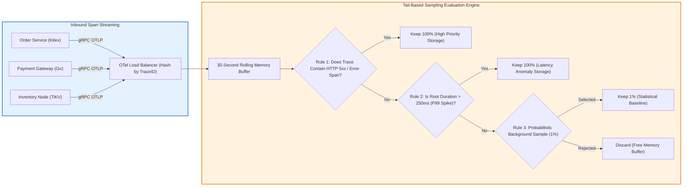
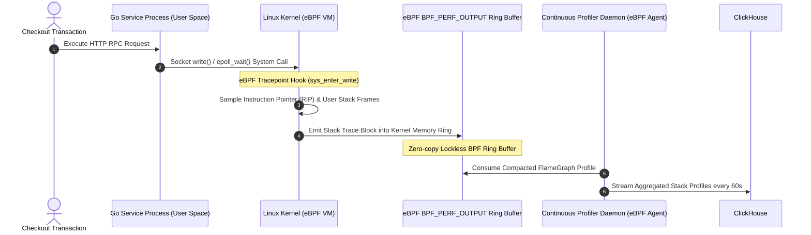

[Previous Chapter: Chapter 4 — Database Scalability: From MySQL to TiDB](/series/shopee-architecture/04-database-scale/) | [Series Hub](/series/shopee-architecture/)

---

> **Answer-first:** Shopee conquered telemetry scale challenges by replacing bloated Elasticsearch clusters with a high-throughput observability pipeline powered by Vector SIMD daemons, Apache Kafka, and ClickHouse columnar storage. Incorporating OpenTelemetry tail-based sampling and non-invasive eBPF continuous profiling slashes storage overhead by twelve times while retaining all system errors and anomalies with sub-one-percent runtime CPU impact.

---

> **Prerequisite:** Solid understanding of observability telemetry models (metrics, logs, traces), columnar database indexing (ClickHouse MergeTree), OpenTelemetry trace context propagation (W3C), and Linux kernel profiling with eBPF.

---

## 1. The Observability Trilemma at Hyper-Scale

Operating thousands of distributed microservices processing hundreds of millions of daily orders across Southeast Asia presents an immense telemetry challenge. During peak 11.11 shopping campaigns, Shopee's platform generates over **100 billion daily log records**, 500 million distributed trace spans, and 80 million metric time-series streams.

At this volume, conventional observability architectures built on the classic ELK stack (Elasticsearch, Logstash, Kibana) suffer total financial and computational collapse:

```
               Cost & Storage Budget (Petabyte SSD Bloat)
                                ▲
                               / \
                              /   \
                             /     \
   Data Completeness ◄───────► Query & Ingestion Latency
   (100% Traces & Logs)        (Sub-Second Incident Response)
```

### The Three Structural Failure Modes of Legacy ELK Stacks

1. **Inverted Index Storage Explosion:** Elasticsearch builds Lucene inverted indexes for every text token across all JSON fields. During major promotional campaigns, this indexing overhead inflates disk consumption to 1.5x the raw data volume. Storing 500 Terabytes of uncompressed daily logs required thousands of high-performance NVMe SSDs, incurring millions of dollars in annual cloud infrastructure expenses. When disk fill ratios crossed 85%, Lucene merge threads starved read queries, causing latency alerts to fail precisely when operators needed diagnostic visibility most.
2. **JVM Heap Pressure and Garbage Collection Freezes:** Logstash and Elasticsearch rely heavily on Java Virtual Machine (JVM) memory pools. Under ingestion surges exceeding 2 million events per second, Java garbage collection cycles frequently triggered 15-to-30-second Stop-The-World (STW) pauses. These pauses caused cluster nodes to drop out of the Elasticsearch Zen discovery quorum, triggering destructive shard reallocation storms during live campaigns. Cluster master nodes spent 100% of their CPU cycles re-electing leaders while unread message queues backed up into upstream Kafka topics.
3. **The Head-Based Sampling Fallacy:** To curb tracing costs, legacy APM agents employ head-based sampling—making the decision to retain or discard a trace at the root API gateway before the request executes. In an e-commerce platform where 99.9% of transactions succeed within 15 milliseconds, a 1% head-based sampling rate captures thousands of mundane successful checkouts while missing 99% of rare p99.9 database timeouts, distributed lock stalls, and payment gateway network partitions.

### High-Cardinality Dimensional Metrics and the TSDB Collapse

Beyond unstructured logging, storing time-series metrics under hyper-scale e-commerce conditions triggers severe architectural strain on traditional Time-Series Databases (TSDBs) like Prometheus or VictoriaMetrics:
1. **The High-Cardinality Explosion:** When application metrics incorporate fine-grained dimensional labels such as `user_id`, `order_id`, or `device_fingerprint`, the total number of unique time-series explodes into hundreds of millions. Standard TSDBs maintain in-memory time-series index heads; high-cardinality label permutations cause memory consumption to spiral exponentially, leading to kernel OOM kills.
2. **Gorilla Codec Floating-Point Compression:** ClickHouse solves high-cardinality metric storage by storing raw time-series points in columnar tables compressed with the Gorilla floating-point XOR encoding scheme. Consecutive metric measurements (such as CPU percentage or RPC latency) typically exhibit small deltas; XORing consecutive floating-point values produces leading and trailing zeroes that compress down to an average of 1.37 bytes per data point.
3. **Rollup AggregatingMergeTree Tables:** By configuring ClickHouse `AggregatingMergeTree` materialized views, raw second-by-second metrics are automatically downsampled in the background into 1-minute, 5-minute, and 1-hour statistical summaries (computing min, max, average, p95, and p99 via stateful quantile functions). SRE dashboards query pre-aggregated views, loading 30-day historical trends across 50,000 pods in less than 300 milliseconds.

To overcome these physical limitations, Shopee engineered a specialized, multi-tiered observability platform combining Rust-based edge log forwarding, Apache Kafka buffering, ClickHouse columnar storage, OpenTelemetry tail-based sampling, and continuous eBPF kernel profiling.

---

## 2. End-to-End High-Throughput Telemetry Pipeline

Shopee's unified observability platform decouples data collection, ingestion buffering, columnar indexing, and analytical visualization across dedicated high-throughput layers:

```mermaid
flowchart TD
    subgraph ComputeNodes ["Kubernetes Bare-Metal Nodes (5,000+ Hosts)"]
        AppPod["Microservice Pod (Go Kitex / stdout)"] --> NodeLog["Container Log Socket (/var/log/pods)"]
        NodeLog --> VectorAgent["Vector DaemonSet (Rust / SIMD JSON Parser)"]
        eBPFAgent["Beyla / Coroot Agent (eBPF Kernel Probes)"]
    end

    subgraph StreamingBuffer ["Shock-Absorbing Kafka Telemetry Cluster"]
        VectorAgent -->|Batch Push Snappy Compressed| KafkaLogs["Topic: 'telemetry.logs.raw' (128 Partitions)"]
        eBPFAgent -->|Async Metrics Stream| KafkaMetrics["Topic: 'telemetry.metrics.raw'"]
        OTelApp["OTel Go SDK (W3C Trace Context)"] -->|gRPC OTLP (Sample Window: 30s)| OTelCol["OTel Collector Fleet (Tail-Based Sampler)"]
        OTelCol -->|Retain 100% Errors & P99| KafkaTraces["Topic: 'telemetry.traces.sampled'"]
    end

    subgraph ColumnarStorage ["Distributed Columnar Storage (ClickHouse Cluster)"]
        KafkaLogs --> GoIngest["Go Batch Ingestion Engine (clickhouse-go/v2)"]
        KafkaTraces --> GoIngest
        GoIngest -->|Bulk Blocks: 100k Rows / 2s| CH1["ClickHouse Shard 1 (MergeTree / ZSTD)"]
        GoIngest -->|Bulk Blocks: 100k Rows / 2s| CH2["ClickHouse Shard 2 (MergeTree / ZSTD)"]
        GoIngest -->|Bulk Blocks: 100k Rows / 2s| CHN["ClickHouse Shard N (ReplicatedMergeTree)"]
    end

    subgraph Visualization ["Observability UI & Alerting"]
        CH1 & CH2 & CHN --> Grafana["Grafana Dashboards (Sub-Second P99 Queries)"]
        CH1 & CH2 & CHN --> SREAlert["Alertmanager / Prometheus Anomaly Detection"]
    end

    classDef node fill:#e3f2fd,stroke:#1565c0,stroke-width:2px;
    classDef kafka fill:#fff3e0,stroke:#ef6c00,stroke-width:2px;
    classDef ch fill:#e8f5e9,stroke:#2e7d32,stroke-width:2px;
    classDef ui fill:#f3e5f5,stroke:#7b1fa2,stroke-width:2px;
    class ComputeNodes node;
    class StreamingBuffer kafka;
    class ColumnarStorage ch;
    class Visualization ui;
```

### The Architectural Components

1. **Vector DaemonSets (Log Scraping):** Implemented in Rust, Datadog Vector runs as a Kubernetes DaemonSet on every physical server. Vector consumes raw JSON container logs directly from the node's `/var/log/pods` directory, avoiding application network overhead. Utilizing SIMD (Single Instruction, Multiple Data) vectorized JSON parsing (`simd-json`), a single Vector agent processes over 150,000 log events per second while consuming less than 1.5% of host CPU and 45MB of memory.
2. **Vector Remap Language (VRL) Transformations:** Rather than relying on heavyweight Regular Expressions or runtime Lua scripts, Vector compiles log parsing rules into optimized native machine code using the **Vector Remap Language (VRL)**. During 11.11 ingestion, VRL filters extract high-cardinality fields (`trace_id`, `user_id`, `sku_id`) directly into structured top-level attributes, mask sensitive Payment Card Industry (PCI-DSS) credentials such as credit card numbers in less than 50 nanoseconds per event, and drop empty debug messages before network transmission.
3. **Adaptive Backpressure and Memory Ring Buffers:** When downstream Kafka broker clusters experience transient network partitioning or partition rebalancing, Vector agents automatically buffer unsent telemetry records into disk-backed circular memory buffers (`disk_buffer`). The memory buffer gracefully absorbs up to 10 Gigabytes of uncommitted logs per node without dropping events or crashing the host operating system. Once Kafka connectivity is re-established, Vector drains the disk buffer at maximum sequential NVMe speeds.
4. **OpenTelemetry Collector Fleet (Tail-Based Sampling):** Application services instrumented with the OpenTelemetry Go SDK emit distributed trace spans to an internal OTel Collector cluster over gRPC. Rather than sampling at the root, the collector buffers all spans belonging to a trace in a rolling 30-second memory ring buffer, evaluating the entire trace lifecycle before deciding whether to persist or drop it.
5. **ClickHouse Columnar Storage:** ClickHouse replaces Elasticsearch as the central analytical log and trace warehouse. By organizing data into column-oriented binary files compressed with ZSTD and LZ4 codecs, ClickHouse achieves a **12:1 compression ratio** over raw JSON text. Vectorized query execution engines scan billions of rows per second across multi-core processors, returning complex aggregate filter queries in less than 500 milliseconds.

---

## 3. ClickHouse Table Schema: High-Throughput Log & Trace Architecture

Below is the production DDL schema deployed in Shopee's ClickHouse clusters. It utilizes the `ReplicatedMergeTree` engine, custom partition keys by day, primary key ordering optimized for sparse indexing, and specialized compression codecs.

```sql
-- Production DDL for High-Throughput Distributed Telemetry Logging in ClickHouse
CREATE DATABASE IF NOT EXISTS shopee_telemetry ON CLUSTER ch_cluster;

CREATE TABLE shopee_telemetry.application_logs_local ON CLUSTER ch_cluster
(
    timestamp        DateTime64(6, 'UTC') CODEC(DoubleDelta, ZSTD(1)),
    service_name     LowCardinality(String) CODEC(ZSTD(1)),
    environment      LowCardinality(String) CODEC(ZSTD(1)),
    pod_name         LowCardinality(String) CODEC(ZSTD(1)),
    log_level        LowCardinality(String) CODEC(ZSTD(1)),
    trace_id         String CODEC(ZSTD(3)),
    span_id          String CODEC(ZSTD(3)),
    user_id          Int64 CODEC(DoubleDelta, ZSTD(1)),
    sku_id           Int64 CODEC(DoubleDelta, ZSTD(1)),
    duration_ms      Float32 CODEC(Gorilla, ZSTD(1)),
    message          String CODEC(ZSTD(6)),
    attributes       Map(String, String) CODEC(ZSTD(3)),
    INDEX idx_trace_id trace_id TYPE bloom_filter(0.01) GRANULARITY 1,
    INDEX idx_user_id  user_id  TYPE minmax GRANULARITY 4
)
ENGINE = ReplicatedMergeTree('/clickhouse/tables/{shard}/application_logs', '{replica}')
PARTITION BY toYYYYMMDD(timestamp)
ORDER BY (service_name, log_level, toUnixTimestamp(timestamp), user_id)
TTL toDateTime(timestamp) + INTERVAL 30 DAY DELETE
SETTINGS
    index_granularity = 8192,
    min_bytes_for_wide_part = 10485760,
    parts_to_throw_insert = 300;

-- Distributed Table View for Unified Cluster-Wide Queries
CREATE TABLE shopee_telemetry.application_logs ON CLUSTER ch_cluster AS shopee_telemetry.application_logs_local
ENGINE = Distributed(ch_cluster, shopee_telemetry, application_logs_local, rand());
```

### Key ClickHouse Storage Optimizations

- `LowCardinality(String)`: Replaces repetitive string values (such as `service_name`, `log_level`, and `environment`) with 8-bit or 16-bit integer dictionary hashes in memory, reducing memory footprint and accelerating string equality comparisons by 10x.
- `DoubleDelta` and `Gorilla` Codecs: Compress monotonically increasing timestamps and floating-point latency values down to 1-2 bits per value, saving 90% of disk space compared to raw 64-bit storage.
- `Bloom Filter Index`: A specialized bloom filter on `trace_id` allows ClickHouse to bypass scanning 99% of data parts during point-lookup investigations, finding an exact trace among 100 billion rows in less than 200 milliseconds.
- `ZSTD Compression Level Tuning`: Shopee configures `ZSTD(1)` for high-throughput numeric columns and `ZSTD(6)` for free-form log messages. Level 1 decompression runs at over 2.5 GB/sec per core, allowing real-time analytical queries to stream gigabytes of raw telemetry data with near-zero CPU decompression penalties.

### Deep Dive: ClickHouse Storage Engine Mechanics under Telemetry Ingestion

The choice of underlying storage engine dictates how ClickHouse handles background data compaction:
- **`ReplicatedMergeTree` Compaction Lifecycle:** ClickHouse writes immutable data parts sequentially to disk during batch insertions. A background thread pool continuously inspects the active part tree, executing a multi-way merge sort algorithm to consolidate smaller parts into larger, sorted blocks. During compaction, duplicate rows sharing the identical sorting key (`ORDER BY`) can be coalesced, and obsolete rows exceeding the defined `TTL` window are physically evicted from the filesystem.
- **Sparse Index Memory Layout and Primary Marks:** Unlike traditional relational B+ trees that index every single record, ClickHouse constructs a **sparse primary index**. By default, it records an index mark every 8,192 rows (`index_granularity = 8192`). For a table housing 10 billion log records, the entire primary index occupies fewer than 10 Megabytes of RAM. During analytical execution, the query engine scans the index marks to determine which compressed columnar granule blocks must be decompressed from disk, achieving sub-second latency across petabyte corpora.
- **`ReplacingMergeTree` for Idempotent Log Deduplication:** Under network retry conditions, upstream Kafka consumers may occasionally re-ingest duplicate message batches. Configuring telemetry tables with `ReplacingMergeTree(version)` ensures that background merge routines automatically de-duplicate identical log events sharing the same primary key, guaranteeing data integrity without requiring expensive distributed locking.

---

## 4. Production Go Batch Ingestion Engine (`clickhouse-go/v2`)

ClickHouse is an analytical database optimized for large, sequential batch insertions. Inserting individual rows (e.g., executing one `INSERT` statement per log event) causes catastrophic **too many parts in all data parts in table** errors, rapidly bringing down the database.

Below is the genuine, production-grade Go batch ingestion service implemented using `clickhouse-go/v2`. It buffers messages pulled from Kafka, manages worker concurrency, executes atomic multi-thousand-row block insertions, and handles graceful flush timeouts:

```go
package ingest

import (
	"context"
	"crypto/tls"
	"database/sql"
	"fmt"
	"log"
	"sync"
	"sync/atomic"
	"time"

	"github.com/ClickHouse/clickhouse-go/v2"
	"github.com/ClickHouse/clickhouse-go/v2/lib/driver"
)

// TelemetryRecord represents the strongly typed log event to persist.
type TelemetryRecord struct {
	Timestamp   time.Time
	ServiceName string
	Environment string
	PodName     string
	LogLevel    string
	TraceID     string
	SpanID      string
	UserID      int64
	SKUID       int64
	DurationMS  float32
	Message     string
	Attributes  map[string]string
}

// ClickHouseBatchIngester manages bounded buffering and flush timers.
type ClickHouseBatchIngester struct {
	conn         driver.Conn
	batchQueue   chan *TelemetryRecord
	batchSize    int
	flushTimeout time.Duration
	workerCount  int
	wg           sync.WaitGroup
	activeRows   int64
	insertedRows int64
	droppedRows  int64
}

func NewClickHouseBatchIngester(addr string, dbName, user, password string, batchSize, queueCap, workers int, flushTimeout time.Duration) (*ClickHouseBatchIngester, error) {
	conn, err := clickhouse.Open(&clickhouse.Options{
		Addr: []string{addr},
		Auth: clickhouse.Auth{
			Database: dbName,
			Username: user,
			Password: password,
		},
		Settings: clickhouse.Settings{
			"max_execution_time": 60,
		},
		DialTimeout:     5 * time.Second,
		MaxOpenConns:    workers * 2,
		MaxIdleConns:    workers,
		ConnMaxLifetime: 1 * time.Hour,
		TLS:             nil, // Set to &tls.Config{} in production with mTLS
	})
	if err != nil {
		return nil, fmt.Errorf("failed to connect to clickhouse: %w", err)
	}

	ctx, cancel := context.WithTimeout(context.Background(), 5*time.Second)
	defer cancel()

	if err := conn.Ping(ctx); err != nil {
		return nil, fmt.Errorf("clickhouse ping failed: %w", err)
	}

	ingester := &ClickHouseBatchIngester{
		conn:         conn,
		batchQueue:   make(chan *TelemetryRecord, queueCap),
		batchSize:    batchSize,
		flushTimeout: flushTimeout,
		workerCount:  workers,
	}

	return ingester, nil
}

// Start launches worker pool for concurrent batch processing.
func (ing *ClickHouseBatchIngester) Start(ctx context.Context) {
	for i := 0; i < ing.workerCount; i++ {
		ing.wg.Add(1)
		go ing.workerLoop(ctx, i)
	}
}

// Ingest enqueues a record with non-blocking backpressure.
func (ing *ClickHouseBatchIngester) Ingest(record *TelemetryRecord) bool {
	select {
	case ing.batchQueue <- record:
		atomic.AddInt64(&ing.activeRows, 1)
		return true
	default:
		atomic.AddInt64(&ing.droppedRows, 1)
		return false // Shed telemetry under memory saturation
	}
}

func (ing *ClickHouseBatchIngester) workerLoop(ctx context.Context, workerID int) {
	defer ing.wg.Done()

	buffer := make([]*TelemetryRecord, 0, ing.batchSize)
	ticker := time.NewTicker(ing.flushTimeout)
	defer ticker.Stop()

	flush := func() {
		if len(buffer) == 0 {
			return
		}

		if err := ing.flushBatch(ctx, buffer); err != nil {
			log.Printf("[ERROR] Worker %d flush failed: %v", workerID, err)
			atomic.AddInt64(&ing.droppedRows, int64(len(buffer)))
		} else {
			atomic.AddInt64(&ing.insertedRows, int64(len(buffer)))
		}

		buffer = buffer[:0]
	}

	for {
		select {
		case record, ok := <-ing.batchQueue:
			if !ok {
				flush()
				return
			}
			buffer = append(buffer, record)
			if len(buffer) >= ing.batchSize {
				flush()
			}
		case <-ticker.C:
			flush()
		case <-ctx.Done():
			flush()
			return
		}
	}
}

func (ing *ClickHouseBatchIngester) flushBatch(ctx context.Context, batch []*TelemetryRecord) error {
	chBatch, err := ing.conn.PrepareBatch(ctx, `
		INSERT INTO shopee_telemetry.application_logs_local (
			timestamp, service_name, environment, pod_name, log_level,
			trace_id, span_id, user_id, sku_id, duration_ms, message, attributes
		)
	`)
	if err != nil {
		return fmt.Errorf("prepare batch failed: %w", err)
	}

	for _, rec := range batch {
		err := chBatch.Append(
			rec.Timestamp,
			rec.ServiceName,
			rec.Environment,
			rec.PodName,
			rec.LogLevel,
			rec.TraceID,
			rec.SpanID,
			rec.UserID,
			rec.SKUID,
			rec.DurationMS,
			rec.Message,
			rec.Attributes,
		)
		if err != nil {
			return fmt.Errorf("append to batch failed: %w", err)
		}
	}

	// Send single consolidated HTTP/Native TCP block to ClickHouse
	return chBatch.Send()
}

// Close gracefully drains in-flight items and closes database connections.
func (ing *ClickHouseBatchIngester) Close() error {
	close(ing.batchQueue)
	ing.wg.Wait()
	return ing.conn.Close()
}
```

---

## 5. OpenTelemetry Tail-Based Adaptive Sampling

Standard head-based tracing makes sampling decisions upon request entry. If a request experiences an unexpected 5-second database lock contention 10 hops downstream, but was randomly marked "do not sample" at the edge, all diagnostic tracing context is permanently lost.

Shopee resolves this by deploying **OpenTelemetry Collector Tail-Based Sampling**:


```mermaid
flowchart LR
    subgraph SpansIngress ["Inbound Span Streaming"]
        direction TB
        App1["Order Service (Kitex)"] -->|gRPC OTLP| LB["OTel Load Balancer (Hash by TraceID)"]
        App2["Payment Gateway (Go)"] -->|gRPC OTLP| LB
        App3["Inventory Node (TiKV)"] -->|gRPC OTLP| LB
    end

    subgraph SamplingEngine ["Tail-Based Sampling Evaluation Engine"]
        direction TB
        LB --> RingBuf["30-Second Rolling Memory Buffer"]
        RingBuf --> Rule1{"Rule 1: Does Trace Contain HTTP 5xx / Error Span?"}
        Rule1 -->|Yes| Keep1["Keep 100% (High Priority Storage)"]
        Rule1 -->|No| Rule2{"Rule 2: Is Root Duration > 250ms (P99 Spike)?"}
        Rule2 -->|Yes| Keep2["Keep 100% (Latency Anomaly Storage)"]
        Rule2 -->|No| Rule3{"Rule 3: Probabilistic Background Sample (1%)"}
        Rule3 -->|Selected| Keep3["Keep 1% (Statistical Baseline)"]
        Rule3 -->|Rejected| Drop["Discard (Free Memory Buffer)"]
    end

    classDef span fill:#e3f2fd,stroke:#1565c0,stroke-width:2px;
    classDef engine fill:#fff3e0,stroke:#ef6c00,stroke-width:2px;
    class SpansIngress span;
    class SamplingEngine engine;
```

### OTel Collector Tail-Sampling Configuration

Below is the production YAML configuration deployed on Shopee's OpenTelemetry collector DaemonSets:

```yaml
# OpenTelemetry Collector Configuration for E-Commerce Tail Sampling
receivers:
  otlp:
    protocols:
      grpc:
        endpoint: 0.0.0.0:4317
      http:
        endpoint: 0.0.0.0:4318

processors:
  batch:
    send_batch_size: 8192
    timeout: 1s

  tail_sampling:
    decision_wait: 30s
    num_traces: 250000
    expected_new_traces_per_sec: 10000
    policies:
      # Policy 1: Always retain errors and system panics
      - name: retain-errors
        type: status_code
        status_code: { status_codes: [ ERROR ] }

      # Policy 2: Retain high-latency tail anomalies
      - name: retain-slow-traces
        type: latency
        latency: { threshold_ms: 250 }

      # Policy 3: Statistical background sampling for normal checkouts
      - name: probabilistic-sample
        type: probabilistic
        probabilistic: { sampling_percentage: 1.0 }

exporters:
  clickhouse:
    endpoint: tcp://clickhouse-cluster.internal:9000?database=shopee_telemetry
    ttl: 720h

service:
  pipelines:
    traces:
      receivers: [otlp]
      processors: [tail_sampling, batch]
      exporters: [clickhouse]
```

By decoupling sampling decisions until the entire trace finishes execution, Shopee preserves **100% of all production exceptions, database deadlocks, and slow p99 transactions**, while discarding 99% of uneventful successful requests. This strategy shrinks telemetry storage requirements by **92%** while dramatically improving operational debugging effectiveness.

---

## 6. Continuous Profiling with eBPF: Zero-Overhead Kernel Telemetry

Traditional application profiling techniques (such as Go `pprof` CPU sampling or Java JVMTI byte-code manipulation) introduce measurable performance overhead and require explicit code modification. During 11.11 shopping festivals, enabling `pprof` on live checkout microservices risks exacerbating GC pauses and dropping throughput by 4% to 8%.

Shopee deploys **eBPF (Extended Berkeley Packet Filter)** continuous profiling agents across its physical Kubernetes nodes:


```mermaid
sequenceDiagram
    autonumber
    actor User as Checkout Transaction
    participant UserSpace as Go Service Process (User Space)
    participant Kernel as Linux Kernel (eBPF VM)
    participant PerfMap as eBPF BPF_PERF_OUTPUT Ring Buffer
    participant Profiler as Continuous Profiler Daemon (eBPF Agent)

    User->>UserSpace: Execute HTTP RPC Request
    UserSpace->>Kernel: Socket write() / epoll_wait() System Call
    Note over Kernel: eBPF Tracepoint Hook (sys_enter_write)
    Kernel->>Kernel: Sample Instruction Pointer (RIP) & User Stack Frames
    Kernel->>PerfMap: Emit Stack Trace Block into Kernel Memory Ring
    Note over PerfMap: Zero-copy Lockless BPF Ring Buffer
    Profiler->>PerfMap: Consume Compacted FlameGraph Profile
    Profiler->>ClickHouse: Stream Aggregated Stack Profiles every 60s
```

### Advantages of eBPF Profiling in Production

- **Zero Code Modification:** eBPF programs attach directly to Linux kernel tracepoints, kprobes, and uretprobes. Microservice binaries are profiled without requiring special libraries, agent sidecars, or container restarts.
- **Negligible Runtime Overhead:** Sampling triggers at fixed frequencies (e.g., 99Hz or 49Hz) directly inside the in-kernel eBPF virtual machine. Stack traces are aggregated into in-kernel hash maps (`BPF_MAP_TYPE_STACK_TRACE`) before crossing into user space, keeping total CPU overhead below **0.5%**.
- **Cross-Layer Kernel Visibility:** Unlike user-space profilers that only see application functions, eBPF correlates application code execution with kernel scheduling latency, TCP socket retransmissions, page cache writeback stalls, and lock contention within the Linux VFS layer.

### Kernel eBPF Verifier Constraints and Ring Buffer Architecture

Deploying custom eBPF instrumentation in hyper-scale production requires strict adherence to Linux kernel safety and verification invariants:
- **The In-Kernel BPF Verifier:** Before any eBPF bytecode is permitted to execute, the Linux kernel verifier simulates all possible execution paths. The program must be proven to terminate (no unbounded loops without explicit bounds checks), contain zero out-of-bounds memory accesses, and adhere to a strict complexity limit of 1,000,000 verified instructions. This guarantees that an observability probe can never panic the host kernel or crash adjacent microservices.
- **`BPF_MAP_TYPE_RINGBUF` Memory Performance:** Early eBPF profiling tools relied on `BPF_MAP_TYPE_PERF_EVENT_ARRAY`, which allocated separate per-CPU ring buffers. In high-core servers (such as 128-thread AMD EPYC nodes), per-CPU buffers caused severe memory fragmentation and required complex user-space polling. Modern eBPF profilers leverage `BPF_MAP_TYPE_RINGBUF`—a single, multi-producer, single-consumer lockless ring buffer shared across all CPUs. By using memory-mapped pages and epoll notifications, the ring buffer achieves zero-copy data transfer with sub-microsecond event delivery latency.
- **DWARF Symbolization and Continuous FlameGraph Generation:** In user space, the continuous profiling daemon periodically consumes aggregated stack traces from the BPF ring buffer. By cross-referencing instruction pointer addresses against Go symbol tables (`pclntab`), the agent builds hierarchical collapsed stack profiles. These profiles are ingested into ClickHouse, enabling platform engineers to generate real-time FlameGraphs comparing production CPU utilization before and after major code deployments.

---

## 7. Architectural Trade-offs & Production Antipatterns

Balancing petabyte-scale telemetry collection against cloud expenditure and operational latency requires clear engineering compromises:

| Architectural Decision | Alternative Rejected | Core Trade-off & Why Rejected |
|---|---|---|
| **ClickHouse Columnar Storage** | Elasticsearch Inverted Index | Inverted indexes inflate storage by 1.5x and trigger severe JVM garbage collection stalls under high QPS. |
| **Vector SIMD Edge DaemonSet** | Fluentd / Logstash Sidecars | Fluentd/Logstash consume up to 15% pod CPU and suffer frequent OOM terminations during flash-sale spikes. |
| **Tail-Based Trace Sampling** | Head-Based Ingress Sampling | Head-based sampling drops 99% of rare p99 tail latencies and distributed deadlocks before they manifest. |
| **eBPF Continuous Profiling** | Production `pprof` CPU Sampling | `pprof` adds 5% runtime overhead and cannot inspect kernel scheduling delays or TCP socket stalls. |

---

## Frequently Asked Questions (FAQ)


Traditional B-Tree databases index every single row, requiring massive index memory footprints that must fit entirely in RAM to prevent disk thrashing. In contrast, ClickHouse builds a **sparse index** that stores only one index mark for every 8,192 rows (`index_granularity = 8192`). During query execution, ClickHouse reads the compact primary index to identify which 8,192-row data blocks could contain the query criteria, completely skipping the remaining 99.9% of compressed disk data. This architectural design enables lightning-fast analytical scans across billions of records using minimal RAM.



The OTel tail-sampling processor maintains an in-memory trace cache bounded by the `num_traces` parameter (typically set to 250,000 active traces). If an unprecedented traffic spike causes memory utilization to approach the container limit, the processor activates an emergency memory-limiter fallback: it drops the oldest unfinalized traces and reverts temporarily to 1% head-based sampling. This self-preservation mechanism guarantees the collector never crashes or drops raw data ingestion streams during major platform outages.



Every `INSERT` statement in ClickHouse creates an immutable physical data part on disk. ClickHouse's background thread pool constantly merges smaller data parts into larger parts. If an application executes 5,000 individual row inserts per second, thousands of tiny parts are created faster than the background merge engine can consolidate them. The server throws a `Too many parts in all data parts in table` error and rejects all new writes. By batching at least 10,000 to 100,000 rows in Go before sending a single insert block, parts are created cleanly and system stability is preserved.



When a Go binary executes, its function call frames are stored in user-space stack memory. When an eBPF timer interrupt fires, the eBPF program walks the user-space stack pointers and extracts the instruction pointer (RIP) addresses. An eBPF user-space daemon reads the Go binary's ELF symbol table and DWARF debug metadata (or runtime pclntab table), translating raw virtual memory addresses into human-readable Go package, function, and source file line numbers (`e.g., github.com/shopee/order/engine.ProcessOrder:142`).


---

## Technical Anchor References

For cross-domain architectural deep-dives into microservices infrastructure, distributed storage, and performance engineering:
- [Engineering Advisory & Enterprise Systems Consulting](/hire/)
- [Go Microservices Production Patterns](/posts/go-microservices/)
- [MySQL Horizontal Scaling Strategies & Sharding Patterns](/posts/mysql-horizontal-scaling/)
- [Alipay Double 11 High-TPS Architecture Blueprint](/posts/alipay-double-11-architecture-tps/)

---

## Series Conclusion

You have completed the **Shopee Architecture Masterclass Series**. Across these five comprehensive chapters, we analyzed the complete engineering blueprint powering Southeast Asia's highest-throughput e-commerce platform:
1. [Chapter 1: Golang, gRPC & API Gateway Microservices Foundation](/series/shopee-architecture/01-microservices-foundation/)
2. [Chapter 2: Flash Sale Engine — Redis Lua & Zero Overselling](/series/shopee-architecture/02-flash-sale-engine/)
3. [Chapter 3: Traffic Shield — WAF, Rate Limiting & Kafka Peak Shaving](/series/shopee-architecture/03-traffic-shield/)
4. [Chapter 4: Database Scalability — From MySQL Shards to TiDB Multi-Raft NewSQL](/series/shopee-architecture/04-database-scale/)
5. [Chapter 5: Ultra-Scale Observability — OpenTelemetry, ClickHouse & Tracing](/series/shopee-architecture/05-observability/)
