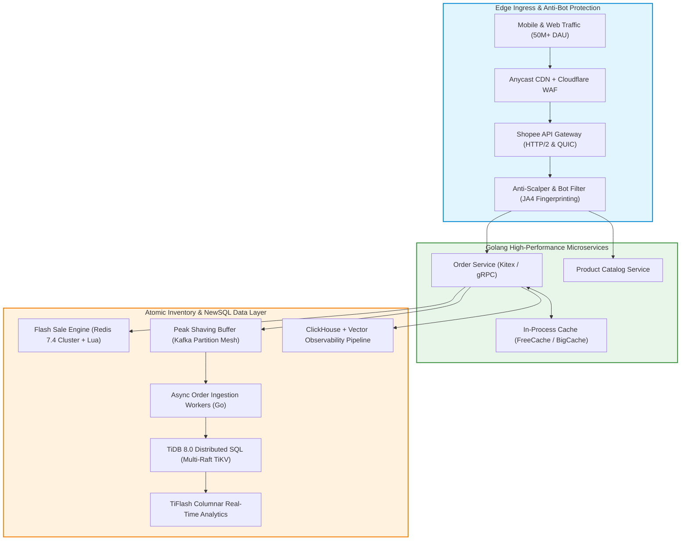
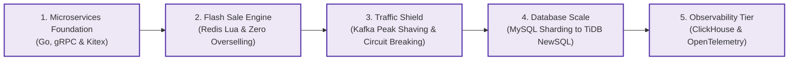

> **Multi-Language Edition:** This Masterclass is also published in Vietnamese at [Học Viện Kỹ Thuật Shopee Architecture (learn.tanhdev.com)](https://learn.tanhdev.com/series/shopee-architecture/).

> **Answer-First:** The Shopee Architecture series details how Go microservices, Redis Lua inventory reservation, Apache Kafka peak shaving, TiDB distributed SQL, and OpenTelemetry/ClickHouse observability handle 10M+ QPS and millions of concurrent buyers during 11.11 flash sales without overselling or database connection starvation.

---

## Masterclass Overview: The Southeast Asian E-Commerce Engine

Shopee is the leading e-commerce platform in Southeast Asia and Taiwan, operating across Singapore, Indonesia, Vietnam, Thailand, Philippines, and Malaysia. During annual shopping festivals (9.9, 11.11, 12.12), platform traffic surges by **more than 10x within seconds** at midnight, creating catastrophic load spikes that break traditional web architectures.

To survive these extreme peaks, Shopee transitioned from monolithic Python/Django backends to a high-performance **Golang microservices ecosystem**, built an atomic **Redis Lua Flash Sale Engine** to guarantee zero overselling, deployed **Kafka-based asynchronous peak shaving**, and migrated petabyte-scale transactional ledgers from sharded MySQL to **TiDB Distributed SQL**.

---

## Core Curriculum & Chapter Roadmap

This series deconstructs the five core engineering pillars behind Shopee's high-concurrency production stack:

1. **[Chapter 1: Microservices Foundation — Golang, gRPC & API Gateway](/series/shopee-architecture/01-microservices-foundation/)**  
   *Why Shopee migrated from Python to Golang, RPC framework benchmarking (gRPC vs Kitex), Protobuf zero-copy serialization, and partitioned Consul service discovery.*

2. **[Chapter 2: Flash Sale Engine — Redis Lua & Zero Overselling](/series/shopee-architecture/02-flash-sale-engine/)**  
   *Deep dive into atomic inventory reservation using Redis Lua scripts, hotspot key sub-sharding, in-memory short-circuiting, and purchase token gatekeepers.*

3. **[Chapter 3: Traffic Shield — Kafka Peak Shaving & Circuit Breaking in Go](/series/shopee-architecture/03-traffic-shield/)**  
   *Absorbing sudden 10x traffic waves with Kafka buffer partitions, consumer group autoscaling, Alibaba Sentinel circuit breakers, and virtual waiting rooms.*

4. **[Chapter 4: Database Scalability — From MySQL Sharding to TiDB NewSQL](/series/shopee-architecture/04-database-scale/)**  
   *Overcoming MySQL InnoDB limits, TiDB NewSQL architecture, TiKV Multi-Raft consensus, region auto-splitting, and online zero-downtime data migration.*

5. **[Chapter 5: Observability — ClickHouse & Distributed Tracing at Scale](/series/shopee-architecture/05-observability/)**  
   *Processing 100 billion daily logs with Vector and ClickHouse, OpenTelemetry W3C distributed tracing, continuous Pyroscope profiling, and Mega Sale war rooms.*

---

## Frequently Asked Questions (FAQ)


Shopee enforces a strict three-tier inventory safeguard: First, the entire flash-sale SKU stock is pre-warmed into a Redis Cluster. When users checkout, an atomic Lua script decrements inventory in memory (`DECRBY`) and returns the remaining balance; because Redis executes Lua scripts sequentially on a single thread per shard, race conditions are physically impossible. Second, if Redis inventory hits zero, local in-memory caches (FreeCache) on Go pods immediately short-circuit subsequent requests without touching Redis. Third, the downstream database enforces an atomic conditional update (`WHERE stock >= qty`) as the final mathematical guarantee.



Early versions of Shopee services were built on Python/Django. As traffic exploded, Python's Global Interpreter Lock (GIL) and high per-process memory footprints caused extreme CPU overhead and required massive container fleets. Migrating to Golang provided native goroutine concurrency, efficient memory management, and compiled binary execution speed, reducing container CPU utilization by over 7x and dropping p99 RPC latencies from 35ms down to sub-3ms.



MySQL application sharding (e.g., using ShardingSphere or custom routing logic) splits tables by a hash key across multiple physical MySQL instances. While this scales write IOPS, it breaks cross-shard ACID transactions, prevents global cross-shard joins, and makes schema alterations (DDL) a logistical nightmare. TiDB NewSQL natively implements the Google Percolator distributed transaction model and Multi-Raft consensus in TiKV, presenting a single logical MySQL-compatible endpoint that scales horizontally without application code changes.


---

## Related Masterclasses & Architecture Deep Dives

- **[Masterclass: High Concurrency Systems & B2B Commerce](/series/high-concurrency-systems/)**: Core C10M networking, io_uring, GCRA, and Transactional Outbox patterns.
- **[Alipay Double-11 Scaling Architecture](/series/alipay-double-11/)**: Billion-transaction distributed ledger engineering and extreme traffic survival.
- **[Distributed Core Banking Architecture](/series/core-banking-architecture/)**: Financial-grade ledger schemas, ISO 20022, and FAPI 2.0 security.
