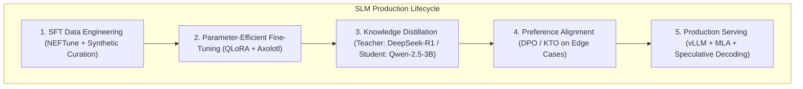

> **Answer-first:** For 80% of domain-specific enterprise tasks (classification, SQL generation, JSON extraction, code triage), fine-tuned Small Language Models (1B–8B parameters) match or exceed frontier model performance at **1/50th of the inference cost** and **sub-50ms latency**. This playbook documents the full production pipeline: synthetic data generation, QLoRA fine-tuning with Axolotl, distillation from DeepSeek-R1, DPO alignment, and vLLM serving.

---
## 🎯 Series Overview: Why Small Language Models in 2026?

Relying exclusively on proprietary frontier API models (GPT-4.5, Claude 3.5 Sonnet) introduces severe architectural vulnerabilities:
1. **API Cost Explosions:** High-frequency autonomous agent loops burn thousands of dollars monthly in inference tokens.
2. **Data Sovereignty & Privacy Risks:** Enterprise customer PII and proprietary source code cannot be streamed to third-party endpoints.
3. **Latency Bottlenecks:** External API calls impose a 500ms–2000ms network round-trip penalty.

This series provides an end-to-end engineering playbook for training, distilling, and deploying specialized **Small Language Models (SLMs)** on self-hosted infrastructure.

---

## 🗺️ Masterclass Chapters

- **[Executive Summary: The Rise of Specialized Small Models](/series/slm-playbook/executive-summary/)**  
  *Economic analysis, latency profiles, and the hybrid AI routing architecture.*
- **[Part 1: Hybrid AI Architecture & Self-Hosting vLLM](/series/slm-playbook/part-1-slm-hybrid-architecture/)**  
  *Deploying local SLMs as fast triage gates in front of cloud frontier models.*
- **[Part 2: SFT Data Engineering — NEFTune & Synthetic Data Curation](/series/slm-playbook/part-2-sft-data-engineering/)**  
  *Constructing high-signal instruction datasets, noise injection, and decontamination.*
- **[Part 3: QLoRA & Axolotl Fine-Tuning on Commodity GPUs](/series/slm-playbook/part-3-lora-qlora-tuning/)**  
  *4-bit quantization, LoRA rank optimization, and training scripts on single RTX 4090/A10G.*
- **[Part 4: Knowledge Distillation from DeepSeek-R1 / Claude](/series/slm-playbook/part-4-knowledge-distillation-r1/)**  
  *Distilling reasoning traces (Chain-of-Thought) from frontier teachers into 3B student models.*
- **[Part 5: Preference Alignment with DPO (Direct Preference Optimization)](/series/slm-playbook/part-5-preference-alignment/)**  
  *Eliminating hallucinations and enforcing JSON schema output reliability without RLHF complexity.*
- **[Part 6: Enterprise vLLM Deployment, Quantization & Automated Evals](/series/slm-playbook/part-6-vllm-deployment-evals/)**  
  *AWQ/GPTQ quantization, vLLM continuous batching, and LLM-as-a-judge automated benchmarking.*
