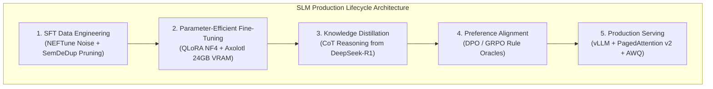
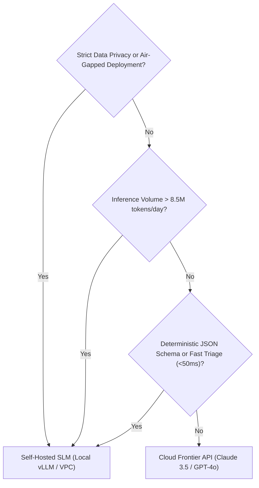

> **Answer-first:** For 80% of domain enterprise tasks, fine-tuned Small Language Models (1B–14B) match frontier performance at 1/50th inference cost and sub-40ms latency. This playbook provides the production engineering blueprint: synthetic data curation, QLoRA fine-tuning with Axolotl on 24GB GPUs, DeepSeek-R1 reasoning distillation, DPO/GRPO alignment, and vLLM continuous batching deployment.

> 🇻🇳 **Read the Vietnamese version of this series on [learn.tanhdev.com](https://learn.tanhdev.com/series/slm-playbook/)**

---

## 🎯 Series Overview: Why Small Language Models in 2026?

Relying exclusively on proprietary frontier API models (GPT-4.5, Claude 3.5 Sonnet) introduces three fatal enterprise vulnerabilities:
1. **API Cost Explosions:** High-frequency autonomous agent loops burn thousands of dollars monthly in inference tokens with zero long-term intellectual property capitalization.
2. **Data Sovereignty & Regulatory Compliance:** Enterprise customer PII, HIPAA medical records, and proprietary source code cannot be legally transmitted to multi-tenant third-party endpoints.
3. **Latency Bottlenecks & Network Jitter:** External cloud API calls impose a 500ms–2,500ms network round-trip penalty, breaking real-time generative UI interactivity and edge execution.

This masterclass series provides an end-to-end engineering playbook for training, distilling, aligning, and serving specialized **Small Language Models (SLMs)** on private, self-hosted infrastructure.

---

## 🗺️ Architectural Decision Framework: When to Choose SLMs

Determining the boundary between prompt engineering, retrieval-augmented generation (RAG), and fine-tuned SLMs is the foundation of modern AI system design.

---

## 🗺️ Masterclass Chapters

- **[Executive Summary: The Rise of Specialized Small Models](/series/slm-playbook/executive-summary/)**  
  *Economic analysis, TCO break-even formulas ($0.02 vs $3.00/1M tokens), and the hybrid AI routing architecture.*
- **[Part 1: Hybrid AI Architecture & Self-Hosting vLLM](/series/slm-playbook/part-1-slm-hybrid-architecture/)**  
  *Deploying a local SLM gateway tier: 80% routine queries served locally in 35ms with automatic fallback escalation to frontier cloud APIs.*
- **[Part 2: SFT Data Engineering — NEFTune & Synthetic Data Curation](/series/slm-playbook/part-2-sft-data-engineering/)**  
  *Constructing high-signal instruction datasets, NEFTune embedding noise injection (alpha=5), SemDeDup semantic deduplication, and decontamination.*
- **[Part 3: QLoRA & Axolotl Fine-Tuning on Commodity GPUs](/series/slm-playbook/part-3-lora-qlora-tuning/)**  
  *4-bit NormalFloat (NF4) quantization mathematics, Double Quantization, Paged Optimizers, and Axolotl scripts on single 24GB GPUs (RTX 4090/A10G).*
- **[Part 4: Knowledge Distillation from DeepSeek-R1 & Frontier Teachers](/series/slm-playbook/part-4-knowledge-distillation-r1/)**  
  *Distilling long Chain-of-Thought (CoT) reasoning paths from DeepSeek-R1 (671B MoE) into compact 1.5B–8B student models.*
- **[Part 5: Preference Alignment with DPO & GRPO](/series/slm-playbook/part-5-preference-alignment/)**  
  *Eliminating hallucinations, enforcing 99.8% JSON schema compliance, and applying Group Relative Policy Optimization without Critic models.*
- **[Part 6: Enterprise vLLM Deployment, Quantization & Automated Evals](/series/slm-playbook/part-6-vllm-deployment-evals/)**  
  *AWQ/FP8 quantization, continuous batching, Multi-Head Latent Attention (MLA), dynamic Multi-LoRA serving, and automated LLM-as-a-judge CI/CD.*

---

## ❓ Frequently Asked Questions (FAQ)


Self-hosting an SLM on a dedicated 24GB GPU (e.g., NVIDIA L4 at $0.70/hr or A10G at $1.00/hr) breaks even with commercial cloud APIs ($3.00/1M input tokens) at approximately 8.5 million tokens per day. Beyond this volume, self-hosted inference operates at near-zero marginal cost, cutting annual inference expenditure by 95% to 98%.



QLoRA achieves performance parity through three complementary innovations: (1) 4-bit NormalFloat (NF4), an information-theoretically optimal quantile representation for normally distributed weights, (2) Double Quantization, which quantizes quantization constants to save 0.37 bits/parameter, and (3) Paged Optimizers, which page memory to host RAM during sequence length spikes to prevent CUDA OOM errors.



Standard SFT only teaches a model what the final answer should be, leading to superficial memorization. Distilling DeepSeek-R1 reasoning traces teaches the student model the step-by-step cognitive process: exploring hypotheses, verifying sub-calculations, catching errors, and backtracking within explicit `<think>` blocks before emitting the answer.


---

## 🔗 Related Series & Engineering Deep Dives

- **[Prompt Standard: Enterprise Context Engineering & PromptOps](/series/prompt-standard/)** — Modular prompt architecture, MCP schemas, and CI/CD evaluation gates.
- **[Enterprise AI Data Pipeline & GraphRAG Architecture](/series/ai-data-engineering-pipeline/)** — High-scale data engineering and knowledge graph ingestion.
- **[The AI-Driven Playbook: Private AI Infrastructure](/series/ai-driven-playbook/)** — Architectural patterns for enterprise AI platforms and gateway routing.
- **[Flagship Deep Dive: SLM Fine-Tuning vs Prompt Engineering](/posts/slm-fine-tune-vs-prompt-engineering/)** — Quantitative break-even analysis and architectural decision matrix.
