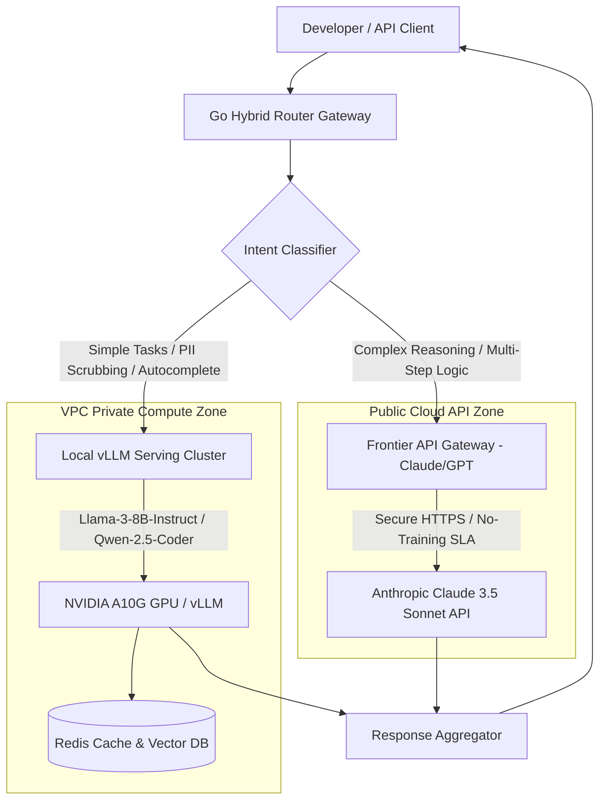

[← Series hub](/series/slm-playbook/)
[Next →](/series/slm-playbook/part-1-slm-hybrid-architecture/)

For the past two years, enterprise AI adoption has been dominated by a singular architectural pattern: API integration with massive, closed-source models (Frontier LLMs). While this API-Centric model allows for rapid prototyping, it becomes a severe liability when scaled to production workloads handling sensitive company data.

## The Problem with API-Centric Architectures

Relying exclusively on commercial APIs (such as GPT-4 or Claude 3.5 Sonnet) introduces three critical bottlenecks for scale-ups and enterprises:
- **Data Privacy and Compliance:** Many organizations—especially in banking, healthcare, and defense—cannot send sensitive PII (Personally Identifiable Information) or proprietary code over public internet endpoints.
- **Astronomical Operating Costs (TCO):** Running millions of daily tokens through premium commercial APIs results in uncontrollable, recurring operational expenses.
- **Generic Output:** Commercial models are designed to be generalists. They often struggle to strictly adhere to highly specific internal enterprise data schemas or private coding frameworks without massive, repetitive few-shot prompting.

## The Small Language Model (SLM) Solution

The democratization of powerful, open-weights Small Language Models (ranging from 2B to 14B parameters) such as **Llama 3 8B**, **Phi-4 14B**, and **Qwen 2.5 Coder** has changed the calculus. When properly fine-tuned on high-quality domain data, these lightweight models can match or exceed the performance of 100B+ parameter models on targeted tasks.

More importantly, they can be deployed entirely within your virtual private cloud (VPC) on consumer-grade or mid-tier hardware (like a single NVIDIA A10G), slashing API costs by over 50%.

---

## 1. Hybrid AI Routing Architecture

To exploit the strengths of both private self-hosted models and massive public frontier systems, enterprises must implement a **Hybrid AI Routing Architecture**. Instead of forcing every query to the most expensive model, requests are dynamically evaluated and routed to the most cost-effective backend.

The system design diagram below shows how the routing gateway acts as the single entry point, intercepting user requests, classifying their intent, and dispatching them accordingly:



---

## 2. Strategic Cost & Latency Analysis (TCO)

Let's model the Total Cost of Ownership (TCO) comparison. Suppose an organization of 250 engineers issues a total of **500,000 queries per month**, averaging 1,000 input tokens and 500 output tokens per query.

### Scenario A: Pure Frontier API Model (e.g., Claude 3.5 Sonnet)
*   **Input Token Price:** \$3.00 per million tokens.
*   **Output Token Price:** \$15.00 per million tokens.
*   **Cost per query:**
    $$\text{Cost}_{\text{query}} = (1,000 \times \$0.000003) + (500 \times \$0.000015) = \$0.003 + \$0.0075 = \$0.0105$$
*   **Monthly Cost:**
    $$\text{Cost}_{\text{monthly}} = 500,000 \times \$0.0105 = \$5,250 / \text{month}$$
*   **Annual Cost:** \$63,000.

### Scenario B: Hybrid Router (80% Local SLM, 20% Frontier API)
By routing simple tasks (such as code auto-complete, spelling corrections, simple SQL generation, and PII sanitization) to a local 8B model, only 20% of complex queries require Claude.
*   **Local Infrastructure:** 1x NVIDIA L4 instance on AWS (g5.xlarge) at ~\$1.01/hour (On-Demand).
    $$\text{Cost}_{\text{infra}} = \$1.01 \times 24 \text{ hours} \times 30.5 \text{ days} \approx \$740 / \text{month}$$
*   **Frontier API Cost (20% of 500K queries = 100K queries):**
    $$\text{Cost}_{\text{frontier}} = 100,000 \times \$0.0105 = \$1,050 / \text{month}$$
*   **Total Hybrid Cost:**
    $$\text{Cost}_{\text{hybrid}} = \$740 + \$1,050 = \$1,790 / \text{month}$$
*   **Monthly Savings:** \$3,460 (**65.9% reduction**), while local query latency falls from ~1,200ms (public cloud roundtrip) to <300ms (VPC local).

---

## 3. Go Implementation: Hybrid Router Gateway

Below is a complete, production-grade Go implementation of the `HybridRouter`. It analyzes incoming prompts for keywords indicating complex reasoning tasks (e.g., "architect", "explain", "refactor", "optimize") and routes them to Anthropic's Claude API, while sending standard tasks to a local vLLM server:

```go
package main

import (
	"bytes"
	"context"
	"encoding/json"
	"errors"
	"fmt"
	"io"
	"net/http"
	"strings"
	"time"
)

type GatewayRequest struct {
	Prompt string `json:"prompt"`
}

type GatewayResponse struct {
	TargetRoute string `json:"target_route"`
	Content     string `json:"content"`
	LatencyMs   int64  `json:"latency_ms"`
}

type OpenAIChatRequest struct {
	Model    string    `json:"model"`
	Messages []Message `json:"messages"`
}

type Message struct {
	Role    string `json:"role"`
	Content string `json:"content"`
}

type OpenAIChatResponse struct {
	Choices []struct {
		Message struct {
			Content string `json:"content"`
		} `json:"message"`
	} `json:"choices"`
}

type HybridRouter struct {
	vLLMEndpoint   string
	frontierURL    string
	frontierAPIKey string
	httpClient     *http.Client
}

func NewHybridRouter(vllmURL, frontierURL, apiKey string) *HybridRouter {
	return &HybridRouter{
		vLLMEndpoint:   vllmURL,
		frontierURL:    frontierURL,
		frontierAPIKey: apiKey,
		httpClient: &http.Client{
			Timeout: 30 * time.Second,
		},
	}
}

// ClassifyPrompt evaluates whether a prompt requires complex reasoning
func (r *HybridRouter) ClassifyPrompt(prompt string) string {
	promptLower := strings.ToLower(prompt)
	complexKeywords := []string{
		"architect", "design a system", "optimize performance",
		"explain the algorithm", "memory leak", "race condition",
		"refactor this monolith", "security vulnerability",
	}

	for _, keyword := range complexKeywords {
		if strings.Contains(promptLower, keyword) {
			return "FRONTIER"
		}
	}
	return "LOCAL_SLM"
}

// RouteAndExecute executes the query against the appropriate endpoint
func (r *HybridRouter) RouteAndExecute(ctx context.Context, prompt string) (*GatewayResponse, error) {
	route := r.ClassifyPrompt(prompt)
	startTime := time.Now()

	var endpoint, modelName, apiKey string
	if route == "FRONTIER" {
		endpoint = r.frontierURL
		modelName = "claude-3-5-sonnet-20241022"
		apiKey = r.frontierAPIKey
	} else {
		endpoint = r.vLLMEndpoint
		modelName = "meta-llama/Meta-Llama-3-8B-Instruct"
		apiKey = "" // Local serving does not require keys
	}

	payload := OpenAIChatRequest{
		Model: modelName,
		Messages: []Message{
			{Role: "user", Content: prompt},
		},
	}

	bodyBytes, err := json.Marshal(payload)
	if err != nil {
		return nil, fmt.Errorf("failed to marshal request: %w", err)
	}

	req, err := http.NewRequestWithContext(ctx, "POST", endpoint, bytes.NewBuffer(bodyBytes))
	if err != nil {
		return nil, fmt.Errorf("failed to build request: %w", err)
	}
	req.Header.Set("Content-Type", "application/json")
	if apiKey != "" {
		req.Header.Set("Authorization", "Bearer "+apiKey)
	}

	resp, err := r.httpClient.Do(req)
	if err != nil {
		return nil, fmt.Errorf("http request failed: %w", err)
	}
	defer resp.Body.Close()

	if resp.StatusCode != http.StatusOK {
		respBody, _ := io.ReadAll(resp.Body)
		return nil, fmt.Errorf("endpoint returned status %d: %s", resp.StatusCode, string(respBody))
	}

	var chatResp OpenAIChatResponse
	if err := json.NewDecoder(resp.Body).Decode(&chatResp); err != nil {
		return nil, fmt.Errorf("failed to decode response: %w", err)
	}

	if len(chatResp.Choices) == 0 {
		return nil, errors.New("received empty choices from LLM API")
	}

	latency := time.Since(startTime).Milliseconds()

	return &GatewayResponse{
		TargetRoute: route,
		Content:     chatResp.Choices[0].Message.Content,
		LatencyMs:   latency,
	}, nil
}
```

---

## 4. What This Series Covers

To transition from being an API consumer to an AI system owner, engineering teams must master the entire lifecycle of model curation, optimization, and serving. This playbook is a technical, hands-on guide exploring:

1. **Architecture & TCO:** Why hybrid routing (mixing local SLMs for common tasks and Frontier APIs for complex reasoning) is the optimal strategy. We analyze latency trade-offs, network hops inside private VPC networks, and local GPU infrastructure requirements.
2. **Data Engineering (SFT):** How to curate pristine training data using semantic deduplication (SemDeDup) and prevent model overfitting with embedding noise (NEFTune). We detail SFT dataset formatting, tokenization boundaries, and data quality metrics.
3. **Parameter-Efficient Fine-Tuning (PEFT):** Mastering LoRA and 4-bit QLoRA using Axolotl and Unsloth to train models on single GPUs. We provide complete YAML configuration files and training loss monitoring setups.
4. **Knowledge Distillation:** Automatically transferring reasoning traces (Chain of Thought) from models like DeepSeek-R1 to your small models. We discuss teacher-student training paradigms and formatting logical reasoning tokens.
5. **Preference Alignment:** Using RL algorithms like DPO, KTO, and GRPO to align model behavior and ensure safety. We compare reward-based reinforcement learning with direct preference optimization and explain the policy alignment loss function.
6. **Production Serving:** Quantizing models to AWQ and configuring vLLM for high-throughput, dynamic multi-LoRA serving. We detail memory management, key-value (KV) caching strategies, and concurrency optimization under heavy traffic.

---

## 5. Gateway Routing Reliability & Fallback Guards

In enterprise environments, the gateway must be resilient to API failures and local hardware overloads. If the local vLLM cluster suffers from memory exhaustion (Out Of Memory - OOM) or high latency spikes due to queue saturation, the router must automatically fail over to a cloud provider API.

This dual-path design prevents service interruptions. It also allows developers to define strict SLAs. For instance, if local inference latency exceeds 800ms, subsequent queries are routed to the cloud frontier API until local queue pressure dissipates. Furthermore, we implement a rate-limiting middleware that blocks malicious token-flooding attempts, preserving resources for legitimate business operations.

---

## 6. Who Is This For?

This playbook is written for CTOs, AI Architects, and Senior Backend Engineers. If you are responsible for lowering AI operational costs, securing data privacy, and building customized AI features that strictly follow your business logic, this series provides the exact engineering blueprints.

Let's dive into the core architecture: **[Part 1 — Hybrid AI & Self-Hosted vLLM](/series/slm-playbook/part-1-slm-hybrid-architecture/)**.


