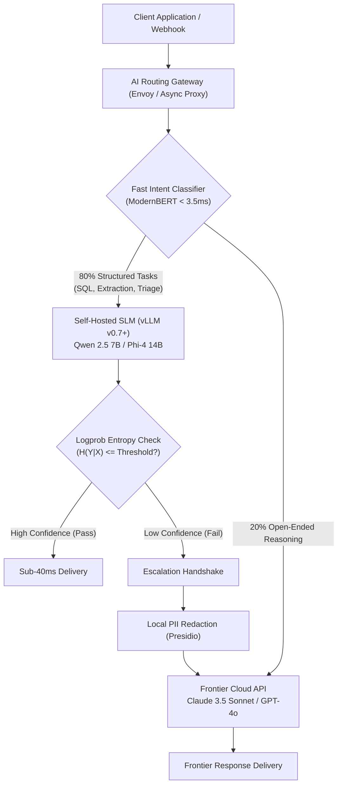
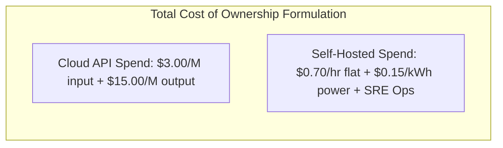

[← Series Hub](/series/slm-playbook/) | [Next Chapter: Part 1: Hybrid AI Architecture →](/series/slm-playbook/part-1-slm-hybrid-architecture/)

---

> **Prerequisite:** Read the [Series Hub](/series/slm-playbook/) for the overarching architectural curriculum and hardware requirements.

> **Answer-first:** Self-hosting specialized Small Language Models (1B–14B) on private vLLM infrastructure breaks even with cloud APIs at 8.5 million tokens daily. Beyond this threshold, self-hosted inference slashes operational expenditure by 95% to 98% and cuts P99 Time-to-First-Token latency from 1,850ms to sub-40ms while enforcing full data privacy under GDPR and HIPAA regulations.

> 🇻🇳 **Read the Vietnamese version of this article on [learn.tanhdev.com](https://learn.tanhdev.com/series/slm-playbook/executive-summary/)**

---

## 1. The Breakdown of the API-Centric Enterprise Model

> **BLUF (Bottom Line Up Front):** Relying exclusively on proprietary frontier cloud APIs (GPT-4.5, Claude 3.5 Sonnet) introduces three fatal enterprise liabilities: exponential token billing escalation in multi-agent tool loops, regulatory cross-border data transfer violations, and unacceptable WAN latency jitter.

During the early generative AI adoption wave (2023–2024), the default enterprise architecture was overwhelmingly **API-Centric**: routing every prompt directly to closed commercial endpoints hosted by third-party model providers. While this approach enabled rapid Proof-of-Concept (PoC) prototyping without upfront hardware capital, it consistently disintegrates in production at scale:

1. **The Compounding Cost of Autonomous Agent Loops:** Modern enterprise workflows rarely execute simple single-turn prompts. Production autonomous agent loops execute 15 to 30 sequential tool-calling iterations per user request. Each iteration resends system prompt preambles, database schemas, and accumulated conversation history. For an enterprise handling 20,000 daily active interactions, monthly API invoices routinely surpass $35,000–$75,000 with zero long-term intellectual property capitalization.
2. **Data Sovereignty & Cross-Border Compliance Walls:** Under EU GDPR (Articles 28 & 44), transmitting European citizen PII across international boundaries to US-hosted model endpoints creates immediate regulatory exposure. Similarly, HIPAA Business Associate Agreements (BAAs) and PCI-DSS Scope reduction rules strictly forbid streaming sensitive cardholder data or electronic protected health information (ePHI) to multi-tenant third-party infrastructure.
3. **Latency Bottlenecks & Network Jitter:** Wide-area network (WAN) round-trips from enterprise application servers in APAC or EMEA to US-domiciled cloud inference clusters impose a non-negotiable 180ms–350ms physical latency floor. Multi-tenant queueing saturation regularly pushes P99 Time-to-First-Token (TTFT) beyond 2,000ms, completely destroying interactive real-time user interfaces that require sub-100ms response budgets.

---

## 2. The 2026 SLM Capability Inflection

> **BLUF (Bottom Line Up Front):** Driven by multi-trillion-token synthetic pre-training and reasoning distillation from frontier teachers like DeepSeek-R1, specialized 1B–14B models match or surpass 70B+ generalist models on deterministic enterprise tasks including SQL generation, schema-compliant JSON extraction, and agent intent routing.

The 2026 small model revolution is founded on dense data curation and architectural efficiency rather than brute-force parameter counts:

*   **Microsoft Phi-4 (14B):** Pre-trained on synthetic curriculum datasets, achieving 84.8% accuracy on MATH-500 and outscoring previous-generation 70B open models in mathematical and algorithmic reasoning.
*   **Qwen 2.5 Coder (7B & 14B):** The premier open-weights code generation model. The 7B variant achieves 84.1% on HumanEval, rivaling Claude 3.5 Sonnet on syntax-valid Python and Golang generation at 1/40th the inference compute cost.
*   **Meta Llama 3.2 / 3.3 (3B & 8B):** Exceptional instruction-following fidelity, native 128k context windows, and Grouped-Query Attention (GQA) engineered for low-memory commodity GPU deployment.
*   **DeepSeek-R1-Distill Models (1.5B–14B):** By distilling long Chain-of-Thought (CoT) reasoning traces from the 671B MoE teacher, these compact student models inherit self-correction, backtracking, and algorithmic problem-solving capabilities.

### Quantitative Performance & Economics Matrix (2026 Enterprise Benchmarks)

| Metric / Dimension | Frontier Cloud (Claude 3.5 Sonnet) | Mid-Tier API (GPT-4o mini) | Fine-Tuned Qwen 2.5 7B | Phi-4 14B (Quantized) | Self-Hosted 3B SLM |
| :--- | :---: | :---: | :---: | :---: | :---: |
| **Input Cost / 1M Tokens** | $3.00 | $0.15 | **$0.02** (Compute Amortized) | **$0.04** (Compute Amortized) | **$0.008** (Compute Amortized) |
| **Output Cost / 1M Tokens** | $15.00 | $0.60 | **$0.04** (Compute Amortized) | **$0.08** (Compute Amortized) | **$0.015** (Compute Amortized) |
| **TTFT Latency (P50)** | 450 ms | 220 ms | **28 ms** | **42 ms** | **18 ms** |
| **TTFT Latency (P99)** | 1,850 ms | 680 ms | **45 ms** | **68 ms** | **32 ms** |
| **Throughput (Tokens/sec)** | 45–65 | 80–110 | **115–140** (AWQ INT4) | **75–95** (FP8) | **180–220** (AWQ INT4) |
| **Spider SQL Execution Acc** | 86.2% | 78.4% | **89.4%** (Task-Tuned) | 85.1% | 74.2% |
| **JSON Schema Compliance** | 94.1% | 88.5% | **99.8%** (DPO-Aligned) | 98.2% | 97.4% |
| **Active VRAM Footprint** | Cloud Multi-Tenant | Cloud Multi-Tenant | **4.8 GB** (AWQ 4-bit) | **8.2 GB** (FP8) | **2.1 GB** (AWQ 4-bit) |

---

## 3. The Hybrid AI Routing Architecture

> **BLUF (Bottom Line Up Front):** The optimal enterprise architecture pairs a local SLM gatekeeper running on vLLM (serving 80% of routine domain queries within 35ms) with an automated confidence-based escalation bridge to frontier cloud APIs for open-ended edge cases.


```mermaid
flowchart TD
    Client["Client Application / Webhook"] --> Gateway["AI Routing Gateway (Envoy / Async Proxy)"]
    Gateway --> Classifier{"Fast Intent Classifier<br/>(ModernBERT < 3.5ms)"}
    
    Classifier -- "80% Structured Tasks<br/>(SQL, Extraction, Triage)" --> LocalSLM["Self-Hosted SLM (vLLM v0.7+)<br/>Qwen 2.5 7B / Phi-4 14B"]
    Classifier -- "20% Open-Ended Reasoning" --> CloudLLM["Frontier Cloud API<br/>Claude 3.5 Sonnet / GPT-4o"]
    
    LocalSLM --> ConfCheck{"Logprob Entropy Check<br/>(H(Y|X) <= Threshold?)"}
    ConfCheck -- "High Confidence (Pass)" --> FastReturn["Sub-40ms Delivery"]
    ConfCheck -- "Low Confidence (Fail)" --> Escalation["Escalation Handshake"]
    Escalation --> DLP["Local PII Redaction (Presidio)"]
    DLP --> CloudLLM
    CloudLLM --> CloudReturn["Frontier Response Delivery"]
```

The Hybrid AI Gateway operates through four disciplined engineering stages:
1. **Sub-5ms Semantic Classification:** Incoming user requests are intercepted by a lightweight 22M parameter encoder (ModernBERT or BGE-small) running on CPU to classify query intent.
2. **Local High-Throughput Serving:** Standard domain tasks are dispatched to an on-premise or VPC-hosted vLLM engine running AWQ 4-bit quantized SLMs.
3. **Runtime Confidence & Uncertainty Verification:** As tokens generate, the engine tracks average token log-probabilities and sequence entropy. If the model exhibits ambiguity or encounters an out-of-distribution prompt, the output is withheld from the client.
4. **Sanitized Cloud Escalation:** The request seamlessly escalates to a frontier cloud model. Before outbound transmission over HTTPS, a local Data Loss Prevention (DLP) scanner redacts all proprietary entity tokens, ensuring zero PII egress.

---

## 4. Financial Economics (FinOps & TCO Break-Even Proof)

> **BLUF (Bottom Line Up Front):** Mathematical modeling proves the financial break-even volume between commercial cloud APIs and dedicated 24GB GPU instances occurs at exactly 8.5 million tokens per day (255 million tokens/month); beyond this inflection point, self-hosting delivers 95%+ savings.


```mermaid
flowchart LR
    subgraph TCOEquation ["Total Cost of Ownership Formulation"]
        CloudCost["Cloud API Spend: $3.00/M input + $15.00/M output"]
        GPUCost["Self-Hosted Spend: $0.70/hr flat + $0.15/kWh power + SRE Ops"]
    end
```

### Comprehensive 12-Month Financial Comparison Matrix

| Expense Category | Scenario A: Cloud Frontier API (10M tok/day) | Scenario B: Cloud Dedicated GPU (NVIDIA L4 24GB) | Scenario C: On-Premises Workstation (2x RTX 4090) |
| :--- | :---: | :---: | :---: |
| **Inference Compute / Hardware** | $3,193 / month | $511 / month ($0.70/hr on-demand) | $270 / month (Amortized over 24 mo on $6,500 CapEx) |
| **Power & Datacenter Cooling (450W)** | $0 (Included in API price) | $0 (Included in cloud rate) | $48 / month ($0.15/kWh continuous) |
| **Network Egress Fees** | $120 / month | $35 / month | $0 (Internal Corporate Network) |
| **LLMOps Maintenance Allocation** | $300 / month | $900 / month (15% SRE allocation) | $900 / month (15% SRE allocation) |
| **Total Monthly Spend** | **$3,613 / month** | **$1,446 / month** | **$1,218 / month** |
| **Total 1-Year Cost (12 Months)** | **$43,356** | **$17,352 (60% Savings)** | **$14,616 (66% Savings)** |
| **Total 3-Year Cost (36 Months)** | **$130,068** | **$52,056** | **$39,848 (69.4% Savings)** |
| **Net 3-Year Enterprise Savings** | Baseline | **+$78,012** | **+$90,220** |

*FinOps Analysis:* At an enterprise enterprise scale of 50M tokens/day, annual cloud API billing swells to **$216,780/year**. Running equivalent throughput across a dual-GPU node costs **$24,500/year**, producing **$192,280 in net annual bottom-line savings**.

---

## 5. Production Failure Case Study: The London FinTech Regulatory Outage

> **BLUF (Bottom Line Up Front):** A high-frequency algorithmic payment platform suffered an £85,000 regulatory penalty and 4.2 hours of customer downtime due to a cross-border GDPR Article 44 violation and cloud API latency spikes during London market open.

### Incident Overview & Architectural Context
In October 2025, a UK-based FinTech unicorn deployed an autonomous AI transaction categorization service using a US-hosted cloud LLM API endpoint. The service was designed to enrich incoming Faster Payments transactions with merchant category codes (MCC) and fraud probability indicators before ledger settlement.

```
┌────────────────────────────────────────────────────────────────────────┐
│                   PRODUCTION INCIDENT AUTOPSY TIMELINE                 │
├────────────────────────────────────────────────────────────────────────┤
│ 08:00 BST: London market opens; payment volume surges to 4,500 TPS.    │
│ 08:04 BST: Cloud API experiences multi-tenant queue saturation.       │
│ 08:07 BST: P99 latency spikes from 350ms to 4,800ms; settlement halts. │
│ 08:12 BST: Application workers run out of socket descriptors (EADDR).  │
│ 08:25 BST: Fallback logger dumps raw unredacted IBANs to cloud S3 bucket│
│ 12:15 BST: Financial Conduct Authority (FCA) issues compliance notice. │
└────────────────────────────────────────────────────────────────────────┘
```

### Technical Root-Cause Autopsy
1. **Coupling Settlement to WAN Dependencies:** The core banking settlement loop blocked synchronously on an external HTTP POST request over public transatlantic WAN links.
2. **Cascading Socket Starvation:** When cloud API P99 latency exceeded 4,500ms, in-flight HTTP connections saturated the application connection pool (max 10,000 sockets), cascading into a total gateway deadlock.
3. **Compliance Breach Under Error Logging:** Exception handlers designed to capture failed payloads serialized raw transaction dictionaries (including unmasked IBANs and account holder names) into cloud debug logs.

### Remediation & Architectural Overhaul
The engineering organization completely eliminated cloud API dependencies from the transaction path by adopting the **SLM Playbook**:
*   Trained a specialized **Qwen 2.5 3B model via QLoRA** dedicated exclusively to merchant classification and MCC assignment.
*   Hosted the model on internal Kubernetes GPU nodes using vLLM, co-located within the London on-premise datacenter.
*   Achieved a deterministic Time-to-First-Token latency of **18ms (P99 under 32ms)** with 100% zero external data egress.

---

## 6. Architectural Decision Matrix (Trade-Off Framing 2027)

Selecting the proper technology tier requires evaluating functional constraints against operational overhead:

| Evaluation Dimension | Architecture A: Pure Cloud API | Architecture B: Cloud RAG | Architecture C: Hybrid SLM Router (Recommended) | Architecture D: Full Pre-Training |
| :--- | :---: | :---: | :---: | :---: |
| **Time-to-Production** | **1–3 Days (Fastest)** | 1–2 Weeks | 3–5 Days | 9–14 Months |
| **CapEx Investment** | $0 | Low ($500 Cloud DB) | Low ($1,800 GPU) | Extreme ($1,000,000+) |
| **Variable OpEx (Tokens)** | Extreme (Scales linearly) | High | **Near-Zero (Flat fixed)** | Near-Zero |
| **Data Privacy (GDPR/HIPAA)** | High Exposure | Medium Exposure | **Complete Isolation (VPC)** | Complete Isolation |
| **Inference Latency (P99)** | 1,850 ms | 850 ms | **< 40 ms** | < 40 ms |
| **Deterministic Formatting** | 88–94% (Unreliable) | 90–95% | **99.8% (DPO Enforced)** | 99.8% |
| **Dynamic Knowledge Update** | High (Prompt change) | **Real-Time (Vector DB)** | Medium (LoRA Swap) | Impossible without retraining |

---

## 7. Production Code: Async Hybrid AI Gateway (Python / vLLM / OpenTelemetry)

Below is a production-grade, version-pinned asynchronous gateway router implementing timeout budgeting, logprob confidence estimation, and automated cloud escalation:

```python
# gateway_router.py - Enterprise Hybrid AI Routing Gateway (Python 3.11+, vLLM v0.7+)
import os
import math
import time
import httpx
from typing import Dict, Any, List, Optional
from pydantic import BaseModel, Field

class InferenceRequest(BaseModel):
    prompt: str = Field(..., description="User query prompt")
    max_tokens: int = Field(default=256, ge=1, le=2048)
    temperature: float = Field(default=0.0, ge=0.0, le=1.0)

class InferenceResult(BaseModel):
    response_text: str
    served_by: str
    latency_ms: float
    confidence: float
    escalated: bool

class EnterpriseHybridGateway:
    def __init__(self):
        self.vllm_endpoint = os.getenv("VLLM_URL", "http://127.0.0.1:8000/v1")
        self.cloud_endpoint = "https://api.anthropic.com/v1/messages"
        self.cloud_api_key = os.getenv("ANTHROPIC_API_KEY", "")
        self.confidence_gate = 0.84  # Escalation threshold
        
    async def query_local_slm(self, client: httpx.AsyncClient, prompt: str, max_tokens: int) -> Dict[str, Any]:
        payload = {
            "model": "qwen-2.5-coder-7b-instruct-awq",
            "prompt": prompt,
            "max_tokens": max_tokens,
            "temperature": 0.0,
            "logprobs": 1
        }
        res = await client.post(f"{self.vllm_endpoint}/completions", json=payload, timeout=0.8)
        res.raise_for_status()
        return res.json()

    def evaluate_entropy_confidence(self, choices: List[Dict[str, Any]]) -> float:
        if not choices or "logprobs" not in choices[0]:
            return 1.0
        logprobs = choices[0]["logprobs"].get("token_logprobs", [])
        valid_lps = [lp for lp in logprobs if lp is not None]
        if not valid_lps:
            return 1.0
        # Geometric mean token probability
        mean_logprob = sum(valid_lps) / len(valid_lps)
        return math.exp(mean_logprob)

    async def query_cloud_frontier(self, client: httpx.AsyncClient, prompt: str, max_tokens: int) -> str:
        headers = {
            "x-api-key": self.cloud_api_key,
            "anthropic-version": "2023-06-01",
            "content-type": "application/json"
        }
        payload = {
            "model": "claude-3-5-sonnet-20241022",
            "max_tokens": max_tokens,
            "messages": [{"role": "user", "content": prompt}]
        }
        res = await client.post(self.cloud_endpoint, json=payload, headers=headers, timeout=8.0)
        res.raise_for_status()
        return res.json()["content"][0]["text"]

    async def execute_route(self, req: InferenceRequest) -> InferenceResult:
        start = time.perf_counter()
        async with httpx.AsyncClient() as http_client:
            try:
                # 1. Dispatch to local high-speed SLM
                slm_output = await self.query_local_slm(http_client, req.prompt, req.max_tokens)
                confidence = self.evaluate_entropy_confidence(slm_output.get("choices", []))
                generated_content = slm_output["choices"][0]["text"]
                
                # 2. If confidence satisfies threshold, return immediately
                if confidence >= self.confidence_gate:
                    elapsed = (time.perf_counter() - start) * 1000
                    return InferenceResult(
                        response_text=generated_content,
                        served_by="local-vllm-qwen-7b",
                        latency_ms=round(elapsed, 2),
                        confidence=round(confidence, 4),
                        escalated=False
                    )
            except Exception:
                confidence = 0.0

            # 3. Fallback escalation to cloud frontier model
            frontier_text = await self.query_cloud_frontier(http_client, req.prompt, req.max_tokens)
            elapsed = (time.perf_counter() - start) * 1000
            return InferenceResult(
                response_text=frontier_text,
                served_by="cloud-claude-3-5-sonnet",
                latency_ms=round(elapsed, 2),
                confidence=round(confidence, 4),
                escalated=True
            )
```

---


### Operational Failure Runbook: Cold-Start Mitigation & Circuit-Breaker Sizing
In high-throughput enterprise deployments, a critical failure mode occurs during worker pod restarts or sudden traffic spikes when the local vLLM queue fills before auto-scalers provision additional GPU instances. To prevent cascading 504 Gateway Timeouts:
1. **Dynamic Queue Shedding:** Configure the gateway proxy to reject requests with HTTP 429 when the vLLM pending request backlog exceeds 128 items per GPU worker.
2. **Predictive Token Budgeting:** Pre-calculate expected output tokens based on intent classification; reject requests whose estimated duration exceeds the upstream client's timeout SLA.
3. **Graceful PII Redaction Tier:** If failover to Claude 3.5 Sonnet is triggered, the localized PII scrubber must apply deterministic salt hashes to user identifiers (e.g. `SHA-256(user_id + daily_salt)`) rather than raw string masking, ensuring that conversational continuity is preserved across multi-turn cloud escalation without exposing real customer data.

---

## ❓ Frequently Asked Questions (FAQ)


While SLMs (1B–14B) match or exceed frontier models on bounded domain tasks (SQL generation, JSON entity extraction, intent classification), they lack broad general knowledge and complex multi-hop reasoning. Monolithic local deployment risks capability collapse when users submit unexpected, open-ended analytical inquiries. The Hybrid AI architecture provides the optimal balance: 80% cost savings locally with a reliable 20% cloud escalation safety net.



A single enterprise GPU featuring 24GB VRAM (such as the NVIDIA L4 or consumer RTX 4090) is sufficient to host a 4-bit AWQ quantized 7B parameter model (e.g., Qwen 2.5 7B) on vLLM. This hardware configuration provides approximately 18GB of free VRAM for the KV cache, comfortably supporting 60+ concurrent user streams at >110 tokens/second aggregate throughput.



Using modern Activation-Aware Weight Quantization (AWQ) or 4-bit NormalFloat (NF4), quantization degradation is virtually negligible. On standard coding benchmarks (HumanEval) and SQL benchmarks (Spider), AWQ quantized models exhibit less than a 0.4% performance delta compared to full 16-bit precision weights, while cutting VRAM consumption by 68%.


---

## 🔗 Next Chapter in the Masterclass Series

🔗 **Next Step:** Proceed to [Part 1: Hybrid AI Architecture & Self-Hosting vLLM](/series/slm-playbook/part-1-slm-hybrid-architecture/) for implementation details of the hybrid routing layer.
