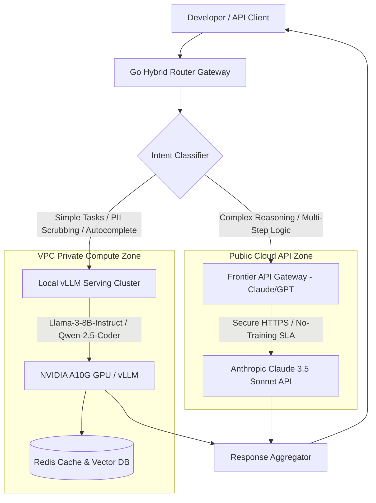

[← Series hub](/series/slm-playbook/)
[Next →](/series/slm-playbook/part-2-sft-data-engineering/)

> **Answer-first:** Self-hosting Small Language Models (2B–14B) with Go hybrid routing and vLLM serving reduces enterprise API costs by up to 65%, eliminates PII privacy risks, and delivers specialized domain performance matching 100B+ models.

For the past two years, enterprise AI adoption has been dominated by a singular architectural pattern: API integration with massive, closed-source models (Frontier LLMs). While this API-Centric model allows for rapid prototyping, it becomes a severe liability when scaled to production workloads handling sensitive company data.

## The Problem with API-Centric Architectures

> **Answer-first:** API-centric architectures create severe bottlenecks in production, including data privacy risks when transmitting PII, escalating token costs at high transaction volumes, and generic model outputs that lack domain specialization.

Relying exclusively on commercial APIs (such as GPT-4o or Claude 3.5 Sonnet) introduces three critical bottlenecks for scale-ups and enterprises that impact reliability, margin control, and regulatory alignment:

- **Data Privacy and Compliance:** Many organizations—especially in banking, healthcare, and defense—cannot send sensitive PII (Personally Identifiable Information) or proprietary codebase context over public internet endpoints due to strict GDPR, HIPAA, and SOC2 requirements.
- **Astronomical Operating Costs (TCO):** Running millions of daily tokens through premium commercial APIs results in uncontrollable, recurring operational expenses that scale linearly with user activity rather than compute efficiency.
- **Generic Output and Schema Drift:** Commercial models are designed to be generalists. They often struggle to strictly adhere to highly specific internal enterprise data schemas or private coding frameworks without massive, repetitive few-shot prompting that inflates token overhead.

## The Small Language Model (SLM) Solution

> **Answer-first:** Deploying 2B–14B parameter open-weights SLMs (such as Llama 3, Phi-4, or Qwen) within a private VPC reduces API expenses by over 50%, guarantees total data privacy, and achieves comparable accuracy for targeted tasks.

The emergence of high-capability open-weights Small Language Models (ranging from 2B to 14B parameters) such as **Llama 3 8B**, **Phi-4 14B**, and **Qwen 2.5 Coder** has altered enterprise AI infrastructure decisions. When fine-tuned on curated domain data using Supervised Fine-Tuning (SFT) and Parameter-Efficient Fine-Tuning (PEFT), these compact models match or surpass 100B+ parameter generalist models on targeted enterprise tasks.

By hosting these models inside a Virtual Private Cloud (VPC) on mid-tier hardware (such as single NVIDIA A10G or L4 GPUs), engineering teams retain absolute data sovereignty while reducing recurring API token expenses by 50% to 70%.

---

## 1. Hybrid AI Routing Architecture

> **Answer-first:** A hybrid AI router dynamically classifies incoming prompts, executing lightweight or privacy-sensitive queries on local SLMs within the VPC while delegating complex reasoning to cloud frontier APIs.

Enterprise workloads exhibit diverse complexity distributions, where up to 80% of daily requests involve routine text formatting, PII sanitization, or standard code generation that do not require frontier reasoning capabilities. A Go-based hybrid router sits at the VPC edge, intercepting incoming traffic and dispatching prompts based on intent analysis and compliance policies.

The system architecture diagram below illustrates how requests flow through the classification engine to either local vLLM serving clusters or encrypted cloud frontier endpoints:


```mermaid
graph TD
    User["Developer / API Client"] --> Gateway[Go Hybrid Router Gateway]
    Gateway --> Classifier{Intent Classifier}
    
    Classifier -->|Simple Tasks / PII Scrubbing / Autocomplete| LocalvLLM[Local vLLM Serving Cluster]
    Classifier -->|Complex Reasoning / Multi-Step Logic| FrontierAPI["Frontier API Gateway - Claude/GPT"]
    
    subgraph VPC Private Compute Zone
        LocalvLLM -->|Llama-3-8B-Instruct / Qwen-2.5-Coder| LocalGPU["NVIDIA A10G GPU / vLLM"]
        LocalGPU --> Cache[("Redis Cache & Vector DB")]
    end
    
    subgraph Public Cloud API Zone
        FrontierAPI -->|Secure HTTPS / No-Training SLA| Claude[Anthropic Claude 3.5 Sonnet API]
    end
    
    LocalGPU --> ResponseMerger[Response Aggregator]
    Claude --> ResponseMerger
    ResponseMerger --> User
```

---

## 2. Strategic Cost & Latency Analysis (TCO)

> **Answer-first:** Routing 80% of routine traffic to local SLM instances slashes monthly operating costs from $5,250 to $1,790 (a 65.9% savings) while cutting local query latencies from ~1,200ms to under 300ms.

Evaluating the Total Cost of Ownership (TCO) between commercial API consumption and private self-hosted SLMs highlights significant latency and financial benefits under high transaction volumes. A rigorous baseline calculation demonstrates how hybrid model routing optimizes operational expenses while retaining high accuracy.

### Scenario A: Pure Frontier API Model (e.g., Claude 3.5 Sonnet)
*   **Input Token Price:** \$3.00 per million tokens.
*   **Output Token Price:** \$15.00 per million tokens.
*   **Cost per query (1,000 input / 500 output tokens):**
    $$\text{Cost}_{\text{query}} = (1,000 \times \$0.000003) + (500 \times \$0.000015) = \$0.003 + \$0.0075 = \$0.0105$$
*   **Monthly Cost (500,000 queries):**
    $$\text{Cost}_{\text{monthly}} = 500,000 \times \$0.0105 = \$5,250 / \text{month}$$
*   **Annual Cost:** \$63,000.

### Scenario B: Hybrid Router (80% Local SLM, 20% Frontier API)
By routing routine tasks (such as code auto-complete, document summarize, SQL extraction, and PII sanitization) to a local 8B model, only 20% of complex multi-step reasoning queries require frontier APIs.
*   **Local Infrastructure:** 1x NVIDIA L4 instance on AWS (`g5.xlarge`) at ~\$1.01/hour (On-Demand instance pricing).
    $$\text{Cost}_{\text{infra}} = \$1.01 \times 24 \text{ hours} \times 30.5 \text{ days} \approx \$740 / \text{month}$$
*   **Frontier API Cost (20% of 500K queries = 100K queries):**
    $$\text{Cost}_{\text{frontier}} = 100,000 \times \$0.0105 = \$1,050 / \text{month}$$
*   **Total Hybrid Cost:**
    $$\text{Cost}_{\text{hybrid}} = \$740 + \$1,050 = \$1,790 / \text{month}$$
*   **Monthly Financial Gain:** \$3,460 (**65.9% expense reduction**), while local query latency drops from ~1,200ms (public cloud API roundtrip) to <300ms (intra-VPC vLLM inference).

---

## 3. Go Implementation: Hybrid Router Gateway

> **Answer-first:** The Go hybrid gateway evaluates prompt keywords to select between local vLLM endpoints and cloud APIs, enforcing strict timeouts, error handling, and performance metrics collection.

A high-performance hybrid router written in Go serves as the central traffic manager, parsing prompt metadata and intent keywords to direct incoming requests. This production gateway handles dynamic upstream dispatching to local vLLM serving clusters or frontier cloud APIs with low overhead.

```go
package main

import (
	"bytes"
	"context"
	"encoding/json"
	"errors"
	"fmt"
	"io"
	"net/http"
	"strings"
	"time"
)

type GatewayRequest struct {
	Prompt string `json:"prompt"`
}

type GatewayResponse struct {
	TargetRoute string `json:"target_route"`
	Content     string `json:"content"`
	LatencyMs   int64  `json:"latency_ms"`
}

type OpenAIChatRequest struct {
	Model    string    `json:"model"`
	Messages []Message `json:"messages"`
}

type Message struct {
	Role    string `json:"role"`
	Content string `json:"content"`
}

type OpenAIChatResponse struct {
	Choices []struct {
		Message struct {
			Content string `json:"content"`
		} `json:"message"`
	} `json:"choices"`
}

type HybridRouter struct {
	vLLMEndpoint   string
	frontierURL    string
	frontierAPIKey string
	httpClient     *http.Client
}

func NewHybridRouter(vllmURL, frontierURL, apiKey string) *HybridRouter {
	return &HybridRouter{
		vLLMEndpoint:   vllmURL,
		frontierURL:    frontierURL,
		frontierAPIKey: apiKey,
		httpClient: &http.Client{
			Timeout: 30 * time.Second,
		},
	}
}

// ClassifyPrompt evaluates whether a prompt requires complex reasoning
func (r *HybridRouter) ClassifyPrompt(prompt string) string {
	promptLower := strings.ToLower(prompt)
	complexKeywords := []string{
		"architect", "design a system", "optimize performance",
		"explain the algorithm", "memory leak", "race condition",
		"refactor this monolith", "security vulnerability",
	}

	for _, keyword := range complexKeywords {
		if strings.Contains(promptLower, keyword) {
			return "FRONTIER"
		}
	}
	return "LOCAL_SLM"
}

// RouteAndExecute executes the query against the appropriate endpoint
func (r *HybridRouter) RouteAndExecute(ctx context.Context, prompt string) (*GatewayResponse, error) {
	route := r.ClassifyPrompt(prompt)
	startTime := time.Now()

	var endpoint, modelName, apiKey string
	if route == "FRONTIER" {
		endpoint = r.frontierURL
		modelName = "claude-3-5-sonnet-20241022"
		apiKey = r.frontierAPIKey
	} else {
		endpoint = r.vLLMEndpoint
		modelName = "meta-llama/Meta-Llama-3-8B-Instruct"
		apiKey = "" // Local serving does not require keys
	}

	payload := OpenAIChatRequest{
		Model: modelName,
		Messages: []Message{
			{Role: "user", Content: prompt},
		},
	}

	bodyBytes, err := json.Marshal(payload)
	if err != nil {
		return nil, fmt.Errorf("failed to marshal request: %w", err)
	}

	req, err := http.NewRequestWithContext(ctx, "POST", endpoint, bytes.NewBuffer(bodyBytes))
	if err != nil {
		return nil, fmt.Errorf("failed to build request: %w", err)
	}
	req.Header.Set("Content-Type", "application/json")
	if apiKey != "" {
		req.Header.Set("Authorization", "Bearer "+apiKey)
	}

	resp, err := r.httpClient.Do(req)
	if err != nil {
		return nil, fmt.Errorf("http request failed: %w", err)
	}
	defer resp.Body.Close()

	if resp.StatusCode != http.StatusOK {
		respBody, _ := io.ReadAll(resp.Body)
		return nil, fmt.Errorf("endpoint returned status %d: %s", resp.StatusCode, string(respBody))
	}

	var chatResp OpenAIChatResponse
	if err := json.NewDecoder(resp.Body).Decode(&chatResp); err != nil {
		return nil, fmt.Errorf("failed to decode response: %w", err)
	}

	if len(chatResp.Choices) == 0 {
		return nil, errors.New("received empty choices from LLM API")
	}

	latency := time.Since(startTime).Milliseconds()

	return &GatewayResponse{
		TargetRoute: route,
		Content:     chatResp.Choices[0].Message.Content,
		LatencyMs:   latency,
	}, nil
}
```

---

## 4. What This Series Covers

> **Answer-first:** This series delivers actionable engineering blueprints covering hybrid routing, SFT dataset preparation, PEFT (LoRA/QLoRA), reasoning distillation, preference alignment (DPO/GRPO), and high-throughput vLLM serving.

To transition from consuming commercial APIs to operating self-hosted AI systems, engineering teams master six technical domain areas:

1. **Architecture & TCO:** Designing hybrid routing architectures mixing local SLMs for routine operations and Frontier APIs for complex reasoning. We analyze latency trade-offs, network topology inside private VPC networks, and GPU hardware requirements.
2. **Data Engineering (SFT):** Curating training data with semantic deduplication (SemDeDup) and embedding noise injection (NEFTune). We detail SFT dataset formatting, tokenization boundaries, and data quality metrics.
3. **Parameter-Efficient Fine-Tuning (PEFT):** Configuring LoRA and 4-bit QLoRA with Axolotl and Unsloth on single GPUs. We provide production YAML configurations and loss monitoring scripts.
4. **Knowledge Distillation:** Transferring reasoning traces (Chain of Thought) from teacher models like DeepSeek-R1 to smaller open weights. We detail teacher-student data generation and logical token formatting.
5. **Preference Alignment:** Applying RL algorithms including DPO, KTO, and GRPO to align model outputs with human intent. We evaluate reward modeling vs. direct preference optimization and policy loss functions.
6. **Production Serving:** Quantizing models to AWQ/GPTQ and configuring vLLM for high-throughput serving. We detail PagedAttention memory management, KV cache tuning, and dynamic multi-LoRA routing under load.

---

## 5. Gateway Routing Reliability & Fallback Guards

> **Answer-first:** Fallback guards protect against local OOM errors and latency spikes by automatically rerouting traffic to frontier APIs when queue thresholds are breached, ensuring continuous high-availability service.

In enterprise environments, the API gateway must withstand hardware overloads and service disruptions gracefully. If a local vLLM cluster experiences Out-Of-Memory (OOM) failures or queue saturation, the router automatically fails over to cloud provider APIs.

This resilient design enforces Service Level Agreements (SLAs). If local inference latency exceeds 800ms, incoming queries redirect to the cloud API until queue pressure subsides. Rate-limiting middleware also prevents token flooding, maintaining stability across high-concurrency environments.

---

## 6. Who Is This For?

> **Answer-first:** Designed for CTOs, AI Architects, and Senior Engineers building production-ready, cost-effective, and secure enterprise AI infrastructure without vendor lock-in.

This series targets CTOs, AI Architects, and Senior Backend Engineers responsible for reducing operational expenditure while maintaining data privacy and regulatory compliance.

Begin exploring the core architecture: **[Part 1 — Hybrid AI Architecture](/series/slm-playbook/executive-summary/)**.

---

## Frequently Asked Questions

The following frequently asked questions address key decision points for CTOs and architects evaluating self-hosted Small Language Models.

### Why choose Small Language Models over commercial APIs like GPT-4o or Claude 3.5 Sonnet?
Small Language Models (2B–14B parameters) running in a private VPC eliminate PII data leakage and cut operating expenses by up to 65% for high-volume routine workloads. Furthermore, fine-tuning lightweight models like Llama 3 8B or Qwen 2.5 Coder on domain-specific data yields higher accuracy on structured tasks than generalist commercial APIs.

### How does the Go hybrid router determine whether to send a prompt to local vLLM or a cloud frontier API?
The Go hybrid router performs fast keyword classification and token inspection on incoming HTTP requests to evaluate task complexity. Prompts requiring simple code autocompletion, PII sanitization, or standard SQL generation are routed locally to vLLM on NVIDIA GPUs, while complex multi-step architectural queries fail over to frontier cloud endpoints.

### What hardware is required to self-host 8B to 14B parameter models in production?
Deploying an 8B model like Meta Llama 3 8B with FP16/BF16 weights or vLLM AWQ/GPTQ 4-bit quantization requires a single mid-tier GPU such as an NVIDIA L4 (24GB VRAM) or NVIDIA A10G. For 14B models like Phi-4, utilizing PagedAttention with vLLM allows high-throughput concurrent request serving on a single 24GB or dual 16GB GPU configuration.



🔗 **Next Step:** Continue to [Part 2 — Sft Data Engineering](/series/slm-playbook/part-2-sft-data-engineering/) for the following module in the series.
