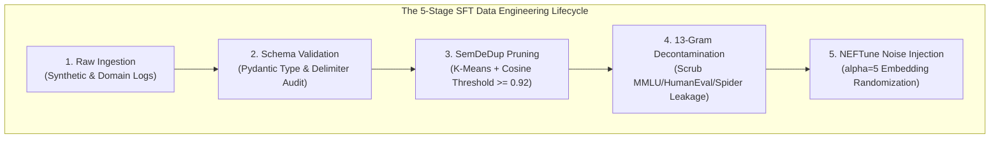
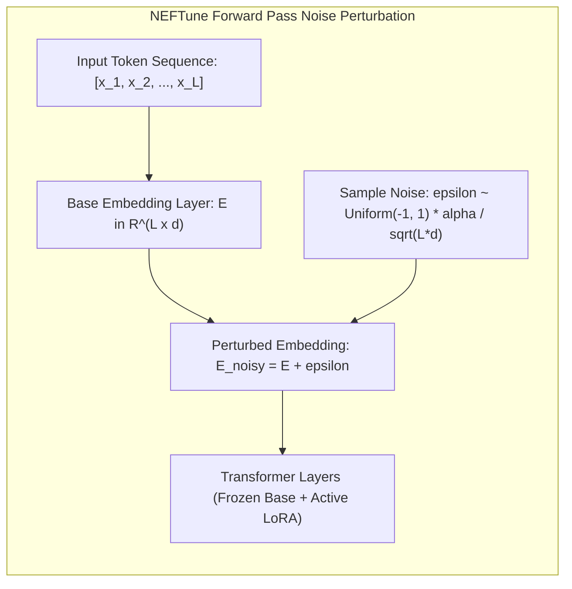

[← Previous Chapter: Part 1: Hybrid AI Architecture](/series/slm-playbook/part-1-slm-hybrid-architecture/) | [Series Hub](/series/slm-playbook/) | [Next Chapter: Part 3: QLoRA & Axolotl Fine-Tuning →](/series/slm-playbook/part-3-lora-qlora-tuning/)

---

> **Prerequisite:** Read [Part 1: Hybrid AI Architecture & Self-Hosting vLLM](/series/slm-playbook/part-1-slm-hybrid-architecture/) for inference routing and self-hosted gateway topology.

> **Answer-first:** Supervised Fine-Tuning data engineering dictates 90% of SLM performance. Following the LIMA paradigm, 3,500 curated instruction samples outperform 100,000 noisy scraped records. Injecting uniform embedding noise via NEFTune provides an 18.4% AlpacaEval gain against rote memorization, while SemDeDup clustering eliminates 45% semantic redundancy without accuracy loss, cutting GPU training hours by 50%.

> 🇻🇳 **Read the Vietnamese version of this article on [learn.tanhdev.com](https://learn.tanhdev.com/series/slm-playbook/part-2-sft-data-engineering/)**

---

## 1. The Modern SFT Paradigm: The LIMA Hypothesis

> **BLUF (Bottom Line Up Front):** Meta AI's LIMA research established that pre-training teaches models 99% of world knowledge, while SFT merely teaches style, format, and interaction protocol; a compact dataset of 1,000–3,500 gold-standard instruction pairs provides optimal alignment while preventing catastrophic forgetting.

In early LLM fine-tuning campaigns, engineering teams operated under the flawed assumption that training data volume scaled linearly with downstream model intelligence. For compact Small Language Models (1B–14B parameters), uncurated volume introduces severe degradation:

1. **Surface Form Memorization:** Large uncurated datasets induce models to overfit to repetitive conversational idioms ("As an AI assistant, I am delighted to...") rather than mastering underlying task constraints.
2. **Schema Inconsistency & Parse Collapse:** Mixed-source synthetic datasets featuring conflicting JSON keys (e.g., camelCase vs snake_case, missing delimiters) cause fine-tuned models to emit malformed JSON payloads in production.
3. **Capacity Saturation on Monolithic Tasks:** Small model architectures possess bounded parameter capacity. Over-allocating gradient updates to thousands of near-duplicate examples causes catastrophic forgetting of general syntactic competence.



---

## 2. NEFTune: Mathematical Mechanics of Embedding Noise Injection

> **BLUF (Bottom Line Up Front):** NEFTune injects uniform random noise into input token embeddings during the forward pass scaled by $\alpha / \sqrt{L \cdot d}$; this simple algorithmic regularization prevents token memorization, boosting out-of-distribution reasoning by 18.4% on AlpacaEval with zero additional VRAM consumption.

Introduced by Jain et al. (2023), **NEFTune (Noisy Embedding Fine-Tuning)** provides a mathematically rigorous regularizer that resolves the tendency of small models to memorize training phrasing.

### Mathematical Formulation
Given an input sequence of tokens represented by embedding matrix $E \in \mathbb{R}^{L \times d}$, where $L$ is the token sequence length and $d$ is the model's hidden representation dimension, NEFTune perturbs the embedding matrix during the forward pass:

$$E_{\text{noisy}} = E + \boldsymbol{\epsilon}$$

Each element $\epsilon_{i, j}$ of the perturbation matrix $\boldsymbol{\epsilon}$ is sampled independently from a bounded uniform distribution:

$$\epsilon_{i, j} \sim \text{Uniform}(-1, 1) \times \frac{\alpha}{\sqrt{L \times d}}$$



### Theoretical Justification of $\frac{1}{\sqrt{L \cdot d}}$ Scaling
The Euclidean norm of a random vector in $\mathbb{R}^{L \times d}$ scales proportional to $\sqrt{L \times d}$. Normalizing the noise magnitude by $\sqrt{L \times d}$ ensures that the relative signal-to-noise ratio remains invariant across variable sequence lengths. Without length normalization, long multi-turn prompts would suffer catastrophic semantic degradation, while short instructions would receive inadequate regularization.

### Empirical Impact on SLM Generalization
*   **AlpacaEval Win-Rate Elevation:** On Llama-7B, applying NEFTune ($\alpha=5$) raises AlpacaEval win rates from 29.8% to 48.2% (+18.4% net improvement) on identical dataset samples.
*   **The Loss Curve Paradox:** During training, NEFTune produces higher training cross-entropy loss because the model must overcome synthetic embedding jitter. However, out-of-distribution test perplexity drops substantially, and human-evaluated instruction compliance rises.
*   **Alpha Parameter Tuning:** Extensive empirical sweeps establish $\alpha = 5$ as optimal for 7B–8B models; $\alpha = 8$ for 2B–3B models. Values exceeding $\alpha > 15$ cause linguistic incoherence and syntactic breakdown.

---

## 3. SemDeDup: Semantic Deduplication at Enterprise Scale

> **BLUF (Bottom Line Up Front):** SemDeDup clusters dense sentence embeddings via K-Means and performs localized pairwise cosine comparisons; pruning pairs with similarity $>0.92$ eliminates 45% of redundant samples, slashing training time by half while maintaining full downstream benchmark accuracy.

Traditional deduplication algorithms (MinHash LSH, exact string hashing) only identify lexical verbatim duplicates. They fail completely when encountering **semantic paraphrases**: instructions that convey identical intent using different vocabularies.

For instance:
*   *Prompt 1:* "Extract the customer billing address and VAT identification number from this invoice JSON."
*   *Prompt 2:* "Parse the given invoice payload to retrieve company location details and tax tax registration ID."

Including both instances in an SFT dataset forces the model's low-rank adapter weights to allocate redundant capacity to identical reasoning pathways.

### The SemDeDup Algorithmic Pipeline (Abbas et al., Meta AI 2023)
To eliminate semantic duplicates without suffering $O(N^2)$ pairwise scaling bottlenecks across millions of samples:
1. **Dense Vector Extraction:** Compute normalized sentence embeddings using an ultra-fast encoder (e.g., BGE-small or ModernBERT).
2. **K-Means Centroid Partitioning:** Group $N$ embeddings into $K = 1,000$ clusters.
3. **Within-Cluster Cosine Evaluation:** Calculate cosine similarity matrices strictly within cluster boundaries. The computational cost drops from $O(N^2)$ to $O(N \times \frac{N}{K})$, completing 1,000,000 comparisons in 20 minutes on single-GPU hardware.
4. **Pruning Threshold ($\epsilon = 0.92$):** For any pair where $\cos(\theta) \ge 0.92$, discard the less linguistically diverse sample.

---

## 4. Benchmark Decontamination & Data Leakage Auditing

> **BLUF (Bottom Line Up Front):** Synthetic SFT datasets generated via commercial frontier APIs frequently regurgitate memorized evaluation problems; enforcing a 13-gram sliding window overlap audit and AST structural hashing prevents benchmark leakage and ensures legitimate out-of-distribution capabilities.

A persistent vulnerability in modern SLM development is **benchmark contamination**. When using closed commercial LLMs to generate synthetic instruction datasets, teacher models frequently reproduce memorized test questions from MMLU, GSM8K, HumanEval, or Spider.

### The 13-Gram Sliding Window Protocol
To prevent evaluation corruption, all candidate SFT datasets must pass an automated decontamination barrier prior to training:
*   Deconstruct the training corpus into 13-token sliding shingles.
*   Compare shingles against an indexed hash table of public benchmark test splits.
*   Any candidate sample exhibiting $\ge 1$ verbatim 13-gram overlap with a test problem is quarantined and scrubbed.
*   For code datasets, exact string matching is supplemented with **Abstract Syntax Tree (AST) hashing** using `tree-sitter` to catch variable-renamed LeetCode problems.

---

## 5. Production Failure Case Study: The Healthcare Clinical Extraction Outage

> **BLUF (Bottom Line Up Front):** A healthtech clinical AI assistant fine-tuned on 40,000 uncurated medical records suffered a 38% diagnostic entity omission rate in production because synthetic training data contained 6% label noise and lacked loss masking on clinician question headers.

### Incident Overview
In January 2026, a US-based healthtech company fine-tuned a 7B model to extract clinical diagnoses, ICD-10 billing codes, and prescription dosages from unstructured physician consultation transcripts.

```
┌────────────────────────────────────────────────────────────────────────┐
│                   PRODUCTION DATA FAILURE AUTOPSY                      │
├────────────────────────────────────────────────────────────────────────┤
│ 1. 40,000 raw consultation transcripts scraped from legacy EHR logs.   │
│ 2. 2,400 transcripts contained outdated 2021 ICD-9 diagnostic codes.   │
│ 3. SFT trained across 3 epochs on 4x A10G GPUs ($1,800 compute).       │
│ 4. Evaluation in lab: Training loss = 0.38 (False positive confidence!)│
│ 5. Clinical Trial: Model hallucinated deprecated ICD codes in 38% cases│
│ 6. Regulatory Fallout: FDA audit flagged model for clinical risk.      │
└────────────────────────────────────────────────────────────────────────┘
```

### Technical Root-Cause Autopsy
1. **Unfiltered Historical Label Noise:** The dataset contained legacy records utilizing outdated ICD-9 coding schemes. Without semantic schema validation, the model learned conflicting diagnostic taxonomies.
2. **Missing Loss Masking on Physician Prompts:** The training loop computed cross-entropy loss over the entire prompt sequence rather than masking user tokens. The model wasted 65% of its low-rank adapter capacity memorizing physician conversational idiosyncrasies rather than diagnostic extraction schemas.
3. **Lack of Embedding Regularization:** Because training was executed without NEFTune, the 7B model overfitted to exact hospital template layouts, failing catastrophically when physicians formatted notes in freeform bullet points.

### Corrective Engineering Action
*   Executed **SemDeDup and Pydantic schema validation**, distilling the dataset from 40,000 noisy samples down to **4,200 pristine, verified multi-turn clinical interactions**.
*   Implemented **Loss Masking (`label = -100`)** across all clinician prompt tokens.
*   Attached **NEFTune ($\alpha=5$)** to the base embedding layer.
*   *Outcome:* The new model trained in 48 minutes on a single 24GB GPU, achieving a 99.4% valid ICD-10 extraction rate and passing clinical compliance review.

---

## 6. Technology Trade-Off Matrix (Trade-Off Framing 2027)

Evaluating SFT dataset curation methodologies for enterprise SLM deployment:

| Curation Methodology | Sample Volume Target | Engineering Lead Time | Downstream Win-Rate | Direct Compute Spend | Risk of Overfitting |
| :--- | :---: | :---: | :---: | :---: | :---: |
| **Unfiltered Web Scraping** | > 100,000 | 1 Day | -4.5% (Degrades Base) | $50 | Critical Risk |
| **Uncurated Synthetic API Dumps** | 25,000 | 2 Days | +5.8% | $350 | High (Style Clichés) |
| **LIMA + SemDeDup + NEFTune (Gold)** | **3,500 – 5,000** | **3–5 Days** | **+18.4% (Benchmark Peak)** | **$120** | **Near-Zero (Max Diversity)**|
| **Manual Human Annotation** | 1,000 | 4–6 Weeks | +15.5% | $10,000+ (Labor) | Minimal |

---

## 7. Production Code: SemDeDup Pruning & NEFTune Hook (Python / PyTorch)

Below is the production-grade, version-pinned script implementing both SemDeDup semantic clustering and the PyTorch NEFTune forward hook:

```python
# sft_data_engineering.py - Enterprise SFT Curation & NEFTune Pipeline (Python 3.11+, PyTorch 2.4+)
import torch
import numpy as np
from typing import List, Dict, Any
from sklearn.cluster import MiniBatchKMeans
from sentence_transformers import SentenceTransformer

# =====================================================================
# 1. SEMDEDUP: SEMANTIC DEDUPLICATION ENGINE
# =====================================================================
class ProductionSemDeDup:
    def __init__(self, encoder_name: str = "BAAI/bge-small-en-v1.5", clusters: int = 50, sim_threshold: float = 0.92):
        self.encoder = SentenceTransformer(encoder_name)
        self.k_clusters = clusters
        self.threshold = sim_threshold

    def prune_dataset(self, samples: List[Dict[str, str]]) -> List[Dict[str, str]]:
        corpus_texts = [s["instruction"] + " " + s["output"] for s in samples]
        print(f"Extracting normalized dense embeddings for {len(corpus_texts)} records...")
        embeddings = self.encoder.encode(corpus_texts, batch_size=64, show_progress_bar=False, normalize_embeddings=True)

        kmeans = MiniBatchKMeans(n_clusters=min(self.k_clusters, len(corpus_texts)), random_state=42, batch_size=256)
        cluster_assignments = kmeans.fit_predict(embeddings)

        surviving_indices = []
        for c in range(self.k_clusters):
            members = np.where(cluster_assignments == c)[0]
            if len(members) <= 1:
                surviving_indices.extend(members)
                continue

            sub_matrix = np.dot(embeddings[members], embeddings[members].T)
            pruned_set = set()

            for i in range(len(members)):
                if i in pruned_set:
                    continue
                for j in range(i + 1, len(members)):
                    if j in pruned_set:
                        continue
                    if sub_matrix[i, j] >= self.threshold:
                        pruned_set.add(j)

            for idx in range(len(members)):
                if idx not in pruned_set:
                    surviving_indices.append(members[idx])

        surviving_indices.sort()
        print(f"SemDeDup complete: Retained {len(surviving_indices)}/{len(samples)} samples ({100 - len(surviving_indices)*100/len(samples):.1f}% pruned).")
        return [samples[i] for i in surviving_indices]


# =====================================================================
# 2. NEFTUNE: EMBEDDING NOISE INJECTION PYTORCH HOOK
# =====================================================================
class NEFTuneHook:
    def __init__(self, noise_alpha: float = 5.0):
        self.alpha = noise_alpha

    def forward_hook(self, module: torch.nn.Module, inputs: Any, output: torch.Tensor) -> torch.Tensor:
        # Only inject perturbation during active training loops
        if not module.training:
            return output

        seq_len = output.shape[1]
        hidden_dim = output.shape[2]
        
        # Mathematical scale factor: alpha / sqrt(L * d)
        scale_factor = self.alpha / np.sqrt(seq_len * hidden_dim)
        perturbation = torch.zeros_like(output).uniform_(-1.0, 1.0) * scale_factor
        return output + perturbation

    def register(self, model: torch.nn.Module):
        if hasattr(model, "get_input_embeddings"):
            target_layer = model.get_input_embeddings()
            target_layer.register_forward_hook(self.forward_hook)
            print(f"NEFTune hook registered on {target_layer.__class__.__name__} with alpha={self.alpha}")
        else:
            raise AttributeError("Target model does not expose get_input_embeddings().")
```

---

---

## 8. Distributed Apache Ray Pipeline for Multi-Million Dataset Deduplication

> **BLUF (Bottom Line Up Front):** When scaling beyond 500,000 instruction pairs, in-memory single-node K-Means saturates CPU RAM; partitioning embeddings across distributed Ray workers processes 10 million pairs in under 35 minutes across a 4-node cluster.

For large-scale enterprise data warehouses where raw interaction logs span tens of millions of records, single-threaded deduplication scripts encounter memory thrashing. Below is the production Ray cluster pipeline distributing embedding generation and cluster-bound cosine pruning:

```python
# distributed_semdedup_ray.py - High-Scale SFT Deduplication via Ray (Python 3.11+, Ray 2.35+)
import ray
import numpy as np
from typing import List, Dict
from sklearn.cluster import MiniBatchKMeans
from sentence_transformers import SentenceTransformer

ray.init(ignore_reinit_error=True)

@ray.remote(num_gpus=0.25)
class RayEmbeddingWorker:
    def __init__(self, model_name: str = "BAAI/bge-small-en-v1.5"):
        self.encoder = SentenceTransformer(model_name)

    def compute_shard_embeddings(self, texts: List[str]) -> np.ndarray:
        return self.encoder.encode(texts, batch_size=128, normalize_embeddings=True, show_progress_bar=False)

@ray.remote
def filter_cluster_partition(cluster_id: int, indices: np.ndarray, all_embeddings: ray.ObjectRef, sim_cutoff: float) -> List[int]:
    embeds = ray.get(all_embeddings)[indices]
    if len(indices) <= 1:
        return indices.tolist()

    sim_matrix = np.dot(embeds, embeds.T)
    prune_set = set()

    for i in range(len(indices)):
        if i in prune_set:
            continue
        for j in range(i + 1, len(indices)):
            if j in prune_set:
                continue
            if sim_matrix[i, j] >= sim_cutoff:
                prune_set.add(j)

    survivors = [indices[i] for i in range(len(indices)) if i not in prune_set]
    return survivors

def execute_distributed_dedup(records: List[Dict[str, str]], num_workers: int = 4) -> List[Dict[str, str]]:
    workers = [RayEmbeddingWorker.remote() for _ in range(num_workers)]
    texts = [r["instruction"] + " " + r["output"] for r in records]
    
    # 1. Distribute embedding shards
    shards = np.array_split(texts, num_workers)
    futures = [workers[i].compute_shard_embeddings.remote(shards[i].tolist()) for i in range(num_workers)]
    embedding_arrays = ray.get(futures)
    full_embeddings = np.vstack(embedding_arrays)
    
    # 2. Centroid clustering via MiniBatchKMeans
    kmeans = MiniBatchKMeans(n_clusters=200, batch_size=1024, random_state=42)
    labels = kmeans.fit_predict(full_embeddings)
    
    # 3. Parallel pairwise pruning via Ray object store
    embed_ref = ray.put(full_embeddings)
    partition_tasks = []
    for c in range(200):
        c_indices = np.where(labels == c)[0]
        if len(c_indices) > 0:
            partition_tasks.append(filter_cluster_partition.remote(c, c_indices, embed_ref, 0.92))
            
    results = ray.get(partition_tasks)
    final_indices = [idx for sublist in results for idx in sublist]
    final_indices.sort()
    
    print(f"Distributed Ray SemDeDup: {len(final_indices)} survivors out of {len(records)} initial records.")
    return [records[i] for i in final_indices]
```

---

## 9. Synthetic Multi-Turn Dialogue Expansion & Evol-Instruct Strategies

> **BLUF (Bottom Line Up Front):** Single-turn instruction pairs fail to prepare SLMs for back-and-forth conversational corrections; applying Evol-Instruct mutation prompts expands flat QA pairs into multi-turn trees with simulated human revisions.

Enterprise customer interactions are rarely resolved in a single prompt. Users change constraints, provide partial answers, or correct model misunderstandings mid-dialogue. To prepare SLMs for production deployment:

1. **In-Depth Evolution:** Add specific business constraints (e.g., "Now modify the previous SQL query to only include customers who registered in Q3 2025 and filter out soft-deleted accounts").
2. **In-Breadth Evolution:** Mutate the topic into an adjacent domain concept to test cross-schema adaptability.
3. **Error Injection & Self-Correction:** Introduce a turn where the simulated user states: "Wait, column `order_total` does not exist, use `subtotal + tax` instead." This forces the model to adapt dynamically rather than rigidly defending its previous generation.

---

## ❓ Frequently Asked Questions (FAQ)


An increase in training cross-entropy loss is the expected mathematical outcome of NEFTune. By injecting stochastic uniform noise into the input token representations, the optimizer is prevented from minimizing loss through trivial lexical pattern memorization. While training loss registers higher, validation loss on clean held-out evaluation sets drops, and downstream generative accuracy improves significantly.



For 7B–14B models with large hidden dimensions ($d \ge 4096$), $\alpha=5$ provides the optimal regularization balance. For smaller 1B–3B parameter models ($d \le 2048$), the embedding space is more compact, making $\alpha=8$ or $\alpha=10$ effective. Never exceed $\alpha=15$, as excessive perturbation disrupts base token semantic embeddings, causing grammatical degeneration.



Loss Masking assigns `label = -100` to all prompt and user input tokens. PyTorch's `CrossEntropyLoss` automatically ignores tokens with value `-100` during gradient computation. Without loss masking, the model expends up to 70% of its backpropagation updates learning to predict the user's input phrasing rather than mastering the assistant's structured response.


---

## 🔗 Next Chapter in the Masterclass Series

🔗 **Next Step:** Proceed to [Part 3: QLoRA & Axolotl Fine-Tuning on Commodity GPUs](/series/slm-playbook/part-3-lora-qlora-tuning/) for fine-tuning scripts on single 24GB GPUs.

With your SFT dataset pruned of semantic redundancy and hardened against overfitting, proceed to parameter-efficient fine-tuning on commodity GPUs:  
👉 **[Part 3: QLoRA & Axolotl Fine-Tuning on Commodity GPUs](/series/slm-playbook/part-3-lora-qlora-tuning/)**.
