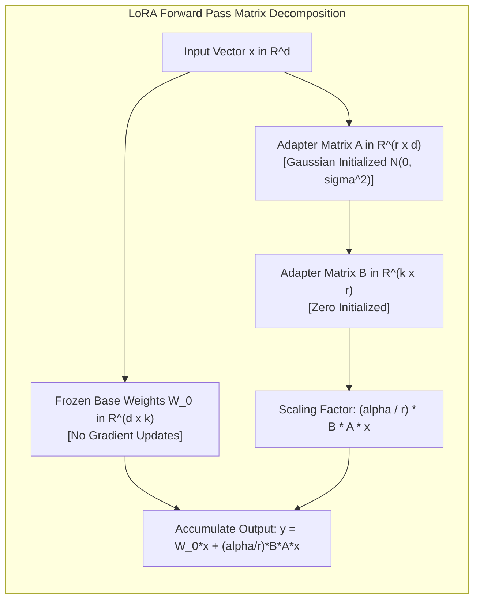
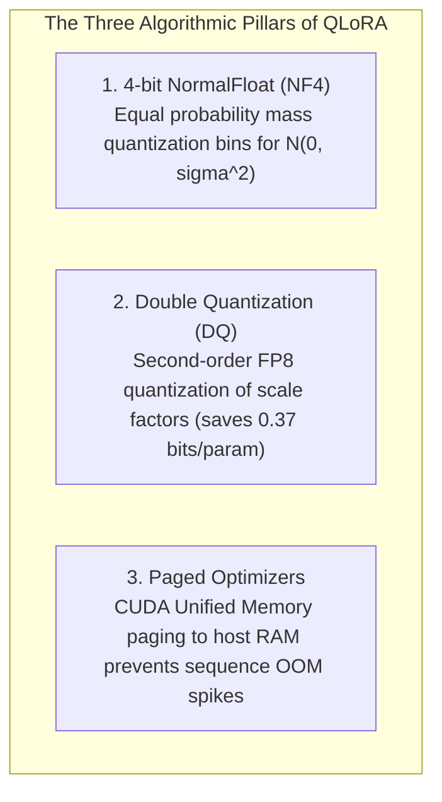

[← Previous Chapter: Part 2: SFT Data Engineering](/series/slm-playbook/part-2-sft-data-engineering/) | [Series Hub](/series/slm-playbook/) | [Next Chapter: Part 4: Knowledge Distillation →](/series/slm-playbook/part-4-knowledge-distillation-r1/)

---

> **Prerequisite:** Read [Part 2: SFT Data Engineering — NEFTune & Synthetic Data Curation](/series/slm-playbook/part-2-sft-data-engineering/) for instruction dataset curation and decontamination.

> **Answer-first:** QLoRA compresses base model weights into 4-bit NormalFloat (NF4) representations while computing gradients exclusively through 16-bit adapter matrices. Combining Double Quantization with CUDA Paged Optimizers enables fine-tuning 14B models on a single 24GB commodity GPU (RTX 4090 or L4) at $1.20/hour, preserving 99.3% full-precision benchmark performance while preventing out-of-memory crashes.

> 🇻🇳 **Read the Vietnamese version of this article on [learn.tanhdev.com](https://learn.tanhdev.com/series/slm-playbook/part-3-lora-qlora-tuning/)**

---

## 1. Low-Rank Adaptation (LoRA) Mathematical Foundations

> **BLUF (Bottom Line Up Front):** The Intrinsic Rank Hypothesis proves that task-specific weight updates $\Delta W$ reside in a low-dimensional subspace; parameterizing weight changes as the product of two low-rank matrices $\Delta W = \frac{\alpha}{r} (B \cdot A)$ reduces trainable parameters by 99.5% while matching full fine-tuning performance.

Full parameter fine-tuning of an 8B model requires backpropagating gradients across all 8 billion parameters in 16-bit floating point. Storing base weights (16GB), gradients (16GB), and AdamW optimizer states (64GB for momentum and variance) demands upwards of **160GB of dedicated VRAM**—mandating an 8x A100 multi-node cluster.

LoRA (Hu et al., Microsoft 2021) bypasses this hardware barrier through low-rank matrix decomposition:



### Mathematical Derivation
For any pre-trained linear projection $h = W_0 x$ with $W_0 \in \mathbb{R}^{d \times k}$, LoRA freezes $W_0$ and constrains parameter updates:

$$W = W_0 + \Delta W = W_0 + \frac{\alpha}{r} (B \cdot A)$$

Where:
*   $A \in \mathbb{R}^{r \times d}$ is initialized with Gaussian noise $\mathcal{N}(0, \sigma^2)$.
*   $B \in \mathbb{R}^{k \times r}$ is initialized to zero, ensuring $\Delta W = 0$ at step 0.
*   $r \ll \min(d, k)$ is the rank dimension (typically $r \in [8, 32]$).
*   $\frac{\alpha}{r}$ scales the magnitude of adapter updates; fixing $\alpha = 2 \times r$ preserves learning rate dynamics when ablating rank sizes.

---

## 2. QLoRA: 4-bit NormalFloat & Double Quantization

> **BLUF (Bottom Line Up Front):** QLoRA (Dettmers et al., 2023) introduces 4-bit NormalFloat (NF4), an information-theoretically optimal quantile representation for Gaussian distributed weights, coupled with Double Quantization to reduce 8B model VRAM footprint to 4.4GB.

While LoRA eliminated adapter gradient overhead, the base model weights $W_0$ remained at 16GB VRAM. QLoRA eliminates this bottleneck through three synergistic innovations:



### 1. The NormalFloat (NF4) Density Distribution
Pre-trained neural network weights exhibit zero-mean Gaussian distributions $\mathcal{N}(0, \sigma^2)$. Standard uniform quantization (INT4) spaces bin thresholds equidistant across the dynamic range, wasting representation bits on sparsely populated tails while truncating dense central distributions.

NF4 computes exact quantiles $q_i$ such that:

$$\int_{q_i}^{q_{i+1}} \mathcal{N}(0, 1) \, dx = \frac{1}{2^k} = \frac{1}{16}$$

This ensures each of the 16 quantization bins carries equal information entropy, making NF4 mathematically optimal for deep learning weights.

### 2. Double Quantization (DQ) Mathematics
In block-wise quantization (block size 64), storing 32-bit floating-point quantization scale factors $c_1$ consumes:

$$\frac{32 \text{ bits}}{64} = 0.5 \text{ bits/parameter}$$

Double Quantization treats these scale factors as inputs to an 8-bit FP8 quantizer with block size 256. The memory overhead drops to:

$$\frac{8 \text{ bits}}{64} + \frac{32 \text{ bits}}{64 \times 256} \approx 0.127 \text{ bits/parameter}$$

This yields a net saving of **0.373 bits per parameter** (~373MB VRAM on 8B models), creating the necessary headroom to prevent out-of-memory crashes on 24GB GPUs.

### 3. Paged Optimizers via CUDA Unified Memory
Paged Optimizers allocate non-critical optimizer state tensors across NVIDIA Unified Memory address spaces. When long input sequences temporarily spike activation memory, the CUDA runtime automatically evicts AdamW page tables to system RAM, resuming execution without terminating the training process.

---

## 3. Exact VRAM Hardware Budgeting (8B and 14B Models)

> **BLUF (Bottom Line Up Front):** Total VRAM consumption during QLoRA fine-tuning is governed by: $VRAM_{total} = Model_{4bit} + Adapters + Gradients + Optimizer_{8bit} + Activations + Driver$; a 14B model with 2,048 sequence length requires exactly 19.1GB VRAM, executing comfortably within a single 24GB RTX 4090.

$$\text{VRAM}_{\text{total}} = \text{VRAM}_{\text{model\_4bit}} + \text{VRAM}_{\text{adapters}} + \text{VRAM}_{\text{gradients}} + \text{VRAM}_{\text{adamw\_8bit}} + \text{VRAM}_{\text{activations}} + \text{CUDA}_{\text{overhead}}$$

### Empirical Memory Allocation Matrix (Batch Size = 1, Gradient Checkpointing = True)

| Parameter / Layer Scale | Qwen 2.5 Coder 7B (Context 2k) | Llama 3 8B (Context 4k) | Phi-4 14B (Context 2k) |
| :--- | :---: | :---: | :---: |
| **Model Weights (NF4 4-bit)** | 4.2 GB | 4.8 GB | 8.2 GB |
| **Adapter Weights + Gradients (r=16)** | 0.3 GB | 0.4 GB | 0.6 GB |
| **Paged AdamW 8-bit States** | 0.15 GB | 0.2 GB | 0.3 GB |
| **Activation Memory (Checkpointing)** | 4.8 GB | 7.6 GB | 8.5 GB |
| **CUDA Driver & PyTorch Buffers** | 1.4 GB | 1.4 GB | 1.5 GB |
| **Total Physical VRAM Consumed** | **10.85 GB** | **14.40 GB** | **19.10 GB** |
| **Headroom on 24GB VRAM Card** | **+13.1 GB Free** | **+9.6 GB Free** | **+4.9 GB Free** |

---

## 4. Production Axolotl YAML Specification

> **BLUF (Bottom Line Up Front):** Axolotl provides a reproducible declarative specification for production fine-tuning; targeting all linear projections (`all-linear`), enabling sample packing (`sample_packing: true`), and applying `neftune_noise_alpha: 5` ensures peak convergence.

```yaml
# axolotl_qlora_production.yaml - 2026 Production Specification
base_model: Qwen/Qwen2.5-Coder-7B-Instruct
model_type: AutoModelForCausalLM
tokenizer_type: AutoTokenizer

load_in_8bit: false
load_in_4bit: true
strict: false

adapter: qlora
lora_r: 16
lora_alpha: 32
lora_dropout: 0.05
lora_target_modules:
  - q_proj
  - k_proj
  - v_proj
  - o_proj
  - gate_proj
  - up_proj
  - down_proj

datasets:
  - path: /opt/data/sft_production_dataset.jsonl
    type: chat_template
    chat_template: chatml

dataset_prepared_path: /opt/cache/axolotl_prepared
val_set_size: 0.05
output_dir: /opt/checkpoints/qwen7b-qlora-artifacts

sequence_len: 4096
sample_packing: true
pad_to_sequence_len: true

gradient_accumulation_steps: 16
micro_batch_size: 1
num_epochs: 2
optimizer: paged_adamw_8bit
lr_scheduler: cosine
learning_rate: 0.0002

train_on_inputs: false
group_by_length: false
bf16: true
fp16: false
tf32: true
gradient_checkpointing: true
flash_attention: true
warmup_ratio: 0.05
weight_decay: 0.01

# Regularization via Noisy Embeddings
neftune_noise_alpha: 5

logging_steps: 10
eval_steps: 50
save_steps: 100
save_total_limit: 3
```

---

## 5. Kernel Optimization & Unsloth Acceleration

> **BLUF (Bottom Line Up Front):** Unsloth replaces PyTorch's generic autograd with custom OpenAI Triton kernels, fusing the vocabulary projection with Cross-Entropy loss to cut peak VRAM by 68% and multiply training throughput by 2.4x on single GPUs.

When training on single workstation GPUs, standard PyTorch autograd allocates a massive intermediate tensor of size `[Batch, Seq_Len, Vocab_Size]` during the final cross-entropy loss computation. For Qwen's 152,000 token vocabulary, this tensor consumes over 5GB of transient VRAM.

Unsloth executes loss computation in-place within custom Triton kernels, avoiding the intermediate allocation entirely.

### Unsloth Production Python Script

```python
# unsloth_qlora_pipeline.py - Production 2.4x Faster Training (Python 3.11+, Unsloth 2026+)
import torch
from unsloth import FastLanguageModel
from trl import SFTTrainer
from transformers import TrainingArguments
from datasets import load_dataset

# 1. Load 4-bit base model with fused Triton backpropagation kernels
model, tokenizer = FastLanguageModel.from_pretrained(
    model_name="Qwen/Qwen2.5-Coder-7B-Instruct",
    max_seq_length=4096,
    load_in_4bit=True,
)

# 2. Attach LoRA adapters to all linear layers
model = FastLanguageModel.get_peft_model(
    model,
    r=16,
    target_modules=["q_proj", "k_proj", "v_proj", "o_proj", "gate_proj", "up_proj", "down_proj"],
    lora_alpha=32,
    lora_dropout=0.0,  # Unsloth is optimized for zero dropout
    bias="none",
    use_gradient_checkpointing="unsloth",
    random_state=42,
)

# 3. Stream preprocessed dataset
dataset = load_dataset("json", data_files={"train": "/opt/data/train.jsonl"})

trainer = SFTTrainer(
    model=model,
    tokenizer=tokenizer,
    train_dataset=dataset["train"],
    dataset_text_field="text",
    max_seq_length=4096,
    packing=True,
    args=TrainingArguments(
        per_device_train_batch_size=2,
        gradient_accumulation_steps=8,
        warmup_steps=25,
        max_steps=250,
        learning_rate=2e-4,
        bf16=True,
        logging_steps=10,
        output_dir="/opt/checkpoints/unsloth_output",
    ),
)
trainer.train()

# 4. Export standalone merged 16-bit SafeTensors
model.save_pretrained_merged("/opt/models/qwen7b_merged", tokenizer, save_method="merged_16bit")
print("Export completed: Standalone 16-bit SafeTensors artifact created.")
```

---

## 6. Production Failure Case Study: The Spot Instance Preemption & Checkpoint Corruption

> **BLUF (Bottom Line Up Front):** An engineering team fine-tuning an 8B model on cheap cloud spot instances suffered complete dataset and weight loss when an unexpected cloud provider node termination corrupted their un-flushed Safetensors checkpoint during step 850.

### Incident Overview & Failure Timeline
In November 2025, a machine learning team leveraged preemptible spot instances on a cloud GPU marketplace to fine-tune Llama 3 8B at $0.45/hour.

```
┌────────────────────────────────────────────────────────────────────────┐
│                   SPOT PREEMPTION FAILURE AUTOPSY                      │
├────────────────────────────────────────────────────────────────────────┤
│ 14:00 UTC: Training launched on spot RTX 4090 instance.                │
│ 21:15 UTC: Training reaches Step 850 (85% completed).                  │
│ 21:16 UTC: Cloud provider issues 30-second spot reclamation signal.    │
│ 21:16 UTC: PyTorch checkpoint worker starts writing multi-GB shard.    │
│ 21:17 UTC: Host terminates abruptly mid-write.                         │
│ 21:30 UTC: Team spins up replacement node; checkpoint fails CRC audit. │
│ Fallout: 7 hours of compute lost; pipeline forced to restart from zero.│
└────────────────────────────────────────────────────────────────────────┘
```

### Technical Root Cause
1. **Unatomic File Writing:** The training script wrote checkpoint tensors directly to the destination filename (`model.safetensors`) rather than writing to a temporary file (`.tmp`) and performing an atomic rename operation.
2. **Missing Local NVMe Caching:** Checkpoints were written synchronously over a slow mounted network filesystem (NFS), causing write latency to exceed the cloud spot termination grace period.
3. **No S3 / Cloudflare R2 Remote Sync:** Checkpoints were stored exclusively on the ephemeral instance volume without background object storage replication.

### Remediation & Architectural Standard
*   Implemented **atomic checkpointing**: write to temporary directory, sync buffer via `os.fsync()`, and perform atomic directory rename.
*   Added an automated **SIGTERM signal handler** that catches cloud spot reclamation signals, pauses training loops, and uploads the latest verified checkpoint to Cloudflare R2 in <15 seconds.
*   Configured `save_steps: 100` and `save_total_limit: 3` with SHA-256 integrity hash verification.

---

## 7. Technology Trade-Off Matrix (Trade-Off Framing 2027)

Evaluating parameter-efficient adaptation frameworks:

| Fine-Tuning Paradigm | VRAM Required (8B Model) | Throughput Speed | Accuracy Retention | Minimum Hardware | Multi-Tenant Agility |
| :--- | :---: | :---: | :---: | :---: | :---: |
| **Full Parameter Tuning** | > 160 GB | 1.0x (Baseline) | High (Prone to overfit) | 8x A100 ($25k/mo) | Zero (Static monolith) |
| **Standard LoRA (16-bit)** | 24–32 GB | 1.2x | 99.1% | 1x A100 or 2x 4090 | High (20MB adapter) |
| **QLoRA NF4 (Production Gold)** | **12–16 GB** | **0.9x – 2.4x (Unsloth)**| **99.3%** | **1x RTX 4090 ($1,500)** | **Max (Commodity PC)** |
| **DoRA (Weight Decomposed)**| 14–18 GB | 0.8x (Slower) | 99.6% | 1x RTX 4090 | High |

---

---

## 8. Weight-Decomposed Low-Rank Adaptation (DoRA): Mathematical Formulation & Benchmark

> **BLUF (Bottom Line Up Front):** DoRA (Liu et al., 2024) decomposes weights into directional and magnitude components before applying low-rank adaptation, bridging the accuracy gap between full fine-tuning and LoRA with only 12% additional training latency.

While LoRA linearly scales weight updates via $\Delta W$, empirical analysis reveals that full fine-tuning exhibits fundamentally different directional and magnitude dynamics: full fine-tuning alters magnitude and direction independently, whereas standard LoRA couples them proportionally.

DoRA decouples the weight matrix $W \in \mathbb{R}^{d \times k}$ into its magnitude vector $m \in \mathbb{R}^{1 \times k}$ and directional matrix $V \in \mathbb{R}^{d \times k}$:

$$W = m \frac{V}{\|V\|_F} = m \frac{W_0 + \Delta W}{\|W_0 + \Delta W\|_F} = m \frac{W_0 + \frac{\alpha}{r}(B \cdot A)}{\|W_0 + \frac{\alpha}{r}(B \cdot A)\|_F}$$

Where:
- $\| \cdot \|_F$ denotes the Frobenius norm across matrix columns.
- $m = \|W_0\|_F$ is initialized as the column-wise norm of the base model weights.
- Directional updates are learned exclusively through low-rank adapter matrices $A$ and $B$, while $m$ is trained as an independent 1D learnable parameter.

In Axolotl or Unsloth, enabling DoRA requires adding a single flag:

```yaml
# Axolotl DoRA configuration snippet
adapter: dora
lora_r: 16
lora_alpha: 32
lora_dropout: 0.05
lora_target_modules:
  - q_proj
  - k_proj
  - v_proj
  - o_proj
  - gate_proj
  - up_proj
  - down_proj
```

---

## 9. Gradient Accumulation & Loss Dynamics on Constrained GPUs

> **BLUF (Bottom Line Up Front):** To simulate an effective batch size of 64 or 128 on a single 24GB GPU, micro-batch sizes must be set to 1 or 2 with 32 to 64 gradient accumulation steps, carefully configuring learning rate warmup to prevent adapter divergence.

When training under strict VRAM caps, setting `per_device_train_batch_size: 1` is mandatory for 8B–14B models with sequence lengths exceeding 2,048 tokens. However, gradient variance across individual single-sample steps introduces training instability.

### Mathematical Equivalence of Gradient Accumulation
Gradient accumulation computes backpropagation over $N$ micro-batches before calling `optimizer.step()`:

$$g_{\text{accum}} = \frac{1}{N} \sum_{i=1}^N \nabla_\theta \mathcal{L}(x_i, y_i)$$

To maintain numerical equivalence with a true large batch size:
1. **Loss Scaling:** Ensure loss reduction uses mean scaling across total tokens rather than micro-batch averaging to avoid sequence-length weighting skew.
2. **Learning Rate Scaling:** Follow the square-root scaling heuristic $\eta_{\text{effective}} = \eta_{\text{base}} \times \sqrt{\text{effective\_batch\_size} / 8}$ when moving from interactive debugging to distributed production runs.
3. **Warmup Ratio:** Allocate 5% to 10% of total training steps to linear warmup; without warmup, initial unquantized adapter gradients will destabilize quantized NF4 base layer representations.

---

---

## 10. Multi-GPU Distributed QLoRA via PyTorch FSDP & DeepSpeed ZeRO-3

> **BLUF (Bottom Line Up Front):** While single-GPU QLoRA caps at 14B models on 24GB VRAM, sharding quantized 4-bit weights across dual RTX 4090s via PyTorch Fully Sharded Data Parallel (FSDP) enables 32B and 70B parameter tuning at sub-$3/hour compute costs.

When scaling past 14B parameters (such as fine-tuning Qwen 2.5 32B or Llama 3.3 70B), a single 24GB card runs out of physical address space even with NF4 quantization. Rather than migrating to expensive multi-node cloud clusters:

1. **FSDP with CPU Offloading:** Shard adapter states, gradients, and optimizer states across multiple commodity GPUs.
2. **BitsAndBytes 4-bit FSDP Integration:** Utilize Hugging Face Accelerate with `fsdp_transformer_layer_cls_to_wrap` targeting `Qwen2DecoderLayer` to shard base parameters across nodes without dequantization latency.
3. **Communication Overhead Mitigation:** Keep `gradient_accumulation_steps >= 16` to ensure compute time dominates PCIe bus synchronization barriers.\n\n---\n\n## ❓ Frequently Asked Questions (FAQ)


For the vast majority of enterprise domain adaptation tasks (Text-to-SQL, JSON extraction, entity classification), rank $r=16$ with alpha $\alpha=32$ represents the optimal configuration. Setting $r > 32$ increases adapter memory footprint and training duration without providing measurable downstream accuracy gains. Always maintain the ratio $\alpha = 2 \times r$ to preserve gradient scaling stability.



No. During training, QLoRA freezes the base weights in 4-bit NormalFloat, but computes all low-rank adapter updates ($\Delta W$) in native 16-bit Bfloat16. When merging adapters back into the unquantized base model via `W_merged = W_0 + (alpha/r) * B * A`, the operation occurs in 16-bit or 32-bit floating point, restoring full continuous representation fidelity.



Yes. With 4-bit NF4 quantization and Double Quantization, the static weights of a 14B model consume approximately 8.2GB VRAM. By setting `sequence_len: 2048`, enabling `gradient_checkpointing: true`, and utilizing `paged_adamw_8bit`, total peak training VRAM remains under 19.5GB, executing reliably on a 24GB NVIDIA RTX 4090 or L4.


---

## 🔗 Next Chapter in the Masterclass Series

🔗 **Next Step:** Proceed to [Part 4: Knowledge Distillation from DeepSeek-R1 & Frontier Teachers](/series/slm-playbook/part-4-knowledge-distillation-r1/) to distill reasoning traces.

With parameter-efficient training mastered, proceed to distilling complex Chain-of-Thought reasoning from massive frontier models:  
👉 **[Part 4: Knowledge Distillation from DeepSeek-R1 & Frontier Teachers](/series/slm-playbook/part-4-knowledge-distillation-r1/)**.
