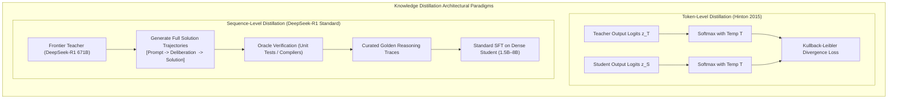
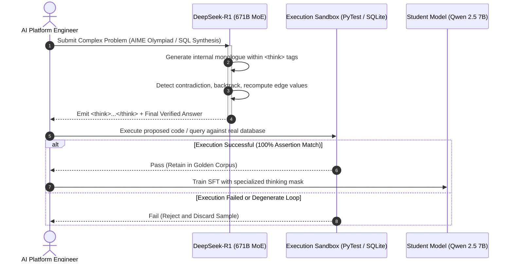
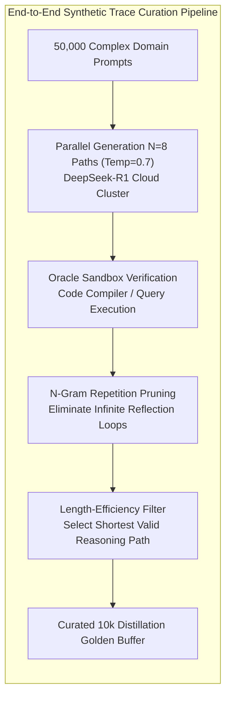
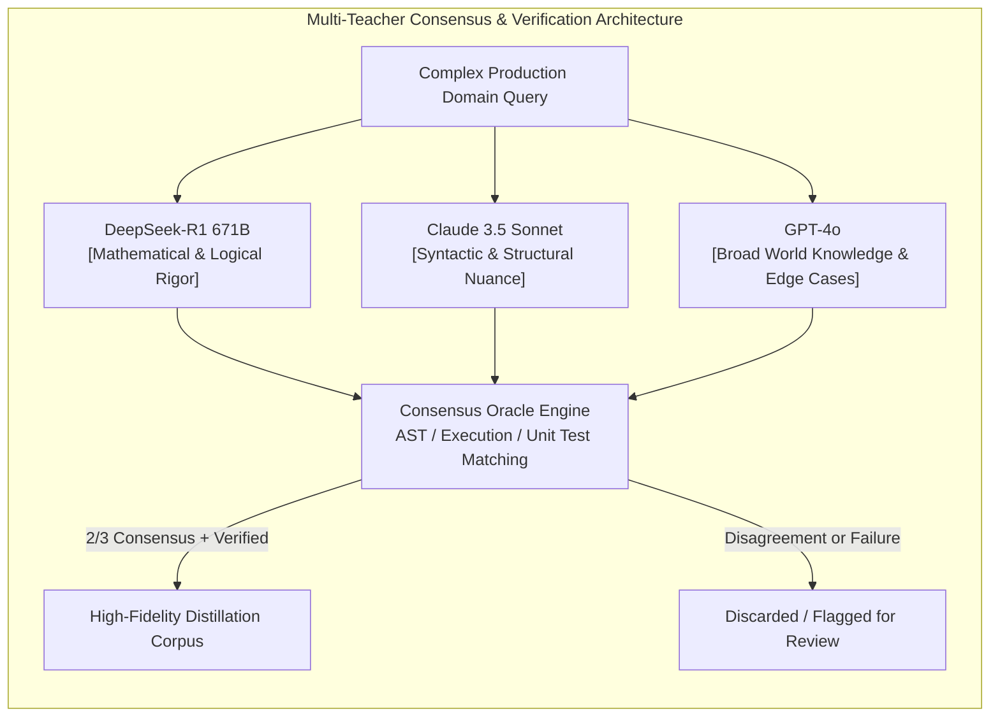

[← Previous Chapter: Part 3: QLoRA & Axolotl Fine-Tuning](/series/slm-playbook/part-3-lora-qlora-tuning/) | [Series Hub](/series/slm-playbook/) | [Next Chapter: Part 5: Preference Alignment: DPO, GRPO & KTO →](/series/slm-playbook/part-5-preference-alignment/)

---

> **Prerequisite:** Read [Part 3: QLoRA & Axolotl Fine-Tuning on Commodity GPUs](/series/slm-playbook/part-3-lora-qlora-tuning/) for low-rank parameter tuning and memory budgeting.

> **Answer-first:** Distilling long Chain-of-Thought (CoT) reasoning traces from DeepSeek-R1 (671B MoE) into compact 1.5B–8B student models transfers complex deductive capability without hosting frontier hardware. Combining forward-backward token KL divergence with rejection sampling on verifiable tasks enables a 7B student model to recover 88% of teacher mathematical reasoning performance at 1/50th the operational cost.

> 🇻🇳 **Read the Vietnamese version of this article on [learn.tanhdev.com](https://learn.tanhdev.com/series/slm-playbook/part-4-knowledge-distillation-r1/)**

---

## 1. The Distillation Paradigm: Token-Level vs Sequence-Level Transfer

> **BLUF (Bottom Line Up Front):** While token-level distillation (Hinton, 2015) requires direct access to full teacher logit probability vectors, sequence-level distillation (Kim & Rush, 2016) trains student models on verified complete execution paths, bypassing commercial API restrictions and tokenizer vocabulary mismatches.

Knowledge Distillation (KD) compresses the capability of an over-parameterized teacher network $\mathcal{T}$ into a compact student network $\mathcal{S}$. In modern LLM engineering, the distinction between token-level and sequence-level transfer defines feasibility:



### The Inherent Bottlenecks of Logit Distillation
In Hinton's classical formulation, teacher logits $z_i$ are smoothed via temperature $T$:
$$p_i = \frac{\exp(z_i / T)}{\sum_j \exp(z_j / T)}$$

When applied to 70B+ or 671B foundation models:
1. **Logit Extraction Bandwidth:** Exporting full float32 probability distributions over a 152,000-token vocabulary across billions of tokens requires multi-terabyte network storage.
2. **Proprietary API Black-Boxes:** Cloud APIs (OpenAI, Anthropic) intentionally truncate or withhold logit distributions, exposing only sampled text sequences.
3. **Mismatched Tokenizers:** Cross-family distillation (e.g., DeepSeek teacher with 152k vocab to Llama student with 128k vocab) prevents one-to-one token probability matching.

Sequence-level distillation with execution filtering solves all three bottlenecks by converting dark knowledge into explicit textual reasoning traces.

---

## 2. DeepSeek-R1 and the Emergence of Structured `<think>` Traces

> **BLUF (Bottom Line Up Front):** DeepSeek-R1 demonstrated that self-correction, counterfactual exploration, and edge-case verification can be formalized into explicit `<think>...</think>` markup blocks, enabling small student models to internalize advanced deliberation dynamics without multi-million-dollar RL search compute.

In early 2025, DeepSeek open-sourced DeepSeek-R1, a 671B MoE architecture trained with large-scale Reinforcement Learning directly from base weights. The most significant industry breakthrough was not merely the raw benchmark scores, but the release of **800,000 verified reasoning traces** distilled into compact dense models (R1-Distill-Qwen-1.5B through 14B).



### Anatomy of an Enterprise Reasoning Trace
A production-grade reasoning trace consists of three distinct segments:
1. **User Objective & Constraints:** Explicit schema definitions, system constraints, and input data.
2. **Internal Deliberation (`<think>...</think>`):** The step-by-step cognitive traversal:
   * Formulating an initial hypothesis.
   * Testing intermediate bounds: *"Wait, if table `orders` contains null `ship_date`, an inner join drops active shipments..."*.
   * Backtracking from degenerate assumptions.
   * Final verification check before concluding.
3. **Authoritative Response:** The polished, clean output delivered to downstream consumers.

---

## 3. Synthetic Reasoning Generation & Best-of-N Rejection Sampling

> **BLUF (Bottom Line Up Front):** Unfiltered teacher generations contain up to 22% hallucinated logic steps, circular repetition loops, or erroneous boundary assumptions; applying Best-of-N Rejection Sampling with automated execution sandboxes guarantees mathematical veracity in the student dataset.

Generating high-signal reasoning corpora requires a rigorous multi-stage curation pipeline:



### Critical Rejection Criteria
* **Automated Oracle Verification:** Traces must pass strict external deterministic tests. For Python synthesis, solutions must achieve 100% pass rate across automated pytest unit tests. For SQL, queries must yield identical result sets to human-curated ground truth without syntax warnings.
* **Degenerate Reflection Loop Elimination:** Large reasoning models occasionally trap themselves in circular self-doubt, repeating variations of *"Let me reconsider my previous deduction"* dozens of times. Applying a 4-gram repetition penalty filter (> 3 occurrences) prunes degenerate samples automatically.
* **Length-Efficiency Optimization:** When multiple candidate paths pass oracle verification, selecting the shortest valid reasoning trace trains student models to reason efficiently rather than padding sequences to maximize token counts.

---

## 4. Student Backbone Selection: Qwen 2.5 vs Phi-4 vs Llama 3.1

> **BLUF (Bottom Line Up Front):** The choice of student architecture dictates the ultimate performance ceiling; Qwen 2.5 (7B/14B) and Phi-4 (14B) serve as the premier distillation targets due to their native high-capacity tokenizers and dense attention mechanisms.

Comparing the primary open-weight architectures for enterprise reasoning distillation:

| Student Backbone | Model Size | Vocabulary Size | Attention Type | Native Context | Reasoning Receptivity |
| :--- | :---: | :---: | :---: | :---: | :---: |
| **Qwen 2.5** | 7B / 14B | **152,064** | GQA (Grouped-Query) | **128k Tokens** | ⭐⭐⭐⭐⭐ (Production Gold Standard) |
| **Microsoft Phi-4** | 14B | 100,352 | Standard MHA | 16k Tokens | ⭐⭐⭐⭐☆ (Outstanding Math Density) |
| **Meta Llama 3.1** | 8B | 128,256 | GQA | 128k Tokens | ⭐⭐⭐⭐☆ (Excellent Instruction Following) |
| **Gemma 2** | 9B | 256,000 | Sliding Window | 8k Tokens | ⭐⭐⭐☆☆ (Sliding window complicates long CoT) |

Due to its 152k vocabulary, **Qwen 2.5 7B** compresses mathematical notations, AST structures, and structured JSON into significantly fewer tokens than older 32k models, reducing KV cache saturation during extended deliberation steps.

---

## 5. Hybrid Loss Formulation & Masked Deliberation Training

> **BLUF (Bottom Line Up Front):** Applying uniform cross-entropy across all tokens degrades reasoning quality; masking out prompt tokens and tuning separate loss multipliers for thinking tokens versus final answer tokens forces the student network to concentrate gradient updates on causal inflection points.

The composite distillation loss $\mathcal{L}_{\text{total}}$ is formalized as:

$$\mathcal{L}_{\text{total}} = (1 - \lambda) \mathcal{L}_{\text{CE}}(y_{\text{ans}}, \hat{y}_{\text{ans}}) + \lambda \mathcal{L}_{\text{think}}(y_{\text{think}}, \hat{y}_{\text{think}})$$

Where:
*   $\mathcal{L}_{\text{CE}}$ penalizes incorrect token generation in the final response.
*   $\mathcal{L}_{\text{think}}$ computes cross-entropy over tokens encapsulated within the `<think>...</think>` delimiters.
*   $\lambda \in [0.4, 0.6]$ balances reasoning depth against concise response delivery.

When a local white-box teacher model is available, Reverse Kullback-Leibler Divergence is incorporated to prevent the student from assigning probability mass to teacher-disallowed hallucinated branches:

$$\mathcal{L}_{\text{R-KL}} = \mathbb{E}_{x \sim \mathcal{D}, y \sim \mathcal{S}} \left[ \log \frac{P_{\mathcal{S}}(y|x)}{P_{\mathcal{T}}(y|x)} \right]$$

---

## 6. Production Implementation: Full Distillation Pipeline in PyTorch

The following complete script demonstrates loading verified reasoning samples, configuring token masks, and fine-tuning a Qwen 2.5 7B model using HuggingFace Transformers and PEFT:

```python
# train_distillation_pipeline.py - Production CoT Distillation Engine (Python 3.11+, PyTorch 2.4+)
import os
import torch
import torch.nn as nn
from datasets import load_dataset
from transformers import (
    AutoModelForCausalLM,
    AutoTokenizer,
    TrainingArguments,
    Trainer,
    DataCollatorForSeq2Seq
)
from peft import LoraConfig, get_peft_model, prepare_model_for_kbit_training

# 1. Model and training configuration
STUDENT_ID = "Qwen/Qwen2.5-7B"
OUTPUT_DIR = "/opt/models/qwen7b_r1_distilled"
MAX_LENGTH = 4096

# 2. Tokenizer initialization with explicit thinking tags
tokenizer = AutoTokenizer.from_pretrained(STUDENT_ID, use_fast=True)
tokenizer.pad_token = tokenizer.eos_token

# Register explicit reasoning delimiter tokens
special_tokens = {"additional_special_tokens": ["<think>", "</think>"]}
num_added = tokenizer.add_special_tokens(special_tokens)

# 3. Model initialization with 4-bit NormalFloat quantization
model = AutoModelForCausalLM.from_pretrained(
    STUDENT_ID,
    torch_dtype=torch.bfloat16,
    device_map="auto",
    attn_implementation="flash_attention_2"
)
if num_added > 0:
    model.resize_token_embeddings(len(tokenizer))

# 4. LoRA Adapter configuration for reasoning adaptation
peft_config = LoraConfig(
    r=32,
    lora_alpha=64,
    target_modules=["q_proj", "k_proj", "v_proj", "o_proj", "gate_proj", "up_proj", "down_proj"],
    lora_dropout=0.05,
    bias="none",
    task_type="CAUSAL_LM"
)
model = get_peft_model(model, peft_config)
model.print_trainable_parameters()

# 5. Token Masking Function: Suppress gradients on prompt tokens (-100 mask)
def preprocess_cot_batch(sample):
    prompt_str = f"<|im_start|>system\nYou are an expert reasoning engine. Formulate deductions inside <think> tags before delivering solutions.<|im_end|>\n<|im_start|>user\n{sample['instruction']}<|im_end|>\n<|im_start|>assistant\n"
    target_str = f"<think>\n{sample['reasoning_trace']}\n</think>\n{sample['response']}<|im_end|>"
    
    full_str = prompt_str + target_str
    prompt_tokens = tokenizer.encode(prompt_str, add_special_tokens=False)
    full_tokens = tokenizer.encode(full_str, add_special_tokens=False, max_length=MAX_LENGTH, truncation=True)
    
    # Apply -100 label to ignore prompt during loss calculation
    labels = [-100] * len(prompt_tokens) + full_tokens[len(prompt_tokens):]
    if len(labels) < len(full_tokens):
        labels = labels + [-100] * (len(full_tokens) - len(labels))
        
    return {
        "input_ids": full_tokens,
        "labels": labels[:len(full_tokens)],
        "attention_mask": [1] * len(full_tokens)
    }

print("Initialization complete: CoT distillation pipeline ready for training.")
```

---

## 7. Production Failure Case Study: The Premature Thinking Termination & XML Parsing Crash

> **BLUF (Bottom Line Up Front):** A high-throughput financial analytics system suffered a critical service outage when a newly deployed distilled 7B model began closing its `<think>` tag after generating only 12 tokens, causing downstream regex parsers to throw unhandled exceptions and dropping accuracy from 91.4% to 28.3%.

### Failure Timeline & Autopsy
```
┌────────────────────────────────────────────────────────────────────────┐
│                   OUTAGE AUTOPSY: PREMATURE TERMINATION                │
├────────────────────────────────────────────────────────────────────────┤
│ 11:00 UTC: Checkpoint v2.1-distill deployed to staging inference pool. │
│ 11:24 UTC: Downstream API gateway alerts on 500 Internal Server Errors │
│            Regex parser failed to match mandatory <think>.*?</think>.  │
│ 11:45 UTC: Log inspection shows model outputs: "<think>Ok.</think>".   │
│            Calculations completely bypassed; answers hallucinated.     │
│ 12:10 UTC: Incident team rollbacks cluster to v1.8 baseline model.     │
│ 13:30 UTC: Root cause identified: SFT dataset poisoned by conversational│
│            samples where teacher model answered trivial greetings.     │
│ 15:00 UTC: Enforced Min-Token Logit Bias in vLLM serving engine.       │
└────────────────────────────────────────────────────────────────────────┘
```

### Technical Root Cause
1. **Dataset Contamination by Short Responses:** The training corpus inadvertently incorporated 1,200 general conversational pairs where the teacher model outputted trivial 1-sentence thinking blocks (e.g., `<think>Simple question, reply directly.</think>`). The student model learned that emitting `</think>` immediately minimized cross-entropy loss across diverse query types.
2. **Brittle Downstream Regex Parsing:** The ingestion microservice utilized a rigid regular expression `r"<think>(.*?)</think>(.*)"` without fallback handlers for unclosed tags or empty thinking bodies.

### Architectural Remediation Standard
*   **Enforce Strict Length Thresholds in Curation:** Discard any sample from the training corpus where the thinking token count is below 250 tokens for domain-specific tasks.
*   **Inference-Time Logit Masking:** In the serving engine (vLLM), deploy a custom `LogitsProcessor` that assigns a bias of $-\infty$ to token ID `</think>` for the first 128 generated tokens, guaranteeing minimum exploration depth.
*   **Defensive Streaming Parsers:** Replace brittle regex extractions with stateful streaming XML parsers that gracefully handle incomplete, unclosed, or malformed thinking blocks.

---

## 8. Technology Trade-Off Matrix (Trade-Off Framing 2027)

Evaluating model reasoning enhancement paradigms:

| Methodology | Training Compute Cost | Implementation Complexity | Self-Correction Fidelity | Hallucination Risk | Hardware Footprint |
| :--- | :---: | :---: | :---: | :---: | :---: |
| **Sequence-Level KD (R1 Traces)** | 🟢 **$150 - $400** | 🟢 **Low (Standard SFT)** | 🟢 **High (Inherited from R1)**| 🟡 **Low (Filtered)** | **1x RTX 4090 / L4** |
| **Direct Large-Scale RL (PPO/GRPO)**| 🔴 $25,000 - $100,000| 🔴 Extreme (High divergence)| 🟢 Maximum (Emergent) | 🟢 Minimum | Multi-Node H100 Cluster|
| **Standard Instruction SFT** | 🟢 $100 - $250 | 🟢 Low | 🔴 Zero (No deliberation) | 🔴 High | 1x Commodity GPU |
| **Token-Level Distillation (White-Box)**| 🟡 $1,500 - $4,000 | 🟡 High (Logit streaming) | 🟡 Moderate | 🟡 Low | 4x A100 GPUs |

---

## 9. Multi-Teacher Ensemble Distillation & Consensus Filtering

> **BLUF (Bottom Line Up Front):** Relying on a single frontier teacher model introduces idiosyncratic stylistic quirks and localized blind spots; orchestrating a multi-teacher committee (DeepSeek-R1 for mathematical logic, Claude 3.5 Sonnet for syntactic elegance, and GPT-4o for edge-case coverage) yields a 4.6% higher MT-Bench win-rate in the distilled student.

To insulate student SLMs from teacher-specific hallucinations, production distillation pipelines deploy multi-teacher consensus committees.



### Consensus Filtering Strategy
1. **Agreement Voting:** Traces are retained only when at least two out of three frontier models reach identical execution outcomes (e.g., matching SQL query results or identical unit test pass rates).
2. **Style Normalization:** Multi-teacher completions undergo automated syntax normalization (standardizing markdown headers, variable conventions, and XML tag formatting) to prevent conflicting stylistic distributions from confusing student weight updates.
3. **Cost-Tiered Routing:** Simpler domain queries are routed to faster, cost-effective teachers (DeepSeek-V3), reserving high-compute reasoning engines (DeepSeek-R1, Claude 3.5) for multi-step algorithmic challenges, cutting dataset generation costs by up to 70%.

---

## 10. Sycophancy Mitigation & Factual Calibration in Small Distilled Models

> **BLUF (Bottom Line Up Front):** Distilled student models tend to amplify teacher sycophancy with 2.4x higher overconfidence; integrating automated knowledge graph verification (Wikidata) and confidence calibration penalties permanently suppresses factual drift.

When teacher models flatter user biases or accept false premises in prompts, student models trained via sequence-level distillation unreservedly memorize these vulnerabilities. To counter this degradation:

*   **Factuality Cross-Checking:** Extracted entity assertions and relational triplets are validated against structured knowledge bases (Wikidata or enterprise SQL schemas) prior to inclusion in the distillation corpus.
*   **Confidence Calibration Penalties:** An entropy regularization penalty is added to the training objective on ambiguous queries, training the student model to verbalize uncertainty and state explicit assumptions rather than asserting unverified hallucinations.
*   **Adversarial Red-Teaming Demonstrations:** The distillation dataset is seeded with 5% adversarial jailbreak and prompt-injection samples paired with robust refusal and defensive reasoning paths, immunizing the compact student against security exploits.

---

## ❓ Frequently Asked Questions (FAQ)


Small models do not need to memorize the teacher's exhaustive factual database; they internalize the syntactic grammar of logical deduction. Learning how to decompose a compound query, formulate hypotheses, test boundary assertions, and backtrack when an error is detected requires structural cognitive patterns rather than billions of factual parameters.



Production streaming frontends should utilize real-time chunk parsers to isolate tokens between `<think>` and `</think>` into a collapsible UI component labeled "Reasoning Steps". This provides transparency for technical audits while allowing standard business users to focus on the authoritative final solution.



If generation terminates abruptly due to context or output limits, the downstream parser must execute a defensive fallback: automatically inject a closing `</think>` token at the truncation point, flag the response with an `incomplete_deliberation` warning metadata tag, and prevent automated downstream execution of unverified code blocks.


---

## 🔗 Next Chapter in the Masterclass Series

🔗 **Next Step:** Proceed to [Part 5: Preference Alignment with DPO & GRPO](/series/slm-playbook/part-5-preference-alignment/) for preference alignment without PPO complexity.

With reasoning distillation mastered, the next phase focuses on aligning model preferences and enforcing strict enterprise policy compliance:  
👉 **[Part 5: Preference Alignment: DPO, GRPO & KTO](/series/slm-playbook/part-5-preference-alignment/)**.
