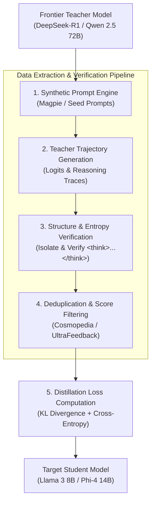

> **Answer-first:** Knowledge distillation transfers reasoning capabilities from frontier teacher models (DeepSeek-R1, Qwen 2.5 72B) to smaller student models (Llama 3 8B, Phi-4 14B) by training on synthetic Chain-of-Thought (CoT) trajectories `<think>...</think>` and matching soft logit probability distributions using Kullback-Leibler (KL) divergence loss scaling at high temperature $T$.

[← Series Hub](/series/slm-playbook/) | [← Previous: Part 3: QLoRA Fine-Tuning](/series/slm-playbook/part-3-lora-qlora-tuning/)

---

## 1. Teacher-Student Distillation Architecture

Teacher-student distillation compresses high-parameter frontier artificial intelligence models into smaller, operational architectures by extracting structural reasoning paths and probability logits. This paradigm bypasses the extreme compute budget required to train specialized small models from scratch by transferring latent problem-solving pathways directly into student parameter spaces.

Distillation operates primarily across two methodologies: white-box logit matching and black-box synthetic trajectory generation. White-box distillation provides student models access to raw logit probability vectors $z_i$ computed by large teacher models, aligning output distributions at the token probability layer. Black-box distillation prompts frontier models to produce synthetic instruction responses paired with step-by-step reasoning tokens enclosed within structural tags such as `<think>...</think>`.

The DeepSeek-R1 distillation methodology demonstrated that small language models (SLMs) acquire advanced mathematical and programmatic reasoning capabilities faster when trained on curated teacher-generated Chain-of-Thought (CoT) samples than when subjected to direct Reinforcement Learning (RL/GRPO) training without prior reasoning exposure. Direct RL on small models frequently suffers from high gradient variance and entropy collapse. In contrast, distilling DeepSeek-R1 reasoning traces embeds validated search trees and self-correction patterns straight into models like Llama 3 8B or Phi-4 14B during Supervised Fine-Tuning (SFT).



---

## 2. Synthetic Data Curation & Chain-of-Thought (CoT) Filtering

Synthetic data curation requires rigorous quality verification pipelines to prevent student models from absorbing hallucinated logic, infinite reasoning loops, or noisy outputs generated by frontier LLMs. Transferring pure text outputs without strict filtering leads to model degradation, excessive response length inflation, and accuracy drops in edge cases.

Prompt diversity forms the foundation of synthetic data generation. The Magpie framework generates diverse prompt distributions directly from base language model alignment states without requiring explicit handcrafted prompt templates. By feeding initial prompt prefixes to teacher models and sampling internal representation probabilities, Magpie extracts authentic query workloads covering complex coding problems, mathematical derivations, and logical deduction scenarios.

Once initial responses are generated, data verification filters process the raw output stream using strict heuristic and model-driven rules:

1. **Reasoning Token Parsing:** Synthetic trajectories generated by reasoning models like DeepSeek-R1 require structural parsing to isolate `<think>...</think>` internal blocks from final answer payloads. Responses missing opening or closing tags, or those containing malformed tags, are immediately discarded.
2. **Step-by-Step Logic Validation:** Mathematical and programmatic reasoning traces are verified using execution sandboxes or symbolic solver checks (such as SymPy or Python AST parsers). Reasoning steps that state correct mathematical premises but arrive at incorrect final numerical outputs indicate internal hallucination and are pruned.
3. **Entropy and Repetition Filtering:** Long Chain-of-Thought reasoning steps sometimes fall into repetitive n-gram loops. Calculating n-gram token entropy and unique word ratios identifies degenerate thinking patterns. Traces falling below an entropy threshold of 0.70 unique n-grams are purged.
4. **Cosmopedia & UltraFeedback Integration:** Synthetic text passes through deduplication and topic distribution checks modeled after the Cosmopedia pipeline. UltraFeedback reward models score candidate responses, retaining only synthetic pairs scoring in the top quartile of helpfulness and factual consistency.

---

## 3. Mathematical Foundations of Logit & Feature Distillation

Logit distillation transfers soft probability distributions from teacher models to student models by scaling output logits before applying the Softmax activation function. Standard cross-entropy loss trains models on hard target vectors ($y \in \{0, 1\}$), discarding valuable structural information regarding non-target token relationships.

To extract non-target relative probabilities (termed "dark knowledge"), temperature scaling factor $T > 1$ softens probability distributions over the model vocabulary $V$. The soft target probability $p_i$ of token $i$ for teacher logits $z_i$ and student logits $s_i$ at temperature $T$ is defined mathematically as:

$$p_i = \frac{\exp(z_i / T)}{\sum_{j=1}^{|V|} \exp(z_j / T)}, \quad q_i = \frac{\exp(s_i / T)}{\sum_{j=1}^{|V|} \exp(s_j / T)}$$

Kullback-Leibler (KL) divergence computes the information loss between the teacher soft probability distribution $p$ and the student soft probability distribution $q$. Multiplying the divergence by $T^2$ compensates for scaling the gradients by $1/T^2$ during backpropagation:

$$\mathcal{L}_{\text{KL}}(p, q) = T^2 \sum_{i=1}^{|V|} p_i \log \left( \frac{p_i}{q_i} \right) = T^2 D_{\text{KL}}(p \parallel q)$$

The total training loss function $\mathcal{L}_{\text{total}}$ combines hard-label Cross-Entropy loss $\mathcal{L}_{\text{CE}}$ at standard temperature ($T=1$) with soft-target KL Divergence loss $\mathcal{L}_{\text{KL}}$ weighted by hyperparameter $\alpha \in [0, 1]$:

$$\mathcal{L}_{\text{CE}}(y, q_{T=1}) = - \sum_{i=1}^{|V|} y_i \log(q_i)$$

$$\mathcal{L}_{\text{total}} = (1 - \alpha) \mathcal{L}_{\text{CE}}(y, q_{T=1}) + \alpha T^2 D_{\text{KL}}(p_T \parallel q_T)$$

High values of temperature $T$ (typically $T \in [2.0, 5.0]$) expose subtle semantic dependencies between non-winning tokens. For instance, when classifying a code syntax error, the teacher model assigns small but non-zero probabilities to plausible alternative syntax structures while assigning near-zero probability to unrelated natural language tokens. This structural constraint forces the student model to learn representation boundaries efficiently.

---

## 4. Production Python Pipeline for Distillation Dataset Curation

Production synthetic data pipelines require scalable code structures capable of filtering raw reasoning trajectories and computing temperature-scaled loss metrics. The following complete Python script implements synthetic Chain-of-Thought parsing, repetition entropy verification, and soft logit KL divergence loss calculation using PyTorch and standard scientific computing libraries.

```python
import math
import re
from typing import List, Dict, Any, Tuple
import numpy as np

def compute_temperature_scaled_kl_loss(
    teacher_logits: np.ndarray, 
    student_logits: np.ndarray, 
    temperature: float = 2.5,
    alpha: float = 0.7
) -> Dict[str, float]:
    """
    Computes Kullback-Leibler (KL) Divergence loss with temperature scaling T
    and combines it with standard Cross-Entropy loss.
    
    Args:
        teacher_logits: Raw unscaled logits from teacher model, shape (vocab_size,)
        student_logits: Raw unscaled logits from student model, shape (vocab_size,)
        temperature: Softmax scaling factor T > 0
        alpha: Weighting factor for soft KL loss versus hard cross-entropy
        
    Returns:
        Dictionary containing calculated total loss, KL loss component, and CE loss component.
    """
    # Soft target probabilities at temperature T
    teacher_soft = np.exp(teacher_logits / temperature)
    teacher_soft /= np.sum(teacher_soft, axis=-1, keepdims=True)
    
    student_soft = np.exp(student_logits / temperature)
    student_soft /= np.sum(student_soft, axis=-1, keepdims=True)
    
    # Numerical stability clip to prevent log(0)
    eps = 1e-12
    teacher_soft = np.clip(teacher_soft, eps, 1.0)
    student_soft = np.clip(student_soft, eps, 1.0)
    
    # KL Divergence: sum( p * log(p / q) ) scaled by T^2
    kl_divergence = np.sum(teacher_soft * np.log(teacher_soft / student_soft), axis=-1)
    scaled_kl_loss = float(np.mean(kl_divergence) * (temperature ** 2))
    
    # Hard targets at temperature T=1.0 for Cross-Entropy
    target_idx = int(np.argmax(teacher_logits))
    student_hard = np.exp(student_logits)
    student_hard /= np.sum(student_hard, axis=-1, keepdims=True)
    ce_loss = float(-np.log(np.clip(student_hard[target_idx], eps, 1.0)))
    
    total_loss = (1.0 - alpha) * ce_loss + alpha * scaled_kl_loss
    
    return {
        "total_loss": total_loss,
        "kl_loss": scaled_kl_loss,
        "ce_loss": ce_loss
    }

class ReasoningTrajectoryFilter:
    """
    Production filter pipeline for verifying synthetic Chain-of-Thought (CoT) samples.
    """
    def __init__(self, min_think_chars: int = 40, max_repetition_ratio: float = 0.35):
        self.min_think_chars = min_think_chars
        self.max_repetition_ratio = max_repetition_ratio
        
    def verify_sample(self, response_text: str) -> Tuple[bool, str, str, str]:
        """
        Parses response for <think>...</think> structure and checks quality metrics.
        """
        pattern = r"<think>(.*?)</think>\s*(.*)"
        match = re.search(pattern, response_text, re.DOTALL)
        
        if not match:
            return False, "", "", "Rejected: Missing or malformed <think> structural tags."
            
        think_trace = match.group(1).strip()
        final_answer = match.group(2).strip()
        
        if len(think_trace) < self.min_think_chars:
            return False, think_trace, final_answer, f"Rejected: Reasoning length ({len(think_trace)} chars) below threshold."
            
        # Check n-gram word repetition ratio
        words = think_trace.split()
        if len(words) > 10:
            unique_ratio = len(set(words)) / len(words)
            repetition_ratio = 1.0 - unique_ratio
            if repetition_ratio > self.max_repetition_ratio:
                return False, think_trace, final_answer, f"Rejected: High word repetition ratio ({repetition_ratio:.2f})."
                
        if len(final_answer) == 0:
            return False, think_trace, final_answer, "Rejected: Missing final answer content after reasoning block."
            
        return True, think_trace, final_answer, "Passed: Structural and logic checks verified."

    def process_dataset_batch(self, raw_samples: List[Dict[str, str]]) -> Dict[str, Any]:
        valid_records = []
        rejected_records = []
        
        for record in raw_samples:
            sample_id = record.get("id", "unknown_id")
            raw_text = record.get("response", "")
            
            is_valid, think, ans, status_msg = self.verify_sample(raw_text)
            
            processed_item = {
                "id": sample_id,
                "prompt": record.get("prompt", ""),
                "think": think,
                "answer": ans,
                "status": status_msg
            }
            
            if is_valid:
                valid_records.append(processed_item)
            else:
                rejected_records.append(processed_item)
                
        return {
            "valid_count": len(valid_records),
            "rejected_count": len(rejected_records),
            "valid_samples": valid_records,
            "rejected_samples": rejected_records
        }

if __name__ == "__main__":
    # Demonstration dataset
    synthetic_batch = [
        {
            "id": "sample_math_01",
            "prompt": "Solve for x: 3x + 15 = 45",
            "response": "<think>\nSubtract 15 from both sides of the equation:\n3x = 45 - 15\n3x = 30\nDivide both sides by 3:\nx = 30 / 3\nx = 10\nVerification: 3(10) + 15 = 45. Correct.\n</think>\nThe value of x is 10."
        },
        {
            "id": "sample_math_02",
            "prompt": "Calculate 15 * 12",
            "response": "<think>Short calculation</think>\n180"
        },
        {
            "id": "sample_math_03",
            "prompt": "What is prime factorization?",
            "response": "Prime factorization breaks down a number into prime factors."
        }
    ]
    
    # Run data curation filter
    filter_engine = ReasoningTrajectoryFilter(min_think_chars=50)
    batch_results = filter_engine.process_dataset_batch(synthetic_batch)
    
    print(f"Batch Processing Summary:")
    print(f"Valid Samples: {batch_results['valid_count']} | Rejected Samples: {batch_results['rejected_count']}\n")
    
    for sample in batch_results["valid_samples"]:
        print(f"[{sample['id']}] STATUS: {sample['status']}")
        print(f"Thinking snippet: {sample['think'][:60]}...")
        print(f"Answer: {sample['answer']}\n")
        
    for sample in batch_results["rejected_samples"]:
        print(f"[{sample['id']}] STATUS: {sample['status']}\n")

    # Run logit distillation math demonstration
    np.random.seed(42)
    sample_teacher_logits = np.array([3.2, 1.5, -0.4, 0.1, -1.2])
    sample_student_logits = np.array([2.8, 1.8, -0.1, 0.0, -0.9])
    
    loss_metrics = compute_temperature_scaled_kl_loss(
        teacher_logits=sample_teacher_logits,
        student_logits=sample_student_logits,
        temperature=3.0,
        alpha=0.65
    )
    
    print("Logit Distillation Loss Computation Results:")
    print(f"Total Combined Loss: {loss_metrics['total_loss']:.6f}")
    print(f"Soft KL Loss (T=3.0): {loss_metrics['kl_loss']:.6f}")
    print(f"Hard Cross-Entropy Loss: {loss_metrics['ce_loss']:.6f}")
```

---

## 5. Empirical Benchmarks & Token Efficiency Gains

Distilling reasoning models yields performance gains across standard evaluation suites while drastically cutting dataset requirements compared to pre-training or unguided fine-tuning. Training student models on curated synthetic trajectories allows 8B and 14B parameter models to achieve benchmark results matching previous-generation 70B parameter models.

The following benchmark comparison highlights performance metrics, dataset efficiency, and training compute savings achieved through DeepSeek-R1 synthetic reasoning distillation across small model parameter classes:

| Model Architecture | Parameter Size | Distillation Source | GSM8K (Math) | MATH (500 Hard) | HumanEval (Code) | MMLU-Pro (Reasoning) | Training Tokens Required | Estimated GPU Compute Cost |
| :--- | :--- | :--- | :--- | :--- | :--- | :--- | :--- | :--- |
| **DeepSeek-R1 (Teacher)** | 671B (MoE) | Native RL (GRPO) | 92.8% | 79.8% | 92.1% | 84.0% | 15.0 Trillion | $6,000,000+ |
| **Qwen 2.5 72B (Base Teacher)** | 72B | Base SFT + RLHF | 86.3% | 59.7% | 86.0% | 72.5% | 18.0 Trillion | $2,200,000 |
| **Llama 3.1 8B (Base Student)** | 8B | Standard Pretrain | 56.8% | 24.1% | 61.0% | 44.2% | 15.0 Trillion | $180,000 |
| **DeepSeek-R1-Distill-Llama-8B** | 8B | DeepSeek-R1 Synthetics | 89.1% | 50.4% | 89.0% | 65.2% | 800 Billion | $1,200 |
| **Phi-4 14B (Base Student)** | 14B | Synthetic Pretrain | 78.4% | 41.2% | 76.5% | 58.1% | 10.0 Trillion | $120,000 |
| **DeepSeek-R1-Distill-Qwen-14B** | 14B | DeepSeek-R1 Synthetics | 90.8% | 59.1% | 91.0% | 71.0% | 800 Billion | $2,400 |

Training distilled student models on 800 billion curated tokens achieves over 90% of teacher model problem-solving accuracy while reducing compute expenses by orders of magnitude. The data efficiency proves that structured reasoning capabilities depend more on token quality and reasoning path clarity than sheer parameter size.

---

## Frequently Asked Questions

Understanding task distillation and synthetic data pipelines involves addressing key architectural tradeoffs during dataset curation and model training.

### Why is distilling DeepSeek-R1 reasoning tokens more effective than running Reinforcement Learning on small models directly?
Applying direct Reinforcement Learning (such as Group Relative Policy Optimization or GRPO) to 8B parameter models from scratch requires exploring massive action spaces with sparse rewards. Small models often experience entropy collapse or fail to discover viable self-correction paths without massive sampling compute. Distillation transfers pre-optimized reasoning trajectories directly into the student model's parameters, establishing strong baseline reasoning prior to any subsequent RL fine-tuning.

### How do data engineering pipelines prevent response length inflation during synthetic data training?
Unfiltered reasoning model outputs frequently generate long internal thinking traces even for trivial queries, inflating token counts and increasing inference latency. Pipelines prevent length inflation by setting adaptive minimum and maximum token limits during synthetic generation and filtering out disproportionately long traces for simple prompts. Additionally, datasets incorporate explicit non-reasoning direct response examples for simple classification and retrieval tasks.

### What is the primary operational difference between white-box logit distillation and black-box sequence distillation?
White-box logit distillation requires direct access to teacher model output probability vectors $z_i$, making it applicable when both teacher and student models run in the same local infrastructure. Black-box sequence distillation operates purely on generated text outputs (such as prompt-response-reasoning triplets) provided by API-gated frontier LLMs. Black-box methods scale easily across commercial API endpoints, whereas white-box methods provide richer signal transfer by capturing non-target token probabilities.

### How can teams prevent student models from outputting empty or infinite reasoning loops in production?
Infinite reasoning loops occur when student models fail to generate the closing structural tag `</think>` or repeat phrasing patterns endlessly inside the thinking context. Teams mitigate this during dataset curation by purging repetitive n-gram samples and enforcing structural regex validation on all SFT data. During production deployment, inference engines configure explicit stop sequences for `</think>` tags and apply max token budgets specifically allocated to internal thinking states.
