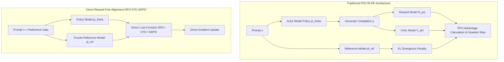

> **Answer-first:** Preference alignment transitions Small Language Models (SLMs) from next-token predictors to instruction-following, safety-compliant, and reasoning agents. While traditional PPO requires complex multi-model RL pipelines, reward-free methods like DPO, KTO, and GRPO optimize policies directly using preference pairs, unpaired binary feedback, or group-relative advantage scores, drastically reducing VRAM and compute overhead.

[← Back to SLM Playbook Series](/series/slm-playbook/) | [← Previous: Part 4 Task & Knowledge Distillation](/series/slm-playbook/part-4-knowledge-distillation-synthetic-data/) | [Next: Part 6 Enterprise Serving & Quantization →](/series/slm-playbook/part-6-vllm-serving-edge-deployment/)

---

## 1. The Evolution of Preference Alignment: PPO to Reward-Free Alignment

Preference alignment aligns fine-tuned Small Language Models with human intentions regarding helpfulness, factual accuracy, and safety constraints. Traditional Reinforcement Learning from Human Feedback (RLHF) relies on Proximal Policy Optimization (PPO), which demands hosting four distinct neural models simultaneously in GPU memory.

In standard PPO pipelines, training requires the active Policy model $\pi_\theta$, a frozen Reference model $\pi_{\text{ref}}$, a Value/Critic model $V_\phi$, and a Reward model $R_\psi$. This architecture introduces massive VRAM overhead, sampling instability, and hyperparameter sensitivity across PPO clipping thresholds ($\epsilon$), Generalized Advantage Estimation ($\lambda$), and value loss coefficients.

Modern alignment techniques remove explicit reward models and critic heads altogether. Direct Preference Optimization (DPO) derives an analytical mapping from the optimal policy to implicit rewards, parameterizing the preference loss directly through policy log-probabilities. Kahneman-Tversky Optimization (KTO) relaxes paired dataset requirements by optimizing over single binary signals (desirable vs undesirable outputs). Group Relative Policy Optimization (GRPO) eliminates the critic model by calculating relative advantage across a sampled group of outputs for a given prompt, enabling efficient reinforcement learning for complex reasoning tasks.



The table below contrasts operational requirements across PPO, DPO, KTO, and GRPO alignment pipelines:

| Feature / Metric | PPO (Classic RLHF) | DPO (Direct Preference) | KTO (Prospect Theory) | GRPO (Group Relative) |
|---|---|---|---|---|
| **Active Models in VRAM** | 4 (Policy, Ref, Critic, Reward) | 2 (Policy, Ref) | 2 (Policy, Ref) | 2 (Policy, Ref) |
| **Dataset Structure** | Prompts + Reward Model Data | Paired $(x, y_w, y_l)$ | Unpaired Binary $(x, y, z \in \{+1, -1\})$ | Prompts + Verification Rules |
| **Critic Model Required** | Yes ($V_\phi$ parameter head) | No | No | No (Group Normalized Baseline) |
| **Training Stability** | Low (High hyperparameter sensitivity) | High (Supervised Loss) | High (Supervised Loss) | High (Clipping + Group Norm) |
| **Primary Production Case** | Legacy Frontier Models | Pairwise Style & Safety Tuning | Single-Feedback Telemetry Logs | Mathematical & Code Reasoning |

---

## 2. Mathematical Formulations: DPO, KTO, & GRPO Loss Functions

Mathematical formulations for modern preference alignment bypass explicit reward model fitting by directly expressing implicit rewards in terms of policy log-likelihood ratios. This theoretical framework maps preference optimization onto constrained log-sigmoid objective functions.

### Bradley-Terry Preference Model & DPO Loss

Direct Preference Optimization originates from the Bradley-Terry preference model, which defines the probability that prompt completion $y_w$ is preferred over $y_l$ given prompt $x$:

$$P(y_w \succ y_l | x) = \sigma(r(x, y_w) - r(x, y_l)) = \frac{1}{1 + e^{-(r(x, y_w) - r(x, y_l))}}$$

Under a KL-divergence constrained reward maximization objective, the optimal policy $\pi_r(y|x)$ and ground-truth reward $r(x,y)$ satisfy the closed-form relationship:

$$r_\theta(x, y) = \beta \log \frac{\pi_\theta(y|x)}{\pi_{\text{ref}}(y|x)} + \beta \log Z(x)$$

where $Z(x)$ represents the partition function and $\beta$ controls the KL penalty strength relative to the reference model. Substituting this implicit reward formulation directly into the Bradley-Terry log-likelihood objective cancels out $Z(x)$, yielding the exact DPO loss function:

$$\mathcal{L}_{\text{DPO}}(\theta; \pi_{\text{ref}}) = -\mathbb{E}_{(x, y_w, y_l) \sim \mathcal{D}} \left[ \log \sigma \left( \beta \log \frac{\pi_\theta(y_w|x)}{\pi_{\text{ref}}(y_w|x)} - \beta \log \frac{\pi_\theta(y_l|x)}{\pi_{\text{ref}}(y_l|x)} \right) \right]$$

Analyzing the gradient of $\mathcal{L}_{\text{DPO}}(\theta)$ reveals how the algorithm updates policy parameters:

$$\nabla_\theta \mathcal{L}_{\text{DPO}}(\theta) = -\beta \mathbb{E}_{(x, y_w, y_l)} \left[ \sigma\left(\hat{r}_\theta(x, y_l) - \hat{r}_\theta(x, y_w)\right) \left( \nabla_\theta \log \pi_\theta(y_w|x) - \nabla_\theta \log \pi_\theta(y_l|x) \right) \right]$$

The weighting scalar $\sigma(\hat{r}_\theta(x, y_l) - \hat{r}_\theta(x, y_w))$ scales the gradient based on how incorrectly the current model scores the pair. If the policy incorrectly assigns higher implicit reward to the dispreferred output $y_l$, the gradient magnitude increases to correct the log-probabilities.

### Kahneman-Tversky Optimization (KTO) Loss

Kahneman-Tversky Optimization adapts Prospect Theory from behavioral economics, modeling human decision-making under risk where losses induce higher psychological impact than equivalent gains. KTO operates on unpaired datasets containing single completions labeled as either desirable ($z=+1$) or undesirable ($z=-1$).

The KTO loss function incorporates a reference point baseline $r_{\text{ref}}(x)$ to evaluate output utility:

$$\mathcal{L}_{\text{KTO}}(\theta; \pi_{\text{ref}}) = \mathbb{E}_{x, y, z} \left[ w(z) \cdot \lambda_{\text{KTO}}\left( r_\theta(x, y) - r_{\text{ref}}(x), z \right) \right]$$

where implicit reward $r_\theta(x, y) = \beta \log \frac{\pi_\theta(y|x)}{\pi_{\text{ref}}(y|x)}$, and the value function $\lambda_{\text{KTO}}(v, z)$ is defined as:

$$\lambda_{\text{KTO}}(v, z) = \begin{cases} 1 - \sigma(v - v_0), & \text{if } z = +1 \text{ (Desirable)} \\ 1 - \sigma(v_0 - v), & \text{if } z = -1 \text{ (Undesirable)} \end{cases}$$

Here, $v_0 = \mathbb{E}_{y' \sim \pi_{\text{ref}}} \left[ \beta \log \frac{\pi_\theta(y'|x)}{\pi_{\text{ref}}(y'|x)} \right]$ acts as the expected reference reward for prompt $x$, while weighting factor $w(z)$ compensates for class imbalances between positive and negative feedback in production telemetry.

### Group Relative Policy Optimization (GRPO) Loss

Group Relative Policy Optimization replaces point estimate value heads by computing normalized advantage across a group of sampled outputs $\{y_1, y_2, \dots, y_G\}$ generated for prompt $x$.

The objective function maximizes clipped policy ratios constrained by KL divergence against the reference model:

$$\mathcal{L}_{\text{GRPO}}(\theta) = -\frac{1}{G} \sum_{i=1}^G \left[ \min \left( \frac{\pi_\theta(y_i|x)}{\pi_{\text{old}}(y_i|x)} A_i, \, \text{clip}\left(\frac{\pi_\theta(y_i|x)}{\pi_{\text{old}}(y_i|x)}, 1-\epsilon, 1+\epsilon\right) A_i \right) - \beta D_{\text{KL}}(\pi_\theta || \pi_{\text{ref}}) \right]$$

The group advantage $A_i$ for output $y_i$ is calculated by standardizing reward scores $R_i$ across the sampled group $G$:

$$A_i = \frac{R_i - \text{mean}(\{R_1, R_2, \dots, R_G\})}{\text{std}(\{R_1, R_2, \dots, R_G\}) + \delta}$$

where $\delta = 10^{-8}$ prevents numerical instability. Standardizing rewards across group samples provides zero-mean advantage estimation without allocating GPU memory for a dedicated critic network.

---

## 3. Group Relative Policy Optimization (GRPO) for Mathematical & Code Reasoning

Reasoning tasks require models to produce structured chain-of-thought derivations validated by deterministic logic rather than subjective human preference scores. Group Relative Policy Optimization (GRPO) provides a specialized framework for reinforcing mathematical correctness and code execution accuracy.

In reasoning pipelines such as DeepSeek-R1, GRPO samples $G$ distinct completions (e.g., $G = 8$) for each prompt $x$. Rather than relying on a learned reward model, completions are evaluated using programmatic rule-based verifiers.

```python
def compute_grpo_rule_rewards(completion: str, target_answer: str, unit_test_func) -> float:
    """
    Computes composite rule-based rewards for mathematical and code reasoning.
    """
    reward = 0.0
    
    # 1. Structural Format Reward (xml tags enforcement)
    if "<think>" in completion and "</think>" in completion:
        reward += 0.25
        
    # 2. Mathematical Extraction & Correctness Check
    import re
    math_match = re.search(r"\\boxed\{([^}]+)\}", completion)
    if math_match:
        extracted_answer = math_match.group(1).strip()
        if extracted_answer == target_answer.strip():
            reward += 1.0
            return reward

    # 3. Code Execution Verification (if applicable)
    if unit_test_func is not None:
        try:
            if unit_test_func(completion):
                reward += 1.0
        except Exception:
            reward -= 0.5
            
    return reward
```

GRPO removes the critic model by utilizing group mean and standard deviation as the baseline. If prompt $x$ produces 8 outputs where 2 reach the correct mathematical answer (reward = 1.25) and 6 fail (reward = 0.25), group standardization converts successful trajectories into positive advantage values ($A_i > 0$) while penalizing failed paths ($A_i < 0$). This group relative normalization drives policy updates toward valid reasoning patterns without manual preference pair labeling.

---

## 4. Production Python & Axolotl Alignment Pipeline

Deploying preference alignment in engineering workflows requires robust Python implementations and memory-optimized configurations. The following section provides a runnable PyTorch DPO loss calculation, a complete Hugging Face TRL script, and an enterprise Axolotl YAML configuration for Llama-3-8B-Instruct.

### PyTorch DPO Loss Implementation

The core mathematical logic of DPO loss can be expressed in standalone PyTorch:

```python
import torch
import torch.nn.functional as F

def compute_dpo_loss_batch(
    policy_chosen_logps: torch.Tensor,
    policy_rejected_logps: torch.Tensor,
    ref_chosen_logps: torch.Tensor,
    ref_rejected_logps: torch.Tensor,
    beta: float = 0.1,
) -> tuple[torch.Tensor, torch.Tensor, torch.Tensor]:
    """
    Calculates Direct Preference Optimization loss and implicit rewards for a batch.

    Args:
        policy_chosen_logps: Log probabilities of chosen responses under policy model (batch_size,)
        policy_rejected_logps: Log probabilities of rejected responses under policy model (batch_size,)
        ref_chosen_logps: Log probabilities of chosen responses under reference model (batch_size,)
        ref_rejected_logps: Log probabilities of rejected responses under reference model (batch_size,)
        beta: KL divergence penalty scalar

    Returns:
        tuple containing (loss, chosen_rewards, rejected_rewards)
    """
    pi_logratios = policy_chosen_logps - policy_rejected_logps
    ref_logratios = ref_chosen_logps - ref_rejected_logps
    logits = pi_logratios - ref_logratios

    # DPO Loss calculation
    losses = -F.logsigmoid(beta * logits)

    # Compute implicit rewards for telemetry tracking
    chosen_rewards = beta * (policy_chosen_logps - ref_chosen_logps).detach()
    rejected_rewards = beta * (policy_rejected_logps - ref_rejected_logps).detach()

    return losses.mean(), chosen_rewards.mean(), rejected_rewards.mean()
```

### Runnable TRL DPOTrainer Script

The complete Python script below loads preference dataset pairs and executes DPO tuning using Hugging Face `trl` and `peft`:

```python
import torch
from datasets import Dataset
from transformers import AutoModelForCausalLM, AutoTokenizer, TrainingArguments
from trl import DPOConfig, DPOTrainer
from peft import LoraConfig

def run_dpo_alignment():
    model_id = "meta-llama/Meta-Llama-3-8B-Instruct"
    
    # 1. Load Tokenizer & Model
    tokenizer = AutoTokenizer.from_pretrained(model_id)
    if tokenizer.pad_token is None:
        tokenizer.pad_token = tokenizer.eos_token

    # 2. Sample Pairwise Preference Data
    preference_data = {
        "prompt": [
            "Write a Python function to check if a number is prime.",
            "Explain SQL injection in simple terms."
        ],
        "chosen": [
            "def is_prime(n):\n    if n <= 1:\n        return False\n    for i in range(2, int(n**0.5) + 1):\n        if n % i == 0:\n            return False\n    return True",
            "SQL injection occurs when untrusted input alters a database query execution path. Parameterized queries prevent this attack."
        ],
        "rejected": [
            "Primes are numbers that cannot be divided. Just divide by 2, 3, 5, 7 in a loop.",
            "SQL injection is when someone hacks your website using HTML tags in the login form."
        ]
    }
    dataset = Dataset.from_dict(preference_data)

    # 3. Configure PEFT / LoRA Adapters
    peft_config = LoraConfig(
        r=16,
        lora_alpha=32,
        lora_dropout=0.05,
        target_modules=["q_proj", "v_proj", "k_proj", "o_proj"],
        bias="none",
        task_type="CAUSAL_LM",
    )

    # 4. Define DPO Training Parameters
    training_args = DPOConfig(
        output_dir="./results_llama3_dpo",
        beta=0.1,
        learning_rate=5e-6,
        per_device_train_batch_size=2,
        gradient_accumulation_steps=4,
        max_length=1024,
        max_prompt_length=512,
        num_train_epochs=3,
        logging_steps=10,
        save_strategy="epoch",
        fp16=True,
        gradient_checkpointing=True,
    )

    # 5. Initialize Model
    model = AutoModelForCausalLM.from_pretrained(
        model_id,
        torch_dtype=torch.float16,
        device_map="auto"
    )

    # 6. Instantiate DPOTrainer
    dpo_trainer = DPOTrainer(
        model=model,
        ref_model=None, # TRL creates an implicit reference model when using LoRA
        args=training_args,
        train_dataset=dataset,
        tokenizer=tokenizer,
        peft_config=peft_config,
    )

    # 7. Execute Alignment Training
    dpo_trainer.train()
    dpo_trainer.save_model("./final_llama3_dpo_adapter")
    print("DPO Alignment training complete.")

if __name__ == "__main__":
    run_dpo_alignment()
```

### Enterprise Axolotl DPO Config (`axolotl_dpo.yaml`)

Axolotl provides a declarative YAML syntax for scaling preference alignment across multi-GPU nodes:

```yaml
base_model: meta-llama/Meta-Llama-3-8B-Instruct
model_type: AutoModelForCausalLM
tokenizer_type: AutoTokenizer

rl: dpo
dpo_beta: 0.1

load_in_8bit: false
load_in_4bit: true
strict: false

datasets:
  - path: argilla/ultraquality-binarized-preferences
    type: dpo.default
    split: train

dataset_prepared_path: last_run_dpo_prepared
output_dir: ./outputs/llama3-8b-dpo

adapter: qlora
lora_r: 16
lora_alpha: 32
lora_dropout: 0.05
lora_target_linear: true

sequence_len: 2048
sample_packing: false

wandb_project: slm-dpo-alignment
wandb_watch: gradients

gradient_accumulation_steps: 4
micro_batch_size: 2
num_epochs: 2
optimizer: adamw_torch
lr_scheduler: cosine
learning_rate: 5e-6

train_on_inputs: false
group_by_length: false
bf16: true
fp16: false

gradient_checkpointing: true
early_stopping_patience: 3
flash_attention: true

warmup_steps: 100
evals_per_epoch: 2
saves_per_epoch: 1
debug: false
```

---

## 5. Alignment Evaluation & Reward Hacking Defense

Optimizing model parameters against preference objectives can induce unintended failure modes if policy drift is left unchecked. Production alignment workflows must evaluate model checkpoints against length bias, over-refusal, and KL divergence collapse.

### Length Bias & Verbosity Exploitation

Preference models and human evaluators frequently display systematic bias toward longer completions, mistaking verbosity for quality. During DPO tuning, models may exploit this artifact by generating padded, repetitive prose to artificially increase implicit rewards.

```
Reward Exploitation Flow:
[Short Factual Output] ---> Low Implicit Reward Signal
[Padded Verbose Output] ---> Inflated Implicit Reward ---> Policy Drift (Length Bias)
```

**Defense Strategies:**
- **Length-Normalized DPO Loss:** Modify the implicit reward definition by dividing log-probabilities by completion token count $|y|$:
  $$r_{\text{norm}}(x, y) = \frac{\beta}{|y|} \log \frac{\pi_\theta(y|x)}{\pi_{\text{ref}}(y|x)}$$
- **Length-Balanced Training Datasets:** Filter preference datasets to ensure chosen responses $y_w$ are not systematically longer than rejected responses $y_l$.

### Over-Refusal & Safety Hyper-Sensitivity

Aggressive alignment against safety preference benchmarks often causes over-refusal, where models reject benign prompts containing trigger keywords (e.g., refusing to answer "How do I kill a background process in Linux?").

**Defense Strategies:**
- **Borderline Prompt Augmentation:** Mix non-harmful edge-case prompts with helpful completions into the preference dataset.
- **Dual-Objective Margin Calibration:** Apply an explicit reward margin $\gamma$ in the DPO loss function to prevent over-penalizing helpful responses:
  $$\mathcal{L}_{\text{DPO-Margin}}(\theta) = -\mathbb{E} \left[ \log \sigma \left( \hat{r}_\theta(x, y_w) - \hat{r}_\theta(x, y_l) - \gamma \right) \right]$$

### KL Divergence Drift & Entropy Collapse

When preference optimization runs for excessive epochs, policy parameters $\pi_\theta$ drift far from the reference distribution $\pi_{\text{ref}}$. This degradation manifests as repeating n-grams, loss of grammatical coherence, and sharp declines in output entropy.

**Defense Strategies:**
- **Dynamic KL Telemetry Monitoring:** Track online KL divergence during training:
  $$D_{\text{KL}}(\pi_\theta || \pi_{\text{ref}}) = \mathbb{E}_{y \sim \pi_\theta} \left[ \log \frac{\pi_\theta(y|x)}{\pi_{\text{ref}}(y|x)} \right]$$
- **Early Stopping Constraints:** Halt training automatically if mean batch KL divergence exceeds target bounds ($D_{\text{KL}} > 10.0$).

The evaluation suite below measures alignment balance across quality, safety, and reasoning dimensions:

| Evaluation Benchmark | Target Metric | Purpose / Defense Focus |
|---|---|---|
| **AlpacaEval 2.0** | Length-Controlled Win Rate | Detects verbosity bias and measures conversational quality against GPT-4 Turbo. |
| **MT-Bench** | Multi-Turn Conversation Score | Evaluates multi-turn instruction following and task coherence across 8 domains. |
| **XTest / AdvGLUE** | Robustness Pass Rate | Tests resilience against adversarial prompt injections and over-refusal edge cases. |
| **GSM8K / MATH** | Verifiable Accuracy Pass@1 | Measures mathematical reasoning precision before and after GRPO optimization. |

---

## Frequently Asked Questions

Understanding technical trade-offs assists engineering teams in selecting the appropriate alignment strategy for enterprise Small Language Model deployments.

### How does DPO compare to QLoRA SFT regarding GPU memory consumption during training?

DPO requires evaluating token log-probabilities under both the active policy model and a frozen reference model, which increases memory consumption compared to standard SFT. However, by using QLoRA with 4-bit base weights for both policy and reference instances, DPO training can execute on a single 24GB VRAM GPU (such as an NVIDIA RTX 4090 or A10G) while preserving precise log-probability calculations.

### When should enterprise teams select KTO over DPO for model alignment?

Enterprise teams should select KTO when production telemetry provides unpaired binary feedback (such as thumbs-up/down ratings or accepted/rejected inline edits) rather than pairwise comparison data. KTO directly optimizes utility over individual desirable and undesirable examples, eliminating the need to construct artificial preference pairs or discard single-feedback logs.

### Why is GRPO advantageous for mathematical and code reasoning compared to DPO?

DPO relies on pre-existing pairwise preference data where one completion is judged superior to another, limiting its capacity to discover novel multi-step reasoning pathways. GRPO samples a group of candidate reasoning chains per prompt and evaluates them using objective rule-based verifiers (such as unit test execution or symbolic math checkers), allowing the model to explore and reinforce optimal reasoning steps without manual preference annotation.
