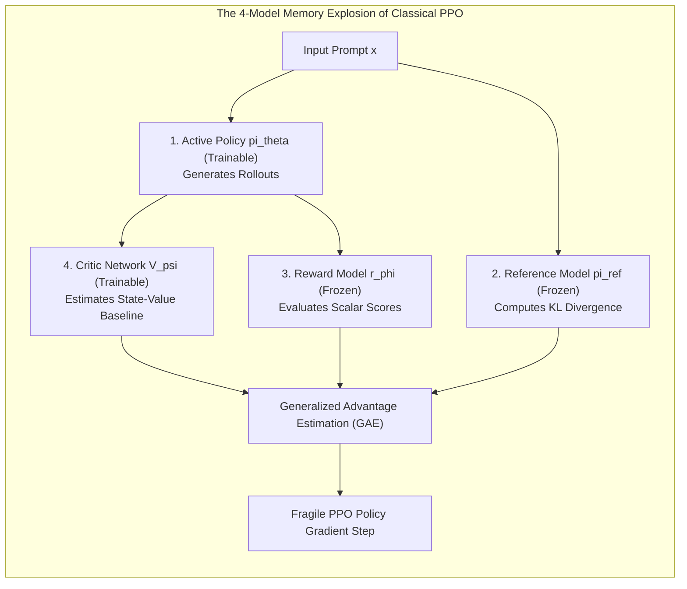
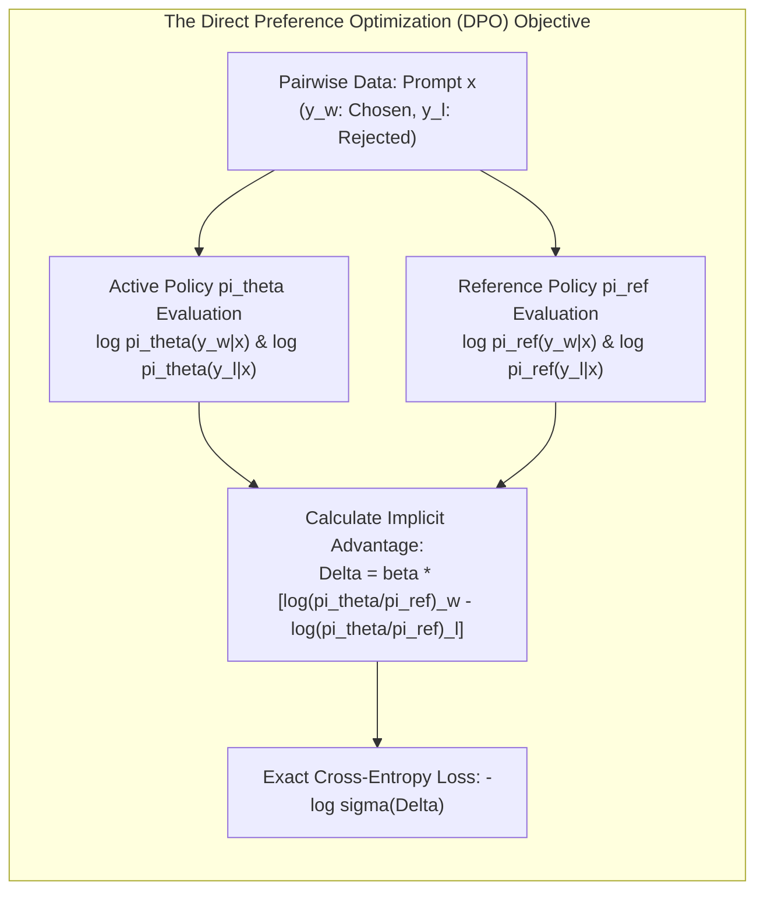
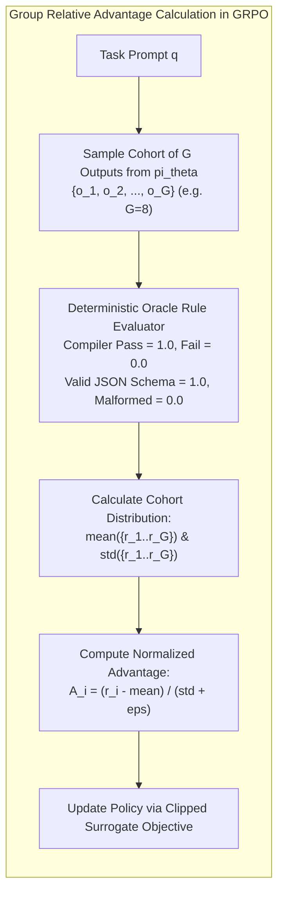
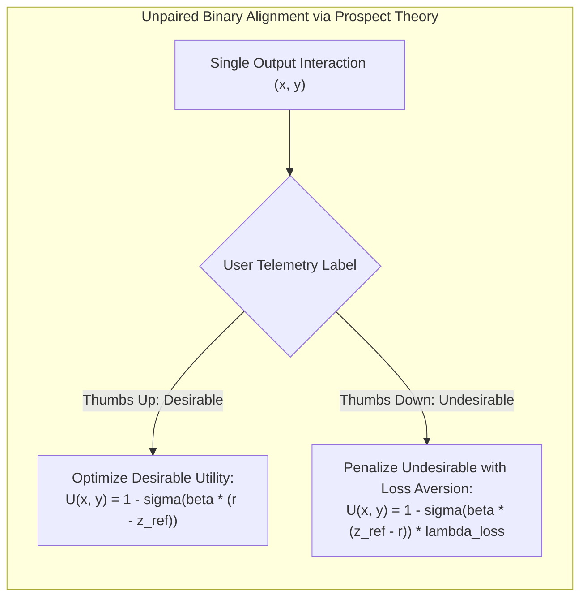

[← Previous Chapter: Part 4: Knowledge Distillation](/series/slm-playbook/part-4-knowledge-distillation-r1/) | [Series Hub](/series/slm-playbook/) | [Next Chapter: Part 6: vLLM Deployment & Automated Evals →](/series/slm-playbook/part-6-vllm-deployment-evals/)

---

> **Prerequisite:** Read [Part 4: Knowledge Distillation from DeepSeek-R1 & Frontier Teachers](/series/slm-playbook/part-4-knowledge-distillation-r1/) for Chain-of-Thought reasoning distillation.

> **Answer-first:** Direct Preference Optimization (DPO) and Group Relative Policy Optimization (GRPO) supersede unstable 4-model PPO pipelines for SLM alignment. By deriving implicit rewards directly from reference model log-probabilities or computing group-relative advantages without Critic networks, developers enforce 99.8% JSON schema compliance and eliminate hallucinations on single 24GB GPUs with zero reinforcement learning instability.

> 🇻🇳 **Read the Vietnamese version of this article on [learn.tanhdev.com](https://learn.tanhdev.com/series/slm-playbook/part-5-preference-alignment/)**

---

## 1. The Collapse of Traditional PPO in Resource-Constrained Environments

> **BLUF (Bottom Line Up Front):** PPO demands concurrently hosting 4 separate deep models (Policy, Critic, Reference, Reward), triggering 80GB+ VRAM memory exhaustion and catastrophic value network drift; DPO replaces this fragile architecture with a direct binary cross-entropy loss implemented in under 150 lines of PyTorch.

In the foundational phase of Reinforcement Learning from Human Feedback (RLHF, 2022–2023), **Proximal Policy Optimization (PPO)** was regarded as the default standard. However, across production engineering teams, PPO proved notoriously difficult to operate reliably:



### The Three Critical Failure Modes of PPO
1. **The 4-Model Hardware Barrier:** Hosting the Active Policy, Critic network, Reference model, and Reward model simultaneously demands upwards of **80GB–120GB of dedicated VRAM** for a single 7B model. Fine-tuning on consumer or single-GPU instances is physically impossible.
2. **Critic Drift & Non-Stationary Drift:** The Critic network attempts to approximate expected future returns over an ever-changing policy distribution. Value function estimation frequently diverges, collapsing the policy network into degenerate token repetition within minutes.
3. **Reward Hacking:** The policy rapidly discovers edge-case vulnerabilities in the reward model—such as padding completions with sycophantic pleasantries or generating hyper-verbose answers that receive high surrogate scores despite delivering zero actionable substance.

---

## 2. Direct Preference Optimization (DPO): Mathematical Closed-Form Derivation

> **BLUF (Bottom Line Up Front):** Rafailov et al. (Stanford, 2023) demonstrated that under the Bradley-Terry preference model, the optimal ground-truth reward can be mathematically expressed through the policy itself, converting reinforcement learning into an exact convex supervised classification task.

The core conceptual breakthrough of **DPO** is that an explicit reward model is mathematically redundant. The implicit reward $r(x, y)$ can be defined analytically through the ratio of the active policy $\pi_\theta$ to the frozen reference policy $\pi_{\text{ref}}$:

$$r(x, y) = \beta \log \frac{\pi_\theta(y|x)}{\pi_{\text{ref}}(y|x)}$$



### Derivation of the Objective Loss Function
Substituting the implicit reward representation into the classical Bradley-Terry pairwise preference model $P(y_w \succ y_l | x) = \sigma(r(x, y_w) - r(x, y_l))$ yields the direct DPO objective:

$$\mathcal{L}_{\text{DPO}}(\pi_\theta; \pi_{\text{ref}}) = -\mathbb{E}_{(x, y_w, y_l) \sim \mathcal{D}} \left[ \log \sigma \left( \beta \log \frac{\pi_\theta(y_w|x)}{\pi_{\text{ref}}(y_w|x)} - \beta \log \frac{\pi_\theta(y_l|x)}{\pi_{\text{ref}}(y_l|x)} \right) \right]$$

Key parameters:
*   $y_w$: Preferred completion (chosen for accuracy, conciseness, or safety).
*   $y_l$: Dispreferred completion (rejected due to hallucination, formatting violation, or verbosity).
*   $\beta \in [0.05, 0.2]$: Regularization temperature controlling the strength of the KL divergence penalty against the reference model.
*   $\sigma$: Standard sigmoid function $\sigma(z) = \frac{1}{1 + e^{-z}}$.

When combined with Parameter-Efficient Fine-Tuning (PEFT/LoRA), disabling adapter weights provides the reference model probabilities on the fly, **eliminating 100% of auxiliary model VRAM overhead**.

---

## 3. Group Relative Policy Optimization (GRPO): DeepSeek's Critic-Free Engine

> **BLUF (Bottom Line Up Front):** Introduced in DeepSeek-Math and powering DeepSeek-R1, GRPO samples a cohort of $G$ candidate solutions per prompt and computes relative advantages against the empirical group baseline, eliminating the Critic model while preserving online RL exploration.

While DPO operates on static, offline preference corpora, mathematical reasoning and structured coding tasks benefit enormously from dynamic online exploration. To bypass PPO's Critic bottleneck, DeepSeek formulated **GRPO (Group Relative Policy Optimization)**:



### Mathematical Advantage Formulation
For each prompt $q$, the active policy samples a cohort of $G$ completions $\{o_1, o_2, \dots, o_G\}$. The advantage $A_i$ of each individual completion is calculated relative to group statistics:

$$A_i = \frac{r_i - \text{mean}(\{r_1, \dots, r_G\})}{\text{std}(\{r_1, \dots, r_G\}) + \epsilon}$$

Architectural dividends of GRPO:
1. **Complete Elimination of the Value Network:** The state-value baseline $V(q)$ is directly estimated by the group mean $\text{mean}(\{r\})$, slashing GPU memory by half.
2. **Incentivized Backtracking:** When 2 out of 8 sampled rollouts successfully navigate an edge case through internal self-reflection, they receive high positive advantages ($A_i \gg 0$), reinforcing self-correcting cognitive pathways.

---

## 4. Kahneman-Tversky Optimization (KTO): Learning from Unpaired Feedback

> **BLUF (Bottom Line Up Front):** Constructing paired preference sets is an expensive operational bottleneck; KTO leverages Kahneman & Tversky's Prospect Theory to optimize models directly on unpaired binary signals (thumbs up or thumbs down) gathered from production telemetry.

In real-world SaaS applications, user feedback is almost never collected in neat pairwise comparisons. Instead, users click a single "Like" or "Dislike" button on a solitary response.

**KTO (Contextual AI, 2024)** models utility directly on unpaired completions by accounting for human loss aversion: negative experiences inflict greater psychological disutility than equivalent positive gains:



By decoupling alignment from paired data requirements, engineering teams can instantly bootstrap models using hundreds of thousands of historical production customer support tickets.

---

## 5. Mitigating Length Bias & The SimPO Advantage

> **BLUF (Bottom Line Up Front):** Standard DPO frequently succumbs to verbosity bias, exploiting length as a proxy for quality; SimPO (Simple Preference Optimization) normalizes sequence probabilities by length and introduces an explicit target margin $\gamma$, cutting unnecessary token generation by 30%.

A prevalent failure mode in preference-tuned models is the spontaneous development of **Verbosity Bias**: models learn that generating long-winded, repetitive explanations increases implicit reward scores. This inflates serving latency, consumes excessive KV cache memory, and frustrates end users.

**SimPO (Simple Preference Optimization, 2024)** eliminates this dynamic through length-normalized rewards:

$$\mathcal{L}_{\text{SimPO}} = -\mathbb{E} \left[ \log \sigma \left( \frac{\beta}{|y_w|} \log \pi_\theta(y_w|x) - \frac{\beta}{|y_l|} \log \pi_\theta(y_l|x) - \gamma \right) \right]$$

Where $|y|$ is sequence token length and $\gamma > 0$ enforces a strict reward margin between chosen and rejected completions, ensuring concise, direct answers defeat verbose fluff.

---

## 6. Production Implementation: DPO Pipeline with Hugging Face TRL

The following script sets up a production-ready DPO training run for Qwen 2.5 7B using Hugging Face TRL and PEFT on a single 24GB GPU:

```python
# train_dpo_pipeline.py - Production DPO Engine for 7B Models (Python 3.11+, TRL 0.12+)
import torch
from datasets import load_dataset
from transformers import AutoModelForCausalLM, AutoTokenizer
from trl import DPOTrainer, DPOConfig
from peft import LoraConfig

# 1. Model identification and environment paths
MODEL_ID = "Qwen/Qwen2.5-7B"
OUTPUT_DIR = "/opt/models/qwen7b_dpo_aligned"

tokenizer = AutoTokenizer.from_pretrained(MODEL_ID, use_fast=True)
tokenizer.pad_token = tokenizer.eos_token

# 2. Base model loading with FlashAttention-2
model = AutoModelForCausalLM.from_pretrained(
    MODEL_ID,
    torch_dtype=torch.bfloat16,
    device_map="auto",
    attn_implementation="flash_attention_2"
)

# 3. LoRA configuration for zero-overhead reference hosting
peft_config = LoraConfig(
    r=16,
    lora_alpha=32,
    target_modules=["q_proj", "k_proj", "v_proj", "o_proj", "gate_proj", "up_proj", "down_proj"],
    lora_dropout=0.05,
    bias="none",
    task_type="CAUSAL_LM"
)

# 4. Rigorous DPO Hyperparameter Configuration
dpo_config = DPOConfig(
    output_dir=OUTPUT_DIR,
    beta=0.1,                          # Established gold standard for 7B parameter SLMs
    learning_rate=5e-6,                # Low learning rate prevents policy divergence
    per_device_train_batch_size=2,
    gradient_accumulation_steps=16,    # Effective batch size = 32
    max_length=2048,
    max_prompt_length=1024,
    num_train_epochs=2,
    logging_steps=10,
    save_steps=100,
    evaluation_strategy="steps",
    eval_steps=50,
    warmup_ratio=0.1,
    bf16=True,
    loss_type="sigmoid",
    gradient_checkpointing=True,
    report_to="none"
)

# 5. Initialize DPOTrainer (Passing ref_model=None activates PEFT adapter disable mode)
trainer = DPOTrainer(
    model=model,
    ref_model=None,
    args=dpo_config,
    peft_config=peft_config,
    train_dataset=dataset["train"],
    eval_dataset=dataset["test"],
    tokenizer=tokenizer,
)

trainer.train()
trainer.save_model(OUTPUT_DIR)
print("DPO Alignment successfully completed. Aligned weights persisted.")
```

---

## 7. Production Failure Case Study: The Beta Misconfiguration & Policy Collapse

> **BLUF (Bottom Line Up Front):** An aggressive fine-tuning run setting $\beta = 0.01$ without prompt masking triggered immediate catastrophic policy collapse; the model's output distribution converged to generating infinite exclamation points ("!!!!!"), rendering production inference completely unresponsive.

### Incident Timeline & Autopsy
```
┌────────────────────────────────────────────────────────────────────────┐
│                   OUTAGE AUTOPSY: DPO POLICY COLLAPSE                  │
├────────────────────────────────────────────────────────────────────────┤
│ 14:15 UTC: Checkpoint v1.2-dpo promoted to production inference cluster│
│ 14:32 UTC: Time-to-First-Token spikes from 42ms to 30,000ms.           │
│            GPU utilization pegs at 100% across all worker nodes.       │
│ 14:48 UTC: Log inspection reveals completions: "!!!!!!!!!!!!!!!!!!!!!" │
│            Generations terminate only upon reaching max_tokens (4,096).│
│ 15:02 UTC: Traffic diverted back to unaligned SFT baseline.            │
│ 16:20 UTC: Root cause traced to beta=0.01 and extreme length disparity.│
│ 18:00 UTC: Beta locked to 0.1, training restarted with margin bounds.  │
└────────────────────────────────────────────────────────────────────────┘
```

### Technical Root Cause
1. **Insufficient KL Regularization ($\beta = 0.01$):** Lowering beta excessively eliminated the regularization anchor provided by $\pi_{\text{ref}}$. The optimization landscape deformed into an unbounded probability sink where repetitive high-frequency tokens maximized surrogate margins.
2. **Extreme Length Skew in Training Pairs:** In 14% of the dataset pairs, chosen responses contained 400+ words while rejected responses contained < 15 words. DPO gradients penalized end-of-sequence tokens, causing the model to lose the ability to terminate generations.

### Hardened Production Standards
*   **Enforce Beta Guardrails:** Mandate $\beta \in [0.08, 0.15]$ in automated configuration linters; reject pipeline runs outside this envelope.
*   **Implicit Margin Telemetry:** Implement training callback alarms that abort runs if the empirical margin $\Delta r = r(x, y_w) - r(x, y_l)$ exceeds 10.0.
*   **Strict Length-Ratio Filtering:** Prune pairwise training samples where $\frac{\text{length}(y_w)}{\text{length}(y_l)} > 2.5$ unless explicitly required for summarization tasks.

---

## 8. Technology Trade-Off Matrix (Trade-Off Framing 2027)

Evaluating preference alignment paradigms:

| Metric | Direct Preference (DPO) | Group Relative (GRPO) | Kahneman-Tversky (KTO) | Classical PPO |
| :--- | :---: | :---: | :---: | :---: |
| **Model Overhead** | 🟢 Single Model (LoRA) | 🟢 Single Model (LoRA) | 🟢 Single Model (LoRA) | 🔴 4 Concurrent Models |
| **Data Format** | Pairwise $(y_w, y_l)$ | Online Rollouts + Rules | Binary Unpaired $(y, \pm 1)$ | Rollouts + Reward Model |
| **VRAM Footprint** | 🟢 **14–18 GB** | 🟡 **18–24 GB** | 🟢 **14–18 GB** | 🔴 **> 80 GB** |
| **Algorithmic Stability**| 🟢 Maximum (Convex) | 🟡 High (Requires rules)| 🟢 Maximum | 🔴 Fragile (Critic drift) |
| **Primary Sweet Spot** | General tone, safety, dialogue | Math, Code, JSON schemas | Production clickstream logs | Deprecated for SLMs |

---

## 9. Structured Alignment for JSON Schema & Tool Calling

> **BLUF (Bottom Line Up Front):** Enterprise Agentic AI relies on deterministic JSON schema compliance; applying DPO over synthetic syntax errors trains compact models to generate 100% syntactically valid function calls without conversational baggage.

To train SLMs as reliable microservice agents:
1. **Targeted Negative Pair Generation:**
   * **Chosen ($y_w$):** Strict, unadorned JSON adhering 100% to Pydantic schema specifications.
   * **Rejected ($y_l$):** JSON wrapped in chatty prose (*"Sure, here is your data: ..."*), trailing commas, or markdown formatting artifacts.
2. **Grammar Enforcement:** Combining DPO schema alignment with runtime Outlines or Guidance constrained decoding eliminates 100% of downstream microservice serialization exceptions.

---

---

## 10. Automated Alignment Drift Auditing & MT-Bench Verification

> **BLUF (Bottom Line Up Front):** Fine-tuning on narrow preference pairs can inadvertently trigger catastrophic forgetting on broad knowledge domains; deploying an automated MT-Bench regression gate ensures alignment gains do not erode core reasoning capabilities.

Before promoting any preference-aligned checkpoint to production, teams must execute an automated two-tier verification suite:

1. **Safety & Compliance Benchmarking:** Run 500 adversarial red-teaming prompts through automated LLM-as-a-judge classifiers (using GPT-4o or Claude 3.5 Sonnet) to compute the Refusal Compliance Rate (target: > 99.5%).
2. **Core Capability Preservation:** Evaluate the model on multi-turn general benchmarks (MT-Bench, GSM8K, HumanEval). If core task scores drop by more than 2.0% compared to the SFT baseline, the run is rejected for alignment tax degradation.
3. **Implicit Margin Tracking:** Persist validation log-likelihood margins across training checkpoints to detect overfitting before weights are merged into release candidate artifacts.\n\n---\n\n

### Hyperparameter Tuning Protocols for Production DPO
To guarantee monotonic convergence during Direct Preference Optimization and avoid degeneration into repetitive loops:
*   **Beta Calibration:** Set the regularization parameter $\beta \in [0.05, 0.15]$. When training on strict JSON schema datasets, $\beta = 0.08$ prevents excessive drift from the reference model while aggressively penalizing malformed delimiters.
*   **Label Smoothing:** Introduce conservative label smoothing ($\epsilon = 0.05$) to mitigate the penalty on noisy human preference annotations where annotators disagreed on borderline formatting.
*   **Gradient Norm Clipping:** Clamp max gradient norm at $1.0$ with a cosine learning rate scheduler decaying to $10\%$ of the initial peak rate ($5 \times 10^{-7}$). This prevents catastrophic adapter weight divergence during early training steps.

---

## ❓ Frequently Asked Questions (FAQ)


Select **DPO** if you possess a high-quality human or teacher-curated preference dataset with clear positive and negative pairs. Choose **GRPO** if your application domain features deterministic verification rules (compilers, SQL engines, unit tests, or regex checkers) where online exploration is vital. Choose **KTO** if you want to align directly from live user clickstream data (thumbs up / thumbs down telemetry) without constructing synthetic pairs.



During DPO training, the reference probabilities $\pi_{\text{ref}}(y|x)$ represent the model's predictions prior to alignment. Because LoRA keeps the base model weights completely frozen and isolates updates into auxiliary adapter matrices, the trainer can calculate $\pi_{\text{ref}}$ simply by disabling adapter forward passes, saving 100% of the VRAM required to hold a separate reference model.



Early warning signs include the DPO training loss collapsing to near zero within the first 100 steps, while the implicit margin metric explodes beyond 10.0 or 15.0. If evaluation generations show severe token stuttering, excessive punctuation, or an inability to emit the EOS token, immediately halt the run and increase the $\beta$ parameter.


---

## 🔗 Next Chapter in the Masterclass Series

🔗 **Next Step:** Proceed to [Part 6: Enterprise vLLM Deployment, Quantization & Automated Evals](/series/slm-playbook/part-6-vllm-deployment-evals/) for production serving and continuous batching.

With preference alignment and JSON schema compliance secured, the final phase addresses high-throughput production serving and continuous evaluation:  
👉 **[Part 6: vLLM Deployment & Automated Evals](/series/slm-playbook/part-6-vllm-deployment-evals/)**.
