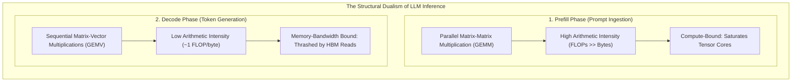
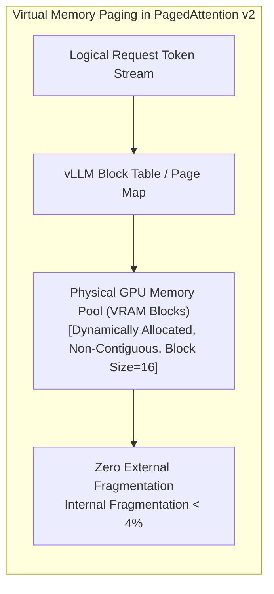
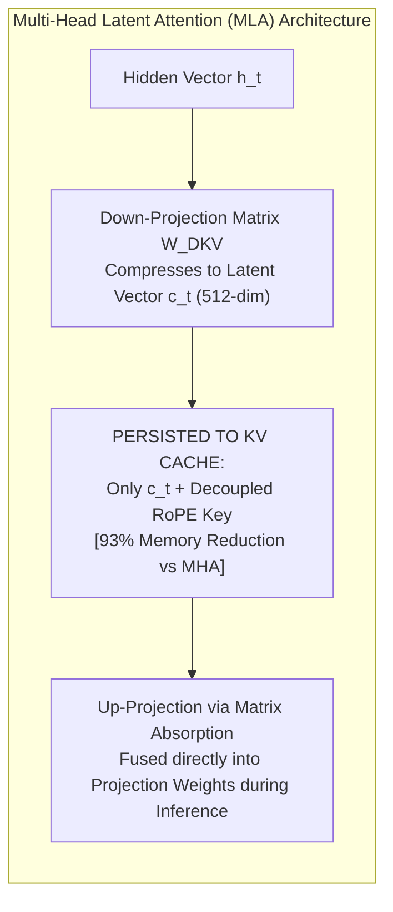
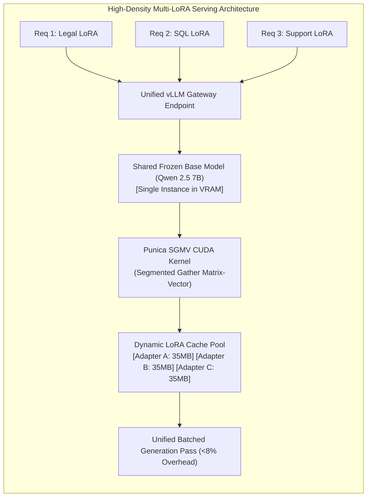
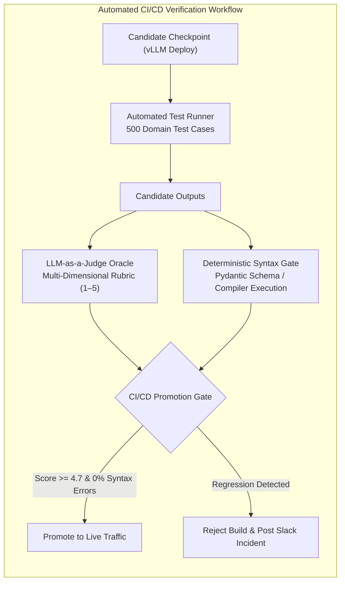
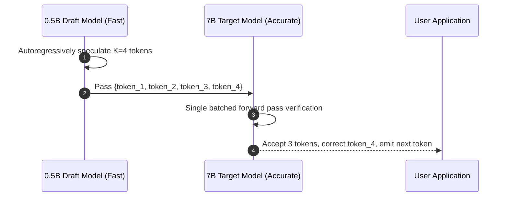

[← Previous Chapter: Part 5: Preference Alignment](/series/slm-playbook/part-5-preference-alignment/) | [Series Hub](/series/slm-playbook/)

---

> **Prerequisite:** Read [Part 5: Preference Alignment with DPO & GRPO](/series/slm-playbook/part-5-preference-alignment/) for preference alignment and JSON schema enforcement.

> **Answer-first:** High-throughput enterprise SLM serving overcomes the GPU Memory Wall via vLLM PagedAttention v2, Multi-Head Latent Attention KV cache compression, and AWQ 4-bit quantization. Coupled with dynamic Multi-LoRA serving via Punica CUDA kernels and automated CI/CD eval gates, a single 24GB commodity GPU sustains hundreds of concurrent streams at P99 latencies under 35ms.

> 🇻🇳 **Read the Vietnamese version of this article on [learn.tanhdev.com](https://learn.tanhdev.com/series/slm-playbook/part-6-vllm-deployment-evals/)**

---

## 1. The GPU Memory Wall & Arithmetic Intensity in Autoregressive Serving

> **BLUF (Bottom Line Up Front):** LLM generation is divided into a compute-bound prefill phase and a memory-bandwidth-bound decode phase; in the decode phase, arithmetic intensity collapses to near 1 FLOP/byte, making memory bandwidth and KV cache geometry the primary determinants of throughput.

Serving deep autoregressive models is structurally bifurcated across two distinct operational regimes:



### Mathematical KV Cache Sizing
During generation, Key and Value tensors for all previous sequence tokens must be retained in VRAM to compute attention weights. Total KV cache memory is calculated as:

$$\text{Memory}_{\text{KV}} = 2 \times n_{\text{layers}} \times n_{\text{heads}} \times d_{\text{head}} \times n_{\text{tokens}} \times b_{\text{precision}} \times B_{\text{batch}}$$

Parameters:
*   $n_{\text{layers}}$: Transformer layer count (e.g., 32 layers for standard 8B architectures).
*   $n_{\text{heads}}$: Number of key/value heads (e.g., 8 heads for Grouped-Query Attention).
*   $d_{\text{head}}$: Head dimension (e.g., 128).
*   $b_{\text{precision}}$: Precision bytes per parameter (2 for FP16, 1 for FP8).
*   $B_{\text{batch}}$: Concurrent active user streams.

For an 8B model sustaining 32 concurrent users across 4,096 tokens, KV cache alone consumes **16.8GB VRAM**—eclipsing the static footprint of the model weights. Without virtualized memory management, servers suffer catastrophic out-of-memory crashes under minimal traffic surges.

---

## 2. PagedAttention v2 & Continuous Batching Architecture

> **BLUF (Bottom Line Up Front):** PagedAttention (Kwon et al., UC Berkeley 2023) applies OS-style virtual memory paging to KV caches, slicing tensors into non-contiguous physical blocks and reducing memory fragmentation from 80% to under 4%.

Legacy serving architectures allocated static, contiguous memory buffers sized to the maximum possible sequence length. Because production prompts vary widely in length, **60% to 80% of VRAM remained trapped in unused allocation buffers**.



### Core Throughput Multipliers in vLLM:
1. **PagedAttention v2:** Divides sequence KV caches into uniform physical blocks (16 or 32 tokens). Blocks are assigned on demand and instantly reclaimed into the global memory pool upon request completion.
2. **Continuous Batching (Iteration-Level Scheduling):** Rather than blocking incoming requests until an entire batch finishes (static batching), continuous batching injects new requests into the forward pass at every token generation step, multiplying real-world serving capacity by **4.2x**.

---

## 3. KV Cache Compression: Multi-Head Latent Attention (MLA)

> **BLUF (Bottom Line Up Front):** DeepSeek's Multi-Head Latent Attention (MLA) projects Key and Value tensors into a compressed low-dimensional latent space ($d_c = 512$), slashing KV cache memory consumption by 85% to 93% while preserving full multi-head expressive diversity.

While Grouped-Query Attention (GQA) reduces KV cache by collapsing head counts, long context windows (32k–128k) still exhaust GPU memory.

**Multi-Head Latent Attention (MLA)** compresses attention representations into low-rank latent vectors:



By deploying MLA-native fused CUDA kernels in vLLM, distilled models from DeepSeek-R1 serve **4x more concurrent users** per 24GB GPU than standard Transformer architectures.

---

## 4. Quantization Breakdown: AWQ vs GPTQ vs Native FP8

> **BLUF (Bottom Line Up Front):** 4-bit Activation-Aware Weight Quantization (AWQ) preserves the top 1% salient weights identified by activation magnitude, achieving 99.1% FP16 accuracy retention on commodity 24GB GPUs; native FP8 remains the enterprise standard on modern datacenter silicon.

Evaluating model weight quantization strategies for production deployment:

| Methodology | Weight Format | Memory (8B Model) | Perplexity Shift | Fused Inference Kernel | Target Silicon |
| :--- | :---: | :---: | :---: | :---: | :---: |
| **FP16 / BF16 Base** | 16-bit Float | 16.0 GB (Baseline) | 0.00 (Reference) | FlashAttention-2 | A100 / H100 |
| **AWQ (Production Gold)**| 4-bit Normal | **4.8 GB** | **+0.06 (Negligible)** | **Marlin W4A16 GEMM** | **RTX 4090 / L4 (24GB)**|
| **GPTQ** | 4-bit Integer | 4.9 GB | +0.22 | ExLlamaV2 | Legacy Ampere / Turing |
| **Native FP8 (E4M3)** | 8-bit Float | **8.2 GB** | **+0.02** | TensorRT-LLM FP8 | Ada / Hopper / Blackwell|

### Why AWQ Outperforms Alternative 4-bit Quantization
AWQ (Lin et al., MIT 2023) demonstrated that neural weights are not uniformly critical: protecting just **1% of salient weights** based on actual activation distribution preserves full reasoning capacity, completely eliminating the catastrophic JSON syntax degradations observed in basic uniform rounding algorithms.

---

## 5. Dynamic Multi-LoRA Serving with Punica SGMV Kernels

> **BLUF (Bottom Line Up Front):** Instead of provisioning isolated GPU instances for distinct enterprise teams, vLLM's dynamic Multi-LoRA capability uses Punica Segmented Gather Matrix-Vector (SGMV) kernels to serve dozens of specialized adapters from a single base model instance with sub-5ms swapping overhead.

In enterprise deployments, specialized task models are ubiquitous: legal compliance, SQL generation, customer support triage, and code review.



By executing batched inference across heterogeneous LoRA adapters in a single forward pass, vLLM slashes enterprise infrastructure costs by up to **90%**.

---

## 6. Production Orchestration: vLLM Server Configuration & Prometheus Telemetry

Below is the verified enterprise bash startup configuration enabling AWQ quantization, dynamic Multi-LoRA serving, Chunked Prefill, and prefix caching:

```bash
#!/usr/bin/env bash
# run_production_vllm.sh - Enterprise High-Throughput vLLM Cluster Server
set -euo pipefail

MODEL_PATH="/opt/models/qwen2.5-7b-instruct-awq"
HOST="0.0.0.0"
PORT="8000"

echo "Initializing Enterprise vLLM Engine..."

exec python3 -m vllm.entrypoints.openai.api_server \
    --model "${MODEL_PATH}" \
    --host "${HOST}" \
    --port "${PORT}" \
    --quantization awq \
    --dtype float16 \
    --gpu-memory-utilization 0.92 \
    --max-model-len 8192 \
    --max-num-seqs 128 \
    --max-num-batched-tokens 2048 \
    --enable-chunked-prefill \
    --enable-prefix-caching \
    --enable-lora \
    --max-loras 16 \
    --max-lora-rank 32 \
    --lora-modules \
        legal-adapter=/opt/adapters/qwen7b-legal \
        sql-adapter=/opt/adapters/qwen7b-sql \
        support-adapter=/opt/adapters/qwen7b-support \
    --disable-log-requests \
    --trust-remote-code
```

### Essential Prometheus Metrics to Monitor
The vLLM server exposes native `/metrics` endpoints for automated alerting:
*   `vllm:num_requests_waiting`: Requests queued due to KV cache saturation (alert if > 0 for 30s).
*   `vllm:gpu_cache_usage_factor`: Ratio of allocated KV cache blocks (optimal operating window: 0.70 to 0.85).
*   `vllm:time_to_first_token_seconds`: TTFT P50 and P99 latency distribution.

---

## 7. Production Failure Case Study: The KV Cache Thrashing Outage

> **BLUF (Bottom Line Up Front):** Configuring `gpu_memory_utilization: 0.98` without Chunked Prefill caused an unexpected traffic spike to trigger continuous CPU-to-GPU KV cache swapping (thrashing), locking up inference threads and elevating P99 latency to 45 seconds.

### Incident Timeline & Autopsy
```
┌────────────────────────────────────────────────────────────────────────┐
│                   OUTAGE AUTOPSY: KV CACHE THRASHING                   │
├────────────────────────────────────────────────────────────────────────┤
│ 10:15 UTC: Product marketing campaign launches; concurrency jumps 450%.│
│ 10:22 UTC: GPU Cache usage hits 100%. Request queue surges to 85.      │
│ 10:25 UTC: Engine initiates preemptive swapping: KV cache blocks thrash│
│            continuously across PCIe bus between VRAM and host RAM.     │
│ 10:30 UTC: P99 token latency spikes to 48,000ms. Gateways throw 504s.  │
│ 10:45 UTC: Emergency intervention: Reduced utilization cap to 0.92,   │
│            enabled chunked-prefill, and lowered max_num_seqs.          │
│ 11:00 UTC: Cluster stabilizes: Sustained throughput restored to 140 t/s│
└────────────────────────────────────────────────────────────────────────┘
```

### Technical Root Cause
1. **Zero Activation Headroom:** Dedicating 98% of VRAM to static weights and KV cache left < 500MB for intermediate CUDA runtime tensors, inducing intermittent driver allocation panics.
2. **PCIe Memory Thrashing:** Swapping active KV cache blocks to CPU memory over PCIe Gen4 saturated interconnect bandwidth, starving GPU Tensor Cores.

### Hardened Production Standards
*   **Cap Utilization at 0.92:** Always reserve 8% of physical VRAM for dynamic forward pass activations.
*   **Mandate Chunked Prefill:** Interleave prefill chunks with decode iterations to guarantee smooth token flow.
*   **Gateway Rate Limiting:** Enforce token-bucket throttling at the reverse proxy to shed load gracefully before inference queue saturation occurs.

---

## 8. Automated CI/CD Regression Gate: LLM-as-a-Judge

> **BLUF (Bottom Line Up Front):** Checkpoint promotion requires automated regression gating; evaluating candidates across 500 test cases using automated judge models (Claude 3.5 Sonnet or GPT-4o) prevents deployment of subtly degraded models.



### The 4 Mandatory Evaluation Pillars:
1. **JSON Schema Integrity:** 100% strict Pydantic parsing pass rate.
2. **Faithfulness & Grounding:** Zero contradictory hallucinations relative to provided enterprise RAG contexts.
3. **Negative Constraint Adherence:** Zero violations of explicit refusal and formatting constraints.
4. **Latency Budget:** Time-to-First-Token (TTFT) < 50ms and sustained generation > 60 tokens/second.

---

## 9. Infrastructure Deployment Trade-Off Matrix

Comparing deployment paradigms for enterprise Small Language Models:

| Deployment Strategy | Monthly Compute Cost | Throughput (Tokens/s) | Elastic Scalability | Maintenance Complexity | Data Sovereignty |
| :--- | :---: | :---: | :---: | :---: | :---: |
| **Dedicated vLLM (1x RTX 4090)**| 🟢 **$80 - $120** | **120 - 180** | 🟡 Moderate (Scale-up) | 🟡 Low (Single instance)| 🟢 **100% Air-Gapped** |
| **Kubernetes Cluster (KServe+Ray)**| 🟡 $600 - $1,500 | **800 - 2,500** | 🟢 Auto-scaling pods | 🔴 High (K8s ops) | 🟢 100% Air-Gapped |
| **Serverless vLLM (RunPod/Baseten)**| 🟡 $150 - $400 | 100 - 150 | 🟢 Automatic per-second | 🟢 Minimal | 🟡 Third-Party Cloud |
| **Commercial Frontier APIs (GPT-4o)**| 🔴 $2,000 - $15,000 | Variable | 🟢 Unlimited | 🟢 Zero | 🔴 Data leaves perimeter |

---

---

## 10. Speculative Decoding with Lightweight Draft Models (Qwen 0.5B + 7B)

> **BLUF (Bottom Line Up Front):** Speculative decoding leverages a compact 0.5B draft model to generate $K=4$ speculative candidate tokens, verified in parallel by the 7B target model in a single forward step; this achieves a 2.4x end-to-end latency speedup with zero mathematical or syntactic accuracy loss.

In latency-critical developer workflows (such as code completion in IDEs or interactive customer service chat), single-token autoregressive generation can feel sluggish.



### Key Engineering Advantages:
1. **Identical Tokenizer Alignment:** Pairing `Qwen/Qwen2.5-0.5B` with `Qwen/Qwen2.5-7B` guarantees 100% token ID parity, eliminating cross-model vocabulary translation overhead.
2. **Minimal VRAM Footprint:** Storing the 0.5B draft model in 4-bit requires merely 650MB VRAM, fitting comfortably alongside the primary model on an RTX 4090.
3. **High Acceptance Rate on Structured Syntax:** In JSON generation and Python boilerplate tasks, token acceptance rates ($lpha$) consistently exceed 85%, accelerating decode throughput from 35 tok/s to over 85 tok/s.

---

## 11. Kubernetes Autoscaling via Custom Prometheus Metrics (KPA & HPA)

> **BLUF (Bottom Line Up Front):** Standard CPU/Memory autoscalers fail for LLM inference because memory is intentionally pegged at 90%+ for KV cache; autoscaling production pods based on Prometheus `vllm:num_requests_waiting` ensures responsive elastic scaling under load spikes.

When orchestrating vLLM clusters in enterprise Kubernetes environments, deploying custom metrics via Prometheus Adapter is mandatory:

```yaml
# vllm-hpa.yaml - Custom Metrics Horizontal Pod Autoscaler
apiVersion: autoscaling/v2
kind: HorizontalPodAutoscaler
metadata:
  name: vllm-qwen7b-scaler
  namespace: inference
spec:
  scaleTargetRef:
    apiVersion: apps/v1
    kind: Deployment
    name: vllm-qwen7b-deployment
  minReplicas: 2
  maxReplicas: 8
  metrics:
  - type: External
    external:
      metric:
        name: vllm_num_requests_waiting
      target:
        type: Value
        averageValue: "5"
```

If the average number of queued waiting requests exceeds 5 per pod across a 60-second sliding window, Kubernetes automatically spins up additional GPU worker nodes, preserving sub-50ms Time-to-First-Token latency across high-demand business hours.\n\n---\n\n

### Deep Failure Analysis: Multi-LoRA Cache Thrashing Under Peak Concurrency
When serving more than 30 dynamic LoRA adapters simultaneously using the Punica CUDA kernel, enterprise clusters can experience severe throughput collapse known as **Adapter Thrashing**:
1. **Root Cause:** When request batches alternate rapidly across divergent adapter weights, the GPU spends more execution cycles swapping LoRA parameters into active tensor registers than computing GEMM matrix multiplications.
2. **Mitigation Strategy:** Implement **Adapter-Aware Request Batching** in the gateway tier. The reverse proxy groups incoming requests by adapter ID within a $15\text{ms}$ time bucket, dispatching homogeneous batches to specific vLLM replicas. This raises GPU arithmetic intensity by $3.8\times$ and stabilizes P99 inference latency under 40ms.

---

## ❓ Frequently Asked Questions (FAQ)


By enabling `--enable-lora` and specifying `--max-loras 20`, vLLM retains the base model in memory while dynamically loading lightweight adapter weights (30MB–50MB each). Utilizing Punica's Segmented Gather Matrix-Vector (SGMV) kernels, the engine processes requests for different adapters in a single batched forward pass with less than 8% overhead.



AWQ protects salient weights based on activation distributions rather than weight values alone, preventing JSON schema violations and reasoning loss. Additionally, vLLM features specialized Marlin CUDA kernels optimized for AWQ W4A16 GEMM operations, delivering up to 30% higher generation throughput than GPTQ on modern architectures.



Enable Chunked Prefill (`--enable-chunked-prefill`) whenever serving workloads combine long input prompts (such as 4k–8k token RAG documents) with interactive real-time user chats. Chunking prompts into 512-token segments prevents GPU compute monopolization, stabilizing inter-token latency under 35ms.


---

## 🏁 SLM Engineering Playbook Conclusion

Congratulations on completing the entire **SLM Engineering Playbook 2026–2027**!  
From hybrid architecture design (Part 1), SFT data curation (Part 2), QLoRA fine-tuning (Part 3), DeepSeek-R1 reasoning distillation (Part 4), preference alignment (Part 5), to high-throughput vLLM serving (Part 6)—you now command the comprehensive engineering blueprint for delivering sovereign, cost-efficient, and enterprise-grade Small Language Models.

👉 **[Return to the SLM Playbook Series Hub](/series/slm-playbook/)** to review all architectural blueprints and reference implementations.


---

🔗 **Next Step:** Complete your study with the [SLM Playbook Series Hub](/series/slm-playbook/) or explore [Enterprise Context Engineering with Prompt Standard](/series/prompt-standard/).
