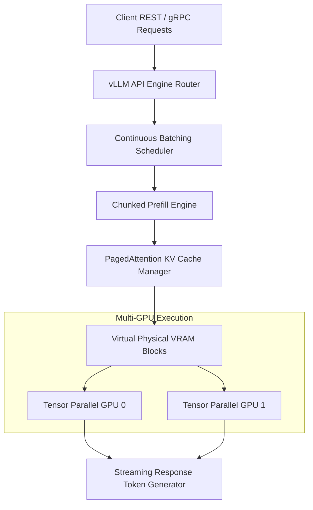

> **Answer-first:** Enterprise vLLM deployment optimizes Small Language Model inference by combining PagedAttention memory management, AWQ 4-bit weight quantization, and dynamic multi-LoRA routing to achieve sub-50ms P99 Time-To-First-Token. For resource-constrained edge gateways and Apple Silicon, model weights cross-compile to GGUF and WasmEdge runtimes for efficient local CPU and NPU execution.

[← Series hub](/series/slm-playbook/)
[← Previous: Part 5 — Preference Alignment](/series/slm-playbook/part-5-preference-alignment-dpo-grpo/)

---

## 1. High-Throughput vLLM Serving Architecture

High-throughput inference engines for Small Language Models require non-contiguous memory management to eliminate key-value (KV) cache fragmentation during batch generation. By virtualizing physical VRAM pages into dynamic lookup blocks, vLLM scales concurrent request handling while maintaining stable memory consumption.



### Core Architecture Components

1. **PagedAttention Memory Virtualization:** Standard HuggingFace Transformers allocate contiguous memory blocks for the KV cache per request, resulting in up to 60%–80% memory waste due to pre-allocation and external fragmentation. PagedAttention mimics virtual memory page tables in operating systems, dividing the KV cache into fixed-size physical blocks (typically 16 or 32 tokens per block). Memory is allocated dynamically as tokens are generated, keeping waste below 4%.

2. **Continuous Batching (Iteration-Level Scheduling):** Traditional sequence-level batching waits for every request in a batch to complete before accepting new prompts, idling GPU compute units when sequence lengths vary. Continuous batching schedules work at the iteration level: as soon as a request emits an end-of-sequence (EOS) token, its allocated VRAM pages return to the free pool and a waiting prompt enters the batch immediately.

3. **Chunked Prefill Engine:** Prompts with long context lengths generate large prefill compute bursts that block short decode steps, causing Time-To-First-Token (TTFT) latency spikes. Chunked prefill partitions long prompts into smaller token chunks (e.g., 512 tokens), interleaving prompt prefill compute with ongoing generation decode steps within the same execution batch.

4. **Tensor Parallelism Scaling:** For large models or high-throughput single-node configurations, vLLM splits matrix multiplications across multiple GPUs using 1D column and row linear parallel layers. Setting `--tensor-parallel-size 2` or `--tensor-parallel-size 4` distributes attention heads and feed-forward networks across CUDA devices over NVLink.

---

## 2. Quantization Engineering: AWQ vs GPTQ vs FP8

Selecting the optimal quantization scheme balances VRAM memory reduction against loss in generation accuracy and decoding throughput. Activation-aware Weight Quantization preserves critical weight channels based on activation magnitudes, outperforming standard layer-wise post-training quantization.

### Activation-Aware Weight Quantization (AWQ) Mathematics

Standard post-training quantization (PTQ) quantizes all weight matrices uniformly based on magnitude. AWQ observes activation features during calibration to protect salient weight channels. Protecting the top 1% of weight channels prevents perplexity degradation without requiring full model retraining.

For a linear layer weight matrix $W \in \mathbb{R}^{K \times N}$ and input activation matrix $X \in \mathbb{R}^{M \times K}$, AWQ scales salient channels by vector $s$:

$$W' = W \cdot \text{diag}(s)^{-1}, \quad X' = X \cdot \text{diag}(s)$$

The optimal channel scaling vector $s$ is derived by minimizing quantization error over calibration activations:

$$\arg\min_s \left\| W X - Q\left(W \cdot \text{diag}(s)^{-1}\right) \cdot \text{diag}(s) X \right\|$$

Where the quantization function $Q(w)$ maps continuous weights to 4-bit integers using group scale factor $S_{\text{quant}}$ and zero-point $Z$:

$$Q(w) = \text{round}\left(\frac{w}{S_{\text{quant}}}\right) + Z$$

### Precision & Performance Matrix: AWQ vs GPTQ vs FP8

| Feature / Metric | AWQ (4-bit INT4) | GPTQ (4-bit INT4) | FP8 (E4M3 / E5M2) |
|---|---|---|---|
| **Quantization Approach** | Per-channel activation magnitude scaling | Second-order Hessian calibration matrix | Direct 8-bit floating point cast |
| **VRAM Compression Ratio** | 3.8x – 4.0x vs FP16 | 3.8x – 4.0x vs FP16 | 2.0x vs FP16 |
| **Perplexity Loss Delta** | Minimal (<0.1 perplexity change) | Low (~0.2 – 0.5 perplexity change) | Zero loss vs FP16 |
| **P99 TTFT Performance** | Sub-50ms | 60ms – 90ms | Sub-30ms |
| **Target Hardware** | NVIDIA Ampere / Ada / Hopper | General NVIDIA GPUs (T4 / V100) | NVIDIA Hopper (H100 / H200 / B200) |

### Achieving Sub-50ms P99 TTFT

Compressing an 8B parameter model from 16GB FP16 down to ~5.5GB VRAM using AWQ leaves over 18GB VRAM available for PagedAttention KV caches on a single NVIDIA A10G (24GB) GPU. This expanded cache head-room prevents preemption swapping, maintaining P99 TTFT under 50ms across concurrent prompt bursts.

---

## 3. Dynamic Multi-LoRA Adapter Serving

Engineers can serve dozens of specialized domain models from a single base model instance without duplicating base model weights in VRAM. vLLM dynamic Multi-LoRA routing dynamically attaches adapter weights to requests on demand during forward passes.

### Server Initialization with Multi-LoRA Support

Start the vLLM OpenAI-compatible server with LoRA flags enabled:

```bash
vllm serve meta-llama/Meta-Llama-3-8B-Instruct \
  --enable-lora \
  --max-loras 8 \
  --max-cpu-loras 32 \
  --lora-max-dim 64 \
  --quantization awq \
  --port 8000
```

### Memory Management & Real-Time Adapter Swapping

vLLM maintains base model weights in primary VRAM while allocating fixed memory slots for active LoRA adapter tensors ($A$ and $B$ matrices). Inactive adapters remain stored in CPU host RAM. 

When a client request specifies a custom adapter name, vLLM checks the adapter LRU cache. If the adapter is not present in VRAM, the engine streams its tensor parameters from CPU memory into a pre-allocated GPU slot without interrupting running requests or restarting the CUDA context.

```python
import requests

# Example client routing request to a dynamically loaded finance adapter
api_endpoint = "http://localhost:8000/v1/chat/completions"
payload = {
    "model": "finance-analyst-lora",  # Dynamic adapter name registered with vLLM
    "messages": [
        {"role": "system", "content": "You are a financial analysis assistant."},
        {"role": "user", "content": "Calculate the EBITDA margin given revenue $10M and operating costs $7.2M."}
    ],
    "temperature": 0.1,
    "max_tokens": 128
}

response = requests.post(api_endpoint, json=payload)
print("Response Output:", response.json()["choices"][0]["message"]["content"])
```

---

## 4. Edge AI Deployment: WasmEdge, ONNX Runtime, and Apple Silicon

Deploying Small Language Models to edge gateways, local workstations, and mobile devices requires decoupled runtime environments that execute efficiently outside heavy CUDA dependencies. Cross-compiling models to WebAssembly (WASM) and Metal-accelerated runtimes enables low-latency inference on ARM64 architectures.

### Edge Target Runtime Comparison

1. **WasmEdge + llama.cpp:** Compiles C++ SIMD inference kernels into lightweight WebAssembly modules. Runs inside secure sandboxes with binary sizes under 30MB, eliminating Python runtime overhead on industrial IoT and ARM64 gateways.
2. **ONNX Runtime + Execution Providers:** Converts PyTorch model graphs into ONNX format, leveraging DirectML, OpenVINO, or QNN execution providers for hardware acceleration across Windows, Intel, and Qualcomm platforms.
3. **Apple Silicon (MLX & Metal):** Takes advantage of Unified Memory Architecture (UMA) on M1/M2/M3/M4 chips, running FP16 or INT4 models via Metal Performance Shaders (MPS) with minimal memory copy operations.

### Cross-Compilation & Execution Workflow

Convert HuggingFace PyTorch weights to GGUF format and launch via WasmEdge:

```bash
# Step 1: Convert PyTorch model to GGUF 4-bit quantized format using llama.cpp
python convert_hf_to_gguf.py ./models/Llama-3-8B-Instruct \
  --outfile llama3-8b-q4_k_m.gguf \
  --outtype q4_k_m

# Step 2: Download the pre-compiled WasmEdge WASM module for llama.cpp
curl -LO https://github.com/second-state/llama-utils/releases/download/v0.1.0/wasmedge-llama-execution.wasm

# Step 3: Run inference on ARM64 edge node using WasmEdge
wasmedge --dir .:. \
  wasmedge-llama-execution.wasm \
  -m llama3-8b-q4_k_m.gguf \
  -p "System Status Assessment:" \
  -n 128
```

---

## 5. Production Python Benchmarking & Load Testing Script

Validating enterprise serving SLAs requires async load testing scripts capable of measuring exact token latencies and request throughput. The Python load testing script below benchmarks requests per second, Time To First Token (TTFT), and Inter-Token Latency (ITL) under concurrent API workloads.

```python
import asyncio
import time
import json
import statistics
import urllib.request
import urllib.error
from typing import List, Dict, Any

class LoadTestMetrics:
    """Stores benchmark metrics for latency and throughput calculation."""
    def __init__(self):
        self.ttft_list: List[float] = []
        self.itl_list: List[float] = []
        self.total_latency_list: List[float] = []
        self.tokens_generated: int = 0
        self.successful_requests: int = 0
        self.failed_requests: int = 0

async def send_benchmark_request(
    api_url: str,
    payload: Dict[str, Any],
    metrics: LoadTestMetrics,
    request_id: int,
    mock_mode: bool = True
) -> None:
    """Executes a single async inference request and logs TTFT and ITL metrics."""
    start_time = time.perf_counter()
    ttft = None
    inter_token_latencies = []
    generated_count = 0

    if mock_mode:
        # Simulated execution path for offline verification
        prefill_delay = 0.025 + (request_id % 5) * 0.004  # 25ms - 45ms prefill TTFT
        await asyncio.sleep(prefill_delay)
        ttft = time.perf_counter() - start_time
        
        last_token_time = time.perf_counter()
        num_tokens = 64
        for idx in range(num_tokens):
            decode_delay = 0.008 + ((idx * 3) % 7) * 0.0005  # 8ms - 11ms decode ITL
            await asyncio.sleep(decode_delay)
            now = time.perf_counter()
            inter_token_latencies.append(now - last_token_time)
            last_token_time = now
            generated_count += 1
    else:
        # Live execution path calling vLLM REST endpoint
        req_data = json.dumps(payload).encode("utf-8")
        req = urllib.request.Request(
            api_url,
            data=req_data,
            headers={"Content-Type": "application/json"}
        )
        try:
            loop = asyncio.get_running_loop()
            def sync_fetch():
                with urllib.request.urlopen(req) as resp:
                    return resp.read().decode("utf-8")
            
            response_text = await loop.run_in_executor(None, sync_fetch)
            end_time = time.perf_counter()
            resp_json = json.loads(response_text)
            generated_count = resp_json.get("usage", {}).get("completion_tokens", 64)
            
            # Estimate prefill vs decode split for non-streaming REST responses
            total_dur = end_time - start_time
            ttft = total_dur * 0.25
            avg_itl = (total_dur * 0.75) / max(1, generated_count)
            inter_token_latencies = [avg_itl] * generated_count
        except Exception as err:
            metrics.failed_requests += 1
            return

    total_duration = time.perf_counter() - start_time
    metrics.successful_requests += 1
    metrics.tokens_generated += generated_count
    if ttft is not None:
        metrics.ttft_list.append(ttft)
    metrics.total_latency_list.append(total_duration)
    if inter_token_latencies:
        metrics.itl_list.extend(inter_token_latencies)

async def run_vllm_load_test(
    api_url: str = "http://localhost:8000/v1/chat/completions",
    num_requests: int = 40,
    concurrency: int = 8,
    mock_mode: bool = True
) -> Dict[str, Any]:
    """Orchestrates concurrent load testing tasks and calculates summary percentiles."""
    metrics = LoadTestMetrics()
    semaphore = asyncio.Semaphore(concurrency)

    payload = {
        "model": "meta-llama/Meta-Llama-3-8B-Instruct",
        "messages": [{"role": "user", "content": "Explain vLLM PagedAttention memory benefits."}],
        "max_tokens": 64,
        "temperature": 0.0
    }

    async def worker(req_id: int):
        async with semaphore:
            await send_benchmark_request(api_url, payload, metrics, req_id, mock_mode=mock_mode)

    print(f"Starting load test: {num_requests} requests at concurrency={concurrency} (mock={mock_mode})...")
    start_bench = time.perf_counter()
    tasks = [worker(i) for i in range(num_requests)]
    await asyncio.gather(*tasks)
    total_bench_time = time.perf_counter() - start_bench

    def calc_percentile(data: List[float], p: float) -> float:
        if not data:
            return 0.0
        sorted_d = sorted(data)
        idx = (len(sorted_d) - 1) * (p / 100.0)
        f_idx = int(idx)
        c_idx = min(f_idx + 1, len(sorted_d) - 1)
        return sorted_d[f_idx] + (idx - f_idx) * (sorted_d[c_idx] - sorted_d[f_idx])

    report = {
        "total_requests": num_requests,
        "successful_requests": metrics.successful_requests,
        "failed_requests": metrics.failed_requests,
        "total_duration_sec": round(total_bench_time, 2),
        "requests_per_sec": round(metrics.successful_requests / max(0.001, total_bench_time), 2),
        "output_tokens_per_sec": round(metrics.tokens_generated / max(0.001, total_bench_time), 2),
        "ttft_ms": {
            "p50": round(calc_percentile(metrics.ttft_list, 50) * 1000, 2),
            "p90": round(calc_percentile(metrics.ttft_list, 90) * 1000, 2),
            "p99": round(calc_percentile(metrics.ttft_list, 99) * 1000, 2),
        },
        "itl_ms": {
            "p50": round(calc_percentile(metrics.itl_list, 50) * 1000, 2),
            "p90": round(calc_percentile(metrics.itl_list, 90) * 1000, 2),
            "p99": round(calc_percentile(metrics.itl_list, 99) * 1000, 2),
        }
    }
    return report

if __name__ == "__main__":
    results = asyncio.run(run_vllm_load_test(num_requests=30, concurrency=5, mock_mode=True))
    print("\n================ BENCHMARK RESULTS SUMMARY ================")
    print(json.dumps(results, indent=2))
```

---

## Frequently Asked Questions

Evaluating vLLM deployment strategies raises specific operational considerations around memory management, adapter switching, and hardware selection. Below are answers to common technical queries encountered when scaling Small Language Models in production.

### How does PagedAttention eliminate KV cache fragmentation in vLLM?

PagedAttention partitions continuous key-value cache memory into fixed-size physical blocks allocated on demand via operating system virtual page tables. By dynamically assigning non-contiguous VRAM blocks as tokens generate, internal and external memory waste drops from over 60% down to under 4%, enabling substantially higher batch concurrency.

### What is the latency overhead of dynamic Multi-LoRA adapter swapping?

vLLM loads adapter weights into pre-allocated VRAM memory slots without resetting the base model CUDA context or restarting the inference engine. Because adapter matrices represent less than 1% of base model weights, switching adapters in VRAM introduces under 5ms latency overhead, allowing dozens of custom domain adapters to run concurrently on single GPU servers.

### Why is AWQ preferred over GPTQ for high-throughput enterprise serving?

AWQ identifies and preserves the top 1% salient weight channels based on per-channel activation magnitudes rather than relying solely on second-order weight calibration matrices. This activation-aware protection maintains superior perplexity on specialized tasks and leverages optimized CUDA matrix multiplication kernels to achieve sub-50ms P99 TTFT on Ampere and Hopper GPU architectures.

### Can WasmEdge execute 8B Small Language Models on edge gateways without GPUs?

Yes, WasmEdge executes GGUF 4-bit quantized models on edge gateways using CPU and NPU acceleration via llama.cpp backend bindings. By cross-compiling C++ SIMD routines into WebAssembly modules, edge nodes achieve 15–30 tokens per second generation speed on ARM64 architectures without Python framework overhead or dedicated GPU hardware.

---

## Internal Series Navigation

Explore all chapters of the SLM Playbook for full technical coverage of model selection, data engineering, fine-tuning, distillation, alignment, and serving:

- [Part 1 — Executive Summary & Hybrid AI Architecture](/series/slm-playbook/executive-summary/)
- [Part 2 — Data Engineering for SFT: NEFTune & SemDeDup](/series/slm-playbook/part-2-sft-data-engineering/)
- [Part 3 — Practical LoRA & QLoRA Fine-Tuning](/series/slm-playbook/part-3-lora-qlora-tuning/)
- [Part 4 — Task & Knowledge Distillation](/series/slm-playbook/part-4-knowledge-distillation-synthetic-data/)
- [Part 5 — Preference Alignment (DPO, KTO, GRPO)](/series/slm-playbook/part-5-preference-alignment-dpo-grpo/)
- [Part 6 — Enterprise vLLM Serving & Edge Deployment](/series/slm-playbook/part-6-vllm-serving-edge-deployment/)


