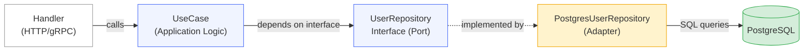

---
title: "Go System Design: CAP, PACELC & Clean Architecture Primer"
slug: "01-introduction-system-design-golang"
date: "2026-06-18T09:00:00+07:00"
lastmod: 2026-07-03T15:41:55+07:00
draft: false
author: "Tanh"
description: "System design trade-off thinking in Go: CAP theorem proof, PACELC matrix, composite availability math, and Clean Architecture with DI."
tags: ["system design", "golang", "clean architecture", "CAP theorem", "PACELC", "distributed systems"]
categories: ["System Design", "Backend Engineering"]
ShowToc: true
TocOpen: true
series: ["system-design"]
mermaid: true
cover:
  image: "/images/posts/ecommerce-microservices-blueprint-cover.png"
  alt: "System Design Masterclass in Golang: architecture patterns for high-traffic distributed systems"
  relative: false
---

> **Prerequisite:** This is Part 1 of the [System Design Masterclass](/series/system-design/) series. Familiarity with basic distributed systems concepts and Go syntax is assumed.

**Answer-first:** Sound system design thinking is fundamentally about evaluating and selecting trade-offs across performance, reliability, and cost. No system is perfect — architects optimize for the constraints imposed by real business requirements and technical realities.

---

## How Do You Build System Design Thinking?

**Answer-first:** System design mastery is built on three pillars: mastering foundational theorems (CAP, PACELC), practicing trade-off analysis on real-world case studies, and repeatedly decomposing large problems into measurable, independently scalable components.

Great architects don't answer *"which technology to use?"* — they answer *"what do we give up by choosing this?"*. Every technical decision carries hidden costs: latency, complexity, operational burden, or consistency degradation.

### The 3D Trade-off Framework

A practical framework for evaluating any architecture decision:

| Dimension | Questions to Ask | Real Example |
|---|---|---|
| **Performance** | Throughput in RPS? P99 latency target? | Flash sale: 500k RPS peak |
| **Reliability** | SLO availability target? Tolerance for data loss? | Banking: 99.999% uptime |
| **Cost** | Infrastructure cost? Operational complexity? | Startup: minimize node count |

> [!IMPORTANT]
> **SLA / SLO / SLI — Not the same thing:**
> - **SLI (Service Level Indicator):** A measured metric — e.g., "The `/checkout` endpoint p99 latency over 1 minute = 120ms"
> - **SLO (Service Level Objective):** The internal target — "99.9% of requests must complete in < 150ms per calendar month"
> - **SLA (Service Level Agreement):** The legal contract — "If SLO is breached, penalty $X applies"

### Composite Availability Math

When services depend on each other, total availability degrades rapidly.

**Series dependency (each service depends on the next):**

$$A_{\text{composite}} = A_A \times A_B \times A_C$$

*Example:* $99.9\% \times 99.9\% \times 99.9\% = 99.7\%$ — adds ~2.6 hours of downtime/year.

**Parallel redundancy (hot standby):**

$$A_{\text{composite}} = 1 - (1 - A_A) \times (1 - A_B)$$

*Example:* $1 - (0.001 \times 0.001) = 99.9999\%$ — only ~31 seconds of downtime/year.

> [!TIP]
> When designing a system targeting 99.95% SLO: with 5 services in a dependency chain, each service must individually achieve at least 99.99% to guarantee the aggregate SLO.

---

## CAP Theorem and the Asynchronous Network Model

**Answer-first:** The CAP Theorem (Seth Gilbert & Nancy Lynch, 2002) states that in an asynchronous distributed system, when a Network Partition (P) occurs, you can only guarantee one of: Consistency (C) or Availability (A). All three simultaneously is impossible.

### Formal Proof (Gilbert & Lynch, 2002)

Given a cluster $G = G_1 \cup G_2$ undergoing a network partition:

1. A write request `W(v1)` arrives at $G_1$.
2. A read request `R(key)` arrives at $G_2$.

**If the system chooses Availability (A):** $G_2$ must respond immediately. Since no message from $G_1$ can cross the partition to notify $G_2$ of the write, $G_2$ returns stale data — violating **Consistency (C)**.

**If the system chooses Consistency (C):** $G_2$ must wait for synchronization from $G_1$. Since the partition may persist indefinitely, $G_2$ never responds — violating **Availability (A)**.

> [!NOTE]
> CAP does not say "always pick 2 of 3". Partitions are rare — under normal operation, a system can achieve both C and A. The theorem applies only **during a partition event**.

### CAP in Practice: Not Binary

Most production systems aren't purely CP or AP. **Apache Cassandra** allows per-query consistency level tuning:

- `ALL`: All replicas must agree → maximum consistency, minimum availability.
- `QUORUM`: Majority of replicas → balanced trade-off.
- `ONE`: Only 1 replica needed → maximum availability, eventual consistency.

This per-operation flexibility is something CAP cannot model — which is why PACELC was introduced.

---

## PACELC Database Matrix

**Answer-first:** PACELC (Daniel Abadi, 2012) extends CAP by addressing the **non-partition case**: when the network is healthy, systems still face a trade-off between Latency (L) and Consistency (C). This is the more relevant trade-off in 99.9% of operational time.

Reading the notation: **PA/EL** = "During Partition, choose Availability; Else, choose Latency".

| Database | Classification | During Partition (P) | During Normal (E) | Mechanism |
|---|---|---|---|---|
| **Cassandra / ScyllaDB** | **PA/EL** | Availability | Latency | Tunable consistency (`LOCAL_QUORUM`, `ONE`). Async read/write repair. |
| **Amazon DynamoDB** | **PA/EL** | Availability | Latency | SSD-backed async replication. Eventual consistency by default. |
| **Google Cloud Spanner** | **PC/EC** | Consistency | Consistency | TrueTime API (atomic clocks + GPS) ensures external consistency (linearizability). |
| **MongoDB (WiredTiger)** | **PC/EC** | Consistency | Consistency | Primary-only writes; secondary disconnection blocks writes during re-election. |
| **OceanBase (Alipay)** | **PC/EC** | Consistency | Consistency | Paxos-based consensus, used by Alipay for Core Ledger in Double 11. |

> [!WARNING]
> Spanner's TrueTime commit wait latency is ~7ms. For systems requiring sub-5ms latency, this is a hard blocker. That's why Alipay still uses OceanBase over Spanner for core banking flows — see [Core Banking Architecture & Microfinance](/posts/deconstructing-microfinance-core-banking-architecture/).

### When to Migrate from Monolith to Microservices?

The answer: **not when you start, but when you're blocked**.

Concrete signals that indicate a monolith is the bottleneck:

- **Deployment coupling:** A bug in the payment module blocks the entire user-profile team release.
- **Scaling granularity:** The image-processing module needs 10× RAM, but you must scale the entire monolith.
- **Team autonomy:** 3+ teams conflicting on `main` branch daily.

> [!CAUTION]
> **Premature microservices is the most common failure pattern.** Shopee started with a PHP monolith, splitting only when real traffic demanded it. Netflix also started with a Java monolith before migrating. Splitting too early creates a *distributed monolith* — more complex, slower, with none of the benefits.

---

## Clean Architecture & Dependency Inversion in Go

**Answer-first:** Clean Architecture (Robert C. Martin) in Go organizes code into concentric layers with one rule: **dependencies can only point inward** — core business logic must never depend on databases, frameworks, or HTTP adapters. This enables domain logic to be tested in complete isolation.

### Standard Project Layout

```
my-service/
├── cmd/
│   └── api/
│       └── main.go           # Entry point, dependency injection wiring
├── internal/
│   ├── domain/               # Innermost layer — pure business rules
│   │   ├── user.go
│   │   └── order.go
│   ├── usecase/              # Application logic, orchestrates domain
│   │   └── create_order.go
│   ├── repository/           # Outbound adapters: DB, Redis, external APIs
│   │   └── postgres_user.go
│   └── handler/              # Inbound adapters: HTTP, gRPC handlers
│       └── order_handler.go
└── pkg/                      # Exportable library code (if needed)
```

> [!NOTE]
> The `internal/` package in Go is a compiler-enforced access boundary — no package outside the module can import code from `internal/`. This is how Go enforces Clean Architecture at the language level.

### Port/Adapter Pattern Implementation

The core principle: `domain` defines the **interface** (port), `repository` provides the **concrete adapter**. The domain never knows whether the database is PostgreSQL or MongoDB.

```go
// internal/domain/user.go — Innermost layer, pure business rules
package domain

type User struct {
    ID    string
    Name  string
    Email string
}

// UserRepository is the Port (Interface) — domain defines the contract
// but never knows the implementation details
type UserRepository interface {
    FindByID(id string) (*User, error)
    Save(user *User) error
}

// UserService — application business logic
type UserService struct {
    repo UserRepository // Injected via interface, not concrete type
}

func (s *UserService) GetUser(id string) (*User, error) {
    return s.repo.FindByID(id)
}
```

```go
// internal/repository/postgres_user.go — Outbound Adapter
// This is the ONLY layer that knows about PostgreSQL
package repository

import (
    "database/sql"
    "my-service/internal/domain"
)

type PostgresUserRepository struct {
    db *sql.DB
}

// PostgresUserRepository implements domain.UserRepository interface
func (r *PostgresUserRepository) FindByID(id string) (*domain.User, error) {
    var u domain.User
    err := r.db.QueryRow(
        "SELECT id, name, email FROM users WHERE id = $1", id,
    ).Scan(&u.ID, &u.Name, &u.Email)
    if err != nil {
        return nil, err
    }
    return &u, nil
}

func (r *PostgresUserRepository) Save(u *domain.User) error {
    _, err := r.db.Exec(
        "INSERT INTO users (id, name, email) VALUES ($1, $2, $3)",
        u.ID, u.Name, u.Email,
    )
    return err
}
```

```go
// cmd/api/main.go — Dependency Injection Wiring
// Only this layer knows all concrete types
package main

import (
    "database/sql"
    "my-service/internal/domain"
    "my-service/internal/repository"
    _ "github.com/lib/pq"
)

func main() {
    db, _ := sql.Open("postgres", "postgres://localhost/mydb?sslmode=disable")

    // Wire: inject PostgresUserRepository into UserService via interface
    userRepo := &repository.PostgresUserRepository{DB: db}
    userService := &domain.UserService{Repo: userRepo}

    _ = userService
    // userService has no knowledge of PostgreSQL
}
```

> [!TIP]
> **Testing benefit:** Since `UserService` depends only on the `UserRepository` interface, you can mock it in tests without a real database:
> ```go
> type MockUserRepo struct{}
> func (m *MockUserRepo) FindByID(id string) (*domain.User, error) {
>     return &domain.User{ID: id, Name: "Test User"}, nil
> }
> ```

### Dependency Flow Diagram



---

## Case Study: Alipay LDC Unitization — CAP at Extreme Scale

Alipay Double 11 is the benchmark for applying CAP Theorem in practice at massive scale. Full analysis at [Alipay Double 11 Architecture](/posts/alipay-double-11-architecture-tps/).

> 🔥 **[Production Insight]: Alipay LDC & Eventual Consistency**
> **Symptom:** At Double 11 scale, millions of transactions/second caused write contention on the core ledger.
> **Root Cause:** Strong consistency on every transaction is infeasible at this scale — latency grows with quorum size.
> **Resolution:** Alipay split into two tiers: (1) **RZone (Regular Zone)** — AP, eventual consistency, handles user-facing flows with local OceanBase replicas; (2) **GZone (Global Zone)** — PC, strict consistency, handles only final accounting settlement.
> *(Source: Alibaba Cloud Architecture Blog)*

**Key takeaway:** Not all data needs the same consistency model. Classify data by its consistency requirement and apply the appropriate PACELC tier per data domain.

---

## FAQ



- **SLI** is the measured metric from the system (e.g., request success rate = 99.95%).
- **SLO** is the internal target (e.g., success rate must be ≥ 99.9% over 30 days).
- **SLA** is the customer contract, typically below the SLO to provide a buffer (e.g., guarantees 99.5% or refunds apply).

**Rule of thumb:** SLO must be at least 0.1–0.5% higher than the SLA so the team has an "error budget" to handle incidents without breaching the contract.



CAP only models partition scenarios — but partitions occur less than 0.1% of the time in most well-operated systems. PACELC adds the "Else" dimension — when the network is healthy, the system **still** chooses between Latency and Consistency on every single request.

Example: Google Spanner chooses **PC/EC** — always prioritizes consistency even without a partition. This causes ~7ms commit wait latency, making it unsuitable for sub-millisecond real-time applications.



Use **monolith** when: team size < 10 engineers, domain boundaries are not yet clear, or iteration speed is critical.

Use **microservices** when: 3+ squads are working in the same codebase causing deployment conflicts, different modules need drastically different scaling characteristics, or release cadence needs to be decoupled between modules.

---

🔗 **Next:** [Part 2: Load Balancing L4/L7 & Rate Limiting in Go](/series/system-design/02-load-balancing-api-gateway-go/) — DSR routing deep-dive, Token Bucket algorithm, and API Gateway patterns.

