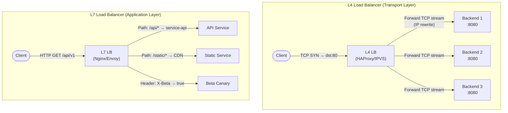
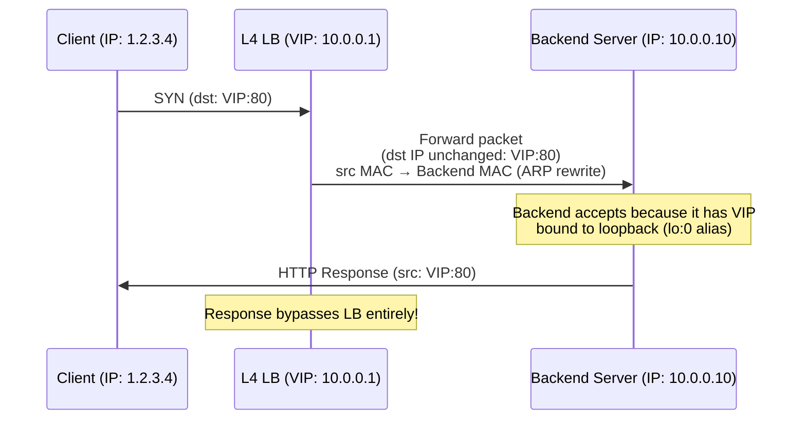
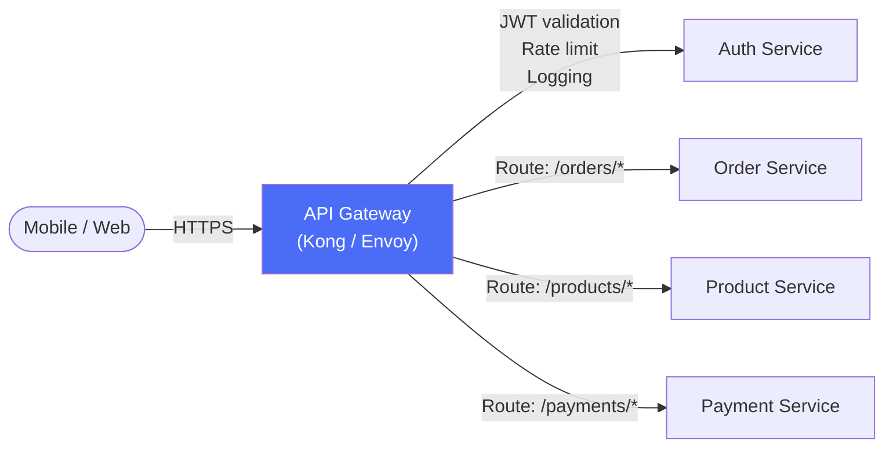

> **Prerequisite:** Part 2 of the [System Design Masterclass](/series/system-design/). Read [Part 1: System Design Thinking](/series/system-design/01-introduction-system-design-golang/) first to understand foundational trade-off frameworks.

**Answer-first:** L4 load balancing routes traffic by transport-layer (IP/TCP/UDP) metadata — minimal CPU overhead but limited intelligence. L7 load balancing inspects HTTP headers, paths, and cookies — enables content-based routing and advanced health checks at the cost of higher processing overhead per request.

---

## L4 vs L7 Load Balancing — The Definitive Comparison

**Answer-first:** The fundamental difference is where in the network stack the routing decision is made. L4 (Transport Layer) routes at TCP/UDP level using IP+port tuples. L7 (Application Layer) routes at HTTP level using headers, URLs, and payloads.

### Architecture Comparison



### Decision Matrix

| Property | L4 (HAProxy TCP) | L7 (Nginx / Envoy) |
|---|---|---|
| **OSI Layer** | Transport (Layer 4) | Application (Layer 7) |
| **Routing based on** | IP + Port tuple | URL path, HTTP headers, cookies, JWT claims |
| **Latency overhead** | **~0.1–0.3ms** | ~0.5–2ms (full HTTP parsing) |
| **Throughput** | **Millions of connections/s** | Hundreds of thousands/s |
| **TLS termination** | ❌ Pass-through only | ✅ Built-in TLS termination |
| **Health checks** | TCP connect only | HTTP 200, custom response body |
| **Sticky sessions** | Source IP hash | Cookie-based (`SERVERID`) |
| **Use case** | Raw TCP throughput, streaming, game servers | REST APIs, gRPC, canary releases, A/B testing |

> [!TIP]
> **Real-world stack:** Use L4 (HAProxy/IPVS) as the outermost layer for raw throughput, then L7 (Envoy/Nginx) inside the datacenter for intelligent routing. Shopee and most large-scale systems use this layered approach — L4 absorbs the raw connection burst, L7 routes by business logic.

---

## Direct Server Return (DSR) — How Asymmetric Routing Works

**Answer-first:** In DSR mode, the load balancer handles inbound requests but backend servers send response traffic directly to the client — bypassing the load balancer entirely. This eliminates the load balancer as a response throughput bottleneck.

### DSR Traffic Flow



### HAProxy DSR Configuration

```bash
# /etc/haproxy/haproxy.cfg — L4 DSR mode
global
    log /dev/log local0
    maxconn 500000

defaults
    mode tcp
    timeout connect 5s
    timeout client  30s
    timeout server  30s

frontend http_front
    bind *:80
    default_backend http_backend

backend http_backend
    balance leastconn
    server backend1 10.0.0.10:80 check
    server backend2 10.0.0.11:80 check
    server backend3 10.0.0.12:80 check
```

```bash
# On each backend server — bind VIP to loopback to accept DSR packets
# The kernel must NOT reply to ARP requests for the VIP (prevents ARP conflict)
sudo ip addr add 10.0.0.1/32 dev lo label lo:vip

# Suppress ARP responses for VIP on the backend's primary interface
echo 1 > /proc/sys/net/ipv4/conf/eth0/arp_ignore
echo 2 > /proc/sys/net/ipv4/conf/eth0/arp_announce
```

> [!IMPORTANT]
> The sysctl parameters are critical: `arp_ignore=1` means "only reply to ARP requests for addresses assigned to the incoming interface" — so the backend won't respond to ARP for the VIP on its public interface. Without this, two servers claim the same IP and traffic becomes unpredictable.

### Why DSR Matters at Scale

For Shopee Flash Sale serving 500k+ RPS, response payloads (product listings, images) can be 50–200KB. With standard proxy mode, every byte flows through the load balancer. With DSR, the LB only handles the small SYN packets while responses bypass it entirely. **Response throughput scales linearly with backend count, not LB capacity.**

---

## Load Balancing Algorithms — When to Use Each

**Answer-first:** Algorithm selection depends on request size variance. Round Robin and Least Connections work well when requests are homogeneous. Consistent Hashing is mandatory for stateful protocols (Redis, gRPC streaming). IP Hash enables sticky sessions without cookie overhead.

| Algorithm | Time Complexity | Optimal For | Failure Mode |
|---|---|---|---|
| **Round Robin** | O(1) | Homogeneous request cost | Long-tail requests monopolize nodes |
| **Weighted Round Robin** | O(1) | Heterogeneous backend capacity | Weight misconfiguration causes overload |
| **Least Connections** | O(log N) | Mixed request duration | New node flooded (connection count = 0) |
| **Consistent Hashing** | O(log N) | Stateful: Redis, gRPC streams | Hot keys → node overload |
| **IP Hash** | O(1) | Sticky sessions without cookies | Uneven if few source IPs (office NAT) |

---

## Token Bucket Rate Limiting Middleware in Go

**Answer-first:** Token Bucket is the industry-standard rate limiting algorithm because it allows request bursting (filling tokens at the rate limit pace) while smoothing out sustained overload. Go's `golang.org/x/time/rate` implements Token Bucket with O(1) time complexity via a lazy refill model.

### How Token Bucket Works

$$\text{tokens} = \min\left(\text{capacity}, \text{tokens} + r \times \Delta t\right)$$

Where:
- $r$ = refill rate (tokens/second)
- $\Delta t$ = elapsed time since last check (lazy refill)
- $\text{capacity}$ = maximum burst size

On each request: consume 1 token. If tokens < 1: reject with HTTP 429.

> [!NOTE]
> The implementation below handles **single-node** rate limiting. For distributed enforcement across multiple app replicas (same user quota shared across pods), the sliding window counter must be synchronized via Redis — covered in depth at [Part 11: Security & API Rate Limiting](/series/system-design/11-security-api-rate-limiting/).

```go
package ratelimit

import (
    "context"
    "fmt"
    "net/http"
    "sync"
    "time"

    "golang.org/x/time/rate"
)

// PerClientRateLimiter enforces per-client rate limits
// Uses a map of client IP → individual token bucket limiter
type PerClientRateLimiter struct {
    mu      sync.RWMutex
    clients map[string]*clientState
    r       rate.Limit    // Tokens refilled per second
    burst   int           // Maximum burst size
    ttl     time.Duration // Evict inactive client states after TTL
}

type clientState struct {
    limiter  *rate.Limiter
    lastSeen time.Time
}

func NewPerClientRateLimiter(rps float64, burst int, ttl time.Duration) *PerClientRateLimiter {
    rl := &PerClientRateLimiter{
        clients: make(map[string]*clientState),
        r:       rate.Limit(rps),
        burst:   burst,
        ttl:     ttl,
    }
    go rl.cleanupLoop() // Background goroutine to evict stale clients
    return rl
}

func (rl *PerClientRateLimiter) getLimiter(clientIP string) *rate.Limiter {
    rl.mu.RLock()
    state, ok := rl.clients[clientIP]
    rl.mu.RUnlock()

    if ok {
        state.lastSeen = time.Now()
        return state.limiter
    }

    // New client — create a fresh token bucket
    rl.mu.Lock()
    defer rl.mu.Unlock()
    limiter := rate.NewLimiter(rl.r, rl.burst)
    rl.clients[clientIP] = &clientState{limiter: limiter, lastSeen: time.Now()}
    return limiter
}

// cleanupLoop evicts client state that hasn't been seen within TTL
func (rl *PerClientRateLimiter) cleanupLoop() {
    ticker := time.NewTicker(rl.ttl / 2)
    defer ticker.Stop()
    for range ticker.C {
        rl.mu.Lock()
        for ip, state := range rl.clients {
            if time.Since(state.lastSeen) > rl.ttl {
                delete(rl.clients, ip)
            }
        }
        rl.mu.Unlock()
    }
}

// Middleware returns an http.Handler middleware that enforces rate limits
func (rl *PerClientRateLimiter) Middleware(next http.Handler) http.Handler {
    return http.HandlerFunc(func(w http.ResponseWriter, r *http.Request) {
        clientIP := r.RemoteAddr
        if xff := r.Header.Get("X-Forwarded-For"); xff != "" {
            clientIP = xff // Trust X-Forwarded-For behind a reverse proxy
        }

        limiter := rl.getLimiter(clientIP)

        // WaitN blocks until token is available or context is cancelled
        // For APIs: prefer Reserve() for non-blocking with Retry-After header
        if !limiter.Allow() {
            w.Header().Set("Retry-After", "1")
            w.Header().Set("X-RateLimit-Limit", fmt.Sprintf("%.0f", float64(rl.r)))
            http.Error(w,
                `{"error":"rate_limit_exceeded","message":"Too many requests, please retry after 1 second"}`,
                http.StatusTooManyRequests,
            )
            return
        }

        next.ServeHTTP(w, r)
    })
}
```

### Distributed Rate Limiting with Redis

Single-process token bucket doesn't scale across multiple pods. Redis `INCR` + `EXPIRE` enables atomic cross-pod rate limiting:

```go
package ratelimit

import (
    "context"
    "fmt"
    "time"

    "github.com/redis/go-redis/v9"
)

type RedisRateLimiter struct {
    rdb      *redis.Client
    limit    int64
    window   time.Duration
}

// Allow checks if a request is within the rate limit using Redis sliding window
func (r *RedisRateLimiter) Allow(ctx context.Context, clientKey string) (bool, error) {
    key := fmt.Sprintf("ratelimit:%s", clientKey)
    
    // Use a Lua script for atomic INCR + EXPIRE
    script := redis.NewScript(`
        local count = redis.call('INCR', KEYS[1])
        if count == 1 then
            redis.call('EXPIRE', KEYS[1], ARGV[1])
        end
        return count
    `)
    
    count, err := script.Run(ctx, r.rdb,
        []string{key},
        int64(r.window.Seconds()),
    ).Int64()
    if err != nil {
        return true, nil // Fail open on Redis error — don't block legitimate traffic
    }
    
    return count <= r.limit, nil
}
```

> [!WARNING]
> **Fail open vs fail closed:** In the Redis rate limiter above, Redis errors result in `true` (allow). This is intentional for user-facing APIs — a Redis outage should not block all legitimate traffic. For security-critical endpoints (login, payment), consider `fail closed` and return 503 on limiter errors.

---

## API Gateway Patterns — Kong / Envoy

An API Gateway acts as the single entry point for all client traffic, handling cross-cutting concerns so individual microservices don't need to re-implement them.



**Gateway responsibilities (cross-cutting):**
- **Authentication/Authorization:** JWT validation, OAuth2 token introspection.
- **Rate Limiting:** Per-user or per-API-key limits.
- **Request/Response Transformation:** Header injection, body transformation.
- **Observability:** Centralized access logging, distributed tracing header injection.
- **TLS Termination:** Certificates managed at the gateway, backends use plaintext internally.

> [!NOTE]
> **Gateway latency overhead:** Envoy adds ~0.5–1ms per request for HTTP parsing, plugin execution, and telemetry. For p99 SLOs < 50ms, this overhead is negligible. For ultra-low-latency streaming protocols (gaming, financial tick data), bypass the gateway and use L4 DSR directly.

---

## FAQ



**L4** routes at TCP level by IP+port — no HTTP parsing. ~0.1ms overhead, millions of connections/second. Limited to connection-level decisions (IP hash, least-connections by TCP connection count). Cannot route based on URL path or HTTP headers.

**L7** routes at HTTP level — inspects headers, URL paths, cookies. ~0.5–2ms overhead but enables URL-based routing, header-based canary releases, and HTTP-aware health checks. Required for microservices where different routes map to different backend services.



In standard proxy mode, both request AND response pass through the load balancer. In DSR, only the request passes through; the backend responds directly to the client using the VIP as the source IP. For large responses (images, file downloads), this can reduce load balancer traffic by 90%+ since responses typically dwarf request sizes.



**IP Hash:** Simple, O(1), good for sticky sessions. Problem: all users from one office NAT appear as the same IP → overload one server.

**Consistent Hash:** Use for routing to stateful backends (Redis shards, gRPC streams) where the same client must always reach the same backend regardless of cluster size changes. Minimizes remapping when nodes are added/removed. Covered in depth at [Part 9: Consistent Hashing](/series/system-design/09-consistent-hashing-sharding/).

---

🔗 **Next:** [Part 3: Caching Strategies & Cache Stampede in Go](/series/system-design/03-caching-strategies-redis-golang/) — XFetch algorithm, Redis LRU/LFU internals, singleflight deduplication.

