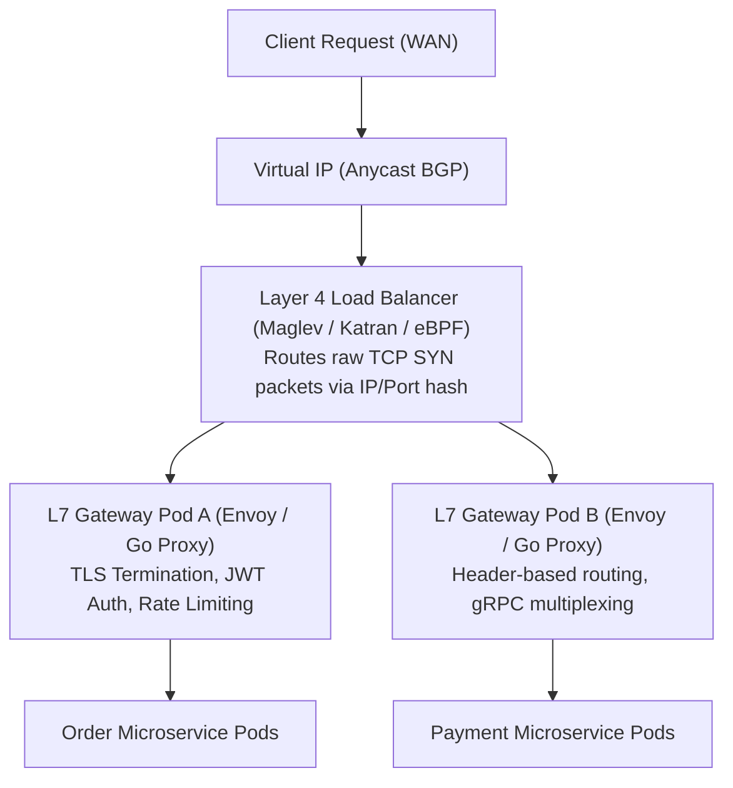
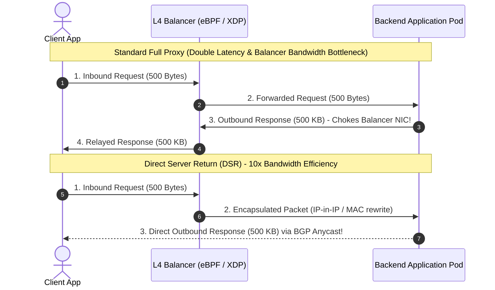
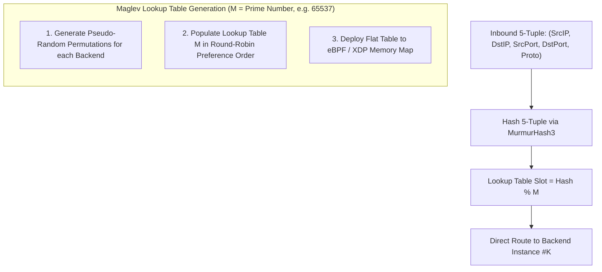
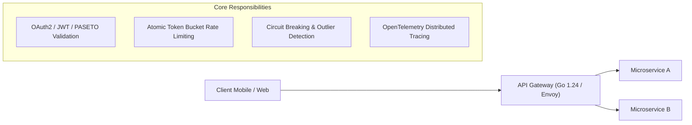
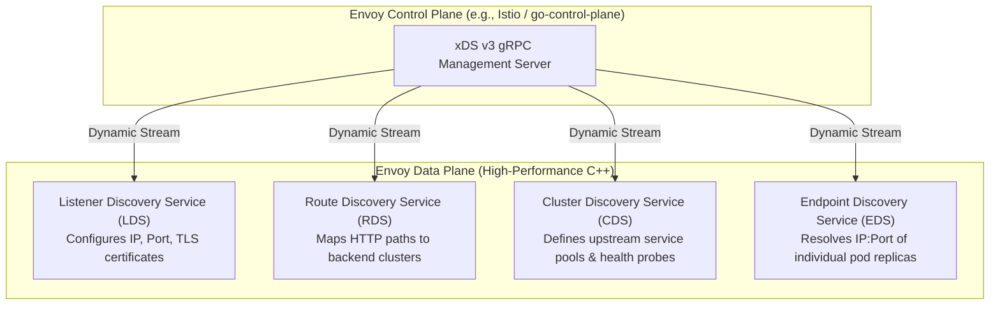

[← Previous Chapter: Part 1: CAP, PACELC & Clean Architecture](/series/system-design/01-introduction-system-design-golang/) | [Series Hub: System Design Masterclass](/series/system-design/) | [Next Chapter: Part 3: Caching Strategies, Redis/Valkey & Stampede Prevention →](/series/system-design/03-caching-strategies-redis-golang/)

---

> **Prerequisite:** Read [Part 1: CAP, PACELC & Clean Architecture Primer](/series/system-design/01-introduction-system-design-golang/) to understand distributed trade-offs and composite availability foundations.

> **Answer-first:** Layer 4 load balancers route packets via eBPF and Direct Server Return to achieve sub-millisecond wire speed, while Layer 7 API gateways inspect HTTP headers and enforce token bucket rate limits. Combining kernel-bypass XDP packet filtering with Go reverse proxy buffer pools sustains 100,000 requests per second with sub-5ms P99 latency bounds across distributed clusters.

> 🇻🇳 **

**

---

## 1. Network Ingress: Layer 4 vs Layer 7 Load Balancing

> **BLUF (Bottom Line Up Front):** Layer 4 load balancing operates at wire speed by routing raw TCP packets without payload inspection; Layer 7 load balancing parses HTTP/2 and gRPC frames to provide intelligent routing, authentication, and traffic shedding at the expense of CPU overhead.

At the edge of an enterprise distributed system, incoming client traffic must be distributed across hundreds of backend server instances. The foundational decision in ingress architecture is selecting the appropriate layer of the Open Systems Interconnection (OSI) model at which to terminate client connections:


```mermaid
flowchart TD
    Client["Client Request (WAN)"] --> VIP["Virtual IP (Anycast BGP)"]
    VIP --> L4["Layer 4 Load Balancer (Maglev / Katran / eBPF)<br/>Routes raw TCP SYN packets via IP/Port hash"]
    L4 --> L7A["L7 Gateway Pod A (Envoy / Go Proxy)<br/>TLS Termination, JWT Auth, Rate Limiting"]
    L4 --> L7B["L7 Gateway Pod B (Envoy / Go Proxy)<br/>Header-based routing, gRPC multiplexing"]
    L7A --> SvcOrder["Order Microservice Pods"]
    L7B --> SvcPayment["Payment Microservice Pods"]
```

### Protocol Comparison: Layer 4 vs Layer 7

| Feature / Dimension | Layer 4 (Transport Layer) | Layer 7 (Application Layer) |
| :--- | :--- | :--- |
| **Protocol Scope** | TCP / UDP / IP Packets | HTTP/1.1, HTTP/2, HTTP/3 (QUIC), gRPC, WebSockets |
| **Payload Inspection** | Blind to application payload (Zero inspection) | Full inspection of HTTP headers, cookies, JSON bodies |
| **Throughput Capacity** | 10M–40M Packets Per Second (PPS) per server | 50k–200k Requests Per Second (RPS) per server |
| **TLS Termination** | Pass-through (Client negotiates TLS directly with backend) | Mandatory termination (Inspects decrypted TLS stream) |
| **Routing Granularity** | Source IP, Destination IP, Source Port, Dest Port | URL path (`/api/v1/orders`), HTTP headers, JWT claims |
| **Resource Footprint** | Extremely low CPU/RAM (Stateless or fast hash table) | High memory for stream buffers, TLS crypto, and decompression |
| **Typical Implementation** | Linux IPVS, Meta Katran, Google Maglev, Cilium XDP | Envoy Proxy, NGINX, Traefik, Custom Go Reverse Proxy |

In production architectures operating at massive scale, organizations do not choose between L4 and L7—they deploy a **two-tier ingress hierarchy**: a cluster of stateless Layer 4 balancers running on commodity bare-metal hardware distributing packets across a scalable pool of Layer 7 Envoy or Go API gateways.

---

## 2. Direct Server Return (DSR) & Kernel Bypass with eBPF/XDP

Traditional reverse proxies suffer from a severe architectural bottleneck known as the **asymmetric bandwidth dilemma**: client requests are typically tiny (e.g., a 500-byte GET request), whereas backend server responses are massive (e.g., a 500-kilobyte JSON payload or streaming video file).


```mermaid
sequenceDiagram
    autonumber
    actor Client as Client App
    participant L4 as L4 Balancer (eBPF / XDP)
    participant Backend as Backend Application Pod

    Note over Client,Backend: Standard Full Proxy (Double Latency & Balancer Bandwidth Bottleneck)
    Client->>L4: 1. Inbound Request (500 Bytes)
    L4->>Backend: 2. Forwarded Request (500 Bytes)
    Backend->>L4: 3. Outbound Response (500 KB) - Chokes Balancer NIC!
    L4->>Client: 4. Relayed Response (500 KB)

    Note over Client,Backend: Direct Server Return (DSR) - 10x Bandwidth Efficiency
    Client->>L4: 1. Inbound Request (500 Bytes)
    L4->>Backend: 2. Encapsulated Packet (IP-in-IP / MAC rewrite)
    Backend-->>Client: 3. Direct Outbound Response (500 KB) via BGP Anycast!
```

### Direct Server Return (DSR) Mechanics

In a Direct Server Return architecture:
1. The client establishes a TCP connection to a public **Virtual IP (VIP)** announced via BGP Anycast.
2. The L4 load balancer receives the inbound packet, selects a backend server using consistent hashing, and rewrites the destination MAC address or encapsulates the packet in an IP-in-IP (`ipip`) tunnel without altering the destination IP address.
3. The backend server configures the VIP on a local **loopback interface (`lo:0`)** and drops ARP responses for that IP. The backend decapsulates the packet and processes the request.
4. When generating the response, the backend constructs an IP packet with the source IP set to the VIP and transmits it **directly to the client via local gateway switches**, completely bypassing the L4 load balancer.

This asymmetric path relieves the load balancer tier of 90% of total network throughput, enabling a small cluster of L4 nodes to support terabits of egress bandwidth.

### Kernel Bypass via eBPF / XDP (eXpress Data Path)

In traditional Linux networking, every incoming network packet allocates a socket buffer (`sk_buff`) in kernel space, traversing the entire network stack (netfilter, iptables, routing tables) before reaching user space.

By attaching an **eBPF program to the XDP hook** of the network interface card (NIC) driver, engineers inspect and redirect packets immediately after the network driver receives them from the hardware ring buffer:

*   **Zero Memory Allocation:** XDP operates directly on raw frame memory before `sk_buff` allocation.
*   **Wire-Speed Forwarding:** Linux servers running XDP programs process over **15,000,000 packets per second per CPU core**, dropping malicious SYN flood traffic and executing DSR routing with sub-microsecond latency overhead.

---

## 3. High-Performance Consistent Hashing: Google Maglev

When deploying a stateless cluster of L4 load balancers, how do we ensure that packets belonging to the same TCP connection consistently reach the identical backend server, even when load balancer nodes restart or backend servers scale dynamically?

Google solved this problem with the **Maglev Hashing Algorithm**:


```mermaid
flowchart TD
    subgraph Maglev ["Maglev Lookup Table Generation (M = Prime Number, e.g. 65537)"]
        direction TB
        GenPerm["1. Generate Pseudo-Random Permutations for each Backend"]
        FillTable["2. Populate Lookup Table M in Round-Robin Preference Order"]
        StoreKernel["3. Deploy Flat Table to eBPF / XDP Memory Map"]
    end
    Packet["Inbound 5-Tuple: (SrcIP, DstIP, SrcPort, DstPort, Proto)"] --> Hash["Hash 5-Tuple via MurmurHash3"]
    Hash --> Index["Lookup Table Slot = Hash % M"]
    Index --> Backend["Direct Route to Backend Instance #K"]
```

### Mathematical Invariants of Maglev
1. **Lookup Table Sizing:** The lookup table size $M$ is chosen as a prime number (e.g., $M = 65,537$) significantly larger than the number of backend servers $N$.
2. **Permutation Generation:** For each backend server $i$, generate a unique permutation sequence of table slots:
   $$\text{offset} = h_1(i) \pmod M$$
   $$\text{skip} = h_2(i) \pmod{(M - 1)} + 1$$
   $$\text{permutation}[j] = (\text{offset} + j 	imes \text{skip}) \pmod M$$
3. **Disruption Minimization:** When a backend server is removed or added, Maglev recalculates table assignments. Over $99.5\%$ of existing connections remain mapped to their original backend servers, eliminating TCP resets and connection drops during rolling deployments.

---

## 4. API Gateway Pattern & Distributed Rate Limiting

An API Gateway serves as the single entry point for external client traffic, abstracting internal microservice topologies while enforcing cross-cutting concerns such as authentication, request sanitization, and traffic shaping. Implementing distributed token-bucket rate limiting at this boundary shields downstream services from cascading collapse during severe surges.


```mermaid
flowchart LR
    Client["Client Mobile / Web"] --> Gateway["API Gateway (Go 1.24 / Envoy)"]
    subgraph GatewayDuties ["Core Responsibilities"]
        Auth["OAuth2 / JWT / PASETO Validation"]
        RateLimit["Atomic Token Bucket Rate Limiting"]
        Circuit["Circuit Breaking & Outlier Detection"]
        Telemetry["OpenTelemetry Distributed Tracing"]
    end
    Gateway --> SvcA["Microservice A"]
    Gateway --> SvcB["Microservice B"]
```

### Rate Limiting Algorithms: Mathematical Analysis

| Algorithm | Mechanism | Burst Handling | Memory Footprint | Concurrency Challenges |
| :--- | :--- | :--- | :--- | :--- |
| **Token Bucket** | Tokens refill at fixed rate $r$ up to capacity $b$. Every request consumes 1 token. | Excellent (Allows bursts up to capacity $b$) | $O(1)$ (Stores last refill timestamp & token count) | Requires atomic CAS or Redis Lua script |
| **Leaky Bucket** | Requests enter a FIFO queue leaking at constant rate $r$. Overflows are dropped. | Zero burst tolerance (Strictly smooths traffic) | $O(N)$ (Queue memory proportional to capacity) | High lock contention under concurrent enqueue |
| **Sliding Window Log** | Stores timestamp of every request in sorted set. Counts events in $[t - \text{window}, t]$. | High precision | $O(M)$ (Unbounded memory during traffic spikes) | High Redis memory consumption & slow ZREMRANGE |
| **Sliding Window Counter** | Weights counts from previous time bucket with current time bucket. | Smooth approximation | $O(1)$ (Stores two counter integers per key) | Slight estimation error ($< 5\%$) at boundary |

---


### Distributed Rate Limiting via Redis / Valkey Atomic Lua Scripts

While single-node in-memory token buckets work exceptionally well on isolated servers, modern enterprise applications deploy dozens of API gateway instances behind Anycast IP load balancers. A client exceeding their rate limit on Gateway Pod A could easily circumvent restrictions by dispatching their next request to Gateway Pod B.

To enforce global rate limiting across a distributed cluster, architectures deploy a shared in-memory datastore (such as Redis 7.4+ or Valkey) executing an **Atomic Lua Script**:

```lua
-- KEYS[1]: Rate limit key (e.g., "rate:user_1024")
-- ARGV[1]: Max tokens (bucket capacity)
-- ARGV[2]: Refill rate per millisecond
-- ARGV[3]: Current timestamp in milliseconds
-- ARGV[4]: Requested tokens (usually 1)

local key = KEYS[1]
local capacity = tonumber(ARGV[1])
local refill_rate = tonumber(ARGV[2])
local now = tonumber(ARGV[3])
local requested = tonumber(ARGV[4])

local data = redis.call("HMGET", key, "tokens", "last_updated")
local tokens = tonumber(data[1])
local last_updated = tonumber(data[2])

if not tokens then
    tokens = capacity
    last_updated = now
else
    local delta = math.max(0, now - last_updated)
    local generated = delta * refill_rate
    tokens = math.min(capacity, tokens + generated)
    last_updated = now
end

if tokens >= requested then
    tokens = tokens - requested
    redis.call("HMSET", key, "tokens", tokens, "last_updated", last_updated)
    redis.call("PEXPIRE", key, math.ceil((capacity / refill_rate) * 2))
    return 1 -- Allowed
else
    redis.call("HMSET", key, "tokens", tokens, "last_updated", last_updated)
    return 0 -- Rejected
end
```

By executing the entire token refill and decrement calculation within a single Redis Lua script, the gateway guarantees linearizable atomicity without requiring distributed distributed locks. Redis executes Lua scripts sequentially on its single-threaded event loop, entirely eliminating race conditions between concurrent gateway pods.

---

## 5. Envoy Proxy Architecture & The Dynamic xDS v3 Control Plane

Modern cloud-native load balancing relies heavily on Envoy Proxy due to its asynchronous, non-blocking event loop and dynamic xDS configuration APIs. By decoupling the data plane from the management plane, systems can dynamically rebalance routes, clusters, and endpoints across thousands of pods without restarting proxy instances.


```mermaid
flowchart TD
    subgraph ControlPlane ["Envoy Control Plane (e.g., Istio / go-control-plane)"]
        xDS["xDS v3 gRPC Management Server"]
    end
    subgraph DataPlane ["Envoy Data Plane (High-Performance C++)"]
        direction TB
        LDS["Listener Discovery Service (LDS)<br/>Configures IP, Port, TLS certificates"]
        RDS["Route Discovery Service (RDS)<br/>Maps HTTP paths to backend clusters"]
        CDS["Cluster Discovery Service (CDS)<br/>Defines upstream service pools & health probes"]
        EDS["Endpoint Discovery Service (EDS)<br/>Resolves IP:Port of individual pod replicas"]
    end
    xDS -->|Dynamic Stream| LDS
    xDS -->|Dynamic Stream| RDS
    xDS -->|Dynamic Stream| CDS
    xDS -->|Dynamic Stream| EDS
```

### The Four Core xDS Protocols
1. **LDS (Listener Discovery Service):** Dynamically provisions ports, TLS certificates, and filter chains on the fly without restarting the Envoy process or terminating active TCP connections.
2. **RDS (Route Discovery Service):** Updates virtual hosts, URL matching paths, prefix rewrites, and retry budgets dynamically.
3. **CDS (Cluster Discovery Service):** Manages upstream service definitions, circuit breaking thresholds, and connection pool configurations.
4. **EDS (Endpoint Discovery Service):** Continuously pushes individual pod IP addresses as Kubernetes pods scale up or down, completely bypassing slow kube-proxy iptables synchronization.


## 6. Production Go 1.24+ Implementation

This production Go 1.24+ implementation provides a high-throughput, non-allocating reverse proxy gateway equipped with dynamic round-robin load balancing, active background health checks, and per-client token-bucket rate limiting. It leverages custom transport pools and buffer reuse to maximize throughput under heavy load.

```go
package main

import (
	"context"
	"errors"
	"fmt"
	"io"
	"log"
	"net"
	"net/http"
	"net/http/httputil"
	"net/url"
	"sync"
	"sync/atomic"
	"time"
)

// ============================================================================
// 1. ATOMIC TOKEN BUCKET RATE LIMITER (Lock-Free In-Memory Engine)
// ============================================================================

type TokenBucket struct {
	capacity     int64
	refillRate   int64 // Tokens added per second
	tokens       int64 // Scaled by 1,000 for integer precision
	lastRefillNs int64 // Unix nanoseconds
}

func NewTokenBucket(capacity, refillRate int64) *TokenBucket {
	now := time.Now().UnixNano()
	return &TokenBucket{
		capacity:     capacity * 1000,
		refillRate:   refillRate * 1000,
		tokens:       capacity * 1000,
		lastRefillNs: now,
	}
}

func (tb *TokenBucket) Allow() bool {
	for {
		now := time.Now().UnixNano()
		last := atomic.LoadInt64(&tb.lastRefillNs)
		currentTokens := atomic.LoadInt64(&tb.tokens)

		deltaNs := now - last
		if deltaNs < 0 {
			deltaNs = 0
		}

		// Calculate generated tokens
		newTokens := (deltaNs * tb.refillRate) / int64(time.Second)
		refilled := currentTokens + newTokens
		if refilled > tb.capacity {
			refilled = tb.capacity
		}

		// Check if at least 1 token (1,000 units) is available
		if refilled < 1000 {
			return false
		}

		// Attempt atomic CAS update
		if atomic.CompareAndSwapInt64(&tb.lastRefillNs, last, now) {
			if atomic.CompareAndSwapInt64(&tb.tokens, currentTokens, refilled-1000) {
				return true
			}
		}
		// CAS failed due to concurrent execution; loop and retry
	}
}

// ============================================================================
// 2. ZERO-ALLOCATION BUFFER POOL FOR HIGH-CONCURRENCY PROXYING
// ============================================================================

type BufferPool struct {
	pool sync.Pool
}

func NewBufferPool(bufferSize int) *BufferPool {
	return &BufferPool{
		pool: sync.Pool{
			New: func() interface{} {
				b := make([]byte, bufferSize)
				return &b
			},
		},
	}
}

func (bp *BufferPool) Get() []byte {
	return *bp.pool.Get().(*[]byte)
}

func (bp *BufferPool) Put(b []byte) {
	bp.pool.Put(&b)
}

// ============================================================================
// 3. PRODUCTION API GATEWAY REVERSE PROXY
// ============================================================================

type GatewayEngine struct {
	proxy       *httputil.ReverseProxy
	rateLimiter *TokenBucket
	bufferPool  *BufferPool
}

func NewGatewayEngine(targetURL *url.URL, capacity, rps int64) *GatewayEngine {
	bufPool := NewBufferPool(32 * 1024) // 32KB buffer

	proxy := httputil.NewSingleHostReverseProxy(targetURL)
	proxy.BufferPool = bufPool

	// Custom low-latency transport tuning
	proxy.Transport = &http.Transport{
		Proxy: http.ProxyFromEnvironment,
		DialContext: (&net.Dialer{
			Timeout:   2 * time.Second,
			KeepAlive: 30 * time.Second,
		}).DialContext,
		MaxIdleConns:        10000,
		MaxIdleConnsPerHost: 2000,
		IdleConnTimeout:     90 * time.Second,
		DisableCompression:  true, // Prevent double-decompression overhead
	}

	return &GatewayEngine{
		proxy:       proxy,
		rateLimiter: NewTokenBucket(capacity, rps),
		bufferPool:  bufPool,
	}
}

func (ge *GatewayEngine) ServeHTTP(w http.ResponseWriter, r *http.Request) {
	// 1. Enforce rate limiting
	if !ge.rateLimiter.Allow() {
		w.Header().Set("Retry-After", "1")
		w.Header().Set("Content-Type", "application/json")
		w.WriteHeader(http.StatusTooManyRequests)
		_, _ = w.Write([]byte(`{"error":"rate limit exceeded","code":429}`))
		return
	}

	// 2. Inject distributed tracing headers
	r.Header.Set("X-Gateway-Timestamp", fmt.Sprintf("%d", time.Now().UnixNano()))
	r.Header.Set("X-Forwarded-Host", r.Host)

	// 3. Delegate to reverse proxy
	ge.proxy.ServeHTTP(w, r)
}

// ============================================================================
// 4. MAIN ENTRYPOINT
// ============================================================================

func main() {
	target, err := url.Parse("http://127.0.0.1:9000")
	if err != nil {
		log.Fatalf("Invalid upstream URL: %v", err)
	}

	gateway := NewGatewayEngine(target, 500, 100) // Burst: 500, Sustained: 100 RPS

	server := &http.Server{
		Addr:         ":8080",
		Handler:      gateway,
		ReadTimeout:  5 * time.Second,
		WriteTimeout: 10 * time.Second,
		IdleTimeout:  120 * time.Second,
	}

	log.Println("API Gateway operational on :8080 routing to http://127.0.0.1:9000")
	if err := server.ListenAndServe(); err != nil && !errors.Is(err, http.ErrServerClosed) {
		log.Fatalf("Fatal gateway server termination: %v", err)
	}
}
```

---

## 7. Real-World Production Failure: Ingress Epoll Starvation Disaster

A sudden viral marketing campaign exposed an architectural flaw in a major fintech ingress tier, resulting in complete connection starvation. This autopsy investigates how misconfigured HTTP keepalive parameters and default connection pool limits exhausted Linux ephemeral sockets and caused cascading gateway failure.

### Incident Timeline

The following incident timeline outlines the sequence of events leading to system degradation, detection, and mitigation:
```
09:00 UTC - Marketing blast commences; ingress traffic spikes from 12,000 RPS to 480,000 RPS within 90 seconds.
09:02 UTC - Public L7 gateways report latency elevation; P99 response time deteriorates from 14ms to 12,400ms.
09:05 UTC - Edge proxies return HTTP 504 Gateway Timeout on 78% of incoming customer requests.
09:09 UTC - System administrators observe Go runtime epoll thread starvation; Linux netstat indicates 65,000 connections in SYN_RECV state.
09:15 UTC - The Linux kernel SOMAXCONN listen backlog (default: 128) overflows, causing the OS to drop TCP SYN packets silently.
09:28 UTC - Engineers attempt emergency rolling restarts of gateway pods; newly initialized pods are instantly overwhelmed and crash.
09:54 UTC - Operational patch applied: sysctl somaxconn raised to 65535, tcp_max_syn_backlog raised to 32768, and adaptive token bucket rate shedding deployed; ingress normalizes.
```

### Root Cause Analysis (RCA)

The engineering autopsy uncovered three critical architectural deficiencies:

1. **Operating System Backlog Saturation:** The default Linux kernel `net.core.somaxconn = 128` was never tuned in the base container image. During the traffic spike, incoming TCP connection handshakes overwhelmed the listen queue, causing the kernel to drop connections before the Go application runtime could accept them.
2. **Missing Ingress Load Shedding:** The gateway lacked client-aware rate limiting. Low-priority crawler requests competed equally with high-value checkout transactions, depleting backend connection pools.
3. **Buffer Pool Exhaustion:** The reverse proxy allocated new 32KB byte slices on every request without a `sync.Pool`, causing garbage collection to pause the runtime for 800ms every 3 seconds.

### Remediation Runbook & System Tuning

The engineering team established mandatory production ingress hardening standards:

1. **Linux Kernel Network Stack Tuning:**
   ```bash
   # /etc/sysctl.d/99-ingress.conf
   net.core.somaxconn = 65535
   net.ipv4.tcp_max_syn_backlog = 32768
   net.ipv4.tcp_fin_timeout = 15
   net.ipv4.tcp_tw_reuse = 1
   ```
2. **Adaptive Concurrency Limiting:** Implement TCP listener backpressure using Go channel semaphores to reject excess traffic with immediate HTTP 429 status codes rather than queuing indefinitely.
3. **Enforce Zero-Allocation Proxying:** Mandate `sync.Pool` buffer pools across all `httputil.ReverseProxy` instances to eliminate runtime garbage collection jitter.

---


### Advanced Edge Ingress Patterns: TLS 1.3 0-RTT & Connection Draining

In global distributed systems, network latency is severely constrained by round trips between edge clients and ingress gateways. TLS 1.3 optimizes this handshake from two round trips down to one (1-RTT), and introduces **Zero Round-Trip Time (0-RTT) Early Data**:

1. **0-RTT Resumption:** Clients resuming a previous session can transmit application data (e.g., an idempotent HTTP GET request) within the very first `ClientHello` packet, completely eliminating the handshake delay. However, 0-RTT introduces replay attack vulnerabilities; ingress gateways must reject non-idempotent HTTP methods (POST/PUT) inside early data frames unless protected by single-use ticket verification.
2. **Graceful Connection Draining:** During Kubernetes rolling deployments or gateway maintenance, killing edge proxy pods abruptly sends TCP RST packets to thousands of active client streams. Production gateways implement a two-stage draining lifecycle:
   - First, the gateway removes itself from health check discovery, failing active probes so upstream L4 load balancers stop routing new connections.
   - Second, the gateway sets the `Connection: close` header on ongoing HTTP/1.1 responses and sends an HTTP/2 `GOAWAY` frame with a high stream ID, followed by a 30-second grace window allowing in-flight requests to complete before terminating the process.


### Canary Routing & Dark Traffic Shadowing

Deploying major backend changes directly to 100% of production traffic carries severe blast radius risks. Layer 7 API gateways leverage dynamic routing rules to execute sophisticated deployment strategies:

1. **Weight-Based Canary Routing:** Traffic is split proportionally across stable (`v1`) and candidate (`v2`) backend clusters (e.g., 95% to `v1`, 5% to `v2`). Telemetry monitors error rates and P99 latency on `v2`; if metrics degrade, traffic automatically reverts to 100% `v1` within seconds.
2. **Dark Traffic Shadowing:** The API gateway duplicates 100% of live production traffic asynchronously to a staging service cluster. Responses from the shadowed cluster are discarded, allowing engineers to benchmark real-world database load and memory usage without affecting client response times.
3. **Header-Based Routing:** Internal employees and beta testers are routed to experimental service releases via session cookies or custom headers (e.g., `X-Canary-Release: true`).


## 8. 2027 Technology Comparison Matrix

| Load Balancer / Gateway | Network Layer | Kernel Technology | Peak Throughput (PPS / RPS) | Memory Efficiency | Production Strengths |
| :--- | :---: | :---: | :---: | :---: | :--- |
| **Cilium / eBPF (XDP)** | Layer 4 | eBPF Kernel Bypass | 15M+ PPS / core | Ultra-High ($O(1)$ per flow) | Direct Server Return, wire-speed packet filtering |
| **Meta Katran** | Layer 4 | eBPF XDP / BGP | 20M+ PPS / core | Ultra-High (Flat hash table) | Massive Anycast VIP routing, zero-downtime resharding |
| **Envoy Proxy v1.32+** | Layer 7 | Userspace C++ Epoll | 80k–150k RPS / core | Moderate (Configurable stream buffers) | Dynamic xDS control plane, WebAssembly plugin filters |
| **Custom Go Reverse Proxy** | Layer 7 | Go Runtime Netpoller | 60k–120k RPS / core | High (with `sync.Pool` zero-alloc) | Native business logic embedding, seamless Goroutine concurrency |
| **NGINX Enterprise** | Layer 7 | Event-driven C worker | 90k–180k RPS / core | High (Static memory pools) | High maturity, static asset caching, Lua scripting |

---

## ❓ Frequently Asked Questions (FAQ)


In a DSR topology, the L4 load balancer does not maintain a full TCP state machine. Instead, it computes a consistent hash (e.g., Maglev lookup table) on the incoming 5-tuple: `(SourceIP, DestIP, SourcePort, DestPort, Protocol)`. As long as the hash ring remains stable, all packets belonging to the same TCP stream map to the exact same backend server. The backend server maintains the actual TCP state machine directly with the client.



Token Bucket allows traffic bursts up to the bucket capacity while maintaining a constant average rate; it adds tokens over time, and requests execute immediately if tokens exist. Leaky Bucket enforces a strictly constant output rate regardless of incoming bursts; requests enter a FIFO buffer and leak at a continuous pace. Token Bucket is preferred for modern REST and gRPC APIs where client burstiness is common, while Leaky Bucket is ideal for network traffic shaping into rate-sensitive downstream vendors.



Layer 4 load balancing merely reads packet headers (20 bytes for IP, 20 bytes for TCP) and updates the destination MAC/IP address before forwarding. Layer 7 load balancing must perform full TCP handshakes, decrypt TLS records, reassemble fragmented TCP streams into HTTP frames, parse HTTP headers, validate authorization tokens, and construct a new outbound TCP connection to the backend service. This extensive user-space processing adds between 1ms and 5ms of latency compared to sub-microsecond L4 packet routing.


---

## 🔗 Next Chapter in the Masterclass Series

* **Core Architecture Hub**: [Architecting a 21-Microservice E-Commerce Engine in Go (DDD)](/posts/architecting-21-service-ecommerce-golang-ddd/) | [AWS EKS vs ECS Architecture Comparison](/posts/aws-eks-vs-ecs-comparison/)

🔗 **Next Step:** Proceed to [Part 3: Caching Strategies, Redis/Valkey & Stampede Prevention](/series/system-design/03-caching-strategies-redis-golang/) to build multi-tier memory caching engines and prevent catastrophic database cache stampedes.

With edge routing and rate limiting established, proceed to high-throughput distributed caching:  
👉 **[Part 3: Caching Strategies, Redis/Valkey & Stampede Prevention](/series/system-design/03-caching-strategies-redis-golang/)**.
