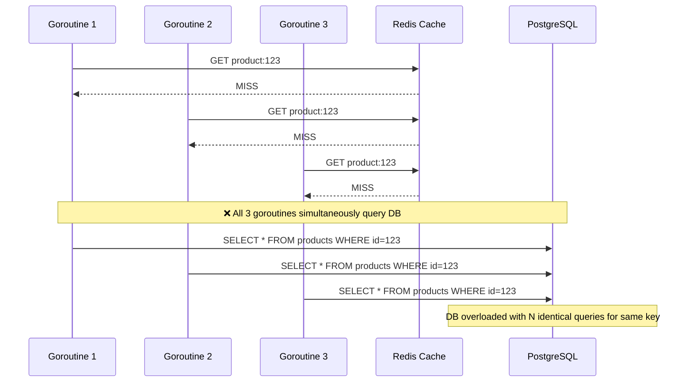

**Answer-first:** Effective caching strategy selection hinges on the acceptable consistency window and the read/write access pattern of the workload. Write-Through suits financial records; Write-Behind suits analytics and event counters; Cache-Aside is the default for read-heavy API responses.

> **Prerequisite:** Part 3 of the [System Design Masterclass](/series/system-design/). Read [Part 2: Load Balancing L4/L7](/series/system-design/02-load-balancing-api-gateway-go/) to understand the traffic layer before diving into the caching tier.

### What You'll Learn That AI Won't Tell You
- **XFetch Mathematical Constants:** How to configure the scaling factor ($\beta$) in XFetch to balance background refresh CPU usage against cache miss rates.
- **Redis Memory Allocation Overhead:** How Redis's internal jemalloc allocator causes memory fragmentation, and why LRU evictions don't immediately free up RAM.
- **Singleflight Leakage:** The danger of singleflight lockups when backend queries hang indefinitely, and how to guard it using Go context timeouts.

---

## How Does Cache Stampede Happen?

**Key Concept:** Cache Stampede (thundering herd) occurs when a popular cached key expires and multiple concurrent goroutines simultaneously detect a cache miss — then all query the database simultaneously. The burst of duplicate DB queries can exceed connection pool capacity and cause cascading failure.

### Anatomy of the Problem



During a Shopee Flash Sale, a single popular key can have thousands of goroutines simultaneously cache-missing → thousands of DB queries → DB crashes.

### Solution 1: Singleflight (In-Process Deduplication)

`golang.org/x/sync/singleflight` ensures that for any given key, only **one** function executes at a time; all other callers block and share that result:

```go
package cache

import (
    "context"
    "errors"
    "fmt"
    "time"

    "golang.org/x/sync/singleflight"
)

type ProductCacheService struct {
    sfGroup singleflight.Group
    store   map[string]string // Production: Redis client
}

// GetOrFetch deduplicates concurrent DB calls with singleflight + timeout protection
func (c *ProductCacheService) GetOrFetch(
    ctx context.Context,
    productID string,
    timeout time.Duration,
    fetchDB func() (string, error),
) (string, error) {
    cacheKey := fmt.Sprintf("product:%s", productID)

    // Fast path: cache hit
    if val, ok := c.store[cacheKey]; ok {
        return val, nil
    }

    // Slow path: deduplicate DB call with singleflight
    // DoChan is non-blocking — doesn't hold the goroutine's OS thread
    resultChan := c.sfGroup.DoChan(cacheKey, func() (interface{}, error) {
        return fetchDB()
    })

    // Race between context timeout and DB result
    select {
    case <-ctx.Done():
        return "", fmt.Errorf("context cancelled: %w", ctx.Err())
    case <-time.After(timeout):
        return "", errors.New("database fetch timeout exceeded")
    case result := <-resultChan:
        if result.Err != nil {
            return "", result.Err
        }
        data := result.Val.(string)
        c.store[cacheKey] = data
        // result.Shared == true means this goroutine is sharing another's result
        return data, nil
    }
}
```

> [!NOTE]
> `result.Shared` is `true` when the current goroutine received a result from another goroutine's execution (not its own). Use this field to track deduplication metrics: what fraction of requests were deduplicated vs actually executed.

> [!WARNING]
> **Singleflight scope:** Deduplication only works **within a single process**. When deploying multiple replicas, each pod still independently sends one DB query. Combine with Redis `SETNX` lock or XFetch for cross-process protection.

---

## Write-Through vs Write-Behind — Which to Choose?

**Write Pattern Comparison:** Write-Through writes synchronously to both cache and DB within the same request — strong consistency but higher write latency. Write-Behind writes to cache first, then flushes to DB asynchronously — lower write latency but risk of data loss if the cache crashes before the flush completes.

### All 5 Caching Patterns Compared

| Pattern | Write Flow | Read Flow | Consistency | Write Latency | Data Loss Risk | Best For |
|---|---|---|---|---|---|---|
| **Cache-Aside** | App → DB directly | App → Cache → DB (on miss) | Eventual | Low | Low | Default — read-heavy APIs |
| **Read-Through** | App → DB directly | Cache auto-fetches on miss | Eventual | Low | Low | ORM/library integration |
| **Write-Through** | App → Cache → DB (sync) | App → Cache | Strong | High | Very Low | Financial records |
| **Write-Behind** | App → Cache → DB (async buffer) | App → Cache | Eventual | Very Low | **High** | Analytics, view counts |
| **Write-Around** | App → DB (bypassing cache) | App → Cache → DB | Strong | Low | Low | Write-once data |

### Cache-Aside Implementation (most common pattern)

```go
package cache

import (
    "context"
    "encoding/json"
    "fmt"
    "time"

    "github.com/redis/go-redis/v9"
)

type Product struct {
    ID    string  `json:"id"`
    Name  string  `json:"name"`
    Price float64 `json:"price"`
}

type ProductRepository struct {
    rdb *redis.Client
    db  interface{ QueryProduct(id string) (*Product, error) }
    ttl time.Duration
}

// GetProduct — Cache-Aside pattern
func (r *ProductRepository) GetProduct(ctx context.Context, id string) (*Product, error) {
    key := fmt.Sprintf("product:%s", id)

    // 1. Try cache first
    cached, err := r.rdb.Get(ctx, key).Result()
    if err == nil {
        var product Product
        if unmarshalErr := json.Unmarshal([]byte(cached), &product); unmarshalErr == nil {
            return &product, nil // Cache HIT
        }
    }

    // 2. Cache MISS — query DB
    product, err := r.db.QueryProduct(id)
    if err != nil {
        return nil, fmt.Errorf("database error: %w", err)
    }

    // 3. Populate cache with TTL
    data, _ := json.Marshal(product)
    r.rdb.Set(ctx, key, data, r.ttl)

    return product, nil
}

// UpdateProduct — invalidate cache on write (safer than cache update)
func (r *ProductRepository) UpdateProduct(ctx context.Context, product *Product) error {
    key := fmt.Sprintf("product:%s", product.ID)

    if err := r.db.(interface{ UpdateProduct(p *Product) error }).UpdateProduct(product); err != nil {
        return fmt.Errorf("db write failed: %w", err)
    }

    // Delete key instead of updating — avoids write race condition
    r.rdb.Del(ctx, key)
    return nil
}
```

> [!TIP]
> **Invalidate, don't update:** After a write operation, **delete** the cache key rather than writing the new value. If the DB write succeeds but the cache write fails, the two sources diverge. Deletion is always safe — worst case is one extra cache miss.

---

## Redis LRU vs LFU Internals

**Eviction Strategy:** Redis implements neither true LRU nor true LFU — both are **probabilistic approximations** using sampling for O(1) eviction. LRU suits recency-based workloads; LFU protects hot keys from eviction during flash sale bursts.

### Redis LRU — Probabilistic Sampling

Redis does not maintain a doubly-linked list for true LRU. Instead, when eviction is needed:

1. Sample $N$ random keys (default `maxmemory-samples = 5`).
2. Evict the key with the largest **idle time** (time since last access).
3. Idle time is stored in the Redis Object clock field (24-bit, 1-second granularity).

Increasing `maxmemory-samples` to 10–20 improves accuracy at linear CPU cost.

### Redis LFU — Morris Counter (Logarithmic)

LFU uses a **Morris Counter** — a probabilistic counter that saves memory by not using exact counts:

$$P_{\text{increment}} = \frac{1}{(\text{counter} - \text{LFU\_INIT\_VAL}) \times \text{lfu\_log\_factor} + 1}$$

- Counter increments with decreasing probability (logarithmic scaling).
- Counter decays over time (controlled by `lfu-decay-time`).

```bash
# redis.conf — optimal LFU configuration for e-commerce flash sale
maxmemory-policy allkeys-lfu    # Apply LFU eviction to all keys
lfu-log-factor 10               # Logarithm base — higher = accurate at high frequency
lfu-decay-time 1                # Decay counter after N minutes idle
```

| Criterion | LRU | LFU |
|---|---|---|
| **Evict based on** | Least recently accessed | Least frequently accessed |
| **Hot key protection** | May evict if briefly not accessed | Protected by high frequency count |
| **New key behavior** | Protected (high recency) | Vulnerable (frequency starts at 0) |
| **Best workload** | General-purpose, sequential access | Hot-key workloads (Flash Sale) |
| **Config** | `allkeys-lru` | `allkeys-lfu` |

---

## XFetch Algorithm — Probabilistic Early Expiration

**Algorithm Strategy:** XFetch solves cache stampede by allowing background pre-computation before key expiry, with probability increasing as TTL runs low. No locking, no coordination needed.

### XFetch Mathematical Formula

$$\text{ShouldRefresh} = \left[\text{currentTime} - \left(\beta \times \delta \times \ln(\text{rand}())\right) > \text{expiryTime}\right]$$

Where:
- $\beta$: Scale constant (default 1.0) — higher values trigger refresh earlier.
- $\delta$: Last fetch duration (milliseconds) — reflects recomputation cost.
- $\ln(\text{rand}())$: Negative (since rand ∈ (0,1)) — creates stochastic trigger.

When TTL is ample: `currentTime ≪ expiryTime` → condition false → no refresh.  
As TTL depletes: probability of condition becoming true increases continuously.

```go
package cache

import (
    "math"
    "math/rand"
    "time"
)

type XFetchEntry struct {
    Value      string
    ExpiryTime time.Time
    Delta      time.Duration // Time taken to fetch this value
    Beta       float64       // Typically 1.0
}

// ShouldRefresh returns true if this entry should be proactively refreshed
func (xf *XFetchEntry) ShouldRefresh() bool {
    if xf.Value == "" {
        return true // No data yet — must fetch
    }

    randVal := rand.Float64()
    if randVal <= 0 {
        randVal = 1e-9 // Avoid ln(0) = -Infinity
    }

    deltaMs := float64(xf.Delta.Milliseconds())
    adjustedNow := time.Now().Add(
        time.Duration(-xf.Beta*deltaMs*math.Log(randVal)) * time.Millisecond,
    )

    return adjustedNow.After(xf.ExpiryTime)
}

// GetOrRefresh uses XFetch to decide whether to refresh cache
func GetOrRefresh(entry *XFetchEntry, fetchFn func() (string, time.Duration, error)) (string, error) {
    if !entry.ShouldRefresh() {
        return entry.Value, nil // Cache is still good
    }

    start := time.Now()
    value, ttl, err := fetchFn()
    if err != nil {
        if entry.Value != "" {
            return entry.Value, nil // Serve stale on error (graceful degradation)
        }
        return "", err
    }

    entry.Value = value
    entry.ExpiryTime = time.Now().Add(ttl)
    entry.Delta = time.Since(start) // Track actual fetch time for next XFetch calculation
    return value, nil
}
```

---

## Tiered Cache: Local → Redis → Database

For [Shopee Flash Sale architecture](/posts/shopee-flash-sale-architecture/), even Redis becomes a bottleneck at millions of requests per second for a single hot key. The solution is a **tiered local cache** at each application node:

> [!TIP]
> When distributing cache keys across multiple Redis shards, the routing algorithm matters. Modulo hashing (`key_hash % shard_count`) causes massive key migrations when adding a shard. For production Redis clusters, use **Consistent Hashing** to minimize remapping — covered in [Part 9: Consistent Hashing & Virtual Nodes](/series/system-design/09-consistent-hashing-sharding/).

```go
package cache

import (
    "sync"
    "time"
)

type localEntry struct {
    value     string
    expiresAt time.Time
}

// TieredCache: L1 (in-process sync.Map) → L2 (Redis) → L3 (Database)
type TieredCache struct {
    localCache sync.Map
    localTTL   time.Duration // Short TTL — 1–5 seconds for local cache
}

func (t *TieredCache) Get(key string) (string, bool) {
    if raw, ok := t.localCache.Load(key); ok {
        entry := raw.(*localEntry)
        if time.Now().Before(entry.expiresAt) {
            return entry.value, true
        }
        t.localCache.Delete(key)
    }
    return "", false
}

func (t *TieredCache) Set(key, value string) {
    t.localCache.Store(key, &localEntry{
        value:     value,
        expiresAt: time.Now().Add(t.localTTL),
    })
}
```

> 🔥 **[Production Pattern]: Shopee Thundering Herd Protection**
> **Symptom:** Flash sale at midnight: 500,000 concurrent requests for `product:flash-item-999`. Cache TTL expired after the first burst.
> **Root Cause:** Redis cannot serve 500k requests/s on a single key.
> **Resolution:** Added local in-process `sync.Map` cache at each pod with TTL = 1 second. Only 1 goroutine/pod/second queries Redis. Redis receives traffic from ~100 pods, not 500k users.
> **Impact:** DB queries dropped from 500k/s to ~100. Redis load reduced 99.98%.
> *(Source: Shopee Engineering Blog, 2021)*

---

## FAQ



Cache Stampede occurs when a popular key expires and many concurrent goroutines all detect the miss simultaneously — then all query the DB at once. Three layers of defense: (1) **Singleflight** — in-process deduplication, O(1) cost, handles 95% of cases; (2) **XFetch** — probabilistic early refresh, no locks needed; (3) **Redis SETNX lock** — cross-process mutual exclusion.



**Write-Through:** Synchronous write to cache + DB. No data loss, write latency = DB latency. Use for: payment records, order creation, any data where losing a write is unacceptable.

**Write-Behind:** Write to cache, flush to DB asynchronously. Write latency is very low but data loss possible if the cache node crashes before flushing. Use for: view counters, analytics events, non-critical aggregations.



Use **LFU** (`allkeys-lfu`) when your workload has clearly identifiable hot keys (e.g., flash sale items, viral content) that need protection from eviction. Use **LRU** (`allkeys-lru`) for general-purpose caches with more uniform access patterns. With Redis 4.0+, LFU is generally better for production e-commerce.


---

## Navigation & Next Steps

[← Previous Part]()
[Next Part →]()

🔗 **Next Step:** Continue to [Part 4: Database Scaling & Connection Pool Tuning in Go]()

Need help implementing this architecture in your organization? [Contact us](/contact/) or [hire our technical consulting team](/hire/) to review your system design and codebase.
