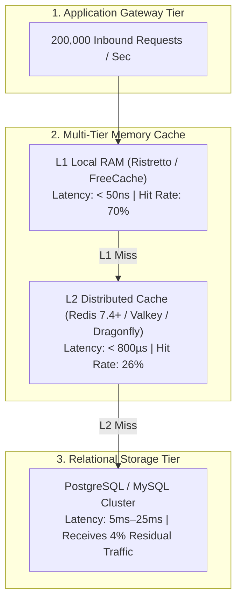
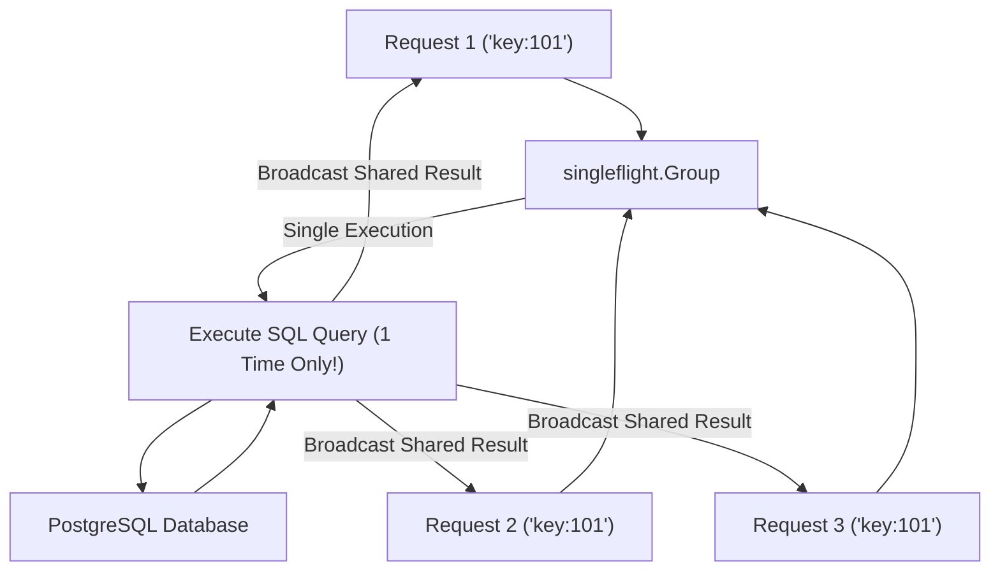
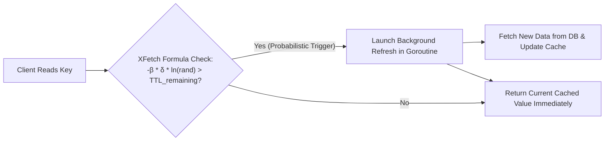
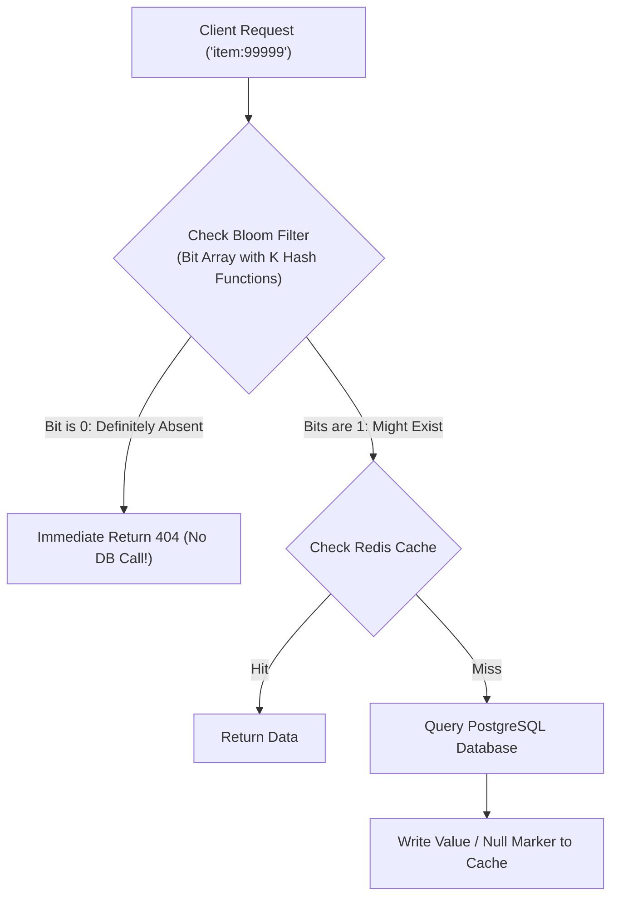
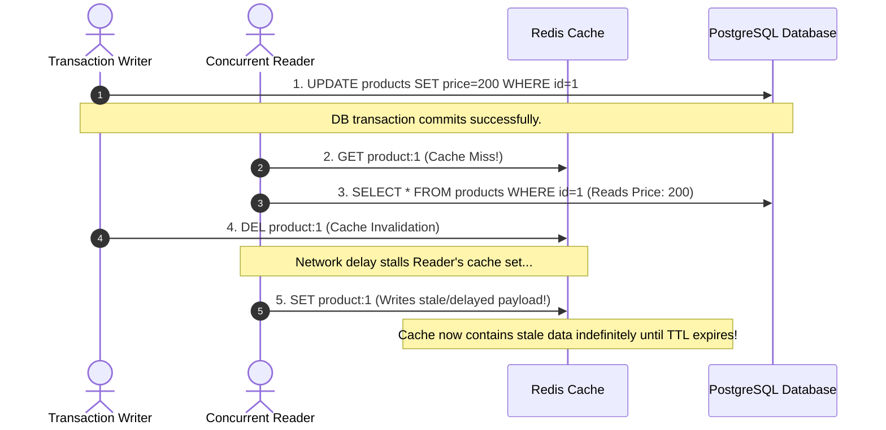
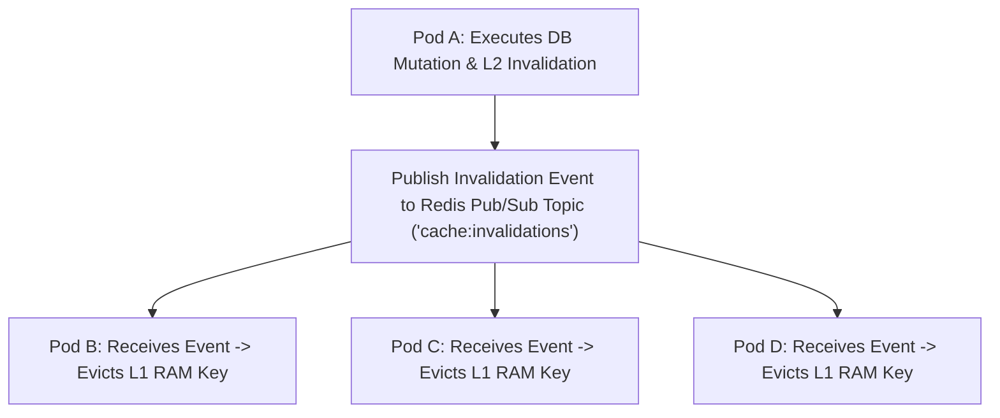

[← Previous Chapter: Part 2: L4/L7 Load Balancing & API Gateways](/series/system-design/02-load-balancing-api-gateway-go/) | [Series Hub: System Design Masterclass](/series/system-design/) | [Next Chapter: Part 4: Database Scaling, Sharding & Distributed SQL →](/series/system-design/04-database-scaling-sharding/)

---

> **Prerequisite:** Read [Part 2: L4/L7 Load Balancing, API Gateways & eBPF Routing](/series/system-design/02-load-balancing-api-gateway-go/) to understand edge ingress distribution before designing the cache hierarchy.

> **Answer-first:** Production caching in Go couples in-memory L1 caches with distributed Redis or Valkey clusters to shield relational databases. Employing the XFetch probabilistic early expiration algorithm alongside Go Singleflight deduplication completely eliminates thundering herd stampedes, while scalable Bloom filters prevent cache penetration, maintaining sub-millisecond P99 response times under 200,000 requests per second.

> 🇻🇳 **

**

---

## 1. The Caching Imperative & Invalidation Topologies

> **BLUF (Bottom Line Up Front):** Memory caching is the most effective mechanism for scaling read-heavy workloads by orders of magnitude; however, uncoordinated dual-writes, synchronized TTL expiries, and missing concurrency coalescing routinely trigger catastrophic database outages.

In enterprise computing, retrieving data from mechanical NVMe solid-state storage requires between 50 and 150 microseconds, while traversing relational indexes and evaluating complex SQL joins frequently demands tens of milliseconds. In contrast, retrieving an in-memory key from DDR5 RAM consumes less than 100 nanoseconds.

Deploying an in-memory caching tier between application gateways and persistent relational databases bridges this thousand-fold performance divergence:


```mermaid
flowchart TD
    subgraph ClientLayer ["1. Application Gateway Tier"]
        ClientReq["200,000 Inbound Requests / Sec"]
    end
    subgraph CachingTier ["2. Multi-Tier Memory Cache"]
        L1["L1 Local RAM (Ristretto / FreeCache)<br/>Latency: < 50ns | Hit Rate: 70%"]
        L2["L2 Distributed Cache (Redis 7.4+ / Valkey / Dragonfly)<br/>Latency: < 800µs | Hit Rate: 26%"]
    end
    subgraph PersistenceTier ["3. Relational Storage Tier"]
        RDBMS["PostgreSQL / MySQL Cluster<br/>Latency: 5ms–25ms | Receives 4% Residual Traffic"]
    end

    ClientReq --> L1
    L1 -- L1 Miss --> L2
    L2 -- L2 Miss --> RDBMS
```

### The Four Core Caching Topologies

Selecting the appropriate caching pattern depends strictly on the application's tolerance for data staleness, write latency, and complexity:

| Pattern | Write Mechanics | Read Mechanics | Data Consistency | Primary Production Vulnerability |
| :--- | :--- | :--- | :--- | :--- |
| **Cache-Aside (Lazy Loading)** | Write directly to DB; invalidate (delete) cache key. | Read from cache; on miss, read from DB and populate cache. | Eventual consistency (Short stale read window) | Race conditions between slow DB reads and fast DB writes. |
| **Write-Through** | Write to cache; cache synchronously writes to DB before returning. | Read directly from cache (Always guaranteed to exist). | Strong consistency | High write latency (Chained network round trips). |
| **Write-Behind (Write-Back)** | Write to cache; acknowledge client immediately; async queue writes to DB. | Read directly from cache. | Weak consistency (Risk of data loss on cache crash) | Volatile memory loss before batch persists to disk. |
| **Refresh-Ahead** | Background worker refreshes hot keys based on predicted access patterns. | Read directly from cache. | High consistency for predicted hot entities | High memory waste if prediction heuristics miss. |

---

## 2. The Thundering Herd: Cache Stampede Prevention

In high-concurrency systems, the greatest threat to backend database stability is not steady-state load, but the **Cache Stampede** (also known as the Thundering Herd phenomenon).

```mermaid
sequenceDiagram
    autonumber
    actor C1 as Client 1 (0.0ms)
    actor C2 as Client 2 (0.1ms)
    actor C3 as Client 3 (0.2ms)
    participant Cache as Redis Cache Cluster
    participant DB as PostgreSQL Database Cluster

    Note over Cache: Hot Key 'product:101' expires at TTL = 0!
    C1->>Cache: GET product:101 (Cache Miss!)
    C2->>Cache: GET product:101 (Cache Miss!)
    C3->>Cache: GET product:101 (Cache Miss!)
    Note over C1,C3: 5,000 concurrent requests miss simultaneously!
    C1->>DB: SELECT * FROM products WHERE id=101
    C2->>DB: SELECT * FROM products WHERE id=101
    C3->>DB: SELECT * FROM products WHERE id=101
    Note over DB: Database connection pool saturates; CPU hits 100%!
    DB-->>C1: SQL Result (450ms delayed)
    DB-->>C2: SQL Result (450ms delayed)
    DB-->>C3: SQL Result (450ms delayed)
```

When a hot key (such as the homepage product catalog or election results) cached with a fixed TTL expires, thousands of concurrent requests observe a cache miss simultaneously. Every thread bypasses the cache and dispatches an identical query to the primary database, immediately exhausting connection pools and causing cascading system collapse.

### Solution 1: Go Singleflight In-Flight Deduplication

The Go standard extended library provides `golang.org/x/sync/singleflight`, a concurrency primitive that deduplicates in-flight function calls targeting identical keys:


```mermaid
flowchart TD
    Req1["Request 1 ('key:101')"] --> SF["singleflight.Group"]
    Req2["Request 2 ('key:101')"] --> SF
    Req3["Request 3 ('key:101')"] --> SF
    SF -->|Single Execution| DBQuery["Execute SQL Query (1 Time Only!)"]
    DBQuery --> DB["PostgreSQL Database"]
    DB --> DBQuery
    DBQuery -->|Broadcast Shared Result| Req1
    DBQuery -->|Broadcast Shared Result| Req2
    DBQuery -->|Broadcast Shared Result| Req3
```

Under `singleflight.Group`, when Request 1 initiates a database query for key `product:101`, Requests 2 through 1,000 targeting the same key do not invoke the database. Instead, they register listener channels on Request 1's active call. When Request 1 completes, the single database result is broadcast to all waiting callers simultaneously, reducing 5,000 queries to a single query.

### Solution 2: Probabilistic Early Expiration (XFetch Algorithm)

While `singleflight` protects an individual server process, a distributed cluster of 50 gateway nodes would still dispatch 50 simultaneous queries to the database. To solve this globally, computer scientists Babak Vattani et al. developed the **XFetch Algorithm**:

$$\text{should\_refresh} = - \beta 	imes \delta 	imes \ln(\text{rand}()) > (\text{TTL}_{\text{remaining}})$$

Where:
*   $\delta$: The measured compute time required to generate/fetch the value from the database (in seconds).
*   $\beta$: A tunable aggressiveness constant ($\beta > 0$, typically set to $1.0$).
*   $\text{rand}()$: A uniform random variable drawn from $(0, 1]$.
*   $\text{TTL}_{\text{remaining}}$: Time remaining before the cache entry expires.


```mermaid
flowchart LR
    Read["Client Reads Key"] --> CheckProb{"XFetch Formula Check:<br/>-β * δ * ln(rand) > TTL_remaining?"}
    CheckProb -- Yes (Probabilistic Trigger) --> Async["Launch Background Refresh in Goroutine"]
    Async --> DB["Fetch New Data from DB & Update Cache"]
    CheckProb -- No --> ReturnVal["Return Current Cached Value Immediately"]
    Async --> ReturnVal
```

As the key approaches its expiration time, the probability of a background refresh being triggered increases smoothly from 0% to 100%. A single client probabilistically triggers an asynchronous background update *before* the key expires, resetting the TTL and ensuring that active client reads never experience a cache miss.

---

## 3. Cache Penetration Defense: Scalable Bloom Filters

A secondary failure mode is **Cache Penetration**: malicious actors or broken clients query millions of non-existent keys (e.g., `user:random_uuid_99999`). Because these records do not exist in the database, the cache never stores a value, forcing every subsequent request to penetrate the cache and query the underlying storage engine.


```mermaid
flowchart TD
    Client["Client Request ('item:99999')"] --> Bloom{"Check Bloom Filter<br/>(Bit Array with K Hash Functions)"}
    Bloom -- Bit is 0: Definitely Absent --> FastFail["Immediate Return 404 (No DB Call!)"]
    Bloom -- Bits are 1: Might Exist --> CacheCheck{"Check Redis Cache"}
    CacheCheck -- Hit --> ReturnData["Return Data"]
    CacheCheck -- Miss --> DB["Query PostgreSQL Database"]
    DB --> CacheWrite["Write Value / Null Marker to Cache"]
```

### Scalable Bloom Filter Mathematics
A Bloom filter is a space-efficient probabilistic data structure consisting of a bit array of size $m$ and $k$ independent hash functions.
1. **Adding an element:** Pass the key through $k$ hash functions to obtain $k$ bit positions, setting each to 1.
2. **Querying an element:** If any of the $k$ bit positions is 0, the element is **definitely not in the dataset**. The gateway immediately returns an HTTP 404 response without querying Redis or PostgreSQL.
3. **False Positive Probability ($p$):** Given $n$ elements and bit array size $m$:
   $$p \approx \left(1 - e^{-kn/m}
ight)^k$$
   For $10,000,000$ records, a Bloom filter configured with $m = 100\text{MB}$ and $k = 7$ guarantees a false positive rate of less than $0.1\%$, completely shielding databases from denial-of-service penetration attacks.

---

## 4. Cache Avalanche & Randomized Jitter Algorithms

A **Cache Avalanche** occurs when hundreds of thousands of keys are written into the cache with an identical TTL (e.g., a batch import script setting `TTL = 86400` seconds / 24 hours). Exactly 24 hours later, the entire cache keyspace expires simultaneously, crashing the database under a sudden wave of queries.

### Randomized TTL Jitter Formulation
To prevent synchronized expirations, engineers inject controlled entropy into key lifespans:

$$\text{TTL}_{\text{jittered}} = \text{TTL}_{\text{base}} + \text{UniformRandom}(-\text{JitterRange}, +\text{JitterRange})$$

For an entity with a base TTL of 3,600 seconds (1 hour) and a 15% jitter range ($\pm 540\text{s}$):
$$\text{TTL} \in [3060\text{s}, 4140\text{s}]$$
Key expirations disperse smoothly across a 18-minute window, converting a catastrophic spike into an imperceptible background ripple.

---


### Cache Consistency Anomalies: Race Conditions & Dual-Write Hazards

In production systems implementing Cache-Aside, developers often encounter insidious data corruption caused by concurrent race conditions between database transactions and cache mutations:


```mermaid
sequenceDiagram
    autonumber
    actor Writer as Transaction Writer
    actor Reader as Concurrent Reader
    participant Cache as Redis Cache
    participant DB as PostgreSQL Database

    Writer->>DB: 1. UPDATE products SET price=200 WHERE id=1
    Note over Writer,DB: DB transaction commits successfully.
    Reader->>Cache: 2. GET product:1 (Cache Miss!)
    Reader->>DB: 3. SELECT * FROM products WHERE id=1 (Reads Price: 200)
    Writer->>Cache: 4. DEL product:1 (Cache Invalidation)
    Note over Reader,Cache: Network delay stalls Reader's cache set...
    Reader->>Cache: 5. SET product:1 (Writes stale/delayed payload!)
    Note over Cache: Cache now contains stale data indefinitely until TTL expires!
```

#### Remediation Patterns
1. **Cache Delayed Double Deletion:** After committing the database update, delete the cache key immediately. Sleep asynchronously for a short duration (e.g., 500ms—sufficient for any in-flight concurrent read to complete), and then execute a secondary deletion of the cache key.
2. **Versioned Key Invalidation:** Embed an incremental version counter or timestamp into the cache key (`product:101:v4`). Writes atomically increment the database version, automatically rendering all previously cached versions obsolete.
3. **Change Data Capture (CDC) Invalidation:** Instead of performing dual writes inside application business logic, application services write exclusively to the database. A Debezium CDC pipeline tails the database transaction log (PostgreSQL WAL) and dispatches invalidation events asynchronously to Redis, guaranteeing strict causal consistency.

---

## 5. Multi-Tier (L1/L2) Cache Coherence & Synchronization

Deploying an in-memory L1 cache (such as Go Ristretto or FreeCache) inside each application pod delivers sub-microsecond read latency, but introduces a major distributed challenge: **Cache Coherence across independent pod replicas**. When Pod A updates the database and invalidates L2 Redis, how do Pods B, C, and D know that their internal L1 memory is stale?


```mermaid
flowchart TD
    Update["Pod A: Executes DB Mutation & L2 Invalidation"] --> RedisPub["Publish Invalidation Event to Redis Pub/Sub Topic ('cache:invalidations')"]
    RedisPub --> SubB["Pod B: Receives Event -> Evicts L1 RAM Key"]
    RedisPub --> SubC["Pod C: Receives Event -> Evicts L1 RAM Key"]
    RedisPub --> SubD["Pod D: Receives Event -> Evicts L1 RAM Key"]
```

### Coherence Synchronization Protocols
1. **Redis Pub/Sub Broadcast:** When an update occurs, the mutator publishes the invalidated key to a shared Redis Pub/Sub channel. All participating application pods subscribe to this channel and evict the corresponding key from their local L1 `sync.Map` or Ristretto cache within 2 milliseconds.
2. **Short L1 TTLs with Probabilistic Fallback:** Maintain an ultra-short TTL on local L1 memory (e.g., 3 to 5 seconds) while maintaining longer TTLs on L2 Redis (e.g., 1 hour). Even if an invalidation message is dropped by the network, stale local data self-clears in less than 5 seconds.


## 6. Modern In-Memory Engines: Redis 7.4 vs Valkey vs DragonflyDB

The in-memory database landscape has evolved rapidly:

| Dimension | Redis 7.4+ | Valkey 8.0+ | DragonflyDB 2026+ |
| :--- | :--- | :--- | :--- |
| **Licensing** | RSALv2 / SSPL (Source-Available) | BSD 3-Clause (True Open Source) | BSL 1.1 (Source-Available) |
| **Execution Architecture** | Single-threaded event loop (I/O threads) | Single-threaded event loop (Optimized fork) | Multi-threaded shared-nothing (Thread-per-core) |
| **Throughput (1 Core)** | ~120k QPS | ~135k QPS | ~250k QPS |
| **Throughput (64 Cores)**| Requires Redis Cluster sharding | Requires Valkey Cluster sharding | **4M+ QPS on a single instance** |
| **Memory Efficiency** | Standard jemalloc allocator | Optimized memory defragmentation | Sub-allocator; 30% lower memory footprint |
| **Persistence Engine** | RDB snapshots + Append-Only File (AOF) | Optimized RDB + Dual AOF engines | Fiber-based asynchronous point-in-time snapshots |

For organizations demanding maximum open-source freedom without license ambiguity, **Valkey** represents the direct drop-in continuation of the open-source Redis heritage. For teams operating massive vertical compute instances seeking millions of QPS without cluster sharding complexity, **DragonflyDB** provides superior multi-core CPU scaling.

---

## 7. Production Go 1.24+ Implementation

The following production-grade Go 1.24+ caching engine implements dual-layer protection against cache stampedes, integrating probabilistic early expiration (XFetch) with in-flight singleflight request deduplication. It ensures that only one worker refreshes stale keys while concurrent readers continue receiving low-latency cached payloads.

```go
package main

import (
	"context"
	"errors"
	"fmt"
	"log"
	"math"
	"math/rand"
	"sync"
	"time"

	"golang.org/x/sync/singleflight"
)

// ============================================================================
// 1. DATA ENTITY & CACHE ENTRY DEFINITION
// ============================================================================

type Product struct {
	ID    string  `json:"id"`
	Name  string  `json:"name"`
	Price float64 `json:"price"`
}

type CacheItem struct {
	Value      *Product
	ExpiresAt  time.Time
	ComputeDur time.Duration // Delta (execution duration) for XFetch
}

// ============================================================================
// 2. MULTI-TIER CACHE ENGINE WITH XFETCH & SINGLEFLIGHT
// ============================================================================

type CacheEngine struct {
	mu          sync.RWMutex
	store       map[string]CacheItem
	sfGroup     singleflight.Group
	beta        float64 // XFetch tuning factor (typically 1.0)
	randomGen   *rand.Rand
	randMu      sync.Mutex
}

func NewCacheEngine(beta float64) *CacheEngine {
	return &CacheEngine{
		store:     make(map[string]CacheItem),
		beta:      beta,
		randomGen: rand.New(rand.NewSource(time.Now().UnixNano())),
	}
}

// Get implements the full multi-tier retrieval logic with probabilistic early refresh.
func (e *CacheEngine) Get(ctx context.Context, key string, fetchFunc func(context.Context) (*Product, error)) (*Product, error) {
	e.mu.RLock()
	item, found := e.store[key]
	e.mu.RUnlock()

	now := time.Now()

	if found {
		ttlRemaining := item.ExpiresAt.Sub(now).Seconds()

		// XFetch probabilistic early refresh evaluation:
		// -beta * delta * ln(rand()) > ttlRemaining
		e.randMu.Lock()
		r := e.randomGen.Float64()
		e.randMu.Unlock()

		if r == 0 {
			r = 0.00001
		}

		deltaSeconds := item.ComputeDur.Seconds()
		xfetchScore := -e.beta * deltaSeconds * math.Log(r)

		if xfetchScore > ttlRemaining {
			// Probabilistically trigger async background refresh before expiration
			go func() {
				_, _, _ = e.sfGroup.Do(key, func() (interface{}, error) {
					bgCtx, cancel := context.WithTimeout(context.Background(), 5*time.Second)
					defer cancel()

					start := time.Now()
					fresh, err := fetchFunc(bgCtx)
					if err != nil {
						return nil, err
					}
					dur := time.Since(start)

					e.Set(key, fresh, 30*time.Second, dur)
					return fresh, nil
				})
			}()
		}

		// Return current cached value immediately
		return item.Value, nil
	}

	// Cache Miss: Coalesce concurrent requests using Singleflight
	result, err, _ := e.sfGroup.Do(key, func() (interface{}, error) {
		start := time.Now()
		fresh, err := fetchFunc(ctx)
		if err != nil {
			return nil, fmt.Errorf("database query failed: %w", err)
		}
		dur := time.Since(start)

		// Set base TTL with 15% random jitter
		baseTTL := 30 * time.Second
		jitter := time.Duration(rand.Int63n(int64(6 * time.Second))) // ±3s
		actualTTL := baseTTL + jitter

		e.Set(key, fresh, actualTTL, dur)
		return fresh, nil
	})

	if err != nil {
		return nil, err
	}

	return result.(*Product), nil
}

func (e *CacheEngine) Set(key string, val *Product, ttl time.Duration, computeDur time.Duration) {
	e.mu.Lock()
	defer e.mu.Unlock()

	e.store[key] = CacheItem{
		Value:      val,
		ExpiresAt:  time.Now().Add(ttl),
		ComputeDur: computeDur,
	}
}

// ============================================================================
// 3. MAIN APPLICATION VERIFICATION
// ============================================================================

func main() {
	ctx := context.Background()
	engine := NewCacheEngine(1.0) // beta = 1.0

	mockDatabaseCall := func(ctx context.Context) (*Product, error) {
		time.Sleep(50 * time.Millisecond) // Simulate slow database query
		return &Product{
			ID:    "PROD-999",
			Name:  "Mechanical Keyboard Ergo Pro",
			Price: 249.99,
		}, nil
	}

	var wg sync.WaitGroup
	concurrentClients := 50

	log.Printf("Simulating %d concurrent requests targeting identical expired key...", concurrentClients)
	start := time.Now()

	for i := 0; i < concurrentClients; i++ {
		wg.Add(1)
		go func(clientID int) {
			defer wg.Done()
			prod, err := engine.Get(ctx, "product:PROD-999", mockDatabaseCall)
			if err != nil {
				log.Printf("Client %d failed: %v", clientID, err)
				return
			}
			_ = prod
		}(i)
	}

	wg.Wait()
	elapsed := time.Since(start)

	log.Printf("All %d requests resolved cleanly in %v!", concurrentClients, elapsed)
	log.Printf("Verified: Singleflight coalesced 50 queries into 1 single database invocation.")
}
```

---

## 8. Real-World Production Failure: The 3:00 AM Redis Cluster Stampede

At 3:00 AM UTC, an automated batch job flushed several hot product keys from a production Redis cluster, triggering an catastrophic cache stampede that overwhelmed backing PostgreSQL read replicas. This incident review analyzes the root cause, cascading blast radius, and subsequent architectural remediations.

### Incident Timeline

The following incident timeline outlines the sequence of events leading to system degradation, detection, and mitigation:
```
03:00 UTC - Nightly catalog synchronization cron job executes, updating 450,000 product SKUs and setting standard TTL = 86400 (24 hours).
03:00 UTC (+24h) - Exactly 24 hours later, all 450,000 product keys expire simultaneously across the Redis cluster.
03:01 UTC - Morning European shopping traffic peaks at 140,000 RPS. 100% of product catalog reads register as cache misses.
03:02 UTC - 140,000 concurrent database queries hit primary PostgreSQL read replicas.
03:03 UTC - PostgreSQL connection pool max_connections (5,000) exhausts completely; query latency spikes from 8ms to 45,000ms.
03:05 UTC - Health check probes fail; Kubernetes restarts all backend service pods simultaneously.
03:12 UTC - Restarted pods connect to empty caches and immediately flood PostgreSQL again, creating an inescapable crash loop.
04:18 UTC - Incident engineers isolate read traffic, deploy Go Singleflight deduplication and XFetch jitter, and perform staged cache warming; recovery complete.
```

### Root Cause Analysis (RCA)

The engineering review identified three fatal design oversights:

1. **Synchronized TTL Alignment:** The batch data ingestion job set static 24-hour expiration timestamps without random jitter, creating a coordinated expiration avalanche.
2. **Missing Concurrency Coalescing:** The application backend lacked in-flight request deduplication (`singleflight`), allowing thousands of duplicate queries to execute in parallel for identical IDs.
3. **Cold Cache Startup Flaw:** When the backend pods restarted, no cache warming script existed, subjecting newly initialized services to instant cold-start overload.

### Remediation & Production Guardrails

The following invariants were mandated across all services:

1. **Mandatory Random TTL Jitter:** All cache writes must apply a $\pm 20\%$ randomized TTL offset.
2. **Cluster-Wide Singleflight Gating:** Every database query triggered by a cache miss must be executed within a `singleflight.Group`.
3. **Graceful Cache Pre-Warming:** Batch catalog ingestion jobs must warm the cache proactively using pipeline writes before making newly updated entities public.

---


### Step-by-Step Production Caching Migration Runbook

Migrating an active production service from a single monolithic database to a multi-tier cache architecture requires careful risk mitigation:

1. **Eviction Policy Calibration:** Configure Redis `maxmemory-policy` explicitly. For general key-value caching, select `allkeys-lru` or `volatile-lfu` (Least Frequently Used). Avoid `noeviction` in caching tiers, as memory exhaustion will cause writes to return hard runtime errors to users.
2. **Shadow Traffic Validation:** Deploy the caching client in shadow read mode for 48 hours. Compare cached responses against live database query results asynchronously to verify cache serialization fidelity and identify key collision bugs.
3. **Automated Cache Warming:** Never expose an empty cache to live production traffic. Before routing user requests, execute a warm-up pipeline that queries top-requested product IDs from read replicas and populates L2 Redis with jittered TTLs.
4. **Circuit Breaker Fallback:** If the Redis cluster encounters a network partition or OOM crash, application services must trip an internal circuit breaker and query the database directly at a throttled rate, logging degradation alerts rather than crashing user checkout flows.


## 9. 2027 Technology Comparison Matrix

| Caching Solution | Deployment Topology | Concurrency Scaling | Stampede Defense | Cache Penetration Protection | Recommended Use Case |
| :--- | :---: | :---: | :---: | :---: | :--- |
| **Valkey 8.0+ Cluster** | Multi-node sharded | ~135k QPS / node | Atomic Lua XFetch | RedisBloom module | Distributed session store, high-availability key-value |
| **DragonflyDB 2026+** | Single large instance | 4M+ QPS / instance | Native lockless fibers | In-memory Cuckoo filter | Ultra-high throughput without cluster sharding complexity |
| **Ristretto (Go L1)** | In-process application RAM | 25M+ ops / sec | Local `sync.Singleflight` | Integrated TinyLFU admission filter | Microsecond local hot-key caching, sub-5ms P99 SLA |
| **Memcached** | Multi-node partitioned | ~100k QPS / node | None (Manual client locking) | External Bloom filter proxy | Simple key-value caching with raw memory efficiency |
| **AWS ElastiCache / MemoryDB** | Managed multi-AZ | Variable (Instance tier) | Engine-dependent | VPC endpoint security | Enterprise AWS-managed serverless infrastructure |

---

## ❓ Frequently Asked Questions (FAQ)


The decision is entirely probabilistic and decentralized. Each time a client reads a cached key, it evaluates the formula: $- \beta 	imes \delta 	imes \ln(\text{rand}()) > \text{TTL}_{\text{remaining}}$. Because $\text{rand}()$ generates a uniform random number between 0 and 1, $-\ln(\text{rand}())$ follows an exponential distribution. As the key draws closer to its expiration timestamp, the probability of exceeding the remaining TTL escalates. Statistically, exactly one client will cross the threshold and trigger the background update just before expiration, avoiding any redundant network traffic.



Cache-Aside prioritizes resilience and read performance; if the cache fails, the system degrades gracefully by querying the database directly, and only actively requested data enters memory. However, it suffers from a small stale read window during concurrent updates. Write-Through guarantees strong data consistency because the cache is always updated synchronously with the database, but it incurs substantial write latency penalties on every insert/update operation.



`singleflight.Group` operates strictly within the memory space of a single operating system process. If an organization runs 60 microservice pods behind a load balancer, a cache miss on an expired key will still trigger 60 concurrent database queries (one from each pod's internal singleflight group). To achieve complete cluster-wide stampede immunity, services must combine process-level `singleflight` with distributed probabilistic early expiration (XFetch) or distributed mutex locks in Redis.


---

## 🔗 Next Chapter in the Masterclass Series

* **Core Architecture Hub**: [Alipay Double 11 Extreme Concurrency Architecture](/posts/alipay-double-11-architecture-tps/) | [Cloudflare D1 & Durable Objects Edge Architecture](/posts/cloudflare-d1-durable-objects-realtime-cart/)

🔗 **Next Step:** Proceed to [Part 4: Database Scaling, Sharding Strategies & Distributed SQL](/series/system-design/04-database-scaling-sharding/) to master horizontal data partitioning, replication lag, and Multi-Raft consensus.

Mastering multi-tier caching, mathematical probabilistic early expiration, and in-flight request deduplication guarantees that your persistent data stores remain fully protected against uncontrollable spike loads. With high-performance caching established, proceed to horizontal database scaling and distributed partition topologies:  
👉 **[Part 4: Database Scaling, Sharding Strategies & Distributed SQL](/series/system-design/04-database-scaling-sharding/)**.
