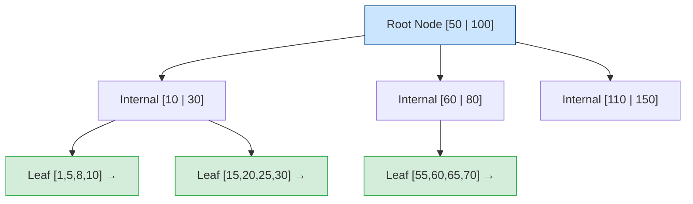
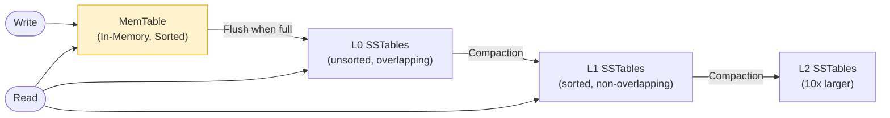

> **Prerequisite:** Part 4 of the [System Design Masterclass](/series/system-design/). Read [Part 3: Caching Strategies](/series/system-design/03-caching-strategies-redis-golang/) to understand the cache layer before examining storage.

**Answer-first:** Database sharding distributes data horizontally across independent partitions (shards) based on a shard key, reducing write contention and enabling linear storage growth. Choosing the wrong shard key leads to hot spots that can be worse than no sharding at all.

---

## Vertical vs Horizontal Scaling — When to Switch?

**Answer-first:** Vertical scaling (scale-up) increases resources on a single server — simple but has a hard physical ceiling and non-linear cost growth. Horizontal scaling (scale-out) adds more servers — no theoretical ceiling, linear cost, but significantly higher operational complexity.

### Scaling Migration Ladder

| Stage | Solution | Data Size | Write Throughput | Complexity |
|---|---|---|---|---|
| 1 | Single DB + pool tuning | < 500 GB | < 5k QPS | Very Low |
| 2 | Read Replicas (leader-follower) | 500 GB–2 TB | < 20k QPS read-heavy | Low |
| 3 | Table Partitioning | 1–10 TB | < 50k QPS | Medium |
| 4 | Application-level Sharding | > 5 TB | > 50k QPS | High |
| 5 | NewSQL (TiDB, Spanner) | Unlimited | > 100k QPS | Medium (managed) |

> [!IMPORTANT]
> **Don't shard prematurely.** Shopee started with a single MySQL instance. Netflix served millions of users from a single Oracle DB before migrating. Premature sharding creates cross-shard query complexity that kills developer productivity before traffic demands it.

---

## B-Tree vs LSM-Tree — Storage Engine Internals

**Answer-first:** B-Tree (InnoDB, PostgreSQL) is optimized for read-heavy workloads with low-latency point lookups. LSM-Tree (RocksDB, Cassandra, TiKV) is optimized for write-heavy workloads by buffering writes in memory before flushing sequentially to disk.

### B-Tree (InnoDB, PostgreSQL Heap)



- **Point lookup:** O(log N) — traverse from root to leaf.
- **Range scan:** Efficient — leaf nodes are doubly-linked.
- **Write amplification:** High — each INSERT may cause page splits and rebalancing.
- **Problem:** Random writes (INSERT in the middle of a range) cause IO amplification due to non-sequential disk writes.

### LSM-Tree (RocksDB, Cassandra, TiKV)

Writes go to an in-memory **MemTable** first (sorted), flushed to immutable **SSTables** on disk when full. Background compaction merges SSTables:



- **Write:** Purely sequential append → very fast, no random IO.
- **Read amplification:** Must check multiple SSTable levels — mitigated by Bloom Filters.
- **Compaction overhead:** Background CPU and IO cost for merging levels.

### When to Choose Each

| Workload | Storage Engine | Reason |
|---|---|---|
| OLTP (orders, payments) | B-Tree (PostgreSQL/MySQL InnoDB) | Low-latency point lookups |
| Time-series (metrics, logs) | LSM (Cassandra, ClickHouse) | Sequential write-heavy |
| Mixed OLTP + OLAP | TiDB (TiKV = LSM + B-Tree secondary indexes) | NewSQL best of both |
| High-throughput key-value | RocksDB / BadgerDB | LSM write optimization |

---

## Choosing an Optimal Shard Key

**Answer-first:** A good shard key must: (1) have **high cardinality** — many unique values for even distribution; (2) ensure **write distribution** — no single value receives disproportionate writes (avoid time-based keys); (3) maintain **query locality** — common queries only need to touch one shard.

### Three Partitioning Strategies

**1. Range Partitioning — ideal for time-series**

```sql
-- PostgreSQL Range Partitioning by time (optimal for time-series data)
CREATE TABLE transaction_log (
    id          UUID           NOT NULL,
    user_id     BIGINT         NOT NULL,
    amount      NUMERIC(15, 2) NOT NULL,
    status      VARCHAR(50)    NOT NULL,
    created_at  TIMESTAMPTZ    NOT NULL,
    PRIMARY KEY (id, created_at) -- created_at required in PK for partitioned tables
) PARTITION BY RANGE (created_at);

CREATE TABLE transaction_log_2026_06 PARTITION OF transaction_log
    FOR VALUES FROM ('2026-06-01 00:00:00+00') TO ('2026-07-01 00:00:00+00');

CREATE TABLE transaction_log_2026_07 PARTITION OF transaction_log
    FOR VALUES FROM ('2026-07-01 00:00:00+00') TO ('2026-08-01 00:00:00+00');

-- Partition-local index — only covers this partition's data
CREATE INDEX idx_txn_log_user_2026_06
    ON transaction_log_2026_06 (user_id, created_at DESC);
```

**Advantage:** DROP partition to instantly delete old data (no vacuum). Queries for a specific time range only scan the relevant partition (partition pruning).

**Disadvantage:** Write hot spot — all new data flows into the most recent partition.

**2. Hash Partitioning — even write distribution**

```sql
CREATE TABLE user_events (
    id          BIGSERIAL,
    user_id     BIGINT NOT NULL,
    event       VARCHAR(100),
    occurred_at TIMESTAMPTZ DEFAULT NOW()
) PARTITION BY HASH (user_id);

CREATE TABLE user_events_0 PARTITION OF user_events
    FOR VALUES WITH (MODULUS 4, REMAINDER 0);
CREATE TABLE user_events_1 PARTITION OF user_events
    FOR VALUES WITH (MODULUS 4, REMAINDER 1);
CREATE TABLE user_events_2 PARTITION OF user_events
    FOR VALUES WITH (MODULUS 4, REMAINDER 2);
CREATE TABLE user_events_3 PARTITION OF user_events
    FOR VALUES WITH (MODULUS 4, REMAINDER 3);
```

**3. Application-Level Shard Router (Directory-based)**

```go
// Application-level sharding in Go
type ShardRouter struct{}

func (r *ShardRouter) GetShardDSN(userID int64) string {
    switch {
    case userID < 1_000_000:
        return "postgres://shard-1:5432/users"
    case userID < 2_000_000:
        return "postgres://shard-2:5432/users"
    default:
        return "postgres://shard-3:5432/users"
    }
}
```

---

## TiDB Percolator — Distributed Commit Protocol

**Answer-first:** TiDB uses Percolator Two-Phase Commit (2PC) on top of TiKV — a distributed key-value store. This provides distributed ACID transactions without application-level coordination.

```
Phase 1 — Prewrite:
  Client selects a primary key (PK) and list of secondary keys
  Writes primary lock to TiKV with start_ts (timestamp from PD/TSO)
  Writes secondary locks referencing the primary key

Phase 2 — Commit:
  If all prewrite locks succeed:
    Write commit record for primary key with commit_ts
    Transaction is considered committed at this exact moment
    Asynchronously: clean up secondary locks
  If any prewrite fails:
    Roll back all acquired locks
```

> [!NOTE]
> TiDB commit latency is ~2–5ms vs ~0.5ms for single-node MySQL — this is the inherent trade-off of distributed ACID. PayPay migrated from 64-shard MySQL to TiDB and accepted this latency increase because the operational simplicity gain was significant. Cross-shard transactions became transparent. Similar to [Alipay's OceanBase architecture](/posts/alipay-double-11-architecture-tps/), the system relies on a robust distributed consensus algorithm (Raft/Paxos) to maintain consistency.

---

## Go Connection Pool Tuning — `database/sql`

**Answer-first:** The `database/sql` connection pool must be configured to match your database's capacity. The most common misconfiguration: `MaxOpenConns` not set (defaults to unlimited), causing the application to open thousands of connections and crash PostgreSQL.

### PostgreSQL vs MySQL Connection Model

| Property | PostgreSQL | MySQL |
|---|---|---|
| **Connection model** | Process-per-connection (fork on connect) | Thread-per-connection |
| **Memory per connection** | **5–10 MB** (virtual memory, shared buffers overhead) | ~1–2 MB |
| **Practical max connections** | ~100–500 before memory saturates | ~1000–5000 |
| **Required pooler** | **PgBouncer (mandatory)** | ProxySQL (optional) |

> [!WARNING]
> **PostgreSQL: 500 connections × 10 MB = 5 GB RAM** just for connection overhead. Always deploy PgBouncer in **transaction mode** in front of PostgreSQL in production. PgBouncer multiplexes hundreds of application connections down to ~50 actual DB connections.

### Optimal Connection Pool Configuration in Go

```go
package database

import (
    "database/sql"
    "fmt"
    "log"
    "time"

    _ "github.com/lib/pq"
)

type DBConfig struct {
    DSN             string
    MaxOpenConns    int
    MaxIdleConns    int
    ConnMaxLifetime time.Duration
    ConnMaxIdleTime time.Duration
}

func InitDB(cfg DBConfig) (*sql.DB, error) {
    db, err := sql.Open("postgres", cfg.DSN)
    if err != nil {
        return nil, fmt.Errorf("failed to open db: %w", err)
    }

    // Rule 1: MaxOpenConns = min(DB max_connections × 0.8, (CPU_cores × 2) + spindles)
    // Example: DB has max_connections=100 → MaxOpenConns=80
    db.SetMaxOpenConns(cfg.MaxOpenConns)

    // Rule 2: MaxIdleConns = MaxOpenConns to avoid connection churn
    // If MaxIdleConns < MaxOpenConns, excess connections are closed after every request
    db.SetMaxIdleConns(cfg.MaxIdleConns)

    // Rule 3: ConnMaxLifetime < DB idle_timeout and firewall timeout
    // AWS RDS / Cloud SQL typically have a 1-hour idle timeout
    // Set lifetime to 30 minutes to retire connections proactively
    db.SetConnMaxLifetime(cfg.ConnMaxLifetime)

    // Rule 4: ConnMaxIdleTime — release idle connections during low traffic
    db.SetConnMaxIdleTime(cfg.ConnMaxIdleTime)

    if err := db.Ping(); err != nil {
        return nil, fmt.Errorf("failed to ping db: %w", err)
    }

    log.Printf("DB pool: maxOpen=%d maxIdle=%d lifetime=%v idleTime=%v",
        cfg.MaxOpenConns, cfg.MaxIdleConns, cfg.ConnMaxLifetime, cfg.ConnMaxIdleTime)
    return db, nil
}

// ProductionConfig — for a service receiving ~500 RPS
func ProductionConfig(dsn string) DBConfig {
    return DBConfig{
        DSN:             dsn,
        MaxOpenConns:    80,
        MaxIdleConns:    80,
        ConnMaxLifetime: 30 * time.Minute,
        ConnMaxIdleTime: 15 * time.Minute,
    }
}
```

> [!TIP]
> **Detecting connection leaks:** If `db.Stats().WaitCount` is continuously increasing and `InUse ≈ MaxOpenConns`, this is a connection leak — goroutines are forgetting to call `rows.Close()` or `defer tx.Rollback()`. Always `defer rows.Close()` immediately after `db.Query()`.

```go
func GetOrders(db *sql.DB, userID int64) ([]Order, error) {
    rows, err := db.Query("SELECT id, amount FROM orders WHERE user_id = $1", userID)
    if err != nil {
        return nil, err
    }
    defer rows.Close() // CRITICAL: always close to return connection to pool

    var orders []Order
    for rows.Next() {
        var o Order
        if err := rows.Scan(&o.ID, &o.Amount); err != nil {
            return nil, err
        }
        orders = append(orders, o)
    }

    // Check rows.Err() — catches errors that occur during iteration (network issues)
    return orders, rows.Err()
}
```

---

## FAQ



**Vertical scaling** adds CPU/RAM to one server. Fast to implement, zero code changes, but has a hard physical ceiling and costs grow non-linearly (a 2× RAM instance typically costs more than 2× the price). **Horizontal scaling** adds more servers — linear cost growth, no ceiling, but requires data partitioning, distributed coordination, and significantly more operational complexity.



A shard key must satisfy three conditions: (1) **High cardinality** — many unique values for even data distribution; (2) **No write hot spot** — avoid keys where one value receives all writes (e.g., `created_at` in active tables); (3) **Query locality** — the most common queries should hit only one shard. `user_id` usually outperforms `created_at` for e-commerce because it avoids the time-based write hot spot.



Use TiDB when: dataset > 1 TB needs complex SQL queries, you need horizontal scaling without manual re-sharding, or you need distributed ACID transactions between multiple tables without application-level 2PC. Don't use TiDB when: latency < 2ms is critical (TiDB commit ~3ms), or the team lacks TiDB operational expertise.

---

🔗 **Next:** [Part 5: Event-Driven Architecture & Kafka in Go](/series/system-design/05-async-message-queues-kafka-go/) — Worker Pool pattern, backpressure via buffered channels, and Exactly-Once Semantics.

