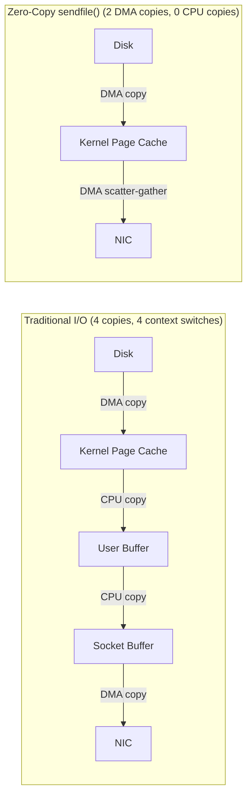
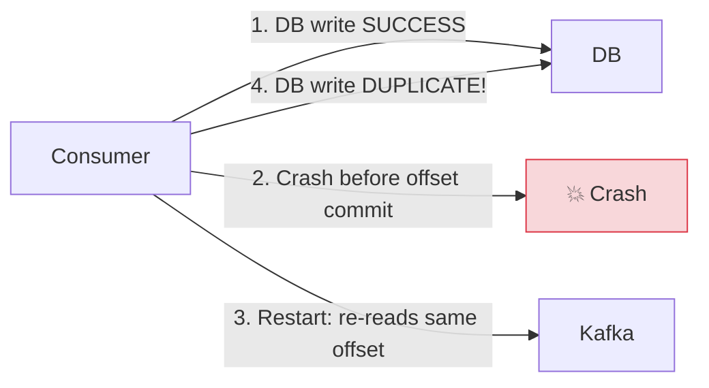

> **Prerequisite:** Part 5 of the [System Design Masterclass](/series/system-design/). Read [Part 4: Database Scaling](/series/system-design/04-database-scaling-sharding/) to understand the storage tier that persisted events are written to.

**Answer-first:** Event-Driven Architecture decouples services through asynchronous communication via a durable message log. In Go, goroutines and buffered channels implement natural backpressure — when consumers fall behind producers, the channel fills up and blocks the producer, throttling the ingest rate automatically.

---

## Kafka vs RabbitMQ — When to Use Each?

**Answer-first:** Kafka is a **distributed commit log** — messages are retained indefinitely, consumers manage their own offsets, and replay is possible. RabbitMQ is a **message broker** — messages are deleted after acknowledgment, the broker handles routing complexity, push-based delivery. They solve different problems.

### Architectural Comparison

| Property | Apache Kafka | RabbitMQ |
|---|---|---|
| **Message Model** | Distributed commit log (append-only, immutable) | Message broker (queue/exchange, mutable) |
| **Message Retention** | Configurable (default 7 days, can be indefinite) | Deleted after ACK |
| **Delivery Model** | **Pull** — consumers poll, manage offsets | **Push** — broker delivers to consumer |
| **Ordering Guarantee** | Within a partition only | Not guaranteed (multiple consumers) |
| **Throughput** | **Millions of messages/s** (zero-copy kernel optimization) | ~100k messages/s |
| **Replay** | ✅ Yes — rewind offset to any position | ❌ No — ACK'd messages are gone |
| **Routing** | Topic + partition (simple) | Exchange types: direct, fanout, topic, headers |
| **Best Use Case** | Event sourcing, stream processing, audit log, fan-out | Task queue, RPC, complex routing, work queues |

> [!NOTE]
> **Use both together.** Shopee uses Kafka for order event streaming (audit trail, analytics fan-out, replay capability) and RabbitMQ for inventory task queues (worker-based processing, dead-letter queue retry). They solve different problems — not competitors.

---

## Kafka Zero-Copy Internals — Why Kafka Is So Fast

**Answer-first:** Kafka achieves extreme throughput using the `sendfile()` system call — zero-copy data transfer from the OS page cache directly to the NIC socket buffer, bypassing user space completely. Combined with sequential disk writes and sparse index lookups, Kafka eliminates most CPU and memory copy overhead.

### Traditional I/O vs Zero-Copy



- **Traditional:** 4 memory copies + 4 user/kernel context switches.
- **Zero-copy:** 0 CPU copies + 2 DMA copies + 2 context switches.
- **Real-world impact:** 2–4× throughput improvement on I/O-bound workloads.

### Sparse Index — Fast Offset Lookup Without Full Scan

Kafka doesn't index every message. It maintains a **sparse index** mapping every $X$ bytes of log data to a file offset:

```
.index file (sparse):
  Offset 0       → File position 0
  Offset 1,234   → File position 4,096
  Offset 2,468   → File position 8,192

.log file:
  [Message offset=0]
  [Message offset=1]
  ...
  [Message offset=1,234]  ← Jump here via binary search on .index
```

Lookup: binary search on `.index` file → sequential scan from closest entry. Combining O(log N) index search with O(M) sequential scan where M is tiny (bounded by index density).

---

## Implementing Backpressure in Go

**Answer-first:** Backpressure in Go is implemented naturally via **buffered channels** — when the buffer is full, the sender blocks, propagating pressure back to the upstream producer. Combined with a bounded worker pool, the system automatically throttles ingest when consumers are slower than producers.

### Bounded Worker Pool Pattern

```go
package kafka

import (
    "context"
    "fmt"
    "log"
    "sync"
    "time"
)

type Message struct {
    Key       string
    Value     []byte
    Partition int32
    Offset    int64
}

// StartWorkerPool creates a bounded pool with natural backpressure
// workers: number of concurrent goroutines
// bufferSize: channel buffer size — when full, sends to jobChan block (backpressure)
func StartWorkerPool(
    ctx context.Context,
    workers int,
    bufferSize int,
    process func(ctx context.Context, msg Message) error,
) chan<- Message {
    jobChan := make(chan Message, bufferSize) // Buffered channel = backpressure mechanism

    var wg sync.WaitGroup
    for i := 0; i < workers; i++ {
        wg.Add(1)
        go func(workerID int) {
            defer wg.Done()
            for {
                select {
                case <-ctx.Done():
                    return
                case msg, ok := <-jobChan:
                    if !ok {
                        return
                    }
                    if err := process(ctx, msg); err != nil {
                        log.Printf("worker %d: failed to process offset=%d: %v",
                            workerID, msg.Offset, err)
                        // Production: send to dead-letter queue
                    }
                }
            }
        }(i)
    }

    go func() { wg.Wait() }()
    return jobChan
}

// KafkaConsumerLoop feeds messages into the worker pool
func KafkaConsumerLoop(ctx context.Context, jobChan chan<- Message) {
    msgOffset := int64(0)
    for {
        select {
        case <-ctx.Done():
            return
        default:
            // Simulate a Kafka poll batch
            for i := 0; i < 10; i++ {
                msg := Message{
                    Key:    fmt.Sprintf("order-%d", msgOffset),
                    Value:  []byte(`{"event":"order_created"}`),
                    Offset: msgOffset,
                }
                select {
                case jobChan <- msg:
                    msgOffset++
                case <-ctx.Done():
                    return
                default:
                    // Buffer full → backpressure: pause consumption
                    // In production: reduce Kafka poll rate, don't commit offset
                    log.Printf("WARN: backpressure applied at offset %d", msgOffset)
                    time.Sleep(10 * time.Millisecond)
                }
            }
        }
    }
}
```

> [!IMPORTANT]
> **Partition ordering constraint:** Kafka guarantees ordering **within a single partition only**. A generic worker pool processes messages from the same partition in arbitrary order (any free worker picks up the next message). If ordering matters (e.g., ORDER_CREATED must be processed before ORDER_CANCELLED for the same order), use a partition-aware pool that assigns one dedicated goroutine per partition.

### Partition-Aware Ordered Worker Pool

```go
// OrderedPartitionWorkerPool: each partition → one dedicated goroutine
// Guarantees in-order processing within each partition
type OrderedPartitionWorkerPool struct {
    mu             sync.RWMutex
    partitionChans map[int32]chan Message
}

func (p *OrderedPartitionWorkerPool) Submit(
    ctx context.Context,
    msg Message,
    process func(ctx context.Context, msg Message) error,
) {
    p.mu.Lock()
    ch, exists := p.partitionChans[msg.Partition]
    if !exists {
        ch = make(chan Message, 100)
        p.partitionChans[msg.Partition] = ch
        // Spawn a dedicated goroutine for this partition
        go func(partCh <-chan Message) {
            for m := range partCh {
                process(ctx, m) // Sequential processing — ordering guaranteed
            }
        }(ch)
    }
    p.mu.Unlock()

    ch <- msg
}
```

---

## Exactly-Once Semantics in Kafka

**Answer-first:** Kafka Exactly-Once Semantics requires an **idempotent producer** (prevents duplicate publishes) plus a consumer that **commits the Kafka offset atomically with the business operation**. True exactly-once end-to-end requires an idempotency key for any side effects outside Kafka.

### At-Least-Once Is the Default



### Exactly-Once via Transactional Offset Commit

The production pattern: **save the Kafka offset in the same DB transaction as the business write**:

```go
package consumer

import (
    "context"
    "database/sql"
    "fmt"
    "log"
)

type OrderEventConsumer struct {
    db *sql.DB
}

// ProcessOrderEvent — Exactly-Once via transactional offset storage
func (c *OrderEventConsumer) ProcessOrderEvent(
    ctx context.Context,
    partition int32,
    offset int64,
    orderJSON []byte,
) error {
    tx, err := c.db.BeginTx(ctx, nil)
    if err != nil {
        return fmt.Errorf("begin tx: %w", err)
    }
    defer tx.Rollback()

    // 1. Check idempotency — has this offset already been processed?
    var exists bool
    err = tx.QueryRowContext(ctx,
        `SELECT EXISTS(
            SELECT 1 FROM kafka_offsets
            WHERE topic='order-events' AND partition=$1 AND offset=$2
        )`, partition, offset,
    ).Scan(&exists)
    if err != nil {
        return fmt.Errorf("offset check: %w", err)
    }
    if exists {
        log.Printf("Offset %d already processed, skipping (idempotent)", offset)
        return nil
    }

    // 2. Business logic — insert order
    _, err = tx.ExecContext(ctx,
        `INSERT INTO orders (data, created_at) VALUES ($1, NOW())`, orderJSON,
    )
    if err != nil {
        return fmt.Errorf("insert order: %w", err)
    }

    // 3. Commit Kafka offset in the SAME transaction
    _, err = tx.ExecContext(ctx,
        `INSERT INTO kafka_offsets (topic, partition, offset)
         VALUES ('order-events', $1, $2)
         ON CONFLICT (topic, partition) DO UPDATE SET offset = EXCLUDED.offset`,
        partition, offset,
    )
    if err != nil {
        return fmt.Errorf("save offset: %w", err)
    }

    // 4. Atomic commit: business data + offset both committed or both rolled back
    return tx.Commit()
}
```

> [!TIP]
> **Schema for Kafka offset tracking:**
> ```sql
> CREATE TABLE kafka_offsets (
>     topic     VARCHAR(255) NOT NULL,
>     partition INT          NOT NULL,
>     offset    BIGINT       NOT NULL,
>     PRIMARY KEY (topic, partition)
> );
> ```

---

## Case Study: Shopee Flash Sale Peak Shaving

> 🔥 **[Production Pattern]: [Shopee's order event pipeline](/posts/shopee-flash-sale-architecture/)**
> **Problem:** Flash sale midnight burst: 500,000 orders/minute. Database cannot absorb this synchronous write volume.
> **Architecture:** `User Request → API Gateway → Kafka (Order Topic) → Worker Pool (Go) → DB Write`
> **Result:** DB receives a steady ~5,000 writes/s regardless of burst size. Kafka absorbs the spike; workers drain it at a controlled rate.
> **Config:** 50 workers × 10 partitions = 500 concurrent DB writes. Buffer size = 10,000 messages.
> **Backpressure:** When buffer fills, Kafka consumer pauses automatically. Orders queue in Kafka (7-day retention) — zero data loss.
> *(Source: Shopee Engineering Blog, 2021)*

---

## FAQ

### What is the difference between Kafka and RabbitMQ?

Kafka is a **distributed log** — messages persist indefinitely, consumers manage offsets, replay is possible, throughput is in millions/s. RabbitMQ is a **message broker** — messages deleted after ACK, broker handles complex routing, push-based. Choose Kafka for event sourcing, audit trails, and fan-out to multiple consumers. Choose RabbitMQ for task queues, request-reply, and complex routing patterns.

### How do you implement backpressure in Go?

Use a **bounded buffered channel**. When the channel is full, the sender blocks — this is natural backpressure. Combine with `select { case jobChan <- msg: default: // backpressure handling }` for non-blocking sends with explicit backpressure logic (e.g., pause Kafka consumption, increment a metrics counter).

### How do you guarantee Exactly-Once in Kafka?

True end-to-end exactly-once for external side effects (DB writes, API calls) requires an **idempotent consumer**: store the Kafka offset and business data in the same DB transaction. If the consumer crashes and restarts, the duplicate message is detected via the offset check and safely skipped.

---

🔗 **Next:** [Part 6: Distributed Locks — Redlock, etcd & Race Condition Prevention in Go](/series/system-design/06-distributed-locks-concurrency/) — Redlock clock drift math, redsync implementation, and when to use Redis vs etcd.
